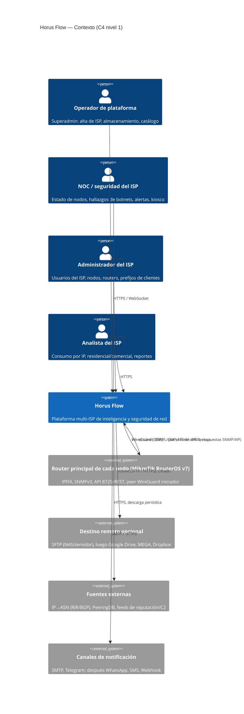
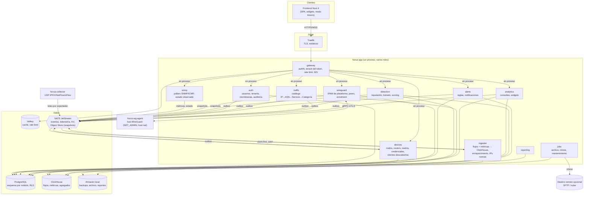

# Horus Flow — Arquitectura general

> Estado: **ronda 2 (tras decisiones del PO)** · Dueño: Agente A (arquitectura) · Fuentes:
> [po-decisions.md](po-decisions.md) (D1–D10, **prevalecen**), [vision.md](vision.md)
>
> Documentos relacionados: [services.md](services.md) (módulos y roles), [adr/](adr/README.md)
> (decisiones; 0017–0025 registran D1–D10), [database.md](database.md),
> [traffic-model.md](traffic-model.md), [storage.md](storage.md), [api.md](api.md),
> [events.md](events.md), [security.md](security.md), [observability.md](observability.md),
> [disaster-recovery.md](disaster-recovery.md), [conventions.md](conventions.md),
> [roadmap.md](roadmap.md), [vendors/mikrotik.md](vendors/mikrotik.md),
> [open-questions/architecture.md](open-questions/architecture.md).

---

## 0. Qué cambió en la ronda 2

| PO | Cambio de arquitectura | ADR |
| --- | --- | --- |
| D1 | El cliente es la IP: se **descubre automáticamente** desde los flujos; identidad (tenant, realm, IP); sin CRM/RADIUS. | [0018](adr/0018-la-ip-es-el-cliente.md) |
| D2, D3 | Almacenamiento **local** primario; destino remoto **opcional** (SFTP primero, luego Drive/MEGA/Dropbox) con rclone. **Sin MinIO, sin NAS obligatorio, sin servidor S3.** | [0019](adr/0019-almacenamiento-local-y-destino-remoto.md) |
| D3 | **Valkey** en lugar de Redis. | [0020](adr/0020-valkey-en-lugar-de-redis.md) |
| D4 | **ClickHouse desde el primer incremento** con series o flujos; sin tabla puente en PostgreSQL. | [0021](adr/0021-clickhouse-desde-el-primer-incremento.md) |
| D5 | **Detección de clientes en botnets** como objetivo de primer nivel. | [0024](adr/0024-deteccion-de-botnets-como-objetivo-principal.md) |
| D6 | **Multi-tenant desde v1**: tenant = ISP; ISP → nodo → router principal → IPs de clientes. | [0017](adr/0017-multi-tenant-desde-v1.md) |
| D7, D9 | Incrementos de valor en lugar de 16 sprints; agentes de IA + 1 persona; calidad por puertas automáticas. | [0023](adr/0023-entrega-por-incrementos-y-equipo-ia.md) |
| D7 | **Un binario modular `horus` con roles**; 3 contenedores propios en el despliegue mínimo (antes 6 procesos en el MVP). | [0025](adr/0025-binario-modular-con-roles.md) |
| D8 | Dashboards por widgets y modo kiosco/NOC (impacto en `analytics` y frontend). | [frontend.md](frontend.md) |
| D10 | **MikroTik RouterOS v7** (≥ 7.12) primero; adaptadores por capacidad; alta con token de un solo uso. | [0022](adr/0022-mikrotik-routeros-v7-primer-fabricante.md) |

---

## 1. Principios de arquitectura

Estos principios son el filtro para cualquier decisión posterior. Si una propuesta viola alguno,
requiere ADR.

| # | Principio | Consecuencia práctica |
| --- | --- | --- |
| P1 | **El plano de administración no depende del plano analítico.** | Login, inventario, WireGuard y configuración funcionan con ClickHouse, el pipeline de flujos o el destino remoto caídos. En el binario modular esto se garantiza con límites por rol y contenedores separados para collector y agente WG ([ADR-0025](adr/0025-binario-modular-con-roles.md)). |
| P2 | **Cada dato tiene un único dueño.** | Cada módulo posee su esquema PostgreSQL y su usuario de BD; los demás lo consultan por contrato (interfaz/gRPC) o lo conocen por eventos. En ClickHouse cada tabla tiene **un único escritor**; las lecturas analíticas se permiten sobre tablas publicadas ([ADR-0008](adr/0008-clickhouse-para-analitica.md)). |
| P3 | **Los colectores nunca esperan a nadie.** | SNMP y flujos publican en NATS y siguen. El descubrimiento de clientes también es asíncrono (el ingester no escribe en PostgreSQL). |
| P4 | **Ausencia de datos ≠ dato cero.** | Routers sin monitoreo → `stale`, no `offline`; huecos de series y de flujos (incluida la ceguera por *offload* de hardware) se registran como cobertura incompleta, no como consumo bajo. |
| P5 | **El frontend solo habla con el gateway.** | Nunca con PostgreSQL, ClickHouse, NATS, SNMP o WireGuard. |
| P6 | **Estado deseado vs estado observado.** | `devices` y `wireguard` guardan lo que *debería* ser; `snmp`, `flows` y `wg-agent` reportan lo que *es*. |
| P7 | **Todo rol es desplegable en Kubernetes sin rediseño.** | Config por entorno, probes por rol, SIGTERM, sin estado local salvo el almacén de archivos declarado ([ADR-0019](adr/0019-almacenamiento-local-y-destino-remoto.md)). |
| P8 | **Ningún evento de dominio se pierde por un fallo de NATS.** | Outbox ([ADR-0016](adr/0016-transactional-outbox.md)), también entre módulos del mismo proceso. La telemetría puede perderse de forma acotada y **medida**. |
| P9 | **Multi-tenant desde v1; el tenant sale del token, nunca del cliente.** | `tenant_id` en todo dato de tenant, RLS en PostgreSQL, row policies en ClickHouse, `Horus-Tenant` en todo mensaje, prefijo en Valkey ([ADR-0017](adr/0017-multi-tenant-desde-v1.md)). |
| P10 | **Nada depende de almacenamiento remoto.** | El primario es local; el NAS o la nube son copias opcionales. Un destino remoto caído solo aumenta el retraso de la copia ([ADR-0019](adr/0019-almacenamiento-local-y-destino-remoto.md)). |
| P11 | **La IP es el cliente.** | Atribución por (tenant, realm, IP) desde el primer flujo; ninguna función depende de un sistema externo de clientes ([ADR-0018](adr/0018-la-ip-es-el-cliente.md)). |
| P12 | **Horus solo lee de los routers.** | Credenciales de solo lectura; el aprovisionamiento es un script que aplica el técnico ([ADR-0022](adr/0022-mikrotik-routeros-v7-primer-fabricante.md)). |
| P13 | **Simplicidad operativa: lo opera una persona.** | Menos procesos, un servidor al inicio, una herramienta por problema, todo verificable por CI ([ADR-0023](adr/0023-entrega-por-incrementos-y-equipo-ia.md)). |

---

## 2. Contexto del sistema (C4 nivel 1)



Versión ASCII:

```
 [Operador plataforma]  [Admin ISP A] [NOC ISP A]   [Admin ISP B] ...
            \                 |           |              /
             \           HTTPS / WebSocket (token por tenant)
              v               v           v             v
           ┌───────────────────────────────────────────────────┐   HTTPS   [Fuentes externas:
           │                   HORUS FLOW                      │ ────────► IP→ASN, PeeringDB,
           │  multi-ISP: aislamiento por tenant en cada capa   │           feeds reputación/C2]
           └───────────────────────────────────────────────────┘
             ▲  hub WireGuard (UDP)        │ rclone (opcional)   │ SMTP/HTTPS
             │  túneles iniciados por      ▼                     ▼
             │  los routers           [SFTP/NAS, Drive,    [Email/Telegram]
   ┌─────────┴───────────┐             MEGA, Dropbox]
   ISP A                  ISP B
   ├─ nodo 1: router MikroTik ── IPs de clientes (realm)
   └─ nodo 2: router MikroTik ── IPs de clientes (realm)
```

**Conectividad** ([ADR-0022](adr/0022-mikrotik-routeros-v7-primer-fabricante.md),
[vendors/mikrotik.md](vendors/mikrotik.md)): cada router principal **inicia** un túnel WireGuard
hacia el hub de Horus (keepalive 25 s, funciona con IP dinámica o NAT). SNMP, API, ICMP y la
exportación IPFIX viajan por el túnel. La IP de túnel de cada router es única en toda la
plataforma e identifica router y tenant. Supuesto del PO a confirmar
([Q3](open-questions/architecture.md#q3)).

---

## 3. Contenedores (C4 nivel 2)

Desde la ronda 2 el backend es **un binario modular `horus`** con roles
([ADR-0025](adr/0025-binario-modular-con-roles.md)). El diagrama muestra el **perfil mínimo**
(un servidor).



Notas:

- Cada módulo usa **su propio esquema y usuario PostgreSQL** (aislamiento lógico) y, además, RLS
  por tenant ([ADR-0017](adr/0017-multi-tenant-desde-v1.md)). Detalle en [database.md](database.md).
- Entre módulos del mismo proceso, las llamadas síncronas van por interfaces en memoria y los
  eventos **siempre por NATS con outbox**; al separar roles en otro proceso, la llamada pasa a
  gRPC sin cambiar el llamador.
- `horus-collector` y `horus-wg-agent` son el mismo binario con otro rol; van aparte por
  aislamiento de carga (UDP) y de privilegios (kernel).
- Snapshots del catálogo y de reputación se distribuyen por **NATS Object Store**; no hay servidor
  S3 ([ADR-0019](adr/0019-almacenamiento-local-y-destino-remoto.md)).

---

## 4. Capas

```
┌──────────────────────────────────────────────────────────────────────────┐
│ 1. Presentación     Nuxt 4 (SPA), widgets, kiosco/NOC, WebSocket          │
├──────────────────────────────────────────────────────────────────────────┤
│ 2. Borde            Traefik: TLS, HTTP/2, compresión, cabeceras, estáticos│
├──────────────────────────────────────────────────────────────────────────┤
│ 3. Gateway (rol)    authN, contexto de tenant, rate limit, WS fan-out     │
├──────────────────────────────────────────────────────────────────────────┤
│ 4. Dominio (roles)  auth, devices, wireguard, traffic, detection,         │
│                     alerts, analytics, reporting                          │
├──────────────────────────────────────────────────────────────────────────┤
│ 5. Recolección      collector, snmp, ingester, wg-agent                   │
├──────────────────────────────────────────────────────────────────────────┤
│ 6. Mensajería       NATS JetStream (streams, KV, Object Store)            │
├──────────────────────────────────────────────────────────────────────────┤
│ 7. Persistencia     PostgreSQL · ClickHouse · Valkey · almacén local      │
│                     (→ rclone → destino remoto opcional)                  │
├──────────────────────────────────────────────────────────────────────────┤
│ Transversal         OpenTelemetry, Prometheus, Loki, Grafana              │
└──────────────────────────────────────────────────────────────────────────┘
```

Estructura interna de cada módulo (hexagonal ligera; detalle en [conventions.md](conventions.md)):

```
services/<módulo>/
  api/                contrato público (interfaces generadas de Protobuf, tipos de eventos)
  internal/domain/    entidades y reglas puras (sin I/O)
  internal/app/       casos de uso
  internal/adapters/  http (Chi), grpc, postgres, nats, clickhouse, vendor/<fabricante>...
services/cmd/horus/   main: compone los módulos según HORUS_ROLES
```

---

## 5. Flujo de datos: síncrono vs asíncrono

### 5.1 Regla de elección

| Usar | Cuándo | Ejemplos |
| --- | --- | --- |
| **REST (JSON, Chi)** | Frontend → gateway → módulo. Público, `/api/v1`. | Crear router, listar clientes, consultar consumo. |
| **Contrato síncrono** (interfaz en proceso o gRPC) | Módulo → módulo cuando el llamador **necesita la respuesta para continuar** y la operación es una consulta o un comando acotado. | `snmp` pide credenciales a `devices`; `wireguard` → `wg-agent`; `analytics` resuelve nombres. |
| **NATS JetStream (eventos)** | Hechos ya ocurridos; telemetría de alto volumen. | `horus.devices.router.created.<id>`, lotes de flujos, `horus.flows.client.first_seen.<realm_id>`. |
| **NATS core** | Notificaciones efímeras a la UI. | Fan-out WebSocket filtrado por tenant. |
| **NATS KV / Object Store** | Coordinación ligera; distribución de snapshots. | Leases de pollers; snapshot de catálogo y de reputación. |

Reglas duras:

1. **Ninguna cadena síncrona de más de 2 saltos** detrás del gateway.
2. **Consumidores idempotentes** (dedupe por `event_id` UUIDv7; contrato en [events.md](events.md)).
3. **Proyecciones locales** de datos ajenos necesarios en caliente (snapshot al arrancar + eventos).
4. **Todo mensaje lleva `tenant_id`** en el sobre y la cabecera `Horus-Tenant`; los subjects
   siguen `horus.<dominio>.<entidad>.<evento>.<entity_id>` **sin** token de tenant
   ([ADR-0017](adr/0017-multi-tenant-desde-v1.md) §6).

### 5.2 Flujo síncrono típico (crear router)

```mermaid
sequenceDiagram
    participant FE as Nuxt
    participant GW as gateway (rol)
    participant DEV as devices (rol)
    participant PG as PostgreSQL
    participant OB as outbox relay
    participant N as NATS
    participant S as snmp

    FE->>GW: POST /api/v1/routers (Bearer JWT con tid)
    GW->>GW: valida JWT, revocación (Valkey→auth), rate limit
    GW->>DEV: handler en proceso (contexto: usuario, tid, permisos)
    DEV->>DEV: autoriza devices.routers.create en el tenant
    DEV->>PG: BEGIN; SET LOCAL horus.tenant_id; INSERT router; INSERT outbox; COMMIT
    DEV-->>GW: 201 Created (+ script RouterOS con token de enrolment)
    GW-->>FE: 201 Created
    OB->>N: publish horus.devices.router.created.<id> (Horus-Tenant)
    N-->>S: entrega (consumer durable)
    S->>DEV: GetPollingTarget(router_id) (credenciales)
    S->>S: asigna a shard; empieza a sondear cuando el túnel tenga handshake
```

### 5.3 Flujos asíncronos principales

```
Alta:      script RouterOS ──/tool fetch──► POST /api/v1/enroll/wireguard (token un solo uso)
                         ──► wireguard ──gRPC──► wg-agent (peer en el hub) ──► handshake ──► active

SNMP:      snmp poller ──► horus.snmp.metrics.* (JetStream) ──► ingester ──► ClickHouse
                     └──► horus.snmp.router.state_changed ──► devices (proyección), alerts, gateway(WS)

Flujos:    router ──IPFIX/túnel──► collector (exportador → router → tenant; desconocido = descarte)
                                      └──► stream FLOWS (lotes por exportador)
                                           └──► ingester: enriquece (catálogo + reputación + realm)
                                                ──► ClickHouse (lotes ≥ 50k filas o 5 s)
                                                └─► IP de cliente nueva ──► horus.flows.client.first_seen

Clientes:  horus.flows.client.first_seen ──► devices (upsert por tenant+realm+IP)
                                         ──► horus.devices.customer.discovered ──► ingester, analytics

Snapshots: traffic ──► Object Store catalog-snapshots + horus.traffic.catalog.published ──► ingester
           detection ──► Object Store reputation-snapshots + …reputation.snapshot_published ──► ingester

Seguridad: ClickHouse (agregados 1–5 min, reputation_hit) ──► detection ──► horus.detection.finding.opened ──► alerts
           detection (scoring) ──► horus.detection.customer.kind_suggested ──► devices (tipo de cliente)

Cobertura: jobs (hora) compara bytes de flujos vs contadores SNMP ──► flow_coverage_low ──► alerts

Copias:    pgBackRest/clickhouse-backup ──► almacén local ──► jobs (rclone) ──► destino remoto (si existe)
```

Subjects ilustrativos; el contrato normativo es [events.md](events.md).

### 5.4 Presupuestos de latencia (objetivos v1)

| Camino | Objetivo |
| --- | --- |
| REST lectura (p95) | < 300 ms |
| REST escritura (p95) | < 500 ms |
| Cambio de estado de router → UI | < 5 s desde la detección |
| Detección de router caído | ≤ 90 s |
| Flujo exportado → visible en dashboard | < 90 s (timeout activo 60 s + lote 5 s + consulta) |
| IP nueva → cliente visible en la UI | < 2 min |
| Señal de botnet (escaneo/DDoS) → hallazgo | < 5 min (ventanas de 1 min) |
| Métrica SNMP → visible | < 75 s |

---

## 6. Dónde vive cada responsabilidad

### 6.1 Matriz de responsabilidades

| Responsabilidad | Dueño (módulo/rol) | Nota |
| --- | --- | --- |
| TLS, HTTP/2, estáticos | Traefik | |
| Autenticación de requests, contexto de tenant (`tid`), rate limit | gateway | El tenant sale del token, nunca del cliente. |
| Login, sesiones, tokens por tenant, TOTP | auth | Sesión de usuario; access token por tenant. |
| Tenants (ISP), usuarios de plataforma, membresías, roles, ACL | auth | [ADR-0017](adr/0017-multi-tenant-desde-v1.md). |
| Auditoría (almacén) | auth | Con `tenant_id` y `via_platform`. |
| Nodos, routers, interfaces, credenciales, fabricantes, matriz de capacidades | devices | |
| Realms y prefijos de clientes (sugeridos desde el router) | devices | Base de la atribución. |
| **Clientes (IPs) descubiertos**: alta, tipo, alias, ciclo de vida | devices (módulo `customers`) | [ADR-0018](adr/0018-la-ip-es-el-cliente.md). |
| Detección de IP de cliente nueva | ingester | Publica `first_seen`; no escribe en PostgreSQL. |
| IPAM de túneles (plataforma), peers, claves públicas, enrolment, scripts RouterOS | wireguard | [ADR-0022](adr/0022-mikrotik-routeros-v7-primer-fabricante.md). |
| Aplicar WG en el kernel, handshakes | wg-agent | |
| Sondeo SNMP/ICMP, estado observado | snmp | |
| Recepción y decodificación de flujos, identificación del exportador, límites por tenant | collector | |
| Enriquecimiento (catálogo, reputación, realm) e inserción en ClickHouse | ingester | [ADR-0015](adr/0015-enriquecimiento-de-flujos-en-ingesta.md). |
| Catálogo de clasificación (plataforma) | traffic | |
| Feeds de reputación (plataforma), detección de botnets, hallazgos (tenant), scoring | detection | [ADR-0024](adr/0024-deteccion-de-botnets-como-objetivo-principal.md). |
| Reglas de alerta, alertas, notificaciones | alerts | |
| Consultas analíticas, widgets, layouts de dashboard, kiosco | analytics | D8. |
| Reportes | reporting | Archivos en el almacén local. |
| Archivo ClickHouse → Parquet local; copia remota con rclone; cobertura de flujos | jobs | [ADR-0019](adr/0019-almacenamiento-local-y-destino-remoto.md). |
| Backups PostgreSQL/ClickHouse | Infraestructura (pgBackRest, clickhouse-backup) + jobs (copia remota) | [disaster-recovery.md](disaster-recovery.md). |

### 6.2 Plano de control vs plano de datos

```
Plano de control (bajo volumen, transaccional, PostgreSQL):
  auth · devices(+customers) · wireguard · alerts(reglas) · traffic(catálogo) · detection(config, hallazgos)

Plano de datos (alto volumen, append-only, ClickHouse):
  collector · ingester · snmp(métricas) · detection(consultas) · analytics(lectura)
```

### 6.3 Reglas de propiedad en ClickHouse

- Cada tabla tiene **exactamente un escritor** (p. ej. `flows_raw` → ingester; métricas SNMP →
  ingester en nombre de `snmp`; `detection_scores` → detection).
- Las tablas *publicadas* ([database.md](database.md)) tienen esquema versionado y pueden ser
  leídas por `analytics`, `detection`, `alerts` y `jobs`.
- `tenant_id` es la primera columna del `ORDER BY`; los usuarios de lectura tienen **row policies**
  por tenant ([ADR-0017](adr/0017-multi-tenant-desde-v1.md) §5).

### 6.4 Aislamiento por tenant, capa por capa

| Capa | Mecanismo |
| --- | --- |
| API | Access token por tenant (`tid`); rutas `/api/v1/platform/*` solo con ámbito de plataforma. |
| PostgreSQL | `tenant_id` en toda tabla de tenant + RLS (`SET LOCAL horus.tenant_id`); rol de app sin `BYPASSRLS`. |
| ClickHouse | `tenant_id` primero en `ORDER BY`; row policies con `SQL_horus_tenant`; límites por tenant en `analytics`. |
| NATS | `tenant_id` en sobre y cabecera; una cuenta; filtrado por tenant en el fan-out WS; límite de flujos/s por tenant en el collector. |
| Valkey | Prefijo `t:<tenant_id>:`. |
| Red | IPAM de túneles de plataforma (IP única por router); sin tráfico entre peers en el hub. |
| Almacén local | Rutas `archive/<tenant_id>/`, `reports/<tenant_id>/`; backups son de plataforma. |
| UI | Selector de ISP, rutas `/t/{slug}/…`, kiosco por tenant. |

---

## 7. API Gateway (rol `gateway`)

Traefik en el borde + rol `gateway` del binario ([ADR-0013](adr/0013-api-gateway-propio.md),
ajustado por [ADR-0025](adr/0025-binario-modular-con-roles.md)).

### 7.1 Qué hace

| Función | Detalle |
| --- | --- |
| **Autenticación** | Valida firma y expiración del access token (JWKS de `auth`), revocación por `sid` en Valkey (fallback a `auth` con caché de 30 s). Rutas públicas: login, refresh, `POST /api/v1/enroll/wireguard` (token de un solo uso, rate limit estricto), `/healthz`. |
| **Contexto de tenant** | Toma `tid` del token y lo pone en el contexto de la petición; rechaza un `tenant_id` del body distinto de `tid`; las rutas de plataforma exigen ámbito `platform`. |
| **Autorización gruesa** | 403 si el token no tiene ningún permiso de la familia de la ruta; la fina la hace el módulo. |
| **Enrutamiento** | Módulo local → **handler montado en proceso** (sin salto HTTP). Módulo en otro proceso (perfil estándar) → reverse proxy HTTP con mTLS. Tabla de rutas declarativa. |
| **Rate limiting** | Por usuario y por IP en Valkey (GCRA); límite estricto en login y enrolment; límite de concurrencia por tenant en rutas de `analytics`. |
| **WebSocket fan-out** | `/api/v1/ws`; autentica en el *upgrade*; la conexión queda ligada al `tid` del token; reenvía eventos NATS core cuyo `Horus-Tenant` coincide y que el usuario tiene permiso de ver. Pantallas de kiosco: misma ruta con token de sesión de kiosco (detalle en [security.md](security.md)). |
| **Transversal** | Request ID, `traceparent`, logs de acceso con `tenant_id`, métricas RED por ruta, límites de body, timeouts, CORS. |

### 7.2 Qué NO hace

- Lógica de negocio ni agregación de respuestas (sin BFF).
- Acceso a PostgreSQL o ClickHouse.
- Emitir tokens (es `auth`).
- TLS público (Traefik).
- Garantizar entrega de eventos a la UI (best effort; snapshot + deltas al reconectar).
- Recibir telemetría de routers.

### 7.3 ¿Por qué cada módulo expone su propio REST?

El contrato público vive junto al dominio (Chi + OpenAPI por módulo); el gateway es genérico y en
el perfil mínimo ni siquiera añade un salto de red. Contrato en [api.md](api.md).

---

## 8. Despliegue: Docker Compose hoy, Kubernetes mañana

### 8.1 Perfiles de despliegue

**Perfil mínimo — un servidor** (desarrollo, demo y producción inicial hasta escala **S**, y M con
holgura de hardware; §9):

```
Servidor único (16 vCPU, 64 GB, SSD/NVMe 2 TB para BD + disco separado 2–4 TB para almacén local)
  traefik
  horus-app        (roles: gateway, auth, devices, wireguard, snmp, traffic, detection,
                    alerts, analytics, reporting, ingester, jobs)
  horus-collector  (rol collector, UDP)
  horus-wg-agent   (rol wg-agent, host network, CAP_NET_ADMIN; hub WireGuard)
  postgresql, clickhouse (memoria limitada), nats (JetStream en SSD), valkey
  prometheus, loki, grafana (o equivalente ligero)
  almacén local: /var/lib/horus/store  ──rclone──►  destino remoto (opcional)
```

**Perfil estándar — dos hosts** (escala **M**; o cuando ClickHouse compita con el login):

```
Host A "control" (8 vCPU, 32 GB, SSD 500 GB)        Host B "datos" (16–32 vCPU, 64–128 GB, NVMe 4–8 TB)
  traefik                                            clickhouse
  horus-core  (gateway, auth, devices, wireguard,    horus-data (ingester, analytics, reporting,
               snmp, traffic, alerts)                            detection, jobs)
  horus-collector, horus-wg-agent (hub WG)           almacén local (disco separado)
  postgresql, nats, valkey, observabilidad
```

Separar es cambiar `HORUS_ROLES` en el compose. NATS y PostgreSQL van con el plano de control
porque transportan/almacenan dominio; JetStream siempre en SSD local. Ningún componente monta el
NAS.

### 8.2 Reglas que hacen posible la migración a Kubernetes

| Regla (desde el primer incremento) | Equivalente en K8s |
| --- | --- |
| Config solo por entorno y secretos montados como archivo; roles por `HORUS_ROLES` | ConfigMap / Secret; un Deployment por conjunto de roles |
| `/healthz` y `/readyz` **por rol** | probes |
| SIGTERM → drenar (30 s), cerrar consumers | `terminationGracePeriodSeconds` |
| Sin estado local salvo el almacén de archivos declarado (`BlobStore`) | PVC, o adaptador `s3` si hay réplicas ([ADR-0019](adr/0019-almacenamiento-local-y-destino-remoto.md)) |
| Descubrimiento por DNS | Service |
| Una imagen, etiquetada por commit | igual |
| Migraciones como job (`horus migrate --module=<m>`) | Job |
| Coordinación por NATS KV | funciona con N pods |

### 8.3 Componentes con tratamiento especial en K8s

| Componente | Problema | Solución prevista |
| --- | --- | --- |
| `wg-agent` (hub) | `CAP_NET_ADMIN`, red del host, endpoint público estable | Fuera del clúster en una VM dedicada (recomendado) o DaemonSet con `hostNetwork` en nodos hub. |
| `collector` | UDP; plantillas IPFIX por exportador | Afinidad por IP origen o colector en el nodo hub (`hostNetwork`). |
| `snmp` | Reparto de routers | Shards virtuales (K=64) con leases en NATS KV. |
| PostgreSQL, ClickHouse, NATS | Stateful | Fuera del clúster al principio. |
| Tráfico por el túnel | Pods deben alcanzar la red de túneles | Rutas en los nodos hacia el hub o pollers en el nodo hub. |

### 8.4 Cuándo migrar

Disparadores: escala **L** o más (§9), HA real exigida (RTO < 15 min sin intervención), más de 3
hosts, o despliegues diarios sin corte. Antes, Compose ([ADR-0011](adr/0011-docker-compose-antes-que-kubernetes.md)).

---

## 9. Límites de escala esperados

### 9.1 Supuestos (a validar con datos reales — [Q2](open-questions/architecture.md#q2))

Con multi-tenant ([D6](po-decisions.md)) la unidad de dimensionamiento ya no es "routers × 300
suscriptores" sino el **total de IPs de clientes activas** en todos los ISP: el router principal de
un nodo agrega a todos los clientes del nodo (cientos a miles).

| Supuesto | Valor | Comentario |
| --- | --- | --- |
| Registros de flujo/s por IP de cliente en hora pico | 5 (bajo) – 10 (alto) | Timeout activo 60 s, inactivo 15 s, **sin muestreo** (requisito de detección, [vendors/mikrotik.md](vendors/mikrotik.md)). |
| Relación media/pico | 0,4 | |
| Tamaño en el cable | ~50 B/registro | IPFIX. |
| Tamaño en ClickHouse | ~20 B/fila | A medir en el incremento de tráfico. |
| Tamaño en NATS | ~60 B/flujo (supuesto) · **184 B/flujo medido** | Protobuf en lotes de ~500 registros; medido en TLM_FLOWS con el simulador (I1-26, [`tests/load/REPORT.md`](../tests/load/REPORT.md)). La columna "NATS pico" de §9.2 y la autonomía de §9.4 usan el supuesto: con lo medido, ×3. |
| SNMP | ~170 valores/ciclo por router, 60 s | Sin interfaces PPPoE dinámicas. |
| Agregados de 1 min para detección | ~1 fila por IP activa × puerto/proto relevante × minuto | Retención corta (7 días). |
| Operadores concurrentes | 20–50 por instalación + pantallas de kiosco | |

### 9.2 Escenarios

| Escenario | Ejemplo | IPs de clientes | Flujos/s pico | Flujos/s medio | Export (pico) | Filas CH/día | Disco raw/día | Raw 7 días | NATS pico |
| --- | --- | ---: | ---: | ---: | ---: | ---: | ---: | ---: | ---: |
| **S** | 3 ISP × 3 nodos | 10k | 50k – 100k | 20k – 40k | 20 – 40 Mbit/s | 1,7 – 3,5 mil M | 35 – 70 GB | 0,25 – 0,5 TB | 3 – 6 MB/s |
| **M** | 10 ISP × 3–5 nodos | 30k | 150k – 300k | 60k – 120k | 60 – 120 Mbit/s | 5 – 10 mil M | 100 – 210 GB | 0,7 – 1,5 TB | 9 – 18 MB/s |
| **L** | 30 ISP, ~100 nodos | 100k | 0,5M – 1M | 0,2M – 0,4M | 200 – 400 Mbit/s | 17 – 35 mil M | 0,35 – 0,7 TB | 2,4 – 4,8 TB | 30 – 60 MB/s |
| **XL** | 100+ ISP | 300k+ | 1,5M – 3M | 0,6M – 1,2M | 0,6 – 1,2 Gbit/s | 52 – 104 mil M | 1 – 2 TB | 7 – 14 TB | 90 – 180 MB/s |

Cálculos: pico = IPs × (5..10); medio = pico × 0,4; filas/día = medio × 86 400; disco = filas ×
20 B; export = pico × 50 B × 8; NATS = pico × 60 B. SNMP: con decenas o cientos de routers
principales, < 1 000 valores/s en cualquier escenario — trivial.

### 9.3 Conclusiones de escala

1. **SNMP no es un problema de escala** (pocos routers principales por ISP). El límite es la
   latencia del túnel; se resuelve con concurrencia.
2. **Flujos sin muestreo en un nodo ClickHouse: cómodo en S, viable en M** (pico 300k filas/s, en
   el límite bajo de un nodo de 16 vCPU con NVMe), **L requiere** 2–4 shards o muestreo. El
   muestreo degrada la detección de escaneos (flujos cortos), por eso la preferencia es escalar
   ClickHouse antes que muestrear ([ADR-0024](adr/0024-deteccion-de-botnets-como-objetivo-principal.md)).
3. **Perfil mínimo (un servidor) hasta S**; M con el perfil estándar; L en adelante con clúster
   ClickHouse, clúster NATS y probablemente Kubernetes.
4. **NATS como buffer**: S y M cómodos en un nodo; L exige clúster de 3 y stream particionado por
   subject; XL obliga a evaluar flujos por NATS core aceptando pérdida durante caídas de
   ClickHouse.
5. **Hub WireGuard**: el ancho de banda (≤ 400 Mbit/s en L) cabe en un núcleo; el problema es que
   es **punto único de fallo** de la recolección de **todos los ISP** (§10.9).
6. **Vecinos ruidosos**: en M+ un ISP grande puede dominar ClickHouse y el stream FLOWS; límites
   de flujos/s por tenant en el collector, concurrencia por tenant en `analytics` y métricas por
   tenant (§10.12).
7. **Clientes en PostgreSQL**: 100k–300k filas `customer` es trivial; el riesgo es la tasa de
   altas por escaneos/IPs falsificadas, acotada por el *throttling* de descubrimiento (§10.13).
8. **Gateway y WebSocket**: no son cuello de botella; eventos a la UI limitados a 1/s por topic.

### 9.4 Capacidad de buffer ante caída de ClickHouse

Stream FLOWS con `max_bytes = 50 GB` en SSD (`discard: old`):

| Escenario | Tasa NATS pico | Autonomía aprox. (pico → media) |
| --- | ---: | --- |
| S | 3 – 6 MB/s | ~2,3 – 4,6 h → ~6 – 12 h |
| M | 9 – 18 MB/s | ~46 – 93 min → ~2 – 4 h |
| L | 30 – 60 MB/s | ~14 – 28 min → ~35 – 70 min |

**Medido en I1-26** ([`tests/load/REPORT.md`](../tests/load/REPORT.md)): un lote de TLM_FLOWS ocupa
**184 B por flujo** (no 60), así que con `max_bytes = 50 GB` la autonomía real es un tercio de la
tabla: **S ≈ 45 – 90 min en pico (≈ 1,9 – 3,8 h en media), M ≈ 15 – 30 min en pico (≈ 38 – 76 min
en media), L ≈ 4,5 – 9 min en pico**.

**Con compresión s2 (FLOW, isp10k).** TLM_FLOWS se declara con `compression: s2` en el contrato C4
(NATS ≥ 2.10; la pila usa 2.14). Medido con el escenario isp10k: **185 B por flujo sin comprimir**
(lo que cuenta `max_bytes` y lo que reserva `max_file_store`) y **50 B por flujo en disco** (×3,7).
`max_bytes` sigue contando bytes sin comprimir, así que la autonomía por `max_bytes` no cambia; lo
que cambia es el disco: un `max_bytes` de 100 GB ocupa ≈ 27 GB. Dimensionado (configurable con
`HORUS_TLM_FLOWS_MAX_BYTES`; `max_file_store` de NATS ≥ suma de `max_bytes`):

    max_bytes = tasa (flujos/s) × 3 600 × horas × 185 B      disco ≈ max_bytes × 0,27

| ISP de 10 000 clientes | Tasa | GB/h sin comprimir | GB/h en disco | Autonomía con 50 GB | Con 100 GB (≈ 27 GB de disco) |
| --- | ---: | ---: | ---: | ---: | ---: |
| Media del día (0,65 flujos/s por cliente medidos) | 6 500/s | 4,3 | 1,2 | 11,5 h | **23 h** |
| Pico habitual | 15 000/s | 10,0 | 2,7 | 5 h | **10 h** |
| Pico alto (vendors/mikrotik.md §2.5) | 60 000/s | 40,0 | 10,8 | 1,25 h | 2,5 h |

Recomendación para 10 000 clientes: `HORUS_TLM_FLOWS_MAX_BYTES = 100 GB` (≈ 27 GB de disco), que
cubre una noche entera de ClickHouse caído a la tasa media y el objetivo C-12 (≥ 6 h) en pico
habitual. A partir del 70 % de ocupación `/readyz` del ingester marca `tlm_flows_buffer` degradado
y se registra un aviso (`horus_ingester_tlm_buffer_ratio`, `HORUS_INGESTER_BUFFER_WARN_RATIO`);
pasado `max_bytes` se descarta lo más antiguo. `natsx.EnsureStreams` (dev y pruebas) ya no deja
TLM_FLOWS sin límite: expande `${HORUS_TLM_FLOWS_MAX_BYTES:-50GB}`.

### 9.5 Perfil recomendado para un ISP de 10 000 clientes (FLOW, isp10k)

Medido con `make load-isp10k` ([`tests/load/REPORT.md`](../tests/load/REPORT.md), sección isp10k) en
4 vCPU compartidas: 10 000 flujos/s con todos los criterios, 20 000 flujos/s sin pérdida ni lag
(API a 700 ms), techo de ClickHouse + ingester ≈ 33 000 filas/s y collector de un solo router ≈ 35 000
registros/s. ClickHouse con 2 vCPU dedicadas escribe 49 000 filas/s con todas las vistas (INSERT
agrupados de 50 000 filas, vistas de 1 h y 1 d en cascada).

| Recurso | Recomendado | Motivo |
| --- | --- | --- |
| CPU | **8 vCPU** dedicadas | pico de 60 000/s ≈ 3,5 núcleos de ClickHouse + 1 de horus-app + 0,5 de collector, más consultas |
| RAM | **32 GB** | ClickHouse 12–16 GB, horus-app 2 GB (`GOMEMLIMIT` 1,8 GiB), collector 512 MiB, NATS 1 GB, caché de página |
| Disco | **500 GB NVMe** | ~250 GB usados: ClickHouse 76–94 GB (7–90 días, [`storage.md` §5.1](storage.md)), NATS 27 GB (`max_bytes` 100 GB con s2), margen de merges y backups |
| Red/kernel | `net.core.rmem_max = 33554432`, `rmem_default = 1048576` | el collector pide 32 MiB de búfer UDP |
| Collector | `HORUS_COLLECTOR_QUEUE_DATAGRAMS=32768`, `HORUS_COLLECTOR_DECODE_WORKERS` por defecto (una por CPU), spool de 8 GiB | absorbe segundos de CPU saturada; el spool, ≈ 38 min de NATS caído a 20 000/s |
| NATS | `HORUS_TLM_FLOWS_MAX_BYTES = 100 GB` | 23 h de ClickHouse caído a la media, 10 h en pico habitual |

**Cuándo un segundo host o una réplica de ClickHouse:** pico sostenido por encima de ~40 000 flujos/s
(varios nodos grandes o más de ~30 000 clientes), p95 de la API > 500 ms en hora pico, 30 días de
crudo (+300 GB) o paneles que deban seguir con ClickHouse caído. Primero ClickHouse en un host propio
(16 vCPU, 64 GB); la réplica (ReplicatedMergeTree + Keeper) solo aporta alta disponibilidad de las
consultas, porque la ingesta ya aguanta la caída de ClickHouse dentro de la autonomía de TLM_FLOWS.
La decodificación de un mismo exportador ya va en paralelo (`HORUS_COLLECTOR_DECODE_WORKERS`, una por
CPU; D23): en el banco, un router da 705 000 registros/s con 2 hilos. En 4 vCPU compartidas la cadena
después del collector no pierde nada ni a 60 000/s; lo que descarta (0,6 % a 40 000/s y 2,6 % a
60 000/s) es la cola del collector con la CPU saturada por ClickHouse ([`tests/load/REPORT.md`](../tests/load/REPORT.md),
ronda D23). NATS necesita 1 GiB a partir de ~40 000/s con backlog (con 512 MiB murió por OOM).

---

## 10. Modos de fallo y degradación

Convenciones: **RPO** = datos que pueden perderse; detección según
[observability.md](observability.md); recuperación en [disaster-recovery.md](disaster-recovery.md).
Todos los escenarios se ejercitan en el incremento de endurecimiento.

### 10.0 Resumen

| Componente caído | Login | Inventario / WG admin | Túneles WG | Sondeo SNMP | Captura flujos | Dashboards tráfico | Alertas | Pérdida de datos |
| --- | :-: | :-: | :-: | :-: | :-: | :-: | :-: | --- |
| ClickHouse | ✅ | ✅ | ✅ | ✅ (buffer) | ✅ (buffer) | ❌ | ⚠️ solo estado/SNMP | Ninguna si dura < autonomía del buffer |
| Rol `snmp` | ✅ | ✅ | ✅ | ❌ | ✅ | ⚠️ sin métricas nuevas | ⚠️ routers → `stale` | Huecos de métricas |
| NATS | ✅* | ✅ (outbox acumula) | ✅ | ⚠️ buffer en memoria | ⚠️ buffer en memoria | ✅ (datos previos) | ❌ nuevas | Telemetría más allá del buffer |
| Un router | ✅ | ✅ | — | ❌ ese router | ❌ ese router | ✅ | ✅ (alerta) | Lo no exportado |
| **Hub WireGuard** | ✅ | ✅ | ❌ todos | ❌ todos | ❌ todos | ✅ (datos previos) | ✅ (una alerta) | Flujos y métricas de **todos los ISP** durante la caída |
| **Destino remoto** | ✅ | ✅ | ✅ | ✅ | ✅ | ✅ | ✅ | Ninguna; crece el retraso de la copia remota |
| **Almacén local lleno** | ✅ | ✅ | ✅ | ✅ | ✅ | ✅ | ✅ | Ninguna inmediata; se pausan archivo/reportes; riesgo para backups |
| PostgreSQL | ❌ nuevo / ✅ sesiones vigentes | ❌ | ✅ | ✅ (caché) | ✅ | ⚠️ sin nombres nuevos | ⚠️ | Ninguna (salvo restauración) |
| Valkey | ✅ (más lento) | ✅ | ✅ | ✅ | ✅ | ✅ (más lento) | ✅ | Ninguna |
| Proceso `horus-app` (perfil mínimo) | ❌ | ❌ | ✅ | ❌ | ✅ (collector aparte, buffer NATS) | ❌ | ❌ | Ninguna de dominio; reinicio automático |

\* El login no depende de NATS; el evento de auditoría queda en el outbox.

### 10.1 ClickHouse se cae

- **Sigue funcionando:** login, usuarios, tenants, inventario, WireGuard, configuración, catálogo,
  reglas de alerta, estado de routers (sale de `snmp` por eventos), alertas de estado. La
  recolección sigue publicando en NATS. El descubrimiento de clientes sigue (el ingester no
  confirma lotes, pero `first_seen` se calcula antes de insertar).
- **Se degrada:** dashboards de tráfico, widgets de kiosco de tráfico (muestran "datos no
  disponibles" sin romper la pantalla), reportes, **detección de botnets** (sin hallazgos nuevos;
  al volver, `detection` reprocesa las ventanas pendientes desde el último *watermark*), scoring.
  `analytics` responde `503 analytics_unavailable`.
- **Detección:** `/readyz` de los roles `analytics`/`ingester` degradado (sin tumbar el proceso);
  `horus_clickhouse_up == 0`; lag del consumer del ingester creciendo; alerta "ClickHouse down > 2
  min" y "buffer FLOWS > 70 %".
- **Recuperación:** reinicio automático; los consumers durables drenan el backlog (ingester ≥ 3×
  la tasa de entrada). El ingester agrupa lotes en INSERT de hasta `HORUS_INGESTER_INSERT_ROWS`
  (50 000) filas o `HORUS_INGESTER_INSERT_WAIT` (1 s) y confirma cada lote en JetStream solo tras el
  INSERT de su grupo. Cada grupo lleva su `insert_deduplication_token` y su composición (token →
  batch_id) se guarda antes del INSERT en el KV `flows_ingester_groups`: si el proceso muere entre
  el INSERT y las confirmaciones, al arrancar los lotes reentregados se reagrupan con el token
  original y ClickHouse descarta el reintento (`services/ingester/internal/app/group.go`). El durable
  tiene `MaxDeliver` ilimitado (una caída de horas no agota las entregas; los lotes inválidos los
  termina el ingester tras 5 intentos) y los grupos pendientes renuevan `ack_wait` (InProgress). Supone un
  único proceso consumiendo el durable; con varios, un grupo en recuperación podría repartirse
  entre ellos (el reparto por subject está pendiente para el clúster de L).
- **Datos perdidos:** ninguno dentro de la autonomía del buffer (§9.4). Pasado el límite,
  JetStream descarta lo más antiguo; `horus_flows_dropped_total{reason="stream_full"}` y la tabla
  de cobertura marca el hueco por tenant.

### 10.2 SNMP deja de funcionar

**(a) El rol `snmp` se cae o se cuelga.** Sigue todo lo demás. Los routers **no** pasan a
`offline`: pasan a `stale` tras 3 intervalos (P4). Detección por heartbeat
`horus.snmp.poller.heartbeat` y `up` en Prometheus (alerta evaluada por Alertmanager, no por
`alerts`). Recuperación: reinicio; reconstruye objetivos desde `devices` o caché local; los leases
huérfanos expiran en 30 s. Datos perdidos: muestras del período (los contadores recuperan el
volumen por delta salvo reinicio o *wrap*).

**(b) SNMP falla en un router concreto** pero responde a ICMP → `degraded`
(`snmp_unreachable`), alerta `warning`; los flujos siguen.

### 10.3 NATS se reinicia (o cae)

- Nodo único con JetStream en archivo; streams y posiciones persisten.
- **Sigue:** REST síncrono (las escrituras van al outbox), túneles y control WG (gRPC directo),
  dashboards sobre datos almacenados.
- **Se degrada:** WebSocket sin eventos (frontend en *polling* 30 s; el kiosco muestra el
  indicador "tiempo real degradado"), propagación entre módulos (incluido el descubrimiento de
  clientes y la recarga de snapshots), alertas nuevas, ingesta.
- **Colectores:** buffer propio **en memoria** acotado (`HORUS_COLLECTOR_BUFFER_BYTES`, 256 MiB por
  defecto); al llenarse se descarta lo nuevo (`horus_collector_dropped_total{reason="bus_unavailable"}`)
  y al volver el bus se publica `horus.flows.collector.data_gap`. **Medido en I1-26:** ~150 B por
  flujo en el búfer (23,5 MB tras 30 s de NATS caído a 5 000 flujos/s, sin pérdida), es decir
  **256 MiB ≈ 6 min a 5 000 flujos/s (nodo mediano), ≈ 35 s a 50 000 y ≈ 18 s a 100 000 (S en pico)
  y ≈ 6 – 12 s en M en pico**. **Spool a disco (D23, §10.15):** en cuanto una publicación falla, los
  lotes (también los que esperaban en memoria) van a disco (`HORUS_COLLECTOR_SPOOL_BYTES`, 8 GiB) y
  se reenvían en orden con el mismo `Nats-Msg-Id` al volver el bus; un apagado o un `kill -9` del
  collector con NATS caído ya no pierde lo recibido. Lo que llega mientras el propio collector está
  caído se sigue perdiendo (UDP sin reintento), pero se mide (§10.16).
- **Recuperación:** automática; outbox drena; consumidores deduplican.
- **Datos perdidos:** eventos de dominio ninguno; telemetría lo que exceda los buffers.

### 10.4 Un router desaparece

- **Correlación de señales** (dueño `snmp`): ICMP (3 fallos a 30 s), SNMP (2 ciclos), handshake
  WG del peer > 180 s (`horus.wireguard.peer.handshake_stale`), exportador silencioso > 5 min
  (`horus.flows.exporter.silent`).
- **Estados:** ICMP ✗ + SNMP ✗ + WG stale → `offline` (`tunnel_down`); ICMP ✗ + SNMP ✗ + WG OK →
  `offline` (`host_unreachable_via_tunnel`); ICMP ✓ + SNMP ✗ → `degraded`; todo OK → `online`
  (umbrales → `warning`/`critical`). Histéresis de 2 observaciones.
- El router permanece en el inventario; sus clientes no se borran (pasan a `inactive` solo tras N
  días sin tráfico, [ADR-0018](adr/0018-la-ip-es-el-cliente.md)).
- **Al volver:** reinicio detectado por `sysUptime`; plantillas IPFIX se reaprenden. Como el router
  es el iniciador del túnel, reconecta solo.
- **Datos perdidos:** métricas y flujos del período (los routers no reintentan IPFIX).

### 10.5 El destino remoto no está disponible (antes: "el NAS deja de responder")

- **Supuesto clave** ([ADR-0019](adr/0019-almacenamiento-local-y-destino-remoto.md)): el destino
  remoto (SFTP/NAS, Drive, MEGA, Dropbox) **solo recibe copias**; ningún componente lo usa en
  caliente ni espera por él. Puede incluso no existir.
- **Sigue funcionando:** todo el producto, incluidos backups locales (pgBackRest a repositorio
  local, WAL incluido), archivado de particiones a Parquet local y reportes.
- **Se degrada:** solo la **copia fuera del servidor**: `jobs` reintenta con backoff; los archivos
  pendientes se acumulan en el almacén local (ya estaban ahí). El RPO *remoto* crece.
- **Detección:** `horus_remote_sync_lag_seconds` por destino > umbral (p. ej. 26 h),
  `horus_remote_sync_failures_total`; banner en la consola de plataforma "copia remota retrasada
  desde hh:mm". Sin destino configurado: aviso permanente "sin copia fuera del servidor".
- **Recuperación:** automática al volver (`rclone copy` reanuda; `rclone check` verifica). Si el
  retraso superó la política, la consola lo indica para ejecutar una copia completa manual.
- **Datos perdidos:** ninguno. Riesgo indirecto: si en esa ventana se pierde el servidor entero,
  se pierde lo no copiado (ver [disaster-recovery.md](disaster-recovery.md)).
- **Ya no aplica** el riesgo del Sprint 0 de que el WAL llene el disco de PostgreSQL por caída del
  NAS: el WAL se archiva en local.

### 10.6 PostgreSQL se cae

- **Sigue:** lecturas analíticas con access token vigente (JWT local + revocación en Valkey);
  túneles WG (`wg-agent` es *fail-static*: nunca borra peers por no leer el estado deseado);
  `snmp` con objetivos en memoria; collector e ingester con snapshots; ClickHouse recibiendo. Las
  IPs nuevas se siguen publicando (`first_seen`) y se crean al volver PostgreSQL.
- **Se degrada:** login/refresh, todo CRUD, persistencia de alertas y hallazgos (se acumulan en
  JetStream sin ack), enrolment de routers.
- **Recuperación:** reinicio; pérdida de disco → PITR desde el repositorio pgBackRest **local**
  (o desde el remoto si se perdió también el disco del almacén). El outbox puede reenviar eventos →
  idempotencia.
- **Datos perdidos:** ninguno en caída de proceso; en pérdida de disco, hasta el último WAL
  archivado (objetivo RPO ≤ 5 min con el repositorio local en otro disco).

### 10.7 Valkey se cae

- Valkey no contiene nada irreconstruible ([ADR-0020](adr/0020-valkey-en-lugar-de-redis.md)).
- **Se degrada:** latencia; revocación vía `auth` con caché de 30 s (una sesión revocada puede
  durar 30 s más); rate limit en memoria; cachés de analytics frías.
- **Recuperación:** reinicio; las cachés se rellenan.

### 10.8 El almacén local se llena (sustituye a "MinIO cae")

- **Causas:** retención local mal dimensionada, archivo sin rotación, destino remoto ausente con
  política de retención basada en "copiado".
- **Comportamiento por umbral** del volumen `HORUS_DATA_DIR`: 70 % aviso; 85 % alerta y se
  **pausan reportes nuevos**; 95 % se **pausa el archivado** (las particiones de ClickHouse que
  debían archivarse no se borran: ClickHouse crece) y se aplica la retención local mínima
  garantizada. Nunca se borran backups por debajo del mínimo.
- **Aislamiento:** el almacén está en un disco distinto de PostgreSQL/ClickHouse/NATS: llenarlo
  no detiene las bases de datos.
- **Detección:** `node_filesystem_avail_bytes` del volumen, `horus_blobstore_*`.
- **Recuperación:** ampliar disco o retención; el archivado y los reportes se reanudan solos.

### 10.9 El hub WireGuard se cae (punto único de fallo de la recolección)

Todos los routers de **todos los ISP** llegan por el hub; es el SPOF más importante del sistema.

- **Casos:** (a) cae el contenedor `horus-wg-agent`; (b) se reinicia el host; (c) se pierde el
  host o su IP pública; (d) falla la red del proveedor del servidor.
- **Qué deja de funcionar:** SNMP, ICMP, API y flujos de todos los routers. El plano de
  administración y los datos históricos siguen.
- **Supresión de tormenta de alertas:** `snmp` detecta la caída (interfaz WG local caída o > 50 %
  de peers *stale* a la vez) y emite **una** alerta `wireguard.hub.down`; `alerts` suprime los
  `router.offline` con razón `tunnel_down` mientras dure. Como esa cadena pasa por el propio
  sistema, Prometheus/Alertmanager evalúa además una regla independiente sobre la métrica del
  hub (`horus_wg_hub_up`, peers con handshake reciente).
- **Recuperación:**
  - (a)/(b): reinicio automático; `wg-agent` reaplica el último estado desde su archivo local y
    los routers, que son **iniciadores con keepalive de 25 s**, reconectan solos sin intervención.
  - (c): reconstruir el hub en otro host con **la misma clave privada del hub** (cifrada en
    PostgreSQL y en los backups) y **el mismo endpoint**. Por eso el endpoint del hub en los scripts
    de los routers es **un nombre DNS con TTL bajo**, nunca una IP literal: cambiar el DNS basta
    para que todos los routers vuelvan sin tocarlos.
- **Datos perdidos:** flujos y métricas de todo el período (los routers no reintentan IPFIX);
  huecos marcados en la cobertura por tenant.
- **Evolución (cuando se exija HA):** hub **activo/pasivo** con la misma clave y una IP flotante o
  DNS conmutado (los routers no cambian). Un segundo hub activo/activo exigiría dos túneles por
  router; se descarta salvo necesidad.

### 10.10 Caída de un rol o del proceso `horus-app`

- En el perfil mínimo, un fallo fatal del proceso `horus-app` afecta a todos sus roles: el
  collector (contenedor aparte) sigue recibiendo y publicando en NATS, y el hub WG sigue; el resto
  vuelve con el reinicio automático (segundos). Se mitiga con límites por rol (concurrencia de
  `reporting`/`analytics`, `GOMEMLIMIT`), y si se repite, se pasa al perfil estándar
  ([ADR-0025](adr/0025-binario-modular-con-roles.md)).
- Un rol degradado (p. ej. `analytics` sin ClickHouse) no marca el proceso como no listo para los
  demás roles. Rutas de un rol separado en otro proceso: el gateway responde `503` con
  `Retry-After` y circuit breaker por destino.

### 10.11 Cobertura de flujos insuficiente

- **Causa típica:** aceleración por hardware en el router (bridge HW, L3HW en CCR2116/2216,
  FastTrack por hardware): ese tráfico no genera flujos ([vendors/mikrotik.md](vendors/mikrotik.md)).
  También: exportación mal configurada, CPU del router saturada, interfaces sin Traffic Flow.
- **Detección:** el rol `jobs` compara cada hora, por router, los bytes de flujos atribuidos con
  los contadores SNMP (`ifHCInOctets/ifHCOutOctets`) de sus interfaces; cobertura < 80 % →
  alerta `flow_coverage_low` (tenant del router) y el período se marca como incompleto.
- **Efecto:** los dashboards y reportes muestran "cobertura parcial" en lugar de consumo bajo
  (P4), y la detección de botnets baja la confianza de los hallazgos de ese router.

### 10.12 Un ISP satura recursos compartidos (vecino ruidoso)

- **Síntomas:** lag del ingester, buffer FLOWS creciendo, consultas lentas para todos.
- **Contención:** límite de flujos/s por exportador y por tenant en el collector (exceso descartado
  y contado por tenant), concurrencia y memoria de consulta por tenant en `analytics`, colas de
  reportes por tenant.
- **Detección:** métricas por tenant (flujos/s, descartes, lag, tiempo de consulta).

### 10.13 Avalancha de IPs nuevas (escaneo o direcciones falsificadas)

- Solo se crean clientes dentro de los **prefijos de clientes** del realm
  ([ADR-0018](adr/0018-la-ip-es-el-cliente.md)); el ingester limita los `first_seen` por realm y
  minuto, y `devices` limita las altas por realm. El exceso se cuenta y genera una alerta de
  plataforma; los flujos se siguen guardando (atribuidos por IP aunque el cliente aún no exista en
  PostgreSQL).

### 10.14 Límites medidos en las pruebas de fallo (I1-26)

`make chaos-i1` ([`tests/chaos/`](../tests/chaos/), informe en
[`tests/load/REPORT.md`](../tests/load/REPORT.md)) los ejercita con el simulador a 5 000 flujos/s
(nodo mediano) sobre el compose de un servidor:

| Fallo | Pérdida medida | Búfer que la absorbe | Recuperación |
| --- | --- | --- | --- |
| ClickHouse parado 30 s | **0 flujos** | TLM_FLOWS (backlog máx. ~360 lotes ≈ 36 s de flujos) | healthy en 6 s, backlog drenado en ~20 s; kiosco de vuelta en 6 s |
| NATS parado 30 s | **0 flujos** | búfer en memoria del collector (máx. 23,5 MB) | healthy en 6 s, drenado en ~12 s; kiosco (WebSocket) de vuelta en 6 s |
| `horus-app` parado 30 s | **0 flujos** | TLM_FLOWS (backlog máx. ~270 lotes) | healthy en 6 s, drenado en ~14 s; kiosco de vuelta en 6 s |
| ClickHouse parado **5 min a 20 000 flujos/s** (isp10k) | **0 flujos** en toda la cadena con la decodificación multihilo (D23; antes, 123 381 = 1,9 % en la cola del collector al drenar) | TLM_FLOWS (backlog máx. 5,6 M de flujos, 1,03 GB lógicos; aviso de `/readyz` al 72 %) | healthy en 6 s, drenado en 2 min 22 s; kiosco de vuelta en 9 s |
| Collector parado 1 min | **lo enviado durante la caída** (~53 s de flujos de 60 s) | ninguno: UDP sin reintento (el spool cubre NATS, no al propio collector) |
| Matriz de reinicio brusco (D23, `make chaos-restart-flows`): collector, horus-app, NATS y ClickHouse × `kill -9` y `docker restart`, 3 veces cada uno a 10 000 flujos/s | **0 flujos y 0 duplicados** salvo con el collector caído: solo lo enviado por UDP en la ventana caída → escuchando (2,2–2,7 s de flujos por cada 3 reinicios, medido también por la secuencia del collector); agregados iguales a los recalculados desde `flows_raw` | TLM_FLOWS, spool del collector (NATS caído), ledger de grupos e instantáneas de §10.16 | todo healthy en 7–17 s; inventario, clientes conocidos y estado del exportador intactos | el hueco es ausencia de filas (la serie de la API da `null`, nunca 0); el exportador pasa por *Silencioso* y vuelve a *Exportando* |

Límites que se derivan: la caída de ClickHouse, NATS o `horus-app` no pierde flujos mientras dure
menos que su búfer (§9.4 con 184 B/flujo; §10.3: 256 MiB ≈ 6 min a 5 000 flujos/s); la caída del
**collector** siempre pierde lo no recibido, como la de un router (§10.4). El estado *Silencioso*
se calcula al volver el collector a partir del último flujo guardado en `flow_exporter_state`
(con `HORUS_COLLECTOR_SILENT_AFTER` de 2 min, una caída de 1 min no llega a *Silencioso*; la prueba
usa 30 s).

Pérdida sin fallo de ningún componente (prueba de carga, `make load-i1`): con la CPU del servidor
saturada, el collector perdió datagramas por desbordamiento del búfer UDP del socket
(`RcvbufErrors`; el collector pide 8 MiB pero el kernel lo limita a `net.core.rmem_max`, 4 MiB en el
host de prueba). Ahora el collector pide **32 MiB** (`HORUS_COLLECTOR_UDP_RCVBUF`), avisa en el log
si el kernel le da menos y, con `CAP_NET_ADMIN`, usa `SO_RCVBUFFORCE`; el instalador debe fijar
`net.core.rmem_max = 33554432` y `net.core.rmem_default = 1048576` (sysctl persistente).

### 10.15 Spool a disco del collector (D23, implementado)

El collector tiene, además del búfer en memoria (`HORUS_COLLECTOR_BUFFER_BYTES`, 256 MiB), un
**spool a disco** (`services/collector/internal/spool`) para cuando NATS no acepta lotes. La caída
de ClickHouse no le afecta (la absorbe TLM_FLOWS, §9.4); el spool alarga la autonomía ante una
caída de **NATS** y hace que un apagado o un `kill -9` con NATS caído no pierdan lo ya recibido.
No cubre la caída del propio collector (UDP sin reintento, §10.16).

- **Cuándo escribe:** en cuanto una publicación falla (bus caído) o cuando el búfer en memoria pasa
  de `HORUS_COLLECTOR_SPOOL_AFTER_RATIO` (0,5) con el bus lento. Al entrar por fallo, los lotes que
  esperaban en memoria pasan también al spool. Con NATS sano nunca toca el disco.
- **Formato:** segmentos append-only de `HORUS_COLLECTOR_SPOOL_SEGMENT_BYTES` (64 MiB) en
  `HORUS_COLLECTOR_SPOOL_DIR` (volumen propio; compose: `/var/lib/horus/collector-spool`); cada
  registro = magia `HSP1` + longitud + CRC32C + (registros, instante, asunto, cabeceras NATS,
  cuerpo). La magia permite resincronizar tras una zona dañada: el registro corrupto se salta y se
  cuenta (`horus_collector_spool_dropped_total{reason="corrupt"}`), el resto se reenvía. `fsync`
  configurable (`HORUS_COLLECTOR_SPOOL_FSYNC`: 1 s por defecto, `0` en cada escritura, negativo
  solo al cerrar segmento); un `kill -9` no necesita `fsync` (la caché de página sobrevive al
  proceso), un corte de luz sí.
- **Reenvío:** al volver el bus, primero lo que quedara en memoria (siempre más antiguo) y luego el
  spool en orden, con el **mismo `Nats-Msg-Id` (= batch_id)**: JetStream descarta lo que ya tenía.
  El cursor de lectura se guarda tras cada PubAck, así que un reinicio a mitad del reenvío repite
  como mucho el último lote. Al vaciarse vuelve al búfer en memoria. Un segmento leído se borra.
- **Arranque:** se leen el cursor y los segmentos; un registro a medio escribir al final del último
  segmento (corte durante la escritura) se trunca; lo pendiente se reenvía antes que lo nuevo.
- **Lleno** (`HORUS_COLLECTOR_SPOOL_BYTES`, 8 GiB ≈ 38 min a 20 000 flujos/s o ≈ 2 h a la media de
  un ISP de 10 000 clientes, con 185 B por flujo): se **descarta el segmento más antiguo** y se
  cuenta (`reason="full"`); con el disco lleno (`ENOSPC`) igual y se reintenta una vez; si aun así
  no cabe, se descarta el lote nuevo (`reason="write_error"`). Los descartes salen en
  `horus.flows.collector.data_gap` (`reason=spool_full`) al volver el bus.
- **Métricas:** `horus_collector_spooling`, `horus_collector_spool_{bytes,batches,records,oldest_age_seconds}`,
  `horus_collector_spool_{written,replayed,dropped,dropped_records}_total`,
  `horus_collector_ingress_bytes_per_second` y **`horus_collector_autonomy_seconds{buffer="memory|spool"}`**:
  cuánto tiempo más aguanta cada búfer sin bus al ritmo de entrada actual. `/readyz` marca `spool`
  degradado mientras los lotes van a disco o si el directorio no se puede usar (el collector sigue
  con el búfer en memoria).
- **Registro de eventos de plataforma** (§10.18, observability.md §11.2): `spool_active` al pasar a
  disco, `spool_drained` al vaciarse y `spool_active` con severidad error cuando el spool lleno
  descarta (como mucho uno por minuto).
- **Pruebas:** corrupción de un segmento, disco lleno, cola cortada y `kill -9` real de un proceso
  escritor (`internal/spool`), reenvío en orden tras la caída del bus y tras un reinicio, y spool
  lleno con `data_gap` (`internal/app/spool_test.go`); en la pila, `make chaos-restart-flows`
  (NATS con `kill -9` y `docker restart`).

### 10.16 Estado tras un reinicio en la cadena de flujos (D23)

Regla de D23: ningún estado vive solo en memoria. Todo lo que un rol de flujos deriva de un stream
se reconstruye al arrancar con **instantánea + stream** (`packages/go/flowstate`): la instantánea
(con la secuencia del último evento aplicado) se guarda en el Object Store `flows_state` de JetStream
y, al arrancar, se restaura y se lee el stream con un consumidor efímero desde la secuencia
siguiente. Así sobrevive a la retención de DEVICES_EVENTS (30 días): releer el stream entero, como
hacía el arreglo anterior de `flowinv`, perdía los routers y prefijos de más de 30 días. El patrón
«durable con el estado en memoria» (tras un reinicio solo llega lo no confirmado) se buscó en todos
los consumidores: lo tenían `flows-inventory-<rol>` (ya arreglado, ahora con instantánea) e
`ingester-known-clients` (arreglado); los demás durables de la cadena guardan su estado fuera del
proceso (`flows-ingester` → ClickHouse con ledger; los de devices → PostgreSQL).

| Componente | Estado | Dónde se guarda | Cómo se reconstruye al arrancar |
| --- | --- | --- | --- |
| collector, ingester, detection | Inventario de flujos (exportadores, realms, prefijos) | Instantánea `flows-inventory-<rol>` en `flows_state` + DEVICES_EVENTS (+ fichero base) | Se restaura la instantánea (inventario disponible antes de leer el stream) y se aplica DEVICES_EVENTS desde la secuencia siguiente; el durable antiguo se borra |
| collector, ingester | ISP con la ingesta en pausa (`POST /platform/tenants/{id}/suspend` con `pause_ingest`) | Instantánea `flows-pause-<rol>` en `flows_state` + AUTH_EVENTS (`tenant.suspended` / `tenant.resumed`) | Se restaura y se aplica el stream; el collector descarta y cuenta (`horus_collector_dropped_total{reason="tenant_suspended"}`) y el ingester confirma sin guardar lo que ya estaba en TLM_FLOWS (`horus_ingester_batches_total{result="tenant_suspended"}`); al reactivar, vuelve a ingerir |
| collector | Plantillas IPFIX / NetFlow v9 por exportador y dominio | KV `flow_collector_state` (`tpl.*`), al cambiar o cada 10 min | Se reinstalan si no superan `HORUS_COLLECTOR_TEMPLATE_TTL` (30 min); los datos que llegan antes de que el router las reenvíe se decodifican en vez de retenerse |
| collector | Secuencia esperada por dominio de observación | KV `flow_collector_state` (`seq.*`), cada 1 s y al parar | Se restaura; el primer datagrama mide lo enviado con el collector caído (`horus_collector_downtime_lost_records_total`, `data_gap` `collector_down`; cota superior: incluye hasta 1 s anterior a un `kill -9`) sin contarlo como pérdida del exportador |
| collector | Estado del exportador (estado, versión, último flujo, huecos y pérdidas acumulados) | KV `flow_exporter_state` | Se continúa; si la caída superó `SilentAfter` se registra la transición a `silent` y luego `recovered`. La ventana de pérdida de 5 min empieza vacía |
| collector | Lotes pendientes de publicar | Memoria y, con el bus caído o lento, spool a disco (§10.15) | El spool se reenvía en orden con el mismo `Nats-Msg-Id`; el apagado ordenado publica lo de memoria o lo pasa al spool |
| collector | Lotes abiertos (≤ 1 s) y colas de datagramas | Memoria | `docker restart` (SIGTERM) los publica; `kill -9` pierde lo recibido en el último segundo, que se mide junto con lo enviado durante la caída (§10.14) |
| collector | Exportadores no registrados, descartes en curso | Memoria | Se recalculan (evento `unregistered` cada 10 min) |
| ingester | Posición de consumo de TLM_FLOWS | Durable `flows-ingester` (JetStream) | Reentrega lo no confirmado |
| ingester | Grupos de INSERT en curso (token → batch_id) | KV `flows_ingester_groups` | Los lotes reentregados se reagrupan con su token: ClickHouse descarta el reintento (§10.1) |
| ingester | Clientes conocidos por realm | Instantánea `ingester-known-clients` en `flows_state` + DEVICES_EVENTS (`customer.discovered/reactivated/purged`) | Se restaura y se aplica el stream desde la secuencia siguiente; antes era un durable y tras un reinicio se reenviaban `first_seen` de todos los clientes ya conocidos |
| ingester | `first_seen` pendientes y emitidos (TTL 1 h), actividad de la hora para `activity_summary` | Instantánea `ingester-discovery` en `flows_state`, cada 10 s y al parar | Se fusiona con lo que llega (los lotes reentregados se vuelven a observar; `last_seen` es un máximo). Un `kill -9` puede perder hasta 10 s de actividad acumulada, dentro de la resolución de 1 h de `last_seen` |
| ingester | Límite anti-avalancha por realm y minuto | Memoria | Empieza de cero (ventana de 1 min) |
| ingester | Enriquecimiento: ASN, catálogo de servicios, reputación | Snapshots versionados en disco (`HORUS_*_SNAPSHOT_DIR`, `$HORUS_DATA_DIR/catalog/…`) | Se recargan al arrancar y cada 30 s |
| ingester | Ocupación de TLM_FLOWS (`/readyz`) | JetStream | Se vuelve a medir |
| traffic (ASN y catálogo) | Snapshots `asn/v<N>`, catálogo | Disco (`horus-asn`, `horus-catalog`) | Sin estado en memoria: el rol es un esqueleto y los snapshots los lee el ingester |
| API de tráfico (analytics) y `/flow-exporters` | Consultas y estado de exportadores | ClickHouse, KV `flow_exporter_state`, inventario del ingester | Sin estado propio que se pierda; las cachés se rellenan |

Pruebas de reinicio: `TestProjectorSurvivesStreamRetention` (`flowinv`), `TestKnownClientsAfterRestart`
y `TestDiscoveryStateAfterRestart` (ingester), `TestCollectorStateAcrossRestart` y
`TestExporterStateAfterCollectorRestart` (collector), `TestSpoolAcrossRestart` y en la pila
`make chaos-restart-flows`.

### 10.18 Estado tras un reinicio: módulos de plataforma (CORE, D23)

D23 exige que, tras cualquier reinicio (`kill -9`, `docker restart`, reinicio del host), todo funcione al 100 %
sin pérdidas ni duplicados. Auditoría de los módulos que no son de flujos (los de flujos — collector,
ingester, `flowinv`, descubrimiento de clientes — tienen su propia subsección de FLOW). "Antes" marca lo que
vivía solo en memoria o se perdía y se corrigió en esta ronda; el patrón buscado es el del fallo de `flowinv`
(estado en memoria alimentado por un durable que, tras reiniciar, solo entrega lo no confirmado).

| Componente | Estado | Persistencia | Reconstrucción tras reinicio |
| --- | --- | --- | --- |
| `detection` · motor | Fin de la última ventana evaluada por detector y tenant | `detection.engine_state` (`window:<detector>`), escrito **después** de aplicar los candidatos. **Antes:** mapa en memoria y avance guardado antes de `Apply` | Al arrancar lee el avance y evalúa las ventanas atrasadas por cadencia (máx. 24 h hacia atrás y 24 ventanas por pasada; el hueco más antiguo se registra en el log). Un `kill -9` entre la evaluación y `Apply` repite la ventana; reevaluar no duplica (ver hallazgos). El fin de ventana se limita a la **marca de agua de la ingesta** (publicación del primer lote de TLM_FLOWS que el ingester no ha confirmado): tras una caída no se dan por evaluadas ventanas cuyos flujos siguen en el búfer |
| `detection` · barrido retroactivo C2 | Versión de snapshot y fin del último barrido | `detection.engine_state` (`c2_retro`), ahora también después de `Apply` | Retoma; si murió a mitad, repite el barrido (ventana de 7 días) |
| `detection` · tenants a evaluar | ISP registrados por la API, `HORUS_DETECTION_TENANTS` e inventario de exportadores | `detection.tenant_registry`; el inventario es la proyección `flowinv` de `DEVICES_EVENTS` | Lee la tabla; `flowinv` relee el stream entero en cada arranque (consumidor efímero, arreglo de FLOW) |
| `detection` · hallazgos | Hallazgo, ciclo de vida, estado de seguridad del cliente | `detection.finding`, `customer_security` y outbox en la misma transacción | Idempotente: `Apply` deduplica por (cliente, kind, objetivo) y `last_seen`; una ocurrencia ya aplicada es `Unchanged` |
| `detection` · reputación y feeds | Snapshot vigente; estado de cada fuente | Disco (`$HORUS_DATA_DIR/catalog/reputation`, `datasets/<fuente>/state.json`, escritura atómica tmp+rename) | `repsnap` recarga cada minuto; `feedsync` reanuda por `LastAttempt` + frecuencia (no re-descarga en cada arranque). Pendiente menor: un `kill -9` a mitad de escritura deja un `.tmp-*` huérfano |
| `alerts` · consumidor `alerts-notify-*` | Posición en DETECTION/FLOWS/WIREGUARD_EVENTS | Durables JetStream (`DeliverNew` solo al crearse) | Tras reiniciar entrega lo no confirmado; el mensaje se confirma cuando las entregas están **en la cola de PostgreSQL** |
| `alerts` · cola de entregas | Entrega por canal y evento, intentos, próximo intento, mensaje ya renderizado (sin datos personales) | `alerts.notification_delivery` (`queued`, `attempts`, `next_attempt_at`, `claimed_until`, `message`). **Antes:** se registraba `queued` y se enviaba en el mismo handler: un `kill -9` entre ambos dejaba la fila y la reentrega no avisaba nunca; sin reintentos | Un despachador reclama las vencidas por lease (`FOR UPDATE SKIP LOCKED`, 2 min) y reintenta con backoff (8 intentos ≈ 2 h). Sin duplicados: única por (canal, evento origen). **Deduplicación documentada:** un `kill -9` entre la aceptación remota y el registro reenvía esa entrega una vez al vencer el lease; LibreNMS recibe `X-Horus-Delivery-Id` para descartarla. El fallo definitivo emite `notification.failed` y un evento de plataforma |
| Outbox → relay (todos los módulos) | Eventos pendientes de publicar | `<esquema>.outbox` en la transacción del cambio | El relay publica `published_at IS NULL` por orden de `seq`. Si muere tras el PubAck y antes de confirmar, republica con el mismo `Nats-Msg-Id` (JetStream deduplica 20 min) y los consumidores son idempotentes por id de evento. Con NATS caído, reintenta con backoff sin perder nada |
| `gateway` · tickets de WebSocket | Ticket de un uso (30 s) | Memoria (una réplica; con varias, Valkey) | Se pierden: el cliente pide otro ticket y reconecta (contrato C6). No es estado de negocio |
| `gateway` · reanudación y último estado por topic | Últimos eventos por tenant (5 min) | Memoria | Tras reiniciar, `resume` no encuentra el id y el cliente pide el snapshot REST (contrato C6). Comprobado: kiosco y WebSocket de usuario se recuperan solos |
| `gateway` · suscripciones NATS core | — | — | `nats.go` reconecta sin límite y resuscribe; `realtime_status` pasa a `degraded` y vuelve a `ok`. **Antes:** el hub sustituía los manejadores de desconexión de la conexión compartida y las caídas de NATS dejaban de verse en los logs |
| `auth` · sesiones y refresh | Sesión, refresh rotativo con detección de reutilización | `auth.session`, `auth.refresh_token` | Siguen válidas (verificado tras cada escenario de la matriz) |
| `auth` · claves de firma y KEK | Clave Ed25519 de los JWT, KEK de los secretos TOTP | Secretos en archivo (`HORUS_AUTH_SIGNING_KEY_FILE`, `HORUS_AUTH_KEK_FILE`; efímeras solo en dev, con aviso) | Los tokens emitidos antes del reinicio siguen siendo válidos |
| `auth` · TOTP | Secreto cifrado y último paso usado (anti-reutilización) | `auth.totp_credential`, `auth.recovery_code` | — |
| `auth` · fallos de 2FA de un login pendiente | Contador por sesión pendiente | `auth.session.mfa_failures`. **Antes:** mapa en memoria: un reinicio regalaba intentos | — |
| `auth` · kiosco | Credencial rotativa del dispositivo y su JWT (10 min) | `auth.kiosk`, `auth.kiosk_credential_rotated` (sucesora y arranque que rotó). **Antes:** si el proceso moría tras confirmar la rotación y antes de entregar la cookie, el kiosco volvía con la anterior y se **revocaba** por "reutilización" | Si la rotó otro arranque, la sucesora nunca se usó y no han pasado 30 min, se reanuda la rotación (auditado `kiosks.credential.rotation_resumed`); dentro del mismo arranque la reutilización sigue revocando (security.md §5.5) |
| `auth` · cachés (estado de sesión y de kiosco) | Revocación cacheada 2 s | Memoria | Caché pura; se rellena desde PostgreSQL |
| `wireguard` (control) | Peers, versión deseada, versión aplicada reportada | `wireguard.peer`, `wireguard.server` | Recalcula; `lastPush` en memoria es solo una optimización: si el agente reporta `applied_version` < deseada se le reenvía todo |
| `wg-agent` (hub) | Interfaz y peers del kernel; versión aplicada | Kernel: la interfaz la crea `horus-tunnel` fuera del contenedor, así que los peers sobreviven al reinicio del contenedor | Arranca con `applied_version = 0` y no borra nada (fail-static) hasta recibir el estado completo, que el control reenvía; queda `agent_restarted` en el registro de plataforma. Túneles de los routers simulados restablecidos solos en la matriz |
| `devices` · inventario | Routers, nodos, prefijos, credenciales cifradas | PostgreSQL + outbox | — (los consumidores de descubrimiento son de FLOW) |
| `devices` · ciclo de vida de clientes | Inactivación y purga diarias | Calculado desde PostgreSQL | Se ejecuta al arrancar y cada 24 h (idempotente) |
| Registro de eventos de plataforma | Arranques, paradas, caídas, migraciones, degradaciones | `platform_events.event`; si PostgreSQL no responde, cola acotada en memoria y spool en `$HORUS_DATA_DIR/platform-events/` (horus-app) | Vuelca el spool al recuperarse; los eventos están además en los logs (`platform event`) |
| Salud y métricas | `/readyz`, contadores | Memoria | Se recalculan (los contadores vuelven a 0, como en cualquier exporter Prometheus) |

Cómo se verifica: tests unitarios y de integración del motor (`TestEngineCatchesUpAfterRestart`,
`TestEngineDoesNotAdvanceOnApplyFailure`, `TestEngineWaitsForIngestionWatermark`), de la cola de alertas (`TestQueueResumesClaimedDeliveryAfterCrash`,
`TestQueueRetriesWithoutDuplicates`), del kiosco (`TestKioskRotationSurvivesRestart`) y la matriz
`make chaos-restart-core` (`kill -9` y `docker restart` de horus-app, horus-wg-agent, PostgreSQL, NATS y Valkey en
orden y momento aleatorios, repetida, y `accept-i1` después; resultados en `bin/chaos-core/report.md`).

**Resultado (2026-10-10, 2 vueltas × 10 escenarios + caída larga, instalación real con 2 routers simulados por
WireGuard):** los 21 escenarios en verde. Tiempo desde el fallo hasta que todo vuelve (contenedor sano, `horus-app`
listo, API, sesión renovada con su cookie, túneles con handshake reciente, WebSocket de usuario con un evento nuevo
recibido y kiosco reconectado): `kill -9` de cualquier componente 7–9 s (Docker lo reinicia en ≈ 1 s), `docker
restart` de PostgreSQL 10–11 s, de `horus-wg-agent` 12 s y de `horus-app` 13–15 s (un kiosco tardó 23 s en una
ocasión tras `kill -9` de Valkey, por su reconexión cada 2 s más el refresco del JWT). Los túneles nunca cayeron
(la interfaz del hub vive fuera del contenedor del agente). Caída larga de `horus-app` (9 min, con flujos del
escenario `dos_out` durante la caída): el hallazgo esperado se abrió 68 s después del arranque, cuando el ingester
vació el búfer. Al final: outbox con 0 eventos pendientes en todos los esquemas; 51 alertas enviadas (48 pruebas
aceptadas durante el caos y 3 de hallazgos) sin ninguna perdida ni duplicada; hallazgos esperados presentes y 0
duplicados activos; un `unclean_shutdown` por cada `kill -9` de `horus-app`; paquete `horus diagnose` sin ninguna
IP de cliente; y `accept-i1` contra la misma instalación en verde (25 OK, 0 FAIL; se omiten `image`, por ser
TARGET=installed, y `lab-chr`, sin KVM).

---

## 11. Riesgos arquitectónicos principales

| Riesgo | Impacto | Mitigación |
| --- | --- | --- |
| Fuga de datos entre ISP por un filtro olvidado | Incidente de privacidad grave | Token por tenant + repositorio con tenant obligatorio + RLS + row policies; tests de aislamiento generados en CI ([ADR-0017](adr/0017-multi-tenant-desde-v1.md), [ADR-0023](adr/0023-entrega-por-incrementos-y-equipo-ia.md)). |
| Hub WireGuard como SPOF de todos los ISP | Pérdida total de visibilidad | Alerta única correlacionada + regla independiente en Alertmanager; endpoint DNS y clave del hub respaldada; activo/pasivo cuando se exija HA (§10.9). |
| Flujos post-NAT o CGNAT en otro equipo | La IP no identifica al cliente (D1 no se cumple) | Verificar por ISP en el alta (NAT leído por API); exportar desde el equipo correcto ([Q6](open-questions/architecture.md#q6)). |
| Ceguera por *offload* de hardware | Consumo y detección subestimados | Alerta `flow_coverage_low` (§10.11). |
| Prefijos de clientes mal declarados | Clientes falsos o no atribuidos | Sugerencia automática desde el router + vista de tráfico no atribuido. |
| Volumen de flujos subestimado | Disco y CPU de ClickHouse | Medir con el primer ISP real; escenarios S/M/L; escalar ClickHouse antes que muestrear. |
| Vecino ruidoso | Degradación para todos los ISP | Límites por tenant (§10.12). |
| Un solo proceso `horus-app` | Un fallo afecta a todos sus roles | Collector y agente WG separados; límites por rol; perfil estándar como salida. |
| Sin destino remoto configurado | Desastre del servidor = pérdida total | Aviso permanente en consola de plataforma; almacén local en disco separado; SFTP en el incremento de almacenamiento. |
| Endpoint público de enrolment | Superficie de ataque sin sesión | Token de un solo uso, hash, TTL 24 h, rate limit, solo acepta claves públicas, auditoría ([ADR-0022](adr/0022-mikrotik-routeros-v7-primer-fabricante.md)). |
| Calidad sin revisores humanos | Defectos y deriva arquitectónica | Puertas automáticas que bloquean el merge ([ADR-0023](adr/0023-entrega-por-incrementos-y-equipo-ia.md)). |
