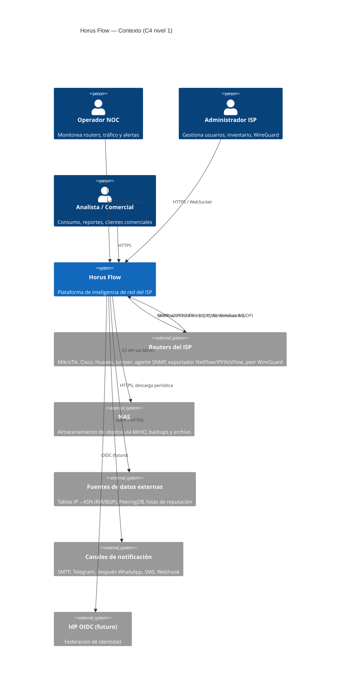
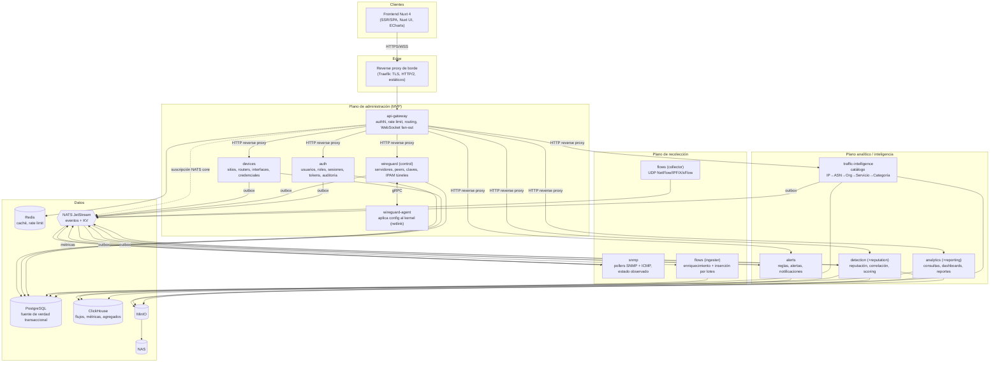

# Horus Flow — Arquitectura general

> Estado: **propuesta Sprint 0** · Dueño: Agente 1 (Arquitecto de sistema) · Fuente: [vision.md](vision.md)
>
> Documentos relacionados: [services.md](services.md) (catálogo de servicios), [adr/](adr/README.md)
> (decisiones), [database.md](database.md) y [traffic-model.md](traffic-model.md) y
> [storage.md](storage.md) (Agente 2), [api.md](api.md) y [events.md](events.md) (Agente 3),
> [security.md](security.md), [observability.md](observability.md),
> [disaster-recovery.md](disaster-recovery.md) y [conventions.md](conventions.md) (Agente 4),
> [roadmap.md](roadmap.md) (Agente 5), [open-questions/architecture.md](open-questions/architecture.md).

---

## 1. Principios de arquitectura

Estos principios son el filtro para cualquier decisión posterior. Si una propuesta viola alguno,
requiere ADR.

| # | Principio | Consecuencia práctica |
| --- | --- | --- |
| P1 | **El plano de administración no depende del plano analítico.** | Login, inventario, WireGuard y configuración funcionan con ClickHouse, el pipeline de flujos y el NAS caídos (requisito explícito del Sprint 14). |
| P2 | **Cada dato tiene un único dueño.** | Ningún servicio lee ni escribe tablas PostgreSQL de otro. Se comunican por REST/gRPC (consulta) o NATS (hechos). En ClickHouse cada tabla tiene **un único escritor**; las lecturas analíticas están permitidas sobre tablas publicadas (ver §6.3 y [ADR-0008](adr/0008-clickhouse-para-analitica.md)). |
| P3 | **Los colectores nunca esperan a nadie.** | SNMP y flujos publican en NATS y siguen; si el destino está caído, NATS amortigua. Un colector no hace llamadas síncronas en su camino caliente. |
| P4 | **Ausencia de datos ≠ dato cero.** | Si el colector SNMP está caído, los routers pasan a `unknown`/`stale`, no a `offline`. Los huecos en series se guardan como huecos, no como ceros. |
| P5 | **El frontend solo habla con el API Gateway.** | Nunca con PostgreSQL, ClickHouse, NATS, SNMP o WireGuard (vision §1). |
| P6 | **Estado deseado vs estado observado.** | `devices` y `wireguard` guardan lo que *debería* ser; `snmp`, `flows` y el agente WireGuard reportan lo que *es*. La reconciliación es explícita. |
| P7 | **Todo servicio es desplegable en Kubernetes sin rediseño.** | Configuración por variables de entorno, sin estado en disco local en servicios stateless, `/healthz` + `/readyz`, apagado ordenado (SIGTERM), logs a stdout. |
| P8 | **Ningún evento de dominio se pierde por un fallo de NATS.** | Los servicios con PostgreSQL publican mediante *transactional outbox* ([ADR-0016](adr/0016-transactional-outbox.md)). La telemetría (flujos, métricas) sí puede perderse de forma acotada y **medida**. |
| P9 | **Una organización en v1, multi-tenant posible después.** | Toda entidad raíz lleva `organization_id` (UUIDv7) desde el día uno aunque solo exista una fila. Ver [preguntas abiertas](open-questions/architecture.md#q1). |

---

## 2. Contexto del sistema (C4 nivel 1)



Versión ASCII equivalente:

```
  [Operador NOC]  [Admin ISP]  [Analista]
         \             |            /
          \     HTTPS / WebSocket  /
           v           v          v
        ┌──────────────────────────────┐        HTTPS (pull periódico)
        │          HORUS FLOW          │ ─────────────────────────────► [Fuentes externas:
        │ inteligencia de red del ISP  │                                  IP→ASN, PeeringDB,
        └──────────────────────────────┘                                  listas reputación]
          │  ▲            │        │
   SNMP,  │  │ NetFlow/   │ S3     │ SMTP / HTTPS
   ICMP,  │  │ IPFIX/sFlow│ (MinIO)│
   WG     ▼  │ handshakes ▼        ▼
     [Routers del ISP]   [NAS]   [Email / Telegram / ...]
```

**Supuesto de red crítico** (validar con PO, [Q3](open-questions/architecture.md#q3)): la mayoría
de routers no tienen IP pública alcanzable (CGNAT, sitios remotos) y se gestionan **a través de
túneles WireGuard** hacia un hub central. Por tanto SNMP, ICMP y la exportación de flujos viajan
por el túnel. Esto convierte al hub WireGuard en una dependencia del plano de recolección (ver
§9.4 y §9.9).

---

## 3. Contenedores (C4 nivel 2)



Notas:

- Cada servicio con PostgreSQL usa **su propio esquema y su propio usuario de BD** dentro de la
  misma instancia PostgreSQL en v1 (`auth`, `devices`, `wireguard`, …). El aislamiento es lógico
  (permisos `GRANT`), no físico. Detalle de esquemas en [database.md](database.md).
- `wireguard-agent` es el mismo binario que `wireguard` en "modo agente"; corre con `network_mode:
  host` y `CAP_NET_ADMIN` en el host del hub (ver [services.md](services.md#wireguard)).
- `flows` corre en dos roles (collector e ingester) del mismo binario para poder escalarlos por
  separado ([ADR-0015](adr/0015-enriquecimiento-de-flujos-en-ingesta.md)).
- `reputation` y `reporting` nacen como **módulos** dentro de `detection` y `analytics`
  respectivamente; sus carpetas en `services/` se crean al separarlos
  ([ADR-0014](adr/0014-granularidad-de-microservicios-en-el-mvp.md)).

---

## 4. Capas

```
┌──────────────────────────────────────────────────────────────────────────┐
│ 1. Presentación     Nuxt 4 (SSR para shell + SPA), ECharts, WebSocket    │
├──────────────────────────────────────────────────────────────────────────┤
│ 2. Borde            Traefik: TLS, HTTP/2, compresión, cabeceras, estáticos│
├──────────────────────────────────────────────────────────────────────────┤
│ 3. Gateway          api-gateway: authN, rate limit, routing, WS fan-out  │
├──────────────────────────────────────────────────────────────────────────┤
│ 4. Dominio          auth, devices, wireguard, alerts, traffic-intel,     │
│                     detection, analytics  (REST público + gRPC interno)  │
├──────────────────────────────────────────────────────────────────────────┤
│ 5. Recolección      snmp, flows (collector/ingester), wireguard-agent    │
├──────────────────────────────────────────────────────────────────────────┤
│ 6. Mensajería       NATS JetStream (streams, consumers durables, KV)     │
├──────────────────────────────────────────────────────────────────────────┤
│ 7. Persistencia     PostgreSQL · ClickHouse · Redis · MinIO → NAS        │
├──────────────────────────────────────────────────────────────────────────┤
│ Transversal         OpenTelemetry, Prometheus, Loki, Grafana             │
└──────────────────────────────────────────────────────────────────────────┘
```

Estructura interna de cada servicio Go (hexagonal ligera; detalle en
[conventions.md](conventions.md)):

```
services/<svc>/
  cmd/<svc>/          main: wiring, config, señales
  internal/domain/    entidades y reglas puras (sin I/O)
  internal/app/       casos de uso (orquestan domain + puertos)
  internal/adapters/  http (Chi), grpc, postgres, nats, clickhouse, snmp...
```

---

## 5. Flujo de datos: síncrono vs asíncrono

### 5.1 Regla de elección

| Usar | Cuándo | Ejemplos |
| --- | --- | --- |
| **REST (JSON, Chi)** | Frontend → gateway → servicio. Siempre público, versionado `/api/v1`. | Crear router, listar peers, consultar consumo. |
| **gRPC (Protobuf)** | Servicio → servicio cuando el llamador **necesita la respuesta para continuar** y la operación es una consulta o un comando acotado. | `snmp` pide credenciales SNMP descifradas a `devices`; `wireguard` → `wireguard-agent` aplica estado; `analytics` pide nombres de routers a `devices`; `gateway` valida sesión con `auth`. |
| **NATS JetStream (eventos)** | Comunicar **hechos ya ocurridos** a quien le interese, sin acoplar en tiempo; telemetría de alto volumen. | `horus.devices.router.created`, métricas SNMP, lotes de flujos, cambios de estado. |
| **NATS core (sin persistencia)** | Notificaciones efímeras hacia la UI donde perder una no importa. | Fan-out WebSocket de "router X cambió a warning". |
| **NATS KV** | Coordinación ligera: asignación de shards de colectores, heartbeats, snapshots pequeños. | `snmp` reparte routers entre pollers. |

Reglas duras:

1. **Ninguna cadena síncrona de más de 2 saltos** detrás del gateway (gateway → A → B como máximo).
   Si se necesita más, el dato debe estar replicado localmente vía eventos.
2. **Los consumidores de eventos son idempotentes** (dedupe por `event_id` UUIDv7; contrato en
   [events.md](events.md)).
3. **Los servicios mantienen proyecciones locales** de datos ajenos que necesitan en caliente
   (p. ej. `snmp` tiene en memoria + caché local la lista de routers a sondear, construida a
   partir de eventos `horus.devices.router.*` y de un *snapshot* gRPC al arrancar). Así sobreviven a
   la caída de `devices`/PostgreSQL.

### 5.2 Flujo síncrono típico (crear router)

```mermaid
sequenceDiagram
    participant FE as Nuxt
    participant GW as api-gateway
    participant DEV as devices
    participant PG as PostgreSQL
    participant OB as outbox relay
    participant N as NATS
    participant S as snmp

    FE->>GW: POST /api/v1/routers (Bearer JWT)
    GW->>GW: valida JWT, revocación (Redis→auth), rate limit
    GW->>DEV: POST /api/v1/routers (+ traceparent, JWT)
    DEV->>DEV: autoriza devices.create
    DEV->>PG: BEGIN; INSERT router; INSERT outbox; COMMIT
    DEV-->>GW: 201 Created
    GW-->>FE: 201 Created
    OB->>PG: lee outbox pendiente
    OB->>N: publish horus.devices.router.created
    N-->>S: entrega (consumer durable)
    S->>DEV: gRPC GetPollingTarget(router_id) (credenciales)
    S->>S: asigna a shard, empieza a sondear
    N-->>GW: (NATS core) evento UI → WebSocket a clientes suscritos
```

### 5.3 Flujos asíncronos principales

```
SNMP:      snmp poller ──► horus.snmp.metrics.* (JetStream, lotes) ──► metrics-writer (en snmp) ──► ClickHouse
                     └──► horus.snmp.router.state_changed ──► devices (status cache), alerts, gateway(WS)

Flujos:    router ──UDP──► flows collector ──► stream FLOWS (lotes protobuf, ~500 flujos/msg)
                                                  └──► flows ingester (enriquece con snapshot de
                                                       traffic-intelligence) ──► ClickHouse (lotes ≥50k filas o 5 s)

Catálogo:  traffic-intelligence ──► snapshot (MinIO) + horus.traffic.catalog.published ──► flows ingester recarga

Seguridad: ClickHouse (consultas periódicas) + horus.traffic.* ──► detection ──► horus.detection.finding.created ──► alerts

Alertas:   horus.snmp.router.state_changed / horus.detection.* / horus.analytics.* ──► alerts ──► notificaciones
```

Los nombres de subjects aquí son ilustrativos de alto nivel; el contrato normativo (streams,
retención, esquemas Protobuf/JSON, versionado) lo define el Agente 3 en [events.md](events.md).

### 5.4 Presupuestos de latencia (objetivos v1)

| Camino | Objetivo |
| --- | --- |
| REST lectura (p95) a través del gateway | < 300 ms |
| REST escritura (p95) | < 500 ms |
| Cambio de estado de router → UI (WebSocket) | < 5 s desde la detección |
| Detección de router caído | ≤ 90 s (3 sondeos ICMP fallidos a 30 s, o 2 ciclos SNMP) |
| Flujo exportado → visible en dashboard | < 90 s (timeout activo del router 60 s + batch 5 s + query) |
| Métrica SNMP → visible en dashboard | < 75 s (intervalo 60 s + pipeline) |

---

## 6. Dónde vive cada responsabilidad

### 6.1 Matriz de responsabilidades

| Responsabilidad | Dueño | Nota |
| --- | --- | --- |
| Terminación TLS, HTTP/2, estáticos | Traefik (borde) | No en Go. |
| Autenticación de requests (validar access token, sesión revocada) | api-gateway | Usa JWKS de `auth` + caché de revocación. |
| Emisión de tokens, login, TOTP, refresh, sesiones | auth | |
| Autorización fina (`devices.update` sobre router X) | Cada servicio de dominio | El gateway solo hace control grueso (¿token válido? ¿permiso de la familia de ruta?). |
| Usuarios, roles, permisos, ACL | auth | |
| Auditoría (almacén) | auth (v1) | Cada servicio publica `horus.<dominio>.audit.recorded`; `auth` persiste. Ver [Q8](open-questions/architecture.md#q8). |
| Sitios, routers, interfaces (inventario), credenciales cifradas, vendors/modelos | devices | |
| Estado observado del router (reachability, uptime, último contacto SNMP) | snmp | `devices` mantiene una copia de solo lectura (`status_cache`) alimentada por eventos para filtrar/listar. |
| Servidores WG, peers, claves, IPAM de túneles | wireguard | Absorbe "network-service" ([ADR-0014](adr/0014-granularidad-de-microservicios-en-el-mvp.md)). |
| Aplicar configuración WG en el kernel, leer handshakes | wireguard-agent | Reconciliación cada 15 s. |
| Sondeo SNMP, ICMP, normalización por fabricante | snmp | |
| Recepción y decodificación NetFlow/IPFIX/sFlow | flows (collector) | |
| Enriquecimiento de flujos (IP→ASN→Servicio→Categoría, IP→cliente/router) | flows (ingester) usando catálogo de traffic-intelligence | [ADR-0015](adr/0015-enriquecimiento-de-flujos-en-ingesta.md). |
| Catálogo de clasificación (prefijos, ASN, organizaciones, servicios, categorías, reglas) | traffic-intelligence | |
| Mapa IP de cliente → cliente/sitio/router (para atribuir flujos) | devices (dueño) → proyectado en el snapshot del ingester | Ver [Q5](open-questions/architecture.md#q5): ¿de dónde sale el mapa cliente↔IP (RADIUS/PPPoE, DHCP, estático)? |
| Reputación de IPs, correlación, scoring residencial/comercial | detection (+módulo reputation) | |
| Reglas de alerta, alertas, notificaciones | alerts | |
| Consultas analíticas, dashboards, reportes y exportaciones | analytics (+módulo reporting) | |
| Retención/archivado ClickHouse → MinIO | analytics (job de archivo) | Política en [storage.md](storage.md). |
| Backups PostgreSQL/ClickHouse | Infraestructura (scripts/jobs), no un microservicio | [disaster-recovery.md](disaster-recovery.md). |

### 6.2 Plano de control vs plano de datos

```
Plano de control (bajo volumen, transaccional, PostgreSQL):
  auth · devices · wireguard · alerts(reglas) · traffic-intelligence(catálogo) · detection(config)

Plano de datos (alto volumen, append-only, ClickHouse):
  snmp(métricas) · flows · detection(hallazgos masivos) · analytics(lectura)
```

### 6.3 Reglas de propiedad en ClickHouse

ClickHouse se usa como **almacén analítico compartido con tablas publicadas**:

- Cada tabla tiene **exactamente un servicio escritor** (p. ej. `flows_raw` → flows ingester;
  `snmp_interface_metrics` → snmp; `detection_scores` → detection).
- Las tablas y vistas materializadas marcadas como *publicadas* en [database.md](database.md)
  tienen un esquema versionado (contrato) y pueden ser **leídas** por `analytics`, `detection` y
  `alerts`. Esto es una excepción deliberada a "ningún servicio lee la BD de otro", justificada en
  [ADR-0008](adr/0008-clickhouse-para-analitica.md): replicar miles de millones de filas por
  eventos o gRPC no tiene sentido.
- Ningún servicio lee tablas no publicadas de otro. Los cambios de esquema de una tabla
  publicada siguen la política de compatibilidad (añadir columnas sí; renombrar/eliminar con
  período de convivencia).

---

## 7. API Gateway

Recomendación (ver [ADR-0013](adr/0013-api-gateway-propio.md)): **Traefik como proxy de borde +
`api-gateway` propio en Go (Chi)** detrás.

### 7.1 Qué hace

| Función | Detalle |
| --- | --- |
| **Autenticación** | Valida firma y expiración del access token (JWT, clave pública EdDSA/ES256 vía JWKS de `auth`, caché local). Comprueba revocación de sesión (`sid`) contra Redis; si Redis no responde, gRPC a `auth` con caché en proceso de 30 s. Rutas públicas explícitas: `/api/v1/auth/login`, `/auth/refresh`, `/healthz`. Detalle de tokens en [security.md](security.md). |
| **Autorización gruesa** | Rechaza con 403 si el token no contiene **ningún** permiso del recurso de la ruta (p. ej. `/api/v1/routers/**` exige algún `devices.*`). La decisión fina la toma el servicio. |
| **Enrutamiento** | Tabla estática `/api/v1/<recurso>` → servicio (config declarativa, versionada en el repo). Reverse proxy HTTP/1.1 keep-alive hacia el REST del servicio. **No traduce REST↔gRPC** (cada servicio expone su propio REST con Chi; ver §7.3). |
| **Rate limiting** | Token bucket por usuario (`sub`) y por IP; contadores en Redis (GCRA). Límite estricto en `/auth/login` (p. ej. 5/min por IP+usuario). Si Redis cae: limitador en memoria por réplica (degradación aceptable). |
| **WebSocket fan-out** | Endpoint único `/api/v1/ws`. Autentica en el *upgrade* (token en subprotocolo o cookie, nunca en query string). El cliente se suscribe a *topics* lógicos (`routers.status`, `alerts`, `wireguard.peers`). El gateway se suscribe a subjects NATS **core** (no durables) y reenvía filtrando por permisos del usuario. Sin estado compartido entre réplicas: cada réplica se suscribe a NATS de forma independiente, lo que permite escalar horizontalmente. |
| **Transversal** | Request ID, propagación W3C `traceparent` (OpenTelemetry), logs de acceso estructurados, métricas RED por ruta, límites de tamaño de body, timeouts por ruta, CORS. |

### 7.2 Qué NO hace

- **No contiene lógica de negocio** ni agrega respuestas de varios servicios (sin BFF en v1; si
  el frontend necesita una vista compuesta, la expone el servicio dueño o `analytics`).
- **No accede a PostgreSQL ni ClickHouse.**
- **No emite tokens** (eso es `auth`); solo los valida.
- **No hace TLS público** (Traefik), aunque sí puede usar mTLS hacia servicios internos más
  adelante.
- **No garantiza entrega de eventos a la UI**: el WebSocket es *best effort*; al reconectar, el
  frontend recarga el estado por REST (patrón "snapshot + deltas").
- **No recibe telemetría de routers** (SNMP/flujos no pasan por el gateway).

### 7.3 ¿Por qué cada servicio expone su propio REST?

Alternativa descartada: gateway que traduce REST→gRPC (grpc-gateway). Duplica el modelo
(OpenAPI + proto con anotaciones), obliga a redeplegar el gateway con cada cambio de API y
concentra acoplamiento. Con REST por servicio, el gateway es un proxy genérico y el contrato
público vive junto al dominio. gRPC queda para servicio↔servicio. Contrato REST en [api.md](api.md).

---

## 8. Despliegue: Docker Compose hoy, Kubernetes mañana

### 8.1 Topología v1 (Docker Compose)

Para ≤ 100 routers, recomendado **2 hosts + NAS** (mínimo viable: 1 host para ≤ 20 routers):

```
Host A "control" (8 vCPU, 32 GB, SSD 500 GB)         Host B "analytics" (16 vCPU, 64 GB, NVMe 4 TB)
  traefik, api-gateway, auth, devices,                 clickhouse
  wireguard (+agent, host network, hub WG)             flows collector + ingester
  snmp, alerts, traffic-intelligence,                  analytics, detection
  postgresql, redis, nats (JetStream en SSD)
  prometheus, loki, grafana                            NAS: minio (en el NAS o con volumen iSCSI)
```

Razones: ClickHouse e ingestión de flujos son los únicos componentes con presión real de CPU/IO
y no deben competir con el plano de administración (P1). NATS va con el plano de control porque
también transporta eventos de dominio; su almacenamiento JetStream debe estar en SSD local,
**nunca en el NAS**. Ver [Q4](open-questions/architecture.md#q4) sobre MinIO.

### 8.2 Reglas que hacen posible la migración a Kubernetes

| Regla (desde Sprint 1) | Equivalente en K8s |
| --- | --- |
| Config solo por variables de entorno y secretos montados como archivo | ConfigMap / Secret |
| `/healthz` (liveness) y `/readyz` (readiness: dependencias críticas OK) | probes |
| SIGTERM → dejar de aceptar, drenar (30 s), cerrar consumers NATS | `terminationGracePeriodSeconds` |
| Servicios stateless sin volúmenes; estado en PG/CH/NATS/Redis/MinIO | Deployment + HPA |
| Descubrimiento por nombre DNS (`devices:8080`, `devices:9090` gRPC) | Service ClusterIP |
| Imágenes inmutables, una por servicio, etiquetadas por commit | igual |
| Migraciones de BD como job separado (`<svc> migrate`), no al arrancar varias réplicas | Job / init |
| Coordinación de colectores vía NATS KV (no por nombre de host) | funciona con N pods |

### 8.3 Componentes con tratamiento especial en K8s

| Componente | Problema | Solución prevista |
| --- | --- | --- |
| `wireguard-agent` | Necesita `CAP_NET_ADMIN`, red del host, IP pública fija y UDP estable | DaemonSet con `nodeSelector` sobre los nodos hub, `hostNetwork: true`. O mantenerlo fuera del clúster (VM dedicada) — recomendado. |
| `flows` collector | UDP; plantillas NetFlow v9/IPFIX son **por exportador**, así que un exportador debe caer siempre en la misma réplica | Service `LoadBalancer` UDP con `externalTrafficPolicy: Local` y afinidad por IP origen, o asignar a cada router un puerto/IP de colector distinto. |
| `snmp` pollers | Reparto de routers entre réplicas | Shards virtuales (K=64) con *leases* en NATS KV; cada réplica toma shards, rebalanceo automático al escalar. |
| PostgreSQL, ClickHouse, NATS | Stateful | Recomendado mantenerlos **fuera** del clúster en VMs al principio; si se mueven: CloudNativePG, Altinity ClickHouse Operator, chart oficial NATS (cluster de 3). |
| SNMP/ICMP a través del túnel WG | Los pods deben enrutar hacia las redes de gestión | Rutas en los nodos hacia el hub WG o pollers en `hostNetwork` en el nodo hub. |

### 8.4 Cuándo migrar

Disparadores (cualquiera): más de ~300 routers; necesidad de HA real (RTO < 15 min sin
intervención manual); más de 3 hosts que administrar; despliegues diarios con zero-downtime.
Antes de eso, Compose + scripts reproducibles es más barato ([ADR-0011](adr/0011-docker-compose-antes-que-kubernetes.md)).

---

## 9. Límites de escala esperados

### 9.1 Supuestos (explícitos, a validar con PO — [Q2](open-questions/architecture.md#q2))

| Supuesto | Valor | Comentario |
| --- | --- | --- |
| Suscriptores por router | 300 | Router de sitio/concentrador PPPoE típico de ISP regional. |
| Registros de flujo/s por suscriptor en hora pico | 5 (bajo) – 10 (alto) | Timeout activo 60 s, inactivo 15 s, **sin muestreo**. QUIC/HTTPS/DNS generan muchos flujos cortos. |
| Relación media/pico | 0,4 | Curva diaria residencial (pico 20–23 h). |
| Tamaño de registro en el cable | ~50 B | NetFlow v9/IPFIX con campos estándar. |
| Tamaño en ClickHouse comprimido | ~20 B/fila | MergeTree con LZ4/ZSTD y codecs Delta/T64; a validar en Sprint 6. |
| Tamaño en NATS | ~60 B/flujo | Protobuf en lotes de 500 flujos, sin comprimir. |
| SNMP | 1 sondeo sistema (10 OIDs) + 20 interfaces × 8 contadores = **~170 valores/ciclo**, ciclo 60 s | Interfaces físicas y VLAN. **Excluye** interfaces PPPoE dinámicas (≈1 por suscriptor). |
| ICMP | 1 ping/30 s por router | |
| Operadores concurrentes en UI | 20–50 | |

### 9.2 Estimaciones (órdenes de magnitud)

| Routers | Flujos/s pico | Flujos/s medio | Ancho de banda de export (pico) | Filas CH/día | Disco CH/día (raw) | Raw 30 días | Métricas SNMP/s | SNMP incl. PPPoE dinámicas |
| ---: | ---: | ---: | ---: | ---: | ---: | ---: | ---: | ---: |
| 10 | 15k – 30k | 6k – 12k | 6 – 12 Mbit/s | 0,5 – 1 mil M | 10 – 21 GB | 0,3 – 0,6 TB | ~30 | ~400 |
| 100 | 150k – 300k | 60k – 120k | 60 – 120 Mbit/s | 5 – 10 mil M | 100 – 210 GB | 3 – 6 TB | ~280 | ~4k |
| 500 | 0,75M – 1,5M | 0,3M – 0,6M | 0,3 – 0,6 Gbit/s | 26 – 52 mil M | 0,5 – 1 TB | 15 – 31 TB | ~1,4k | ~20k |
| 1000 | 1,5M – 3M | 0,6M – 1,2M | 0,6 – 1,2 Gbit/s | 52 – 104 mil M | 1 – 2 TB | 31 – 62 TB | ~2,8k | ~40k |

Cálculos: flujos/s pico = routers × 300 × (5..10). Filas/día = medio × 86 400. Disco = filas × 20 B.
SNMP = routers × 170 / 60 (o × ~2 400 / 60 con 300 interfaces PPPoE).

### 9.3 Conclusiones de escala (lo que esto implica para el diseño)

1. **SNMP no es un problema de escala**: incluso 40k valores/s a 1000 routers es trivial para
   ClickHouse y para un poller Go (≈ 1000 routers × ~5 PDUs GetBulk/min). El límite real es la
   latencia del túnel y los timeouts; se resuelve con concurrencia (pool de 256–1024 goroutines).
   Las interfaces PPPoE dinámicas **no** deben sondearse por SNMP por defecto: el consumo por
   suscriptor se obtiene de los flujos.
2. **Flujos raw sin muestreo solo son viables hasta ~100 routers en un nodo ClickHouse.** Un nodo
   (16 vCPU, NVMe) ingiere de forma sostenida ~300k–1M filas/s en lotes grandes; a 100 routers
   (pico 300k/s) estamos en el límite bajo y con 3–6 TB de raw a 30 días. Por eso:
   - Retención raw por defecto **7 días** (no 30) hasta medir; agregados de 1 min y 1 h vía
     vistas materializadas (reducen 10–50×) para 6–12 meses (ver [storage.md](storage.md) y
     [traffic-model.md](traffic-model.md)).
   - **A partir de ~200 routers**: muestreo 1:N configurable por router (en el exportador o en el
     collector) y/o clúster ClickHouse de 2–4 shards.
   - A 1000 routers sin muestreo (3M flujos/s, ~1,2 Gbit/s de export) se requieren varios
     collectors, clúster ClickHouse y probablemente dejar de persistir el stream de flujos en
     JetStream (ver punto 3). Esto debe ser una decisión de producto, no un accidente.
3. **NATS JetStream como buffer de flujos**: a 10 routers el stream FLOWS mueve ~1,8 MB/s pico; a
   100, ~18 MB/s (cómodo); a 1000, ~180 MB/s con persistencia en disco (exigente para un único
   nodo). Por encima de ~300 routers se evalúa: clúster NATS de 3 nodos con stream particionado
   por subject (`horus.flows.batch.<shard>`), o flujos por NATS core con ingesters en *queue
   group* aceptando pérdida durante caídas de ClickHouse.
4. **El hub WireGuard**: a 1000 routers, 0,6–1,2 Gbit/s de export de flujos + SNMP atravesando un
   único hub WG es significativo (WG en kernel maneja varios Gbit/s por núcleo, pero es un SPOF).
   Para > 300 routers: 2 hubs WG o exportar flujos fuera del túnel cuando el router tenga IP
   alcanzable.
5. **Gateway y WebSocket** no son cuello de botella: 50 conexiones WS y < 100 req/s de UI. Los
   eventos de estado hacia la UI se agregan/limitan (máx. 1 actualización/s por topic por
   cliente).

### 9.4 Capacidad de buffer ante caída de ClickHouse

Con un stream FLOWS de `max_bytes = 50 GB` en el SSD del host de control (política
`discard: old`):

| Routers | Tasa NATS pico | Autonomía aprox. (pico → media) |
| ---: | ---: | --- |
| 10 | 1,8 MB/s | ~7,7 h → ~19 h |
| 100 | 18 MB/s | ~46 min → ~2 h |
| 1000 | 180 MB/s | ~5 min → ~12 min (insuficiente; ver §9.3 punto 3) |

Métricas SNMP: ~170 valores × 1000 routers/min ≈ 30 MB/h → días de autonomía con 5 GB.

---

## 10. Modos de fallo y degradación

Convenciones de esta sección: **RPO** = datos que pueden perderse; "detección" = cómo lo vemos en
la observabilidad ([observability.md](observability.md)); recuperación detallada en
[disaster-recovery.md](disaster-recovery.md). Todos los escenarios se ejercitan deliberadamente en
el Sprint 14.

### 10.0 Resumen

| Componente caído | Login | Inventario / WG admin | Túneles WG (data plane) | Sondeo SNMP | Captura flujos | Dashboards tráfico | Alertas | Pérdida de datos |
| --- | :-: | :-: | :-: | :-: | :-: | :-: | :-: | --- |
| ClickHouse | ✅ | ✅ | ✅ | ✅ (buffer) | ✅ (buffer) | ❌ | ⚠️ solo estado/SNMP | Ninguna si dura < autonomía del buffer |
| Servicio `snmp` | ✅ | ✅ | ✅ | ❌ | ✅ | ⚠️ sin métricas nuevas | ⚠️ routers → `stale` | Huecos de métricas del período |
| NATS | ✅* | ✅ (outbox acumula) | ✅ | ⚠️ buffer en memoria | ⚠️ buffer en memoria | ✅ (datos previos) | ❌ nuevas | Flujos/métricas más allá del buffer en memoria |
| Un router | ✅ | ✅ | — | ❌ ese router | ❌ ese router | ✅ | ✅ (genera alerta) | Lo que el router no exportó |
| NAS / MinIO | ✅ | ✅ | ✅ | ✅ | ✅ | ✅ (datos calientes) | ✅ | Ninguna inmediata; riesgo de disco lleno |
| PostgreSQL | ❌ nuevo / ✅ sesiones vigentes | ❌ | ✅ | ✅ (caché) | ✅ | ⚠️ sin nombres nuevos | ⚠️ | Ninguna (salvo RPO de restauración si es pérdida de disco) |
| Redis | ✅ (más lento) | ✅ | ✅ | ✅ | ✅ | ✅ (más lento) | ✅ | Ninguna |

\* El login no depende de NATS; el evento de auditoría queda en el outbox.

### 10.1 ClickHouse se cae

- **Sigue funcionando:** login, usuarios, roles, inventario, WireGuard (admin y túneles),
  configuración, catálogo de clasificación, reglas de alerta, estado online/offline de routers
  (sale de `snmp` → eventos → `devices`/`alerts`, no de ClickHouse), notificaciones de alertas de
  estado. La recolección continúa: `snmp` y `flows collector` siguen publicando en NATS.
- **Se degrada:** dashboards de tráfico, consumo, top ASN/servicios, gráficas históricas de CPU/
  interfaces, reportes, detección basada en consultas (scoring residencial/comercial, anomalías).
  `analytics` responde `503` con código `analytics_unavailable` y el frontend muestra un estado
  "datos analíticos no disponibles temporalmente" sin romper la página. Los ingesters dejan de
  confirmar (`ack`) mensajes y JetStream acumula.
- **Detección:** `/readyz` de `analytics` y de los ingesters falla; métrica
  `horus_clickhouse_up == 0`; *consumer lag* de `flows-ingester` y `snmp-metrics-writer` creciendo
  (`nats_consumer_num_pending`); alerta de infraestructura "ClickHouse down > 2 min" y "buffer FLOWS
  > 70 %".
- **Recuperación:** reinicio automático del contenedor (`restart: unless-stopped`). Al volver, los
  consumers durables reanudan desde el último `ack` y drenan el backlog (el ingester debe poder
  insertar a ≥ 3× la tasa de entrada para recuperarse en un tiempo razonable). **Sin duplicados**:
  cada lote se inserta con `insert_deduplication_token` = ID del lote NATS, y las tablas usan
  `non_replicated_deduplication_window` (o la ventana de dedupe de Replicated*). Si el disco de
  ClickHouse se pierde: restaurar desde backup (ver DR); los agregados se recalculan desde raw si
  el raw sigue en el stream o en el archivo de MinIO.
- **Datos que pueden perderse:** ninguno mientras la caída dure menos que la autonomía del buffer
  (§9.4: ~8 h a 10 routers, ~45 min a 100 routers en pico). Pasado ese límite, JetStream descarta
  los lotes **más antiguos** (`discard: old`) y se pierde ese tramo de flujos; se registra
  `horus_flows_dropped_total{reason="stream_full"}` y el período se marca como hueco en
  `analytics` (tabla de cobertura), para que los reportes digan "datos incompletos" en vez de
  mostrar consumo bajo.

### 10.2 SNMP deja de funcionar

Dos casos distintos:

**(a) El servicio `snmp` se cae o se cuelga.**
- **Sigue funcionando:** todo el plano de administración, flujos y analítica de tráfico,
  dashboards históricos.
- **Se degrada:** no hay métricas nuevas (CPU, RAM, interfaces), ni detección de router caído por
  SNMP/ICMP. Crucial (P4): **los routers no se marcan `offline`**; `devices` y la UI los muestran
  como `stale` ("sin datos de monitoreo desde hh:mm") cuando el `last_observed_at` supera 3
  intervalos, porque la ausencia de monitoreo no es evidencia de caída.
- **Detección:** heartbeat `horus.snmp.poller.heartbeat` cada 15 s (consumido por `alerts` y
  `gateway`); `up{job="snmp"} == 0` en Prometheus; métrica `horus_snmp_polls_total` plana. Alerta de
  infraestructura "monitoreo SNMP detenido" (esta alerta la evalúa Prometheus/Alertmanager, no
  `alerts`, para no depender del propio pipeline).
- **Recuperación:** reinicio automático. Al arrancar, reconstruye la lista de objetivos desde
  snapshot gRPC de `devices` (o caché local en disco si `devices` no responde) y retoma. Con varias
  réplicas, los shards huérfanos se reasignan cuando expira el lease en NATS KV (TTL 30 s).
- **Datos perdidos:** las muestras del período sin sondeo (SNMP no tiene histórico en el router
  para gauges). Para **contadores** (octetos, errores) no se pierde el total: el primer sondeo
  tras la recuperación calcula el delta acumulado, que se reparte como un único intervalo largo
  (se pierde resolución, no volumen), salvo que el router se haya reiniciado (`sysUpTime` menor) o
  el contador haya dado la vuelta (Counter32), en cuyo caso el intervalo se descarta.

**(b) SNMP falla en un router concreto (credenciales, ACL, agente colgado) pero el router responde a ICMP.**
- Estado `degraded` con razón `snmp_unreachable` (no `offline`). Alerta de severidad `warning`.
  Los flujos de ese router siguen llegando.

### 10.3 NATS se reinicia (o cae)

- **Supuesto:** NATS en nodo único con JetStream en almacenamiento de archivo (`file`) en SSD local
  (v1). Un reinicio planificado tarda segundos; los streams y la posición de los consumers
  durables **persisten** en disco.
- **Sigue funcionando:** todas las operaciones REST síncronas (login, CRUD de inventario,
  WireGuard). Las escrituras de dominio se completan porque el evento va primero a la tabla
  **outbox** en la misma transacción PostgreSQL; el relay reintenta con backoff y publica cuando
  NATS vuelve, en orden por agregado ([ADR-0016](adr/0016-transactional-outbox.md)). Los túneles
  WG y la aplicación de config WG (gRPC directo, no NATS) siguen. Dashboards sobre datos ya
  almacenados siguen.
- **Se degrada:** WebSocket sin eventos en vivo (el gateway avisa al frontend `realtime:
  degraded` y el frontend hace *polling* REST cada 30 s); propagación de cambios entre servicios
  (p. ej. un router recién creado no empieza a sondearse hasta que NATS vuelve); alertas nuevas;
  ingestión a ClickHouse detenida.
- **Colectores:** el cliente NATS de Go reconecta automáticamente y mantiene un *reconnect
  buffer*. `flows collector` y `snmp` usan además un buffer acotado propio en memoria
  (configurable, p. ej. 256 MB para flujos ≈ 2,3 min a 100 routers en pico; 32 MB para SNMP ≈
  horas). UDP no permite backpressure: al llenarse el buffer se descartan los lotes nuevos y se
  cuenta en `horus_flows_dropped_total{reason="bus_unavailable"}`.
- **Detección:** `nats_up == 0`, errores de publish en todos los servicios, `horus_outbox_pending`
  creciendo, `/readyz` de colectores en estado degradado.
- **Recuperación:** automática. Tras el reinicio, consumers durables retoman desde su último ack;
  el relay del outbox drena; los consumers deduplican por `event_id` (entrega *at-least-once*).
- **Datos que pueden perderse:** **eventos de dominio: ninguno** (outbox). Mensajes JetStream ya
  persistidos: ninguno (salvo corrupción de disco; JetStream con `sync` por defecto puede perder
  los últimos ~2 min de escrituras no sincronizadas ante un corte eléctrico — aceptable para
  telemetría, irrelevante para dominio gracias al outbox). Telemetría: lo que exceda los buffers en
  memoria de los colectores. Mensajes NATS core (fan-out UI): se pierden, por diseño.
- **Evolución:** clúster de 3 nodos con streams replicados (R3) cuando se pida HA (Sprint 14 o al
  migrar a K8s).

### 10.4 Un router desaparece

- **Detección (correlación de tres señales, dueño `snmp`):**
  1. ICMP: 3 pings fallidos consecutivos (30 s) → sospecha.
  2. SNMP: 2 ciclos sin respuesta.
  3. WireGuard: `latest_handshake` del peer > 180 s (WG renegocia cada 120 s con tráfico) —
     reportado por `wireguard-agent` → `horus.wireguard.peer.handshake_stale`.
  4. Flujos (señal secundaria): `flows` publica `horus.flows.exporter.silent` si un exportador que
     enviaba deja de hacerlo > 5 min.
- **Clasificación del estado** (`horus.snmp.router.state_changed`):
  - ICMP ✗ + SNMP ✗ + WG stale → `offline`, razón `tunnel_down` (problema de enlace/energía del sitio).
  - ICMP ✗ + SNMP ✗ + WG OK → `offline`, razón `host_unreachable_via_tunnel` (ruta/firewall).
  - ICMP ✓ + SNMP ✗ → `degraded` (`snmp_unreachable`).
  - Todas OK → `online`; umbrales de CPU/temp → `warning`/`critical`.
  Se aplica histéresis (2 observaciones para cambiar de estado) para evitar *flapping*.
- **Sigue funcionando:** todo lo demás. El router permanece en el inventario (desaparecer de la red
  no lo borra). Sus datos históricos siguen consultables.
- **Se degrada:** sin métricas ni flujos de ese router; su consumo se muestra con huecos (no
  ceros) y la tabla de cobertura lo marca.
- **Alerta:** `alerts` genera alerta `router.offline` (con la razón), notifica, y la cierra
  automáticamente al volver a `online`.
- **Al volver:** si `sysUpTime` es menor que el anterior, se registra `horus.snmp.router.rebooted`
  y no se calculan deltas a través del reinicio. Las plantillas NetFlow v9/IPFIX se reaprenden;
  los flujos recibidos antes de la plantilla se descartan (contados).
- **Datos perdidos:** las métricas del período; flujos que el router no pudo exportar (los routers
  no reintentan NetFlow). Contadores de interfaz: el volumen total se recupera vía delta si no hubo
  reinicio.

### 10.5 El NAS deja de responder

- **Supuesto clave:** el NAS solo está detrás de MinIO; **ningún componente en caliente**
  (PostgreSQL, ClickHouse, NATS) tiene sus datos activos en el NAS. ClickHouse **no** usa el NAS
  como disco de tiering en v1 ([ADR-0010](adr/0010-minio-sobre-nas.md)).
- **Sigue funcionando:** todo el producto interactivo: login, inventario, WireGuard, SNMP, flujos,
  dashboards (datos calientes en ClickHouse), alertas.
- **Se degrada:**
  - Exportación de reportes (PDF/CSV/Excel): los trabajos quedan en `pending` y se reintentan; la
    UI muestra "almacenamiento no disponible".
  - Archivado ClickHouse → MinIO: se pausa; las particiones que debían archivarse **no se borran**
    hasta confirmar el archivo (la TTL de borrado depende de la confirmación). ClickHouse crece por
    encima de lo previsto.
  - Backups (pg_basebackup, archivado WAL, backups ClickHouse): fallan. **Riesgo principal:** si el
    archivado de WAL de PostgreSQL apunta a MinIO, `pg_wal` crece en el disco local hasta
    llenarlo y **detener PostgreSQL**. Mitigación: alerta `pg_wal_size > 20 GB` y
    `archive_command` con fallos > 15 min; límite `max_slot_wal_keep_size`; procedimiento de
    "desactivar archivado temporalmente" en el runbook.
  - Snapshots de catálogo de traffic-intelligence: el ingester sigue usando el último snapshot que
    tiene en disco local; no hay actualizaciones de catálogo hasta que vuelva.
  - Descarga de archivos históricos fríos (> retención caliente): no disponible.
- **Detección:** `minio_cluster_health == 0` / `/minio/health/live` falla; errores S3 en
  `analytics`/backups; alerta "backup no completado en 26 h".
- **Recuperación:** al volver el NAS, MinIO se reconecta; los trabajos pendientes se reintentan;
  el archivado se pone al día; ejecutar un backup completo manual si el período sin backup
  excedió el RPO de [disaster-recovery.md](disaster-recovery.md).
- **Datos perdidos:** ninguno inmediato. El riesgo es indirecto: ventana sin backups (aumenta el
  RPO efectivo) y disco lleno en hosts si la caída es larga.

### 10.6 PostgreSQL se cae

- **Sigue funcionando:**
  - Usuarios con sesión activa pueden seguir **leyendo** endpoints que no tocan PostgreSQL
    (dashboards de `analytics` sobre ClickHouse) mientras su access token (vida corta, p. ej.
    10 min) sea válido; el gateway valida el JWT localmente y la revocación en Redis.
  - Túneles WireGuard: el kernel conserva la configuración; `wireguard-agent` **nunca** elimina
    peers por no poder leer el estado deseado (solo aplica cambios explícitos).
  - `snmp` sigue sondeando con su lista de objetivos en memoria/caché local; `flows` sigue
    capturando y enriqueciendo con su snapshot; ClickHouse sigue recibiendo.
- **Se degrada:** login y refresh de tokens (fallan → tras expirar el access token los usuarios
  deben esperar), todo CRUD (inventario, WG, usuarios, reglas), creación de alertas persistidas
  (alerts acumula en JetStream sin ack y las procesa al volver), nombres/etiquetas recientes en
  dashboards (analytics usa caché de nombres).
- **Detección:** `pg_up == 0`, `/readyz` de auth/devices/wireguard/alerts en fallo, gateway
  devolviendo 503 en esas rutas.
- **Recuperación:** reinicio automático; si es pérdida de disco: restaurar base + WAL desde MinIO
  (PITR) según [disaster-recovery.md](disaster-recovery.md). Tras restaurar, el outbox puede
  reenviar eventos ya publicados → los consumidores deduplican.
- **Datos perdidos:** ninguno en caída de proceso. En pérdida de disco: hasta el último WAL
  archivado (objetivo RPO ≤ 5 min, a fijar por el Agente 4).

### 10.7 Redis se cae

- **Principio:** Redis no contiene nada que no se pueda reconstruir ([ADR-0009](adr/0009-redis.md)).
  La fuente de verdad de sesiones es PostgreSQL (`auth`); las *leases* de colectores están en
  NATS KV, no en Redis.
- **Sigue funcionando:** todo.
- **Se degrada:** latencia (verificación de revocación va a `auth` por gRPC con caché en proceso
  de 30 s → una sesión revocada puede seguir siendo aceptada hasta 30 s más); rate limiting pasa a
  limitador en memoria por réplica (límites efectivos × N réplicas; aceptable); cachés de
  analytics frías (más carga en ClickHouse).
- **Detección:** `redis_up == 0`, logs de *fallback* en gateway.
- **Recuperación:** reinicio; cachés se rellenan solas. Sin persistencia obligatoria (AOF opcional).
- **Datos perdidos:** ninguno relevante (contadores de rate limit, cachés).

### 10.8 MinIO cae (con el NAS sano)

Mismo comportamiento que §10.5 (el NAS es transparente detrás de MinIO). Diferencia: la
recuperación es reiniciar el contenedor/servicio MinIO; si MinIO corre en el propio NAS, ver
[Q4](open-questions/architecture.md#q4).

### 10.9 El hub WireGuard se cae (escenario derivado del supuesto §2)

- Todos los routers gestionados por túnel quedan inalcanzables a la vez → `snmp` vería un
  "apagón masivo". Para no generar cientos de alertas, `snmp` detecta la caída del hub (interfaz
  WG local caída o > 50 % de peers stale simultáneamente) y emite **una** alerta
  `wireguard.hub.down`, suprimiendo las alertas individuales `router.offline` con razón
  `tunnel_down` (correlación). Los flujos que viajan por el túnel también se pierden durante la
  caída.

### 10.10 Caída de un servicio de dominio (genérico)

Cada servicio stateless se reinicia automáticamente; durante la caída el gateway devuelve `503`
con `Retry-After` solo para sus rutas (circuit breaker por servicio: abre con 50 % de errores en
10 s, semiabierto a los 15 s). Los eventos que debía consumir se acumulan en su consumer durable.
Ningún otro servicio falla en cascada porque no hay cadenas síncronas largas (§5.1).

---

## 11. Riesgos arquitectónicos principales

| Riesgo | Impacto | Mitigación |
| --- | --- | --- |
| Volumen de flujos subestimado | Disco y CPU de ClickHouse desbordados | Medir en Sprint 6 con routers reales; retención raw 7 días; muestreo configurable; agregados. |
| Atribución flujo → cliente imposible sin mapa IP↔cliente (PPPoE dinámico, CGNAT) | El valor principal (consumo por cliente, detección comercial) no funciona | Resolver [Q5](open-questions/architecture.md#q5) antes del Sprint 6. |
| Hub WireGuard como SPOF del plano de recolección | Pérdida total de visibilidad | Alerta correlacionada; segundo hub en Sprint 14. |
| Demasiados microservicios para el tamaño del equipo | Lentitud, coste operativo | Fusiones iniciales de [ADR-0014](adr/0014-granularidad-de-microservicios-en-el-mvp.md). |
| Archivado de WAL en MinIO/NAS llena el disco de PostgreSQL | Caída del plano de administración | Alertas y límites (§10.5). |
| CGNAT del ISP: IP de cliente en flujos es privada/compartida | Atribución incorrecta | Recolectar flujos en el lado interno del NAT o correlacionar con logs NAT ([Q6](open-questions/architecture.md#q6)). |
