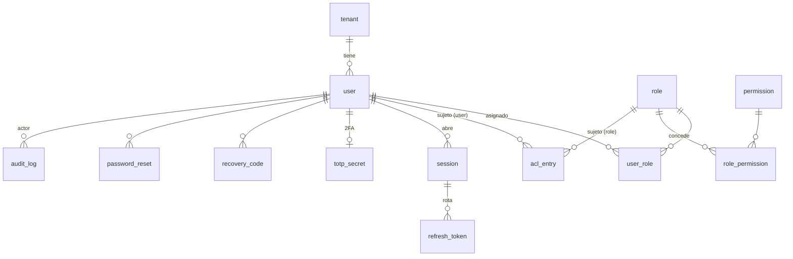
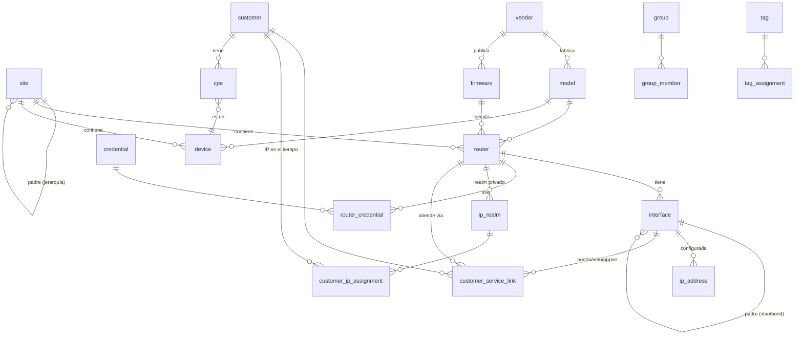
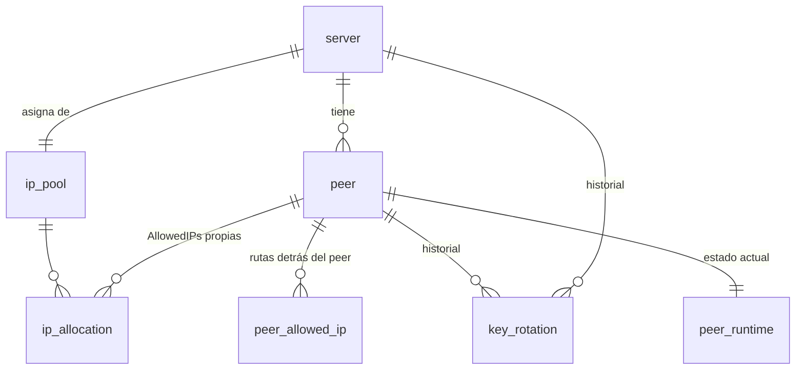
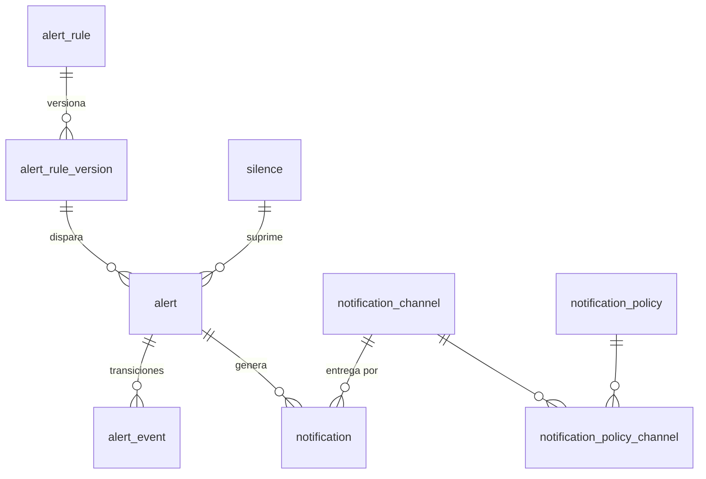
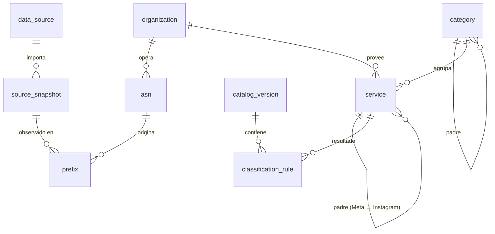
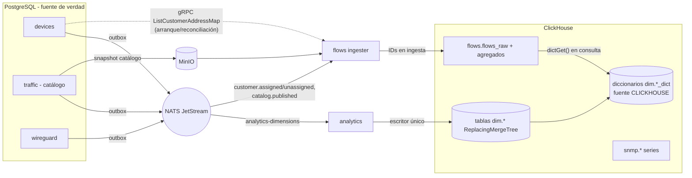

# Modelo de datos — Horus Flow

> Estado: **borrador Sprint 0** · Dueño: Agente 2 (Arquitecto de datos) · Fuente: [`vision.md`](vision.md)
>
> Documentos relacionados: [`traffic-model.md`](traffic-model.md) (pipeline de clasificación y
> atribución), [`storage.md`](storage.md) (MinIO/NAS, archivado, retención),
> [`open-questions/data.md`](open-questions/data.md) (decisiones pendientes del PO),
> [`architecture.md`](architecture.md) y [`services.md`](services.md) (Agente 1),
> [`events.md`](events.md) y [`api.md`](api.md) (Agente 3), [`security.md`](security.md),
> [`disaster-recovery.md`](disaster-recovery.md) y [`conventions.md`](conventions.md) (Agente 4).
>
> Todo el DDL de este documento es **ilustrativo (borrador)**. Las migraciones reales se escriben en
> cada servicio a partir del Sprint 1 siguiendo las reglas de la sección 3.

---

## 0. Resumen de decisiones

| # | Decisión | Justificación corta |
|---|----------|---------------------|
| D1 | Un clúster PostgreSQL, **una base `horus`, un esquema por servicio**, un rol de BD por servicio con permisos solo sobre su esquema. | Aislamiento de propiedad sin el costo operativo de N instancias; permite separar a instancias distintas después sin cambiar el modelo. |
| D2 | **Sin FK ni joins entre esquemas.** Referencias cruzadas = UUID "suelto" + sincronización por eventos NATS. | Cada servicio puede desplegarse, migrarse y caerse de forma independiente. |
| D3 | IDs **UUIDv7** generados en la aplicación (Go). `DEFAULT uuidv7()` solo como red de seguridad si se usa PostgreSQL ≥ 18. | Ordenables por tiempo (índices B-tree compactos), generables offline (colectores), iguales en PG y ClickHouse. |
| D4 | `tenant_id uuid NOT NULL` en las tablas raíz desde v1, con un único tenant sembrado. Sin RLS en v1. | Añadir la columna después en tablas con históricos de años es caro; mantenerla constante hoy es casi gratis. **Nombre**: `architecture.md` P9 lo llama `organization_id`; aquí se usa `tenant_id` porque `organization` ya es una entidad del dominio de clasificación (Meta, Google…) y `organization_id` aparece en cada fila de flujo con ese significado. Pendiente de unificar (ver §10). |
| D5 | Borrado **lógico** (`deleted_at`) para entidades referenciadas por históricos (sitios, routers, interfaces, suscriptores, servicios del catálogo, usuarios). Borrado **físico** para datos efímeros (sesiones, refresh tokens, códigos de recuperación usados, asignaciones caducadas fuera de retención). | ClickHouse guarda UUIDs durante años; el nombre de un router borrado debe seguir resolviéndose en un reporte de hace 2 años. |
| D6 | Migraciones con **goose** (SQL puro, embebido en el binario Go), **forward-only** en producción, patrón **expand/contract**. Mismo tooling para ClickHouse. | Una sola herramienta para PG y CH, sin DSL propio, SQL revisable en PR. |
| D7 | Dimensiones en ClickHouse como **tablas `dim.*` alimentadas por eventos** (escritor único: `analytics`, consumer `analytics-dimensions` de [`events.md`](events.md)) y expuestas como **diccionarios con fuente ClickHouse**. Hechos (flujos, métricas) se enriquecen con **IDs** en ingesta; los **nombres** se resuelven en consulta con `dictGet`. | Respeta P2 de [`architecture.md`](architecture.md) (ClickHouse no lee PostgreSQL); nombres mutables no se congelan en miles de millones de filas; consistencia eventual de segundos a ≤ 5 min; si PostgreSQL o NATS caen, las dimensiones siguen con su último estado. |
| D8 | **Métricas SNMP de red → ClickHouse** (fuente de verdad histórica). **Prometheus solo para la salud de la plataforma** (incluidas métricas agregadas del colector SNMP, sin etiquetas por interfaz). | Cardinalidad (router × interfaz) y retención de años no encajan en Prometheus; los reportes cruzan SNMP con flujos. Ver §9. |
| D9 | Flujos: una tabla cruda enriquecida (`flows.flows_raw`, escritor único: rol *ingester* de `flows`, [ADR-0015](adr/0015-enriquecimiento-de-flujos-en-ingesta.md)) + agregados 5 min / 1 h / 1 día alimentados por **materialized views en abanico desde la tabla cruda** (no en cascada). | Simplicidad y robustez: cada MV es independiente, el TTL de la cruda no afecta a los agregados. ([ADR-0008](adr/0008-clickhouse-para-analitica.md) menciona 1 min/1 h/1 d; aquí se propone 5 min como granularidad fina — ver §6.2.) |
| D10 | Los agregados se indexan por `service_id` (+ `catalog_version` en crudo); la **categoría se resuelve con diccionario** del catálogo vigente. `flows_raw` guarda además `category_id` de la versión usada, solo como auditoría (ADR-0015). | Si el catálogo mueve un servicio de categoría, el histórico se reinterpreta sin reescribir filas. Ver [`traffic-model.md` §6.4](traffic-model.md). |

---

## 1. Convenciones del modelo relacional

- **Tipos**: `uuid` para IDs, `timestamptz` para todo instante (UTC), `inet`/`cidr` para IPs y
  prefijos, `text` + `CHECK` (o tablas de referencia) en lugar de `ENUM` de PostgreSQL (los `ENUM`
  complican expand/contract), `jsonb` solo para atributos realmente abiertos (metadatos de
  fabricante, configuración de canal).
- **Columnas estándar** en tablas de entidades: `id`, `tenant_id`, `created_at`, `updated_at`,
  `deleted_at` (si borrado lógico), `version integer` (bloqueo optimista; la API usa `ETag`/`If-Match`
  — coordinar con [`api.md`](api.md)).
- **Nombres**: tablas en singular `snake_case` (`router`, `user_role`), FKs `<entidad>_id`,
  índices `ix_<tabla>__<cols>`, únicos `ux_<tabla>__<cols>`, checks `ck_<tabla>__<regla>`.
- **Unicidad con borrado lógico**: índices únicos parciales `WHERE deleted_at IS NULL`.
- **Texto de búsqueda**: `citext` para emails/usernames; `pg_trgm` (GIN) en nombres buscables
  (routers, suscriptores, sitios).
- **Extensiones requeridas**: `citext`, `pg_trgm`, `btree_gist` (constraints de exclusión por
  rango temporal). Se instalan en el esquema `public` por la migración de infraestructura (rol
  administrador), no por los servicios.
- **Outbox**: todo servicio que publica eventos tiene `<esquema>.outbox` (patrón transactional
  outbox) para no perder eventos si NATS está caído. Contrato del sobre del evento en
  [`events.md`](events.md).

```sql
-- borrador: tabla outbox estándar (una por esquema)
CREATE TABLE <schema>.outbox (
  id            uuid PRIMARY KEY,            -- UUIDv7 = event_id
  subject       text NOT NULL,               -- horus.<dominio>.<entidad>.<evento>
  aggregate_id  uuid NOT NULL,
  payload       jsonb NOT NULL,
  occurred_at   timestamptz NOT NULL,
  published_at  timestamptz,                 -- NULL = pendiente
  attempts      integer NOT NULL DEFAULT 0
);
CREATE INDEX ix_outbox__pending ON <schema>.outbox (id) WHERE published_at IS NULL;
-- borrado físico de publicados > 7 días (job del propio servicio)
```

### 1.1 Mapa de esquemas

| Esquema PG | Servicio dueño | Sprint | Contenido |
|------------|----------------|--------|-----------|
| `auth` | auth | 1–2 | usuarios, roles, permisos, ACL, sesiones, TOTP, auditoría |
| `devices` | devices | 3 | sitios, routers, interfaces, IPs, credenciales, catálogo de fabricantes, tags, grupos, **suscriptores y asignaciones de IP** |
| `wireguard` | wireguard | 4 | servidores, peers, pools, claves (cifradas), estado de handshake |
| `flows` | flows | 6 | exportadores registrados, plantillas, configuración de muestreo |
| `traffic` | traffic-intelligence | 7 | catálogo de clasificación versionado, ASN, organizaciones, prefijos |
| `detection` | detection (con módulo *reputation*) | 8/10 | fuentes e indicadores de reputación, hallazgos, modelos de scoring, veredictos confirmados |
| `alerts` | alerts | 11 | reglas, alertas, notificaciones, canales, silencios |
| `analytics` | analytics (con rol *reporting-worker* y job *archiver*) | 9/12/13 | dashboards guardados, definiciones y ejecuciones de reportes, ledger de archivado |

Sin esquema PG: `api-gateway` (sin estado propio salvo Redis) y `snmp` (su estado operativo —
leases de shards, último sondeo, últimos contadores para calcular deltas— vive en **NATS KV**
`snmp_router_state`, y el estado resumido se proyecta a `devices.router_status`; ver
[`services.md`](services.md)).

> Fusiones del MVP ([ADR-0014](adr/0014-granularidad-de-microservicios-en-el-mvp.md)):
> *network* → `wireguard`; *security + reputation + detection* → `detection`; *reporting* →
> `analytics`; auditoría → `auth`. Cada módulo usa un **prefijo de tabla** dentro del esquema del
> servicio anfitrión (`detection.reputation_*`, `analytics.report_*`) para poder extraerlo después
> a su propio esquema con un simple `ALTER TABLE … SET SCHEMA`.

---

## 2. Esquemas PostgreSQL por servicio

### 2.1 `auth`



| Tabla | Campos clave | Constraints / índices | Borrado |
|-------|--------------|-----------------------|---------|
| `tenant` | `id`, `slug`, `name`, `status` | `ux(slug)` | lógico |
| `user` | `id`, `tenant_id`, `username citext`, `email citext`, `display_name`, `password_hash text` (Argon2id PHC string), `status` (`active`/`disabled`/`locked`/`pending`), `failed_logins int`, `locked_until`, `last_login_at`, `password_changed_at`, `mfa_enforced bool`, `external_subject text` (futuro OIDC) | `ux(tenant_id, username) WHERE deleted_at IS NULL`, `ux(tenant_id, email) WHERE deleted_at IS NULL`, `ux(external_issuer, external_subject)` | lógico (el UUID aparece en `audit_log` para siempre); al borrar se anonimizan email/nombre |
| `role` | `id`, `tenant_id`, `key` (`admin`, `noc`, `viewer`…), `name`, `description`, `is_system bool` | `ux(tenant_id, key)` | físico si no `is_system` y sin usuarios |
| `permission` | `key text PK` (`devices.read`, `traffic.read`…), `description`, `resource`, `action` | `ck(key = resource || '.' || action)` | — catálogo sembrado por migración; nunca se borra, se marca `deprecated_at` |
| `role_permission` | `role_id`, `permission_key` | PK compuesta | físico |
| `user_role` | `user_id`, `role_id`, `granted_by`, `granted_at`, `expires_at` | PK compuesta; `ix(role_id)` | físico (queda en auditoría) |
| `acl_entry` | `id`, `tenant_id`, `subject_type` (`user`/`role`), `subject_id`, `resource_type` (`site`/`router`/`device_group`/`customer_group`/`wireguard_server`), `resource_id uuid` (**sin FK**, vive en otro esquema), `effect` (`allow`/`deny`), `permissions text[]` (subconjunto de permisos que aplica; vacío = todos los del rol) | `ux(subject_type, subject_id, resource_type, resource_id)`; `ix(resource_type, resource_id)` | físico |
| `session` | `id`, `user_id`, `created_at`, `last_seen_at`, `expires_at`, `revoked_at`, `revoked_reason`, `ip inet`, `user_agent`, `mfa_verified_at` | `ix(user_id) WHERE revoked_at IS NULL` | físico tras `expires_at + 30 d` (su rastro queda en `audit_log`) |
| `refresh_token` | `id`, `session_id`, `token_hash bytea` (SHA-256; el token **nunca** se guarda en claro), `family_id` (detección de reutilización), `issued_at`, `expires_at`, `used_at`, `replaced_by` | `ux(token_hash)`; `ix(session_id)` | físico tras expiración |
| `totp_secret` | `user_id PK`, `secret_ciphertext bytea`, `key_version int`, `confirmed_at`, `last_used_step bigint` (anti-replay) | — | físico al desactivar 2FA |
| `recovery_code` | `id`, `user_id`, `code_hash`, `used_at` | `ix(user_id) WHERE used_at IS NULL` | físico al regenerar |
| `password_reset` | `id`, `user_id`, `token_hash`, `expires_at`, `used_at` | `ux(token_hash)` | físico tras 24 h |
| `audit_log` | `id` (UUIDv7), `tenant_id`, `occurred_at`, `actor_type` (`user`/`service`/`system`), `actor_id`, `action` (`devices.router.updated`…), `resource_type`, `resource_id`, `result` (`success`/`denied`/`error`), `ip`, `user_agent`, `trace_id`, `request_id`, `changes jsonb` (diff sin secretos), `prev_hash bytea`, `hash bytea` | **particionada por mes** (`PARTITION BY RANGE (occurred_at)`); `ix(resource_type, resource_id, occurred_at)`, `ix(actor_id, occurred_at)`; solo `INSERT` (rol del servicio sin `UPDATE/DELETE`) | **nunca** se modifica; particiones > retención (propuesta 2 años en PG) se exportan a MinIO (object lock) y se hace `DETACH`+`DROP` |

Notas:

- **Sesiones en Redis vs PG**: PG es la fuente de verdad de sesiones revocables; Redis guarda una
  lista de revocación/caché (`session:{id}`) con TTL para que el gateway valide sin ir a PG en cada
  request. Detalle en [`security.md`](security.md).
- **ACL**: el permiso efectivo = permisos de roles ∩ alcance ACL. Sin entradas ACL ⇒ alcance global
  del rol (decisión a confirmar con Agente 4). Cuando `devices` borra un sitio emite
  `horus.devices.site.deleted` y `auth` limpia/invalida las entradas ACL huérfanas.
- **Auditoría centralizada**: otros servicios publican eventos de auditoría
  (`horus.audit.entry.recorded`, nombre a confirmar por Agente 3) y `auth` los persiste. Alternativa:
  cada servicio su propia tabla de auditoría. Recomiendo centralizar (una sola UI, una sola
  cadena de hash). Coordinar con Agente 1/4.
- **Cadena de hash** (`prev_hash`, `hash`): integridad evidente ante manipulación; opcional en v1,
  pero la columna se crea desde el inicio.

### 2.2 `devices` (inventario + suscriptores)



#### 2.2.1 Inventario de red

| Tabla | Campos clave | Constraints / índices | Borrado |
|-------|--------------|-----------------------|---------|
| `site` | `id`, `tenant_id`, `parent_id` (jerarquía lógica: región → ciudad → nodo/POP → torre), `code`, `name`, `kind` (`region`/`pop`/`tower`/`datacenter`/`office`/`other`), `address`, `latitude numeric(9,6)`, `longitude numeric(9,6)`, `timezone text` (IANA, para reportes "por día local"), `metadata jsonb` | `ux(tenant_id, code) WHERE deleted_at IS NULL`; `ix(parent_id)`; `ck` sin ciclos (validado en aplicación) | lógico |
| `vendor` | `id`, `key` (`mikrotik`, `cisco`, `huawei`, `juniper`, `ubiquiti`, `other`), `name`, `enterprise_oid text` (sysObjectID raíz) | `ux(key)` | lógico |
| `model` | `id`, `vendor_id`, `name`, `sys_object_id text`, `kind` (`router`/`switch`/`olt`/`ap`/`cpe`/`server`), `capabilities jsonb` (soporta netflow/ipfix/sflow, snmpv3…) | `ux(vendor_id, name)`; `ix(sys_object_id)` | lógico |
| `firmware` | `id`, `vendor_id`, `model_id NULL`, `version`, `release_date`, `eol_date`, `notes`, `is_vulnerable bool` | `ux(vendor_id, model_id, version)` | lógico |
| `router` | `id`, `tenant_id`, `site_id`, `model_id`, `firmware_id`, `hostname`, `display_name`, `serial_number`, `mgmt_address inet` (dirección de gestión, típicamente la IP WireGuard), `mgmt_wireguard_peer_id uuid NULL` (sin FK, esquema `wireguard`), `role` (`edge`/`border`/`core`/`aggregation`/`bng`), `admin_state` (`active`/`maintenance`/`decommissioned`), `snmp_profile_id uuid NULL` (esquema `snmp`, sin FK), `flow_export_enabled bool`, `flow_sampling_rate int NULL` (declarado; el real llega en el flujo), `sys_object_id`, `sys_descr`, `metadata jsonb` | `ux(tenant_id, hostname) WHERE deleted_at IS NULL`; `ux(serial_number) WHERE deleted_at IS NULL AND serial_number IS NOT NULL`; `ix(site_id)`; `ix GIN(display_name gin_trgm_ops)` | lógico |
| `device` | Equipos no-router (switch, OLT, AP, servidor, **CPE**): `id`, `tenant_id`, `site_id NULL`, `model_id`, `kind`, `name`, `serial_number`, `mac_address macaddr`, `mgmt_address inet`, `admin_state` | `ux(tenant_id, mac_address) WHERE deleted_at IS NULL AND mac_address IS NOT NULL` | lógico |
| `interface` | `id`, `router_id`, `parent_interface_id NULL`, `if_index int`, `name` (ifName), `descr` (ifDescr), `alias` (ifAlias), `kind` (`ethernet`/`vlan`/`bond`/`pppoe_server`/`wireguard`/`bridge`/`loopback`/`other`), `vlan_id int NULL`, `speed_bps bigint`, `mtu int`, `mac_address`, `flow_role` (`customer_edge`/`upstream`/`peering`/`core`/`management`/`none`) — **clave para la deduplicación de flujos**, ver [`traffic-model.md` §10](traffic-model.md), `monitored bool`, `discovered_at`, `last_seen_at` | `ux(router_id, if_index) WHERE deleted_at IS NULL`; `ux(router_id, name) WHERE deleted_at IS NULL` | lógico (los ifIndex cambian tras reboot en algunos equipos: se re-concilia por `name` y se conserva el `id`) |
| `ip_address` | IPs **configuradas en interfaces** del equipo (no de clientes): `id`, `interface_id`, `address inet` (con máscara), `realm_id`, `is_primary bool` | `ux(realm_id, address)`; `ix GiST(address inet_ops)` | físico (re-descubrible) |
| `credential` | `id`, `tenant_id`, `name`, `kind` (`snmp_v2c`/`snmp_v3`/`ssh`/`routeros_api`/`netconf`/`http_api`), `username text NULL` (no secreto), `snmp_v3_auth_proto`, `snmp_v3_priv_proto`, `secret_ciphertext bytea`, `secret_nonce bytea`, `dek_wrapped bytea`, `kek_id text` (o bien `secret_ref text` si se usa un gestor externo — ver nota), `rotated_at`, `last_used_at` | `ux(tenant_id, name) WHERE deleted_at IS NULL`; `ck(secret_ciphertext IS NOT NULL OR secret_ref IS NOT NULL)` | lógico, pero el material cifrado se **sobrescribe con NULL** al borrar (crypto-shredding) |
| `router_credential` | `router_id`, `credential_id`, `purpose` (`snmp`/`api`/`ssh`), `priority` | PK `(router_id, purpose, priority)` | físico |
| `ip_realm` | Espacio de direccionamiento donde una IP es única: `id`, `tenant_id`, `kind` (`public` = global del ISP / `private` = detrás de un router o VRF / `cgnat` = 100.64.0.0/10 compartido), `router_id NULL`, `vrf_name NULL`, `name` | `ux(tenant_id) WHERE kind='public'` (uno solo); `ux(router_id, vrf_name)` | lógico |
| `tag` | `id`, `tenant_id`, `key`, `value`, `color` | `ux(tenant_id, key, value)` | físico |
| `tag_assignment` | `tag_id`, `resource_type` (`site`/`router`/`device`/`interface`/`customer`), `resource_id` | PK compuesta; `ix(resource_type, resource_id)` | físico |
| `group` | Grupos para ACL y reportes: `id`, `tenant_id`, `kind` (`device_group`/`customer_group`), `name`, `dynamic_filter jsonb NULL` (grupo dinámico por tags/sitio) | `ux(tenant_id, kind, name)` | lógico |
| `group_member` | `group_id`, `member_type`, `member_id` | PK compuesta | físico |
| `router_status` | Estado operacional actual (proyección de eventos SNMP/ICMP/WireGuard): `router_id PK`, `status` (`online`/`offline`/`warning`/`critical`/`unknown`), `reason`, `since`, `last_poll_at`, `last_seen_at` | `ix(status)` | — (1 fila por router) |

Notas:

- **Router vs device**: se separan porque el router tiene ciclo de vida propio (SNMP, flujos,
  WireGuard, interfaces). `device` cubre el resto del inventario, incluidos CPE.
- **`router_status`** se actualiza por eventos (`horus.snmp.router.unreachable`, etc.) y alimenta el
  dashboard *online/offline/warning/critical* sin consultar ClickHouse (funciona sin ClickHouse,
  requisito del Sprint 14).
- **Credenciales**: propuesta de cifrado por sobre (envelope): DEK por secreto (AES-256-GCM),
  envuelta con una KEK fuera de la BD (archivo/secret de Docker en v1; Vault/KMS después). La
  decisión de mecanismo es del Agente 4 ([`security.md`](security.md)); el modelo soporta ambos
  caminos (`secret_ciphertext` + `dek_wrapped` + `kek_id`, o `secret_ref`). **Ninguna API devuelve
  el secreto**; solo `snmp`/`wireguard` lo piden por gRPC interno autenticado.

#### 2.2.2 Clientes / suscriptores

En v1 los suscriptores viven en `devices` (están ligados a router/interfaz/IP/CPE y son la
dimensión que necesita la atribución de flujos). Si en el futuro hay integración con
facturación/CRM, se mantiene aquí la **proyección** con `external_ref` (ver open questions Q1).

| Tabla | Campos clave | Constraints / índices | Borrado |
|-------|--------------|-----------------------|---------|
| `customer` | `id`, `tenant_id`, `external_ref text NULL` (ID en CRM/facturación), `code` (nº de cliente), `name`, `kind_declared` (`residential`/`business`/`unknown` — lo contratado; el detectado vive en `detection`), `plan_name`, `plan_down_bps`, `plan_up_bps`, `status` (`active`/`suspended`/`terminated`), `site_id NULL`, `address`, `latitude`, `longitude`, `contact jsonb` (PII: email/teléfono; ver nota) | `ux(tenant_id, code) WHERE deleted_at IS NULL`; `ux(tenant_id, external_ref) WHERE external_ref IS NOT NULL AND deleted_at IS NULL`; GIN trigram en `name` | lógico; PII anonimizada a los N días de `terminated` (política a definir) |
| `cpe` | `id`, `customer_id`, `device_id NULL` (si se gestiona como equipo), `mac_address`, `serial_number`, `model_text`, `installed_at`, `removed_at` | `ix(customer_id)`; `ux(mac_address) WHERE removed_at IS NULL` | lógico (`removed_at`) |
| `customer_service_link` | Cómo se conecta el cliente a la red (puede cambiar en el tiempo): `id`, `customer_id`, `router_id`, `interface_id NULL` (puerto/VLAN/interfaz PPPoE server), `access_type` (`pppoe`/`ipoe_dhcp`/`static`/`gpon`/`wireless`), `pppoe_username NULL`, `vlan_id NULL`, `valid tstzrange NOT NULL` | `EXCLUDE USING gist (customer_id WITH =, valid WITH &&)` (una sola conexión activa por cliente en v1); `ux(router_id, pppoe_username) WHERE upper_inf(valid)` | nunca se borra; se cierra el rango |
| `customer_ip_assignment` | **Tabla crítica para la atribución.** `id`, `tenant_id`, `customer_id`, `realm_id`, `prefix inet` (una IP `/32`/`/128` o un prefijo delegado IPv6 `/56`, `/64`), `source` (`static`/`dhcp`/`pppoe_radius`/`pppoe_router_api`/`cgnat_log`/`manual`), `router_id NULL`, `valid tstzrange NOT NULL` (`[inicio, fin)`; fin abierto = vigente), `session_ref text NULL` (Acct-Session-Id, lease id), `observed_at` | `EXCLUDE USING gist (realm_id WITH =, prefix inet_ops WITH &&, valid WITH &&)` — **una IP/prefijo no puede pertenecer a dos clientes a la vez en el mismo realm**; `ix GiST(realm_id, prefix inet_ops, valid)`; `ix(customer_id, lower(valid))` | físico solo pasado el horizonte de retención de flujos crudos + agregados que la usen (propuesta: 13 meses); nunca se actualiza el pasado salvo corrección auditada |

Notas sobre `customer_ip_assignment`:

- PostgreSQL ≥ 18 permite `UNIQUE (realm_id, prefix, valid WITHOUT OVERLAPS)`; el `EXCLUDE` con
  `btree_gist` es el equivalente portable y es el que se recomienda escribir.
- Volumen: con PPPoE/DHCP dinámico, ~1–3 cambios por cliente por día ⇒ 100 k clientes ≈ 300 k
  filas/día ≈ 110 M filas/año. Se **particiona por mes** sobre `lower(valid)` cuando supere ~50 M
  filas (Sprint 15).
- Las asignaciones se publican como eventos (`horus.devices.customer.assigned` /
  `horus.devices.customer.unassigned`, nombres de [`services.md`](services.md)) y se exponen por
  gRPC (`ListCustomerAddressMap`) para que el **ingester de `flows`** mantenga su tabla de
  atribución en memoria. **Dependencia
  Agente 3**: payload con `assignment_id, customer_id, realm_id, prefix, valid_from, valid_to,
  source, router_id`.

### 2.3 `wireguard`



| Tabla | Campos clave | Constraints / índices | Borrado |
|-------|--------------|-----------------------|---------|
| `server` | `id`, `tenant_id`, `name`, `host` (nodo donde corre la interfaz), `interface_name` (`wg0`), `listen_port int`, `endpoint text` (host:puerto público), `public_key text` (base64, 44 chars), `private_key_ciphertext bytea`, `dek_wrapped`, `kek_id`, `mtu`, `dns inet[]`, `persistent_keepalive int`, `status` | `ux(tenant_id, name)`; `ux(host, interface_name)`; `ux(public_key)` | lógico + crypto-shredding de la privada |
| `ip_pool` | `id`, `server_id`, `cidr cidr` (p. ej. `10.200.0.0/16`), `gateway inet`, `family` (4/6) | `ux(server_id, family)`; `EXCLUDE USING gist (cidr inet_ops WITH &&)` (pools no solapados) | físico si sin asignaciones |
| `ip_allocation` | `pool_id`, `address inet`, `peer_id`, `allocated_at`, `released_at` | `ux(pool_id, address) WHERE released_at IS NULL`; `ck(address << pool.cidr)` (validado en app) | lógico (`released_at`); cuarentena de 24 h antes de reutilizar una IP liberada |
| `peer` | `id`, `server_id`, `kind` (`router`/`operator`/`service`), `router_id uuid NULL` (sin FK, `devices`), `name`, `public_key text`, `preshared_key_ciphertext bytea NULL`, `dek_wrapped`, `kek_id`, `endpoint text NULL`, `persistent_keepalive`, `status` (`pending`/`active`/`disabled`/`revoked`), `revoked_at`, `revoked_reason`, `key_created_at`, `key_expires_at` (política de rotación) | `ux(server_id, public_key) WHERE revoked_at IS NULL`; `ux(router_id) WHERE revoked_at IS NULL AND router_id IS NOT NULL` | lógico (`revoked_at`); nunca se reutiliza una clave pública revocada (`ux(public_key)` global sobre histórico) |
| `peer_allowed_ip` | Prefijos ruteados detrás del peer (LAN de gestión del router): `peer_id`, `cidr` | PK; `EXCLUDE USING gist (cidr inet_ops WITH &&)` dentro del servidor (validado en app/trigger) | físico |
| `key_rotation` | `id`, `owner_type` (`server`/`peer`), `owner_id`, `old_public_key`, `new_public_key`, `rotated_at`, `rotated_by`, `reason` | `ix(owner_type, owner_id, rotated_at)` | nunca (histórico) |
| `peer_runtime` | `peer_id PK`, `last_handshake_at`, `endpoint_observed`, `rx_bytes bigint`, `tx_bytes bigint`, `sampled_at`, `state` (`up`/`stale`/`down`), `state_since` | `ix(state)` | — (1 fila por peer, upsert) |
| `config_render` (opcional) | Metadatos de entregas de configuración: `id`, `peer_id`, `rendered_at`, `rendered_by`, `delivery` (`download`/`api_push`), `sha256` | — | físico > 1 año |

**Material de claves: qué se guarda y qué no**

| Material | ¿Se guarda? | Cómo | Motivo |
|----------|-------------|------|--------|
| Clave privada del **servidor** | Sí | Cifrada (envelope) | El servicio debe reconstruir la interfaz tras reinicio/migración de host. |
| Clave pública servidor/peers | Sí | En claro | Es pública; se necesita para configurar. |
| Clave privada de un **peer router** | **No** (por defecto) | Se genera, se entrega una vez (descarga o push por API del router) y se descarta | Si la BD se filtra, no hay acceso a los routers. Si el router pierde su clave ⇒ rotación (nuevo par). |
| Clave privada generada por el propio router | Nunca llega a Horus | El router envía solo su pública | Opción preferida cuando el equipo lo soporta (MikroTik RouterOS 7). |
| Preshared key | Sí | Cifrada | Forma parte de la config del servidor y del peer. |
| Configuración `.conf` renderizada | **No** se persiste | Se genera bajo demanda desde la BD | Contiene la privada del peer; ver [`storage.md`](storage.md) §3. |

**Handshakes**: el estado actual va en `peer_runtime` (PostgreSQL, sirve sin ClickHouse). Las
transiciones (`up→down`) se publican como eventos (`horus.wireguard.peer.handshake_lost` /
`.handshake_restored`, nombres a confirmar con Agente 3) y la serie temporal de rx/tx/handshake
(cada 60 s) se guarda en ClickHouse `wireguard.peer_metrics` (ver §6.4) cuando ClickHouse exista.

### 2.4 `alerts`



| Tabla | Campos clave | Constraints / índices | Borrado |
|-------|--------------|-----------------------|---------|
| `alert_rule` | `id`, `tenant_id`, `key`, `name`, `current_version int`, `enabled bool`, `owner_id` | `ux(tenant_id, key) WHERE deleted_at IS NULL` | lógico |
| `alert_rule_version` | `rule_id`, `version`, `source` (`snmp`/`flows`/`wireguard`/`detection`/`reputation`/`system`), `condition jsonb` (expresión declarativa: métrica, operador, umbral, ventana, `for` duración), `severity` (`info`/`warning`/`critical`), `scope jsonb` (sitio/grupo/router), `labels jsonb`, `created_by`, `created_at` | PK `(rule_id, version)`; inmutable | nunca (las alertas referencian la versión exacta) |
| `alert` | `id`, `tenant_id`, `rule_id`, `rule_version`, `fingerprint bytea` (hash de regla + entidad afectada), `resource_type`, `resource_id`, `severity`, `state` (`firing`/`acknowledged`/`resolved`/`suppressed`), `summary`, `details jsonb`, `started_at`, `acknowledged_at`, `acknowledged_by`, `resolved_at`, `last_evaluated_at`, `occurrences int` | `ux(fingerprint) WHERE state IN ('firing','acknowledged')` (deduplicación: una alerta abierta por fingerprint); `ix(state, severity, started_at DESC)`; `ix(resource_type, resource_id, started_at DESC)` | físico > 13 meses (exportable a MinIO); particionado mensual si crece |
| `alert_event` | `id`, `alert_id`, `occurred_at`, `from_state`, `to_state`, `actor_id NULL`, `note` | `ix(alert_id, occurred_at)` | igual que `alert` |
| `notification_channel` | `id`, `tenant_id`, `kind` (`web`/`email`/`telegram`/`whatsapp`/`sms`/`webhook`), `name`, `config jsonb` (no secreto: destinatario, chat_id, URL), `secret_ciphertext bytea NULL` (token del bot, secreto HMAC del webhook), `dek_wrapped`, `kek_id`, `enabled`, `last_success_at`, `last_error` | `ux(tenant_id, name)` | lógico |
| `notification_policy` | Enrutamiento: `id`, `match jsonb` (severidad, labels, sitio), `group_wait`, `repeat_interval`, `priority` | — | lógico |
| `notification_policy_channel` | `policy_id`, `channel_id` | PK | físico |
| `notification` | `id`, `alert_id`, `channel_id`, `status` (`pending`/`sent`/`failed`/`dead`), `attempts`, `next_attempt_at`, `sent_at`, `provider_message_id`, `error` | `ix(status, next_attempt_at) WHERE status IN ('pending','failed')` | físico > 90 días |
| `silence` | `id`, `matchers jsonb`, `starts_at`, `ends_at`, `created_by`, `comment` (ventanas de mantenimiento) | `ix(ends_at)` | físico > 1 año |

### 2.5 `traffic` (catálogo de clasificación)

El diseño funcional (reglas, prioridad, confianza, publicación, CDN) está en
[`traffic-model.md` §6–§8](traffic-model.md). Aquí solo el modelo físico.



| Tabla | Campos clave | Constraints / índices | Borrado |
|-------|--------------|-----------------------|---------|
| `category` | `id`, `key` (`social`, `video_streaming`, `gaming`, `cloud`, `cdn_infra`, `messaging`, `software_updates`, `unknown`…), `name`, `parent_id`, `color` | `ux(key)` | lógico (`deprecated_at`); nunca físico: CH la referencia |
| `organization` | `id`, `key` (`meta`, `google`, `netflix`…), `name`, `country`, `peeringdb_org_id int NULL`, `website`, `source` (`manual`/`caida_as2org`/`peeringdb`/`whois`) | `ux(key)` | lógico |
| `asn` | `asn bigint PK` (4 bytes), `organization_id NULL`, `name` (AS-name), `country`, `rir`, `network_type` (`content`/`nsp`/`cable_dsl_isp`/`enterprise`/`educational`/`unknown`, de PeeringDB), `updated_at` | `ix(organization_id)` | — (se actualiza, no se borra) |
| `service` | `id`, `key` (`instagram`, `youtube`, `netflix`, `steam`, `cloudflare_generic`…), `name`, `organization_id NULL`, `category_id`, `parent_service_id NULL`, `is_generic bool` (bolsa genérica de una organización/CDN), `icon` | `ux(key)` | lógico; nunca físico |
| `data_source` | `id`, `key` (`iptoasn`, `routeviews_rib`, `ripe_ris`, `caida_as2org`, `peeringdb`, `aws_ip_ranges`, `google_ranges`, `cloudflare_ips`, `geolite2_asn`…), `license`, `url`, `refresh_interval` | `ux(key)` | — |
| `source_snapshot` | `id`, `data_source_id`, `fetched_at`, `object_key` (MinIO), `sha256`, `row_count`, `status` | `ix(data_source_id, fetched_at DESC)` | físico > 90 días (el objeto en MinIO sigue su lifecycle) |
| `prefix` | Tabla resultante prefix→ASN consolidada: `prefix cidr`, `origin_asn bigint`, `snapshot_id`, `first_seen`, `last_seen`, `is_moas bool` (múltiples orígenes) | PK `(prefix, origin_asn)`; `ix GiST(prefix inet_ops)` | físico al reemplazar snapshot (~1,1 M prefijos IPv4+IPv6; se carga con `COPY` en tabla nueva + swap) |
| `catalog_version` | `id`, `version int` (monotónico), `status` (`draft`/`validated`/`published`/`retired`), `based_on_version`, `changelog text`, `created_by`, `published_at`, `published_by`, `artifact_object_key` (MinIO), `artifact_sha256`, `stats jsonb` | `ux(version)`; `ux(status) WHERE status='published'` (una sola publicada a la vez) | nunca |
| `classification_rule` | `id`, `catalog_version_id`, `priority int`, `match_type` (`prefix`/`asn`/`asn_port`/`prefix_port`/`port`/`sni`/`dns`/`local_override`), `match_asn bigint NULL`, `match_prefix cidr NULL`, `match_protocol smallint NULL`, `match_port_range int4range NULL`, `match_pattern text NULL` (SNI/DNS futuro), `direction` (`any`/`remote_is_server`), `service_id`, `confidence smallint` (0–100), `scope` (`global`/`local`), `note`, `source_ref` | `ix(catalog_version_id, match_type)`; `ck(confidence BETWEEN 0 AND 100)`; filas **inmutables** una vez publicada la versión (trigger o rol sin `UPDATE`) | nunca |

### 2.6 Esquemas secundarios (borrador ligero; se detallan en su sprint)

- **`snmp` (sin PostgreSQL)**: el estado por router (`last_success_at`, `last_error`,
  `consecutive_failures`, último `sysUpTime` y contadores `ifHC*` previos para calcular deltas y
  detectar wrap/reinicio) vive en NATS KV `snmp_router_state`. Perfiles de sondeo y mapa de OIDs
  por fabricante/modelo (CPU, RAM, temperatura) se versionan como **archivos en el repositorio**
  (`services/snmp/profiles/`) o, si deben ser editables desde la UI, como tablas
  `devices.snmp_profile` (decisión de Sprint 5). Las series van a ClickHouse (§6.3).
- **`flows`**: `exporter` (`id`, `router_id`, `source_ip inet`, `observation_domain_id`,
  `protocol`, `declared_sampling_rate`, `last_packet_at`), `template_cache` (plantillas v9/IPFIX
  persistidas para no perder decodificación tras reinicio del colector).
- **`detection`** (incluye módulo reputation):
  - `reputation_source` (`key`, `license`, `kind`, `weight`, `refresh_interval`) y
    `reputation_entry` (`value cidr`, `source_id`, `category` (`scanner`/`botnet_cc`/`spam`/
    `tor_exit`/`vpn_proxy`…), `score`, `first_seen`, `last_seen`, `expires_at`;
    `ux(source_id, value)`, `ix GiST(value inet_ops)`; borrado físico al expirar).
    **Decisión: `reputation_entry` en PostgreSQL**: volumen esperado 1–5 M entradas (feeds
    públicos típicos), consultas puntuales por IP con GiST, altas/bajas frecuentes (mal caso para
    ClickHouse). Para cruzar con flujos se compila un snapshot que se carga en ClickHouse como
    diccionario `IP_TRIE` (`dim.reputation`) y detection escribe los cruces en
    `detection.reputation_hits` (CH). Se reevalúa a > 10 M entradas.
  - `finding`, `finding_evidence`, `scoring_model` (versión, pesos, parámetros),
    `verdict_feedback` (confirmación humana "es comercial / no lo es" para recalibrar). Los scores
    por cliente y período viven en ClickHouse (`detection.customer_scores_1d`).
- **`analytics`** (incluye reporting y archiver): `dashboard` (vistas guardadas por usuario),
  `report_definition`, `report_run` (`status`, `parameters jsonb`, `object_key` en MinIO,
  `sha256`, `expires_at`, `requested_by`), `archive_manifest` (ledger de particiones de ClickHouse
  archivadas en MinIO, ver [`storage.md` §6](storage.md)).

---

## 3. Estrategia de migraciones

**Herramienta**: [goose](https://github.com/pressly/goose) v3 (SQL puro; migraciones embebidas con
`embed.FS`; soporta PostgreSQL y ClickHouse). Alternativas evaluadas: `golang-migrate` (equivalente,
menos cómodo para migraciones Go cuando hace falta un backfill), Atlas (potente, diff declarativo,
pero añade un DSL/licencia y lo declarativo choca con expand/contract manual).

**Ubicación**: `services/<servicio>/migrations/postgres/NNNNNNNNNNNNNN_<descripcion>.sql` y
`services/<servicio>/migrations/clickhouse/...`. Tabla de control por esquema:
`<esquema>.goose_db_version` (no compartida).

**Reglas**

1. **Forward-only en producción**. Se escribe el bloque `-- +goose Down` solo para desarrollo
   local; en producción la corrección de un error es otra migración hacia adelante. Antes de
   migrar en producción se toma snapshot/backup (ver [`disaster-recovery.md`](disaster-recovery.md)).
2. **Expand / contract** para todo cambio incompatible, en **releases distintas**:
   1. *Expand*: añadir columna/tabla nueva (nullable o con default), escribir en ambas.
   2. *Migrate*: backfill por lotes (job idempotente, no dentro de la transacción de migración).
   3. *Switch*: el código lee de la nueva.
   4. *Contract*: release posterior elimina lo viejo.
   Así, la versión N y N+1 del servicio funcionan con el mismo esquema (requisito de despliegue
   sin downtime y de rollback de binario sin rollback de BD).
3. **Prohibido en una sola migración**: renombrar columnas/tablas usadas, `ALTER COLUMN TYPE` que
   reescriba la tabla, `NOT NULL` sin default sobre tablas grandes, `CREATE INDEX` sin
   `CONCURRENTLY` en tablas con datos (goose: `-- +goose NO TRANSACTION`).
4. **Timeouts**: cada migración fija `SET lock_timeout = '5s'` y `statement_timeout`; si no obtiene
   el lock, falla y se reintenta, nunca bloquea el tráfico.
5. **Quién migra**: el propio servicio al arrancar (`--migrate` / init container) con un rol
   `<servicio>_migrator` (DDL en su esquema) distinto del rol de ejecución `<servicio>_app` (solo
   DML). Lock de advisory de goose evita migraciones concurrentes de réplicas.
6. **CI**: cada PR levanta PG/CH limpios, aplica todas las migraciones desde cero, y además aplica
   las nuevas sobre un dump con el esquema de la última release (detecta migraciones que solo
   funcionan en vacío). Lint con `squawk` para PostgreSQL.
7. **ClickHouse**: mismas reglas, más: `ALTER TABLE ... ADD COLUMN` es barato (metadato); cambios de
   `ORDER BY`/`PARTITION BY` **no** son posibles in-place ⇒ tabla nueva + MV de doble escritura +
   `INSERT SELECT` por particiones + swap con `EXCHANGE TABLES`. Los MV se recrean siempre en la
   misma migración que su tabla destino.

---

## 4. Relación PostgreSQL ↔ ClickHouse



### 4.1 Principios

1. **Los hechos llevan IDs, no nombres.** Una fila de flujo guarda `customer_id`, `router_id`,
   `site_id`, `interface_id`, `service_id`, `remote_asn`, `remote_org_id`. Nunca `router_name`.
   (El evento enriquecido de [`events.md`](events.md) §8.6 lleva `remote_org` y `service` como
   texto: en ClickHouse se guardan sus IDs.)
2. **Lo temporal se resuelve en ingesta.** La atribución IP→cliente depende del instante
   (asignaciones dinámicas). Se resuelve una sola vez, cuando llega el flujo, en el **rol ingester
   de `flows`** ([ADR-0015](adr/0015-enriquecimiento-de-flujos-en-ingesta.md)), con su tabla en
   memoria alimentada por eventos `horus.devices.customer.assigned/unassigned` + snapshot inicial
   por gRPC a `devices` (`ListCustomerAddressMap`). Resolverlo en consulta con un diccionario
   `RANGE_HASHED` sería posible pero caro sobre miles de millones de filas y frágil si la tabla de
   asignaciones se purga.
3. **Lo descriptivo y mutable se resuelve en consulta** con diccionarios cuya fuente son tablas
   `dim.*` **dentro de ClickHouse**:

| Tabla `dim.*` (ReplacingMergeTree(`version`)) | Evento de origen (dueño) | Diccionario | LIFETIME | Uso |
|-----------------------------------------------|--------------------------|-------------|----------|-----|
| `dim.site` | `horus.devices.site.*` | `HASHED` (UUID) | 60–300 s | nombre, padre, timezone |
| `dim.router` | `horus.devices.router.*` | `HASHED` | 60–300 s | nombre, sitio, rol |
| `dim.interface` | `horus.devices.interface.*` | `HASHED` | 60–300 s | nombre, speed_bps, flow_role |
| `dim.customer` | `horus.devices.customer.*` (**sin PII**: id, code, name, kind_declared, plan, site_id, status) | `HASHED` | 300 s | nombre/código del cliente, plan |
| `dim.service`, `dim.category`, `dim.organization`, `dim.asn` | `horus.traffic.catalog.published` (analytics lee el snapshot de MinIO y vuelca las tablas de la versión) | `HASHED` | 300 s | nombres, `category_id` vigente de cada servicio, AS-name |
| `dim.wg_peer` | `horus.wireguard.peer.*` | `HASHED` | 300 s | nombre del peer |
| `dim.prefix_asn` | snapshot del catálogo | `IP_TRIE` | al publicar | "¿qué es esta IP?" con el catálogo actual (ADR-0015) |
| `dim.reputation` | snapshot de reputación de `detection` | `IP_TRIE` | al publicar | cruce de flujos con reputación vigente |

- Escritor único de `dim.*`: `analytics` (consumer `analytics-dimensions` de
  [`events.md`](events.md)). Las tablas son publicadas (las leen detection y alerts).
- **Arranque y reconciliación**: al iniciar, y cada noche, `analytics` pide un snapshot completo por
  gRPC (`devices`, `wireguard`) y reescribe las dimensiones (corrige eventos perdidos o
  desordenados; `ReplacingMergeTree(version)` con la `version` del agregado garantiza que gana la
  más reciente).
- Se incluyen entidades borradas lógicamente (con `deleted_at`) para que los históricos sigan
  resolviendo nombres.
- **Requisito para Agente 3**: los eventos `*.created/updated/deleted` de entidades dimensionales
  deben llevar **el estado completo** de los campos de la tabla anterior (no solo el diff) y la
  `version` del agregado.

### 4.2 Alternativa descartada: diccionarios con fuente PostgreSQL

Diccionarios ClickHouse leyendo vistas `v_export_*` de cada esquema PG con un rol de solo lectura.
Más simple (sin consumer ni snapshots), pero crea una conexión ClickHouse→PostgreSQL que viola P2 de
[`architecture.md`](architecture.md) y acopla el contrato a vistas SQL. Si el consumer de
dimensiones resultara frágil, se puede adoptar con un ADR (propuesto como ADR-0017 si llegara a
hacer falta).

### 4.3 Consistencia esperada

| Dato | Latencia hasta reflejarse en CH | Si PostgreSQL / NATS está caído |
|------|----------------------------------|----------------------------------|
| Renombrar router/sitio/cliente | evento (segundos) + LIFETIME del diccionario (≤ 5 min) | CH sigue con el último estado; dashboards con nombres posiblemente viejos. |
| Nueva asignación IP→cliente | ~segundos (evento → memoria del ingester) | El ingester sigue con su tabla en memoria (y copia local en disco). Flujos de IPs con asignaciones no vistas ⇒ `customer_id` = UUID cero con `attribution_status='unknown'`; reatribución opcional sobre crudo ([`traffic-model.md` §9.5](traffic-model.md)). |
| Nueva versión del catálogo | evento `horus.traffic.catalog.published` ⇒ recarga en caliente en ingesters; `dim.service` en ≤ 5 min | se usa la última versión cargada (cache local). |
| Borrar un router | inmediato en PG; CH conserva sus datos hasta TTL | — |

---

## 5. ClickHouse — principios del modelo

- **Bases (databases) por escritor único** ([ADR-0008](adr/0008-clickhouse-para-analitica.md),
  [`architecture.md` §6.3](architecture.md)): `flows` (escribe el ingester de `flows`), `snmp`
  (escribe el rol *metrics-writer* de `snmp`), `wireguard` (escribe `wireguard`), `detection`
  (escribe `detection`), `dim` y `analytics` (escribe `analytics`). Un usuario CH por servicio con
  `INSERT` solo en su base y `SELECT` solo en tablas **publicadas**.
- **Tablas publicadas** (contrato versionado, legibles por `analytics`, `detection`, `alerts`):
  `flows.flows_raw`, todos los agregados `flows.*_5m/_1h/_1d`, `snmp.*_metrics` y sus agregados,
  `wireguard.peer_metrics*`, `detection.customer_scores_1d`, `detection.reputation_hits`, `dim.*`.
  Privadas: tablas temporales de reconstrucción (`*_rebuild`) y de staging.
- **Inserciones por lotes**: ≥ 50 k filas o cada 5 s por escritor (lo que ocurra primero; ADR-0008);
  nunca fila a fila. `async_insert=1` solo como respaldo. Idempotencia: cada lote lleva un
  `insert_deduplication_token` derivado del ID del mensaje/lote de JetStream, así un reintento tras
  caída no duplica (deduplicación de bloques de `MergeTree`, ventana `replicated_deduplication_window` /
  `non_replicated_deduplication_window` configurada ≥ 1000).
- **Tiempo**: `DateTime64(3,'UTC')` en tablas crudas; en agregados se usa `DateTime('UTC')`
  (segundos) para el bucket — el ms no aporta en 5 min/1 h/1 d y ahorra espacio. *Desviación menor
  de la convención: se pide validar con Agente 4 (`conventions.md`)*. Los días "de calendario
  local" en reportes se calculan con `toStartOfDay(ts, site_timezone)` sobre agregados horarios.
- **IPs**: `IPv6` para ambas familias (IPv4 como `::ffff:a.b.c.d`), evita columnas duplicadas.
- **IDs**: `UUID`. "Desconocido" = `toUUID('00000000-0000-0000-0000-000000000000')` (no `Nullable`:
  `Nullable` añade un bitmap por columna y empeora el ORDER BY).
- **tenant_id** como primera columna del `ORDER BY` (constante en v1 ⇒ coste ~0, prepara
  multi-tenant).
- **Particiones**: por día en crudo (TTL limpio por partición completa con
  `ttl_only_drop_parts=1`), por mes en agregados; nunca más de ~1000 particiones activas por tabla.
- **Codecs**: `DoubleDelta`/`Delta` + `ZSTD` en timestamps y contadores monotónicos; `Gorilla` en
  gauges `Float64`; `T64` + `ZSTD` en enteros pequeños; `LowCardinality` en strings de baja
  cardinalidad.

---

## 6. ClickHouse — tablas

### 6.1 Flujos crudos enriquecidos: `flows.flows_raw`

Registro canónico definido en [`traffic-model.md` §3](traffic-model.md); aquí su forma física.

```sql
-- borrador
CREATE TABLE flows.flows_raw
(
    tenant_id              UUID,
    ts                     DateTime64(3, 'UTC') CODEC(DoubleDelta, ZSTD(1)), -- fin del flujo (o del intervalo activo)
    flow_start             DateTime64(3, 'UTC') CODEC(DoubleDelta, ZSTD(1)),
    received_at            DateTime64(3, 'UTC') CODEC(DoubleDelta, ZSTD(1)),
    site_id                UUID,
    router_id              UUID,                        -- exportador
    interface_id           UUID,                        -- punto de observación (interfaz del cliente)
    observation_role       Enum8('unknown'=0,'customer_edge'=1,'upstream'=2,'peering'=3,'core'=4),
    input_if_index         UInt32 CODEC(T64, ZSTD(1)),
    output_if_index        UInt32 CODEC(T64, ZSTD(1)),
    customer_id          UUID,                        -- UUID cero si no atribuido
    attribution_status     Enum8('unknown'=0,'attributed'=1,'ambiguous'=2,'infrastructure'=3,'transit'=4),
    direction              Enum8('unknown'=0,'upload'=1,'download'=2,'internal'=3),
    customer_ip          IPv6,
    customer_port        UInt16,
    remote_ip              IPv6,
    remote_port            UInt16,
    protocol               UInt8,
    tcp_flags              UInt8,
    bytes                  UInt64 CODEC(T64, ZSTD(1)),  -- ya multiplicado por sampling_rate
    packets                UInt64 CODEC(T64, ZSTD(1)),
    sampling_rate          UInt32 CODEC(T64, ZSTD(1)),  -- 1 = sin muestreo
    flow_source            Enum8('netflow_v5'=1,'netflow_v9'=2,'ipfix'=3,'sflow_v5'=4),
    remote_asn             UInt32,
    remote_prefix          IPv6, remote_prefix_len UInt8,
    remote_org_id          UUID,
    remote_country         LowCardinality(FixedString(2)),
    service_id             UUID,                        -- UUID cero = sin clasificar
    classification_method  Enum8('none'=0,'local_override'=1,'prefix'=2,'asn_port'=3,'asn'=4,'port'=5,'sni'=6,'dns'=7,'heuristic'=8),
    classification_confidence UInt8,                    -- 0..100
    catalog_version        UInt32,
    category_id            UUID,                        -- categoría del servicio según catalog_version (auditoría; los reportes usan la vigente, ver §6.2)
    INDEX ix_remote_ip   remote_ip    TYPE bloom_filter(0.01) GRANULARITY 4,
    INDEX ix_router      router_id    TYPE set(256)          GRANULARITY 4,
    INDEX ix_asn         remote_asn   TYPE set(1024)         GRANULARITY 4,
    INDEX ix_sub_ip      customer_ip TYPE bloom_filter(0.01) GRANULARITY 4
)
ENGINE = MergeTree
PARTITION BY toYYYYMMDD(ts)
ORDER BY (tenant_id, site_id, customer_id, ts)
TTL toDateTime(ts) + INTERVAL 7 DAY DELETE
SETTINGS index_granularity = 8192, ttl_only_drop_parts = 1;
```

Justificación del `ORDER BY (tenant_id, site_id, customer_id, ts)`:

- La consulta cruda más frecuente es **"detalle de un cliente en una ventana"** (drill-down del
  dashboard de cliente, soporte, investigación de seguridad) ⇒ `customer_id` antes que `ts`
  permite leer solo los gránulos de ese cliente.
- `site_id` delante agrupa por sitio (consultas "tráfico del sitio X ahora") y tiene baja
  cardinalidad (bueno como prefijo).
- Las consultas por IP remota/ASN/router usan los índices de salto (`bloom_filter`, `set`) — son
  menos frecuentes sobre crudo porque los agregados las cubren.
- Las consultas "por tiempo para todo el ISP" no van a la cruda sino a los agregados.

Retención: **TTL 7 días por defecto** (rango del plan: 7–30; alineado con
[`architecture.md` §9](architecture.md)), configurable por instalación; subir a 14–30 días solo
con disco medido (ver §8).

La reputación **no** se guarda en la fila: la cruza `detection` (módulo reputation) en consulta con
el diccionario `dim.reputation` y persiste los cruces en `detection.reputation_hits`. Así el
ingester no depende del servicio de reputación ([`traffic-model.md` §12](traffic-model.md)).

### 6.2 Agregados de tráfico (materialized views en abanico)

Todas las MV leen de `flows.flows_raw` en cada `INSERT` y escriben en su tabla destino.
Engine: `AggregatingMergeTree` con `SimpleAggregateFunction(sum, …)` para sumas (barato, igual que
`SummingMergeTree`) y `AggregateFunction(uniq…)` solo donde se necesitan distintos.

| Tabla | Granularidad | Claves (ORDER BY tras `tenant_id, bucket`…) | Métricas | Filtro de origen | PARTITION BY | TTL |
|-------|--------------|----------------------------------------------|----------|------------------|--------------|-----|
| `flows.customer_5m` | 5 min | `(tenant_id, site_id, customer_id, bucket, router_id, service_id, direction)` | bytes, packets, flows, `uniqState(remote_ip)` | `observation_role='customer_edge'` y `attribution_status='attributed'` | `toYYYYMM(bucket)` | 90 días |
| `flows.customer_1h` | 1 h | `(tenant_id, site_id, customer_id, bucket, service_id, remote_asn, direction)` | bytes, packets, flows, `uniqState(remote_ip)`, `maxState(bytes/s pico 5 min)` opcional | idem | `toYYYYMM(bucket)` | 13 meses |
| `flows.customer_1d` | 1 día (UTC) | `(tenant_id, customer_id, bucket, service_id, remote_asn, direction)` | bytes, packets, flows, `uniqState(remote_ip)`, `uniqState(remote_asn)` | idem | `toYear(bucket)` | 5 años |
| `flows.site_5m` | 5 min | `(tenant_id, site_id, bucket, router_id, interface_id, service_id, remote_asn, direction)` | bytes, packets, flows, `uniqState(customer_id)` | `observation_role='customer_edge'` (todo, incl. no atribuido) | `toYYYYMM(bucket)` | 90 días |
| `flows.site_1h` | 1 h | igual que `site_5m` | idem | idem | `toYYYYMM(bucket)` | 13 meses |
| `flows.site_1d` | 1 día | `(tenant_id, site_id, bucket, router_id, service_id, remote_asn, direction)` | idem | idem | `toYear(bucket)` | 5 años |
| `flows.border_1h` | 1 h | `(tenant_id, bucket, router_id, interface_id, remote_asn, direction)` | bytes, packets | `observation_role IN ('upstream','peering')` | `toYYYYMM(bucket)` | 13 meses |
| `flows.unattributed_1h` | 1 h | `(tenant_id, site_id, bucket, router_id, customer_ip)` | bytes, packets | `attribution_status != 'attributed'` y rol edge | `toYYYYMM(bucket)` | 30 días |

```sql
-- borrador: una de las MV
CREATE TABLE flows.customer_1h
(
    tenant_id     UUID,
    site_id       UUID,
    customer_id UUID,
    bucket        DateTime('UTC'),
    service_id    UUID,
    remote_asn    UInt32,
    direction     Enum8('unknown'=0,'upload'=1,'download'=2,'internal'=3),
    bytes         SimpleAggregateFunction(sum, UInt64),
    packets       SimpleAggregateFunction(sum, UInt64),
    flows         SimpleAggregateFunction(sum, UInt64),
    remote_ips    AggregateFunction(uniq, IPv6)
)
ENGINE = AggregatingMergeTree
PARTITION BY toYYYYMM(bucket)
ORDER BY (tenant_id, site_id, customer_id, bucket, service_id, remote_asn, direction)
TTL bucket + INTERVAL 13 MONTH DELETE;

CREATE MATERIALIZED VIEW flows.mv_customer_1h TO flows.customer_1h AS
SELECT tenant_id, site_id, customer_id,
       toStartOfHour(ts) AS bucket, service_id, remote_asn, direction,
       sum(bytes) AS bytes, sum(packets) AS packets, count() AS flows,
       uniqState(remote_ip) AS remote_ips
FROM flows.flows_raw
WHERE observation_role = 'customer_edge' AND attribution_status = 'attributed'
GROUP BY tenant_id, site_id, customer_id, bucket, service_id, remote_asn, direction;
```

**Por qué en abanico y no en cascada (5m→1h→1d)**: las MV en cascada sobre tablas
`AggregatingMergeTree` funcionan pero acoplan fallos y exigen `-MergeState` en cada nivel; en
abanico, cada MV procesa el mismo bloque insertado (coste ~3–4 agregaciones por bloque, aceptable) y
cada tabla es reconstruible desde la cruda mientras ésta exista.

**Por qué `site_id` antes que `customer_id` en `customer_*`**: la consulta estrella del plan
("consumo de los clientes de este sitio en 24 h") filtra por sitio y agrupa por cliente.
`customer_1d` omite `site_id` en el ORDER BY porque su consulta típica es por cliente
(consumo mensual) y el cliente puede cambiar de sitio en 5 años.

**Hora vs día**: `customer_1d` usa día UTC. Para reportes "por día local del ISP" se usa
`customer_1h` (retención 13 meses cubre "mes actual y anterior" y comparativas anuales); más
allá de 13 meses el día UTC es suficientemente preciso (decisión a validar en open questions Q8).

#### Consultas típicas y tabla que las sirve

| Consulta (vision.md) | Tabla | Forma |
|----------------------|-------|-------|
| Tráfico de los clientes del sitio X, últimas 24 h | `customer_5m` (o `_1h`) | `WHERE tenant_id=? AND site_id=? AND bucket >= now()-INTERVAL 24 HOUR GROUP BY customer_id` — lee un rango contiguo del ORDER BY. |
| Top ASN del ISP (24 h / 7 d) | `site_1h` | `GROUP BY remote_asn ORDER BY sum(bytes) DESC LIMIT 20`, nombre con `dictGet('dim.asn', 'name', remote_asn)`. |
| Top categorías del ISP | `site_1h` | `GROUP BY dictGet('dim.service','category_id', service_id)` — agrega primero por `service_id` (cientos de valores) y luego mapea. |
| Consumo mensual por cliente | `customer_1d` | `WHERE customer_id=? AND bucket >= toStartOfMonth(today())` (o todos los clientes: `GROUP BY customer_id`). |
| Upload/download diario de un cliente | `customer_1d` / `_1h` | `GROUP BY direction, toDate(bucket)` |
| Tráfico actual del ISP (tiempo real) | `site_5m` último bucket (o stream en memoria de analytics) | `WHERE bucket >= now()-INTERVAL 10 MINUTE` |
| Destinos de un cliente (IP/puerto) | `flows_raw` | ventana ≤ retención cruda. |

### 6.3 Métricas SNMP

```sql
-- borrador
CREATE TABLE snmp.interface_metrics
(
    tenant_id     UUID,
    router_id     UUID,
    interface_id  UUID,
    ts            DateTime64(3, 'UTC') CODEC(DoubleDelta, ZSTD(1)),
    interval_s    UInt16,                         -- segundos desde la muestra previa
    in_bps        Float64 CODEC(Gorilla, ZSTD(1)), -- calculado en snmp con ifHCInOctets (delta/interval, maneja wrap y reboot)
    out_bps       Float64 CODEC(Gorilla, ZSTD(1)),
    in_pps        Float64 CODEC(Gorilla, ZSTD(1)),
    out_pps       Float64 CODEC(Gorilla, ZSTD(1)),
    in_errors     UInt32  CODEC(T64, ZSTD(1)),    -- delta en el intervalo
    out_errors    UInt32  CODEC(T64, ZSTD(1)),
    in_discards   UInt32  CODEC(T64, ZSTD(1)),
    out_discards  UInt32  CODEC(T64, ZSTD(1)),
    oper_status   Enum8('up'=1,'down'=2,'testing'=3,'unknown'=4,'dormant'=5,'not_present'=6,'lower_layer_down'=7),
    speed_bps     UInt64  CODEC(T64, ZSTD(1))
)
ENGINE = MergeTree
PARTITION BY toYYYYMMDD(ts)
ORDER BY (tenant_id, router_id, interface_id, ts)
TTL toDateTime(ts) + INTERVAL 30 DAY DELETE
SETTINGS ttl_only_drop_parts = 1;

CREATE TABLE snmp.device_metrics
(
    tenant_id UUID, router_id UUID,
    ts DateTime64(3, 'UTC') CODEC(DoubleDelta, ZSTD(1)),
    uptime_s UInt64, cpu_pct Float32, mem_used_pct Float32, temperature_c Nullable(Float32),
    poll_duration_ms UInt32, reachable UInt8
)
ENGINE = MergeTree
PARTITION BY toYYYYMM(ts)
ORDER BY (tenant_id, router_id, ts)
TTL toDateTime(ts) + INTERVAL 90 DAY DELETE;
```

- Se guardan **tasas y deltas ya calculados** (no contadores crudos): el servicio `snmp` mantiene el
  último contador en NATS KV (`snmp_router_state`) y maneja wrap de 64/32 bits y reinicios (detectados
  por `sysUpTime` decreciente ⇒ muestra descartada). Simplifica todas las consultas y los
  agregados.
- Agregados: `snmp.interface_metrics_5m` (90 días), `_1h` (13 meses), `_1d` (5 años) con
  `AggregatingMergeTree`: `avgState`, `maxState`, `quantilesState(0.95)(in_bps)` (p95 para
  facturación/capacidad), `sum` de errores/discards, `sumState(interval_s * (oper_status='up'))`
  para disponibilidad. Equivalentes para `device_metrics` (`avg/max` de CPU, RAM, temperatura).
- Interfaces dinámicas PPPoE (`<pppoe-cliente>` en MikroTik) **no se sondean por SNMP** por defecto
  (crearían cientos de interfaces efímeras por router); el consumo por cliente sale de flujos. Ver
  open questions Q6.

### 6.4 Otras tablas ClickHouse (borrador)

- `wireguard.peer_metrics` — `(tenant_id, peer_id, ts)`, `rx_bytes`, `tx_bytes` (delta),
  `seconds_since_handshake`; TTL 90 días; agregado `_1h` 13 meses.
- `detection.customer_scores_1d` — `ReplacingMergeTree(computed_at)` ORDER BY
  `(tenant_id, customer_id, day, model_version)`, scores residential/commercial/security/anomaly,
  `reasons Array(String)` (claves de razón, no texto libre); TTL 5 años.
- `flows.flows_reclassified` (solo si se activa reclasificación; ver
  [`traffic-model.md` §6.4](traffic-model.md)).

### 6.5 Engines: resumen de elección

| Engine | Dónde | Por qué |
|--------|-------|---------|
| `MergeTree` | `flows_raw`, `snmp.*_metrics` | Hechos inmutables, solo inserción. |
| `AggregatingMergeTree` | todos los agregados | Sumas + estados `uniq`/`quantiles` combinables. |
| `ReplacingMergeTree(version)` | scores de detection, dimensiones si algún día van por eventos | Última versión por clave; consultas con `FINAL` o `argMax`. |
| `SummingMergeTree` | no se usa | `AggregatingMergeTree` + `SimpleAggregateFunction(sum)` cubre el caso y permite mezclar con `uniq`. |

---

## 7. Retención (resumen; política completa en [`storage.md`](storage.md) §5)

| Dato | Granularidad | Retención en ClickHouse | Archivo en MinIO |
|------|--------------|-------------------------|------------------|
| Flujos crudos | por flujo | 7 d (rango 7–30) | opcional (Parquet diario), ver storage.md |
| Agregados tráfico 5 min | 5 min | 90 d | no |
| Agregados tráfico 1 h | 1 h | 13 meses (rango 6–12 + mes de margen) | Parquet mensual, 5 años |
| Agregados tráfico 1 d | 1 día | 5 años (rango 2–5) | Parquet anual |
| SNMP crudo | 60 s | 30 d | no |
| SNMP 5 min / 1 h / 1 d | — | 90 d / 13 meses / 5 años | no |

---

## 8. Estimación de volumen

### 8.1 Supuestos (explícitos; se validan con pruebas de carga del Sprint 15)

| Supuesto | Valor | Comentario |
|----------|-------|------------|
| Flujos/s exportados por router (promedio diario) | **200** | Router de borde/BNG con ~150 clientes, timeout activo 60 s, inactivo 15 s. Pico ≈ 3× promedio. Rango realista 50–1000. |
| Clientes por router | 150 | |
| Fracción de clientes activos (media diaria) | 50 % | |
| Bytes por fila cruda comprimida | **40 B** | UUIDs repetidos y ordenados comprimen casi a 0; pesan IPs, puertos, bytes, ts. Rango esperado 30–60 B. |
| Bytes por fila agregada comprimida | 35–40 B | |
| Claves por cliente activo en 5 min (servicio × dirección) | 8 | |
| Claves por cliente activo en 1 h (servicio × ASN × dirección) | 30 | |
| Claves por cliente en 1 día | 80 | |
| Claves por router en `site_5m` (interfaz × servicio × ASN × dirección) | 400 | |
| Interfaces SNMP sondeadas por router | 30, cada 60 s | sin PPPoE dinámicas |
| Bytes por fila SNMP comprimida | 15 B | gauges con Gorilla |

### 8.2 Resultados

**Flujos crudos** (`flows_raw`): 200 × 86 400 = **17,3 M filas/router/día ≈ 0,69 GB/router/día**.

| Routers | Filas/día | GB/día | En disco con TTL 7 d (default) | Con TTL 30 d | Inserción media / pico |
|---------|-----------|--------|--------------------------------|--------------|------------------------|
| 10 | 173 M | 6,9 | 48 GB | 0,21 TB | 2 k / 6 k filas/s |
| 100 | 1,73 G | 69 | 0,48 TB | 2,1 TB | 20 k / 60 k filas/s |
| 1000 | 17,3 G | 691 | 4,8 TB | 20,7 TB | 200 k / 600 k filas/s |

**Sensibilidad**: el número de flujos/s por router es el supuesto más incierto. `architecture.md`
§9 trabaja con ~3 000 flujos/s pico por router (3 M/s a 1000 routers); si el **promedio** real
fuera 1 000 flujos/s, multiplicar las cifras de crudo por 5 (1000 routers: 3,5 TB/día). Por eso
la medición del Sprint 6 es bloqueante para dimensionar. Nota: ADR-0008 estima ~20 B/fila; aquí se
usa 40 B porque la fila enriquecida lleva varios UUID e IPv6 (mejor sobrestimar).

**Agregados de tráfico**

| Tabla | Filas/router/día | MB/router/día | 10 routers (en retención) | 100 routers | 1000 routers |
|-------|------------------|---------------|---------------------------|-------------|--------------|
| `customer_5m` (90 d) | 75×288×8 = 173 k | 6,0 | 5,4 GB | 54 GB | 540 GB |
| `customer_1h` (13 m) | 75×24×30 = 54 k | 2,2 | 8,6 GB | 86 GB | 0,86 TB |
| `customer_1d` (5 a) | 150×80 = 12 k | 0,48 | 8,8 GB | 88 GB | 0,88 TB |
| `site_5m` (90 d) | 400×288 = 115 k | 4,0 | 3,6 GB | 36 GB | 360 GB |
| `site_1h` (13 m) | 800×24 = 19 k | 0,77 | 3,0 GB | 30 GB | 300 GB |
| `site_1d` (5 a) | 1 500 | 0,06 | 1,1 GB | 11 GB | 110 GB |

**SNMP**: 30 × 1 440 = 43 k filas/router/día ≈ 0,65 MB ⇒ 1000 routers: 43 M filas/día,
0,65 GB/día, ~20 GB en 30 días + agregados (< 100 GB en 5 años). Volumen menor; no es el problema.

**Total aproximado en disco (estado estable)**

| Routers | Crudo (7 d) | Agregados + SNMP | Total | Con margen de merges/backup local (×1,5) |
|---------|-------------|------------------|-------|------------------------------------------|
| 10 | ~0,05 TB | ~0,04 TB | **~0,1 TB** | 0,15 TB |
| 100 | ~0,5 TB | ~0,35 TB | **~0,85 TB** | 1,3 TB |
| 1000 | ~4,8 TB | ~3,2 TB | **~8 TB** | 12 TB |

### 8.3 Conclusiones

1. Hasta **~100–300 routers**, un nodo ClickHouse (16–32 vCPU, 64–128 GB RAM, NVMe 4–8 TB) basta.
2. A **1000 routers** el crudo domina (≈ 75 % del disco) y la inserción pico (600 k filas/s) está
   en el límite de un nodo. Palancas, en orden de preferencia:
   - Mantener TTL crudo en 7 días (ya es el default).
   - **Pre-agregación en el colector** (`flows`): acumular por (IP cliente, IP remota, protocolo,
     puerto de servicio) en ventanas de 60 s antes de publicar ⇒ factor 3–10× menos filas, se pierde
     solo el puerto efímero del cliente y el detalle sub-minuto. Se diseña como modo configurable
     desde Sprint 6.
   - Muestreo en el router (1:N) para enlaces de borde de alto volumen.
   - Sharding ClickHouse por `site_id` (Sprint 14/15).
3. Los agregados son baratos: los 5 años de `customer_1d` a 1000 routers caben en < 1 TB.

---

## 9. Dónde viven las métricas SNMP: decisión

**Decisión**: series temporales de **red** (device/interface) en **ClickHouse**; **Prometheus solo
para observabilidad de la plataforma** (servicios Horus, incluido el colector SNMP con métricas
agregadas: `snmp_polls_total{result}`, `snmp_poll_duration_seconds`, `snmp_targets_unreachable`;
sin etiqueta por router ni por interfaz).

| Criterio | ClickHouse | Prometheus |
|----------|------------|------------|
| Cardinalidad (1000 routers × 30–200 interfaces = 30 k–200 k series × 8 métricas) | Sin problema (son filas) | 0,2–1,6 M series activas: posible pero pesado; con interfaces efímeras degrada |
| Retención 2–5 años | Nativa con agregados + TTL | No diseñado para ello (requiere Thanos/Mimir/VictoriaMetrics) |
| Cruce con flujos, clientes, reportes (SQL) | Sí, misma base | No |
| Disponibilidad del dashboard de routers sin ClickHouse (Sprint 14) | El **estado actual** vive en NATS KV (`snmp_router_state`) y se proyecta a PG (`devices.router_status`) | — |
| Alerting en tiempo real | `alerts` consume eventos NATS del colector, no consulta series | Alertmanager (reservado a la plataforma) |

**Consecuencias**:
- ClickHouse entra en el **Sprint 5** (solo base `snmp`, volumen pequeño) en lugar del Sprint 6.
  Esto contradice ligeramente el MVP de `vision.md` §14 (`... → SNMP → PostgreSQL`). Ventaja: se
  valida la operación de ClickHouse (migraciones, backups, diccionarios) con poco volumen antes de
  los flujos. **Alternativa si el PO exige MVP sin ClickHouse**: tabla puente
  `devices.interface_sample` (o un esquema `snmp` temporal) particionada por día en PostgreSQL con retención de 7 días como puente, migrando a ClickHouse en
  Sprint 6 (trabajo desechable). Ver open questions Q10. Esto **resuelve el conflicto C-03** de
  [`roadmap.md`](roadmap.md) a favor de ClickHouse en S5 y es coherente con ADR-0008 ("un solo
  motor para flujos y métricas SNMP"); se propone registrarlo como **ADR-0017** (Agente 1) y ajustar
  el roadmap (Agente 5).
- Grafana puede leer ClickHouse (plugin oficial) para vistas NOC internas; la UI de producto usa
  `analytics` vía `api-gateway`.

---

## 10. Dependencias con otros documentos y desacuerdos abiertos

| Con | Qué necesito / qué difiere |
|-----|----------------------------|
| Agente 3 (`events.md`) | (1) `horus.devices.customer.assigned/unassigned` con `assignment_id, customer_id, realm_id, prefix, valid_from, valid_to, source, router_id`. (2) Eventos `horus.devices.{site,router,interface,customer}.{created,updated,deleted}` con **estado completo** + `version` (para `dim.*`); `interface` con `flow_role`, `if_index`, `router_id`. (3) `horus.traffic.catalog.published` (`catalog_version`, `artifact_object_key`, `sha256`) — `events.md` lo llama `horus.traffic.ruleset.published`; unificar. (4) Lote `horus.flows.batch.received` con el registro canónico de [`traffic-model.md` §3](traffic-model.md), `sampling_rate` y `batch_id` (→ `insert_deduplication_token`). (5) Telemetría SNMP con **tasas ya calculadas**. (6) `events.md` §4/§8.6 todavía describe un `traffic-enricher` en traffic-intelligence y un `analytics-flows-writer`: contradice ADR-0015 (enriquece y escribe el ingester de `flows`). (7) `events.md` usa `client_id`; `services.md` y este documento usan `customer_id`. |
| Agente 1 (`architecture.md`, ADR) | (1) ADR-0017 propuesto: ClickHouse desde S5 para SNMP (resuelve C-03). (2) Nombre de la columna de tenancy: `tenant_id` aquí vs `organization_id` en P9 (colisiona con la organización de red del catálogo). (3) Granularidad fina de agregados: 5 min aquí vs 1 min en ADR-0008/`services.md` (`flows_1m`): 1 min multiplica ×5 las filas del nivel fino; se propone 5 min y, si la UI necesita "tiempo real", servirlo desde el último tramo de `flows_raw`. (4) Nombres de tablas CH: aquí `<base>.<tabla>` (`flows.customer_1h`, `snmp.interface_metrics`) en lugar de `flows_1h`/`snmp_interface_metrics`. |
| Agente 4 (`security.md`, `conventions.md`) | Mecanismo de cifrado de secretos (envelope + KEK) y crypto-shredding; anonimización de PII de clientes; `DateTime('UTC')` (segundos) en buckets de agregados; tablas PG en singular. |
| Agente 4 (`disaster-recovery.md`) | RPO/RTO por base para dimensionar backups descritos en [`storage.md`](storage.md). |
| Agente 5 (`roadmap.md`) | ClickHouse en S5 (C-03); modo de pre-agregación de flujos en S6; tabla de asignaciones IP y su ingesta (RADIUS/API router/DHCP) como historia de S3 (modelo) y S6 (ingesta). |
