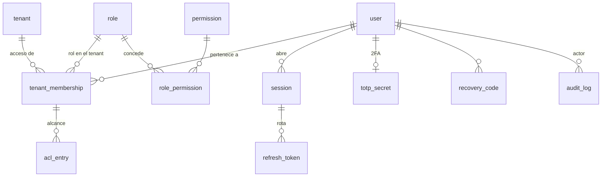
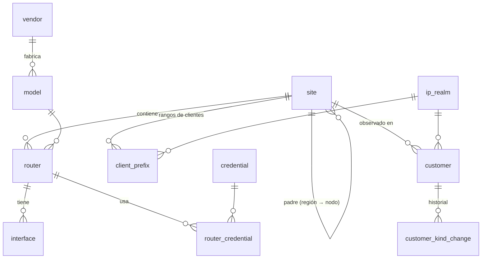
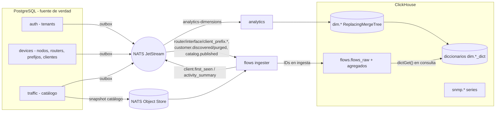

# Modelo de datos — Horus Flow

> Estado: **ronda 2 (tras decisiones del PO)** · Dueño: Agente B (Datos) · Fuentes:
> [`po-decisions.md`](po-decisions.md) (D1–D10, **prevalecen**), [`vision.md`](vision.md).
>
> Documentos relacionados: [`traffic-model.md`](traffic-model.md) (atribución cliente = IP,
> clasificación, señales de botnet), [`storage.md`](storage.md) (almacenamiento local + destino
> remoto opcional, archivado, retención), [`open-questions/data.md`](open-questions/data.md),
> [`architecture.md`](architecture.md), [`services.md`](services.md) y [`adr/`](adr/README.md)
> (Agente A), [`events.md`](events.md), [`api.md`](api.md), [`security.md`](security.md),
> [`disaster-recovery.md`](disaster-recovery.md) y [`conventions.md`](conventions.md) (Agente C),
> [`vendors/mikrotik.md`](vendors/mikrotik.md) (Agente E).
>
> Todo el DDL de este documento es **ilustrativo (borrador)**. Las migraciones reales se escriben en
> cada servicio, en el incremento que las necesita, siguiendo las reglas de la sección 3.

---

## 0. Resumen de decisiones

| # | Decisión | Justificación corta |
|---|----------|---------------------|
| M1 | Un clúster PostgreSQL, **una base `horus`, un esquema por servicio**, un rol de BD por servicio con permisos solo sobre su esquema. | Aislamiento de propiedad sin el costo operativo de N instancias. |
| M2 | **Sin FK ni joins entre esquemas.** Referencias cruzadas = UUID "suelto" + sincronización por eventos NATS. | Cada servicio se despliega, migra y cae de forma independiente. |
| M3 | IDs **UUIDv7** generados en la aplicación. El cliente tiene además **clave natural** `(tenant_id, realm_id, ip)`, que es la que usa ClickHouse ([ADR-0018](adr/0018-la-ip-es-el-cliente.md)). | UUIDv7: ordenables y generables offline. La clave natural permite atribuir desde el primer flujo sin esperar a que el cliente exista en PostgreSQL. |
| M4 | **Multi-tenant real desde v1 (D6)**: tenant = ISP. `tenant_id uuid NOT NULL` en **todas** las tablas de negocio, primera columna de índices únicos y de las claves compuestas. Usuarios globales con **membresía + rol por tenant**; superadmin de plataforma. | El aislamiento entre ISP es requisito de producto, no preparación. |
| M5 | **Row Level Security activado** ([ADR-0017](adr/0017-multi-tenant-desde-v1.md)) en las tablas de negocio de PostgreSQL como **defensa en profundidad**, con `SET LOCAL horus.tenant_id` por transacción y política *fail-closed* (§1.2). | El código lo escriben agentes de IA con un solo revisor humano (D7): el error más probable es olvidar un `WHERE tenant_id = …`; RLS lo convierte en "cero filas" en lugar de una fuga entre ISP. |
| M6 | **Cliente = IP (D1, [ADR-0018](adr/0018-la-ip-es-el-cliente.md))**: `devices.customer` se **descubre automáticamente** desde los flujos del router principal del nodo. Sin CRM, RADIUS ni facturación. Tipo `residential` por defecto; cambia por scoring o manualmente, con historial. **Se elimina `client_ip_assignment`** y se sustituye por `client_prefix` (qué rangos del ISP son de clientes en cada nodo). | La IP **es** el cliente: no hay asignaciones temporales que mantener. |
| M7 | **ClickHouse desde el primer incremento que guarde series temporales o flujos (D4)**. Se eliminan las tablas puente en PostgreSQL. | Un solo motor para series y flujos desde el inicio. |
| M8 | `tenant_id` **primera columna del `ORDER BY`** de todas las tablas ClickHouse (§5.1). | Toda consulta filtra por tenant: poda de gránulos, localidad por ISP, clave natural de sharding futura. |
| M9 | Dimensiones en ClickHouse como **tablas `dim.*` alimentadas por eventos** (escritor único: `analytics`) y expuestas como diccionarios con fuente ClickHouse. Los hechos guardan **IDs**; los nombres se resuelven en consulta con `dictGet`. | ClickHouse no lee PostgreSQL; nombres mutables no se congelan en miles de millones de filas. |
| M10 | Métricas SNMP de red → ClickHouse; Prometheus solo para la salud de la plataforma. | Cardinalidad y retención de años (§9). |
| M11 | Flujos: tabla cruda enriquecida (`flows.flows_raw`, escritor único: ingester de `flows`, [ADR-0015](adr/0015-enriquecimiento-de-flujos-en-ingesta.md)) + agregados 5 min / 1 h / 1 d **en abanico** + agregados de **detección de 1 min** con retención corta (`flows.client_security_1m`, `flows.client_port_1m`, 7 días; [ADR-0024](adr/0024-deteccion-de-botnets-como-objetivo-principal.md)) y marca de reputación en ingesta (`reputation_hit`). | Simplicidad; la detección de botnets necesita contadores que los agregados de consumo no tienen. |
| M12 | **Valkey** en lugar de Redis (D3) para caché, revocación de sesiones y rate limit. Mismo protocolo; claves prefijadas por tenant. | Licencia BSD-3; compatible con clientes Redis. |
| M13 | Borrado **lógico** (`deleted_at`) para entidades referenciadas por históricos (tenants, nodos, routers, interfaces, usuarios, servicios del catálogo). El cliente tiene **ciclo de vida propio** (`active` → `inactive` → purga, §2.3.4). | ClickHouse guarda UUIDs durante meses o años. |
| M14 | Migraciones con **goose** (SQL puro, embebido), forward-only en producción, patrón expand/contract. Mismo tooling para ClickHouse. | Una sola herramienta para PG y CH. |

---

## 1. Convenciones del modelo relacional

- **Tipos**: `uuid` para IDs, `timestamptz` para todo instante (UTC), `inet`/`cidr` para IPs y
  prefijos, `text` + `CHECK` en lugar de `ENUM` de PostgreSQL (los `ENUM` complican
  expand/contract), `jsonb` solo para atributos realmente abiertos.
- **Columnas estándar** en tablas de entidades: `id`, `tenant_id`, `created_at`, `updated_at`,
  `deleted_at` (si borrado lógico), `version integer` (bloqueo optimista; la API usa
  `ETag`/`If-Match`, ver [`api.md`](api.md)).
- **Nombres**: tablas en singular `snake_case`, FKs `<entidad>_id`, índices `ix_<tabla>__<cols>`,
  únicos `ux_<tabla>__<cols>`, checks `ck_<tabla>__<regla>`.
- **Unicidad con borrado lógico**: índices únicos parciales `WHERE deleted_at IS NULL`, siempre
  empezando por `tenant_id`.
- **Texto de búsqueda**: `citext` para emails; `pg_trgm` (GIN) en nombres buscables.
- **Extensiones**: `citext`, `pg_trgm`, `btree_gist` (exclusión de prefijos solapados). Las instala
  la migración de infraestructura (rol administrador).
- **Outbox**: todo servicio que publica eventos tiene `<esquema>.outbox` (transactional outbox,
  [ADR-0016](adr/0016-transactional-outbox.md)). Contrato del sobre en [`events.md`](events.md).

```sql
-- borrador: tabla outbox estándar (una por esquema)
CREATE TABLE <schema>.outbox (
  id            uuid PRIMARY KEY,            -- UUIDv7 = event_id
  seq           bigint GENERATED ALWAYS AS IDENTITY,
  tenant_id     uuid,                        -- NULL solo para eventos de plataforma
  subject       text NOT NULL,               -- horus.<dominio>.<entidad>.<evento>.<entity_id>
  aggregate_id  uuid NOT NULL,
  headers       jsonb NOT NULL DEFAULT '{}', -- traceparent, Nats-Msg-Id, tenant_id
  payload       jsonb NOT NULL,
  occurred_at   timestamptz NOT NULL,
  published_at  timestamptz,
  attempts      integer NOT NULL DEFAULT 0
);
CREATE INDEX ix_outbox__pending ON <schema>.outbox (seq) WHERE published_at IS NULL;
-- sin RLS: solo la lee el relay del propio servicio (rol <svc>_relay); nunca se expone por API
```

### 1.1 Jerarquía multi-tenant (D6)

```
Plataforma Horus (superadmin)
└─ Tenant = ISP                         auth.tenant
   ├─ Membresías de usuarios (rol)      auth.tenant_membership
   └─ Nodo (sitio)                      devices.site (kind = 'node')
      ├─ Router principal (exportador)  devices.router (is_primary = true, uno por nodo)
      ├─ Prefijos de clientes           devices.client_prefix
      └─ Clientes = IPs observadas      devices.customer
```

- Un **nodo** es un sitio físico del ISP (POP, torre, cabecera) con **un router principal** que
  exporta los flujos y es sondeado por SNMP (D6, D10). Se permiten otros routers por nodo en el
  inventario (para SNMP o futuros exportadores), pero solo el principal define la atribución en v1.
- Los sitios pueden anidarse (`region` → `node`) para agrupar en reportes; la atribución siempre
  cuelga del nodo.

### 1.2 Aislamiento por tenant y Row Level Security

**Decisión: RLS activado** en todas las tablas de negocio con `tenant_id`, como segunda barrera
detrás del filtro explícito que hace siempre la aplicación.

```sql
-- borrador: patrón aplicado a cada tabla de negocio
ALTER TABLE devices.customer ENABLE ROW LEVEL SECURITY;
ALTER TABLE devices.customer FORCE ROW LEVEL SECURITY;   -- aplica también al dueño de la tabla
CREATE POLICY p_tenant ON devices.customer
  USING      (tenant_id = current_setting('horus.tenant_id', true)::uuid)
  WITH CHECK (tenant_id = current_setting('horus.tenant_id', true)::uuid);
```

- **Fail-closed**: si la transacción no fijó `horus.tenant_id`, `current_setting(..., true)` devuelve
  `NULL` ⇒ la comparación es `NULL` ⇒ **cero filas** (y los `INSERT` fallan). Un olvido produce un
  error visible en pruebas, no una fuga.
- **Cómo se fija**: la librería común de acceso a datos (Go) abre cada transacción con
  `SET LOCAL horus.tenant_id = $1` tomado del contexto de la petición (claim del token validado por
  el gateway) o del sobre del evento. `SET LOCAL` muere con la transacción ⇒ compatible con
  pgbouncer en modo transacción y con pools compartidos.
- **Roles**: `<svc>_app` (DML, **sin** `BYPASSRLS`); `<svc>_platform` (con `BYPASSRLS`) solo para
  procesos de plataforma explícitos y auditados: relay del outbox, reconciliaciones nocturnas
  multi-tenant, purgas de retención, vistas del superadmin. `<svc>_migrator` para DDL.
- **Tablas sin RLS** (no son de un tenant): catálogos globales (`auth.permission`,
  `devices.vendor/model/firmware`, catálogo global de `traffic`, feeds globales de reputación),
  `outbox`, `goose_db_version`.
- **Integridad entre tenants dentro de un esquema**: cada tabla raíz declara
  `UNIQUE (tenant_id, id)` y las FKs internas son **compuestas** `(tenant_id, x_id) REFERENCES
  … (tenant_id, id)`: es imposible que un router de un ISP apunte a un nodo de otro.
- **Costo**: la política añade un predicado que el planificador combina con los índices (todos
  empiezan por `tenant_id`); impacto despreciable. Riesgo conocido: funciones `SECURITY DEFINER`
  y vistas saltan RLS si se crean con el rol dueño ⇒ prohibidas salvo revisión (lint en CI).
- **Pruebas obligatorias** (Definición de Terminado, D7): cada repositorio de datos tiene un test
  que crea dos tenants y verifica que ninguna consulta del tenant A devuelve filas de B, y que una
  transacción sin `horus.tenant_id` devuelve cero filas.

**Alternativas descartadas**: (a) base o esquema por tenant: aislamiento fuerte pero multiplica
migraciones, conexiones y dimensiones de ClickHouse; inviable con decenas de ISP y un equipo de
IA + 1 persona. (b) Solo filtro en aplicación: barato pero sin red de seguridad.

### 1.3 Mapa de esquemas

| Esquema PG | Servicio dueño | Contenido |
|------------|----------------|-----------|
| `auth` | auth | **tenants**, usuarios, membresías, roles, permisos, ACL, sesiones, TOTP, auditoría |
| `devices` | devices | nodos, routers, interfaces, credenciales, fabricantes, tags, grupos, **prefijos de clientes y clientes (= IPs)** |
| `wireguard` | wireguard | servidores, peers, pools, claves (cifradas), estado de handshake |
| `flows` | flows | exportadores registrados, plantillas |
| `traffic` | traffic-intelligence | catálogo global versionado, reglas locales por tenant, ASN, organizaciones, prefijos |
| `detection` | detection (con módulo *reputation*) | fuentes de reputación, hallazgos, modelos de scoring, veredictos, propuestas de cambio de tipo |
| `alerts` | alerts | reglas, alertas, notificaciones, canales, silencios |
| `analytics` | analytics (con *reporting-worker* y *archiver*) | dashboards y widgets (D8), reportes, ledger de archivado |

Sin esquema PG: `api-gateway` (estado efímero en **Valkey**) y `snmp` (estado operativo en NATS KV
`snmp_router_state`, proyectado a `devices.router_status`). El reparto final de servicios y su
granularidad lo fija el Agente A ([`services.md`](services.md)).

---

## 2. Esquemas PostgreSQL por servicio

### 2.1 `auth` (tenants, identidad y acceso)



| Tabla | Campos clave | Constraints / índices | Borrado |
|-------|--------------|-----------------------|---------|
| `tenant` | `id`, `slug`, `name` (ISP), `status` (`active`/`suspended`/`offboarding`), `country` (ISO-3166, para revisión legal por país), `timezone` (IANA, día local por defecto), `settings jsonb` (retenciones propias más cortas, umbral de inactividad de clientes, tipo por defecto), `created_by` | `ux(slug)` | lógico; la purga física de sus datos es un proceso de *offboarding* (§10) |
| `user` | **global, sin `tenant_id`**: `id`, `email citext`, `display_name`, `password_hash` (Argon2id), `status` (`active`/`disabled`/`locked`/`pending`), `is_platform_admin bool` (**superadmin**), `failed_logins`, `locked_until`, `last_login_at`, `password_changed_at`, `mfa_enforced`, `external_issuer`, `external_subject` | `ux(email) WHERE deleted_at IS NULL`; `ux(external_issuer, external_subject)`; `ck(NOT is_platform_admin OR mfa_enforced)` | lógico; al borrar se anonimizan email/nombre |
| `tenant_membership` | `id`, `tenant_id`, `user_id`, `role_id`, `status` (`active`/`invited`/`revoked`), `granted_by`, `granted_at`, `expires_at` | `ux(tenant_id, user_id)` (un rol por usuario y tenant; varios tenants por usuario); `ix(user_id)` | físico (queda en auditoría) |
| `role` | `id`, `tenant_id NULL` (**NULL = rol de sistema**, disponible en todos los tenants), `key` (`tenant_admin`, `noc`, `security_analyst`, `viewer`, `kiosk`…), `name`, `is_system` | `ux(coalesce(tenant_id, '0…0'), key)` | físico si no `is_system` y sin membresías |
| `permission` | `key text PK` (`devices.read`, `customers.kind.write`…), `resource`, `action`, `scope` (`tenant`/`platform`) | catálogo sembrado por migración | `deprecated_at` |
| `role_permission` | `role_id`, `permission_key` | PK compuesta | físico |
| `acl_entry` | Restricción opcional **dentro** de un tenant: `id`, `tenant_id`, `membership_id`, `resource_type` (`site`/`router`/`customer_group`), `resource_id` (sin FK), `effect` (`allow`/`deny`) | `ux(membership_id, resource_type, resource_id)` | físico |
| `session` | `id`, `user_id`, `active_tenant_id` (tenant seleccionado; cambia sin re-login si hay membresía), `created_at`, `last_seen_at`, `expires_at`, `revoked_at`, `ip`, `user_agent`, `mfa_verified_at`, `kind` (`interactive`/`kiosk`) | `ix(user_id) WHERE revoked_at IS NULL` | físico tras `expires_at + 30 d` |
| `refresh_token` | `id`, `session_id`, `token_hash bytea`, `family_id`, `issued_at`, `expires_at`, `used_at`, `replaced_by` | `ux(token_hash)` | físico tras expiración |
| `totp_secret`, `recovery_code`, `password_reset` | igual que en Sprint 0 | — | físico |
| `audit_log` | `id`, `tenant_id NULL` (NULL = acción de plataforma), `occurred_at`, `actor_type`, `actor_id`, `acting_as_platform_admin bool`, `action`, `resource_type`, `resource_id`, `result`, `ip`, `trace_id`, `changes jsonb`, `prev_hash`, `hash` | particionada por mes; solo `INSERT`; RLS: un usuario de tenant ve solo su tenant, el superadmin todo | nunca se modifica; particiones fuera de retención se exportan al almacenamiento local de archivo ([`storage.md`](storage.md)) y se hace `DETACH`+`DROP` |

Notas:

- **Superadmin** (`is_platform_admin`): gestiona tenants, ve todos, asigna miembros. Sus lecturas
  de datos de un tenant se hacen **dentro** del tenant (fija `horus.tenant_id`) y se auditan con
  `acting_as_platform_admin = true`; solo las vistas agregadas de plataforma usan el rol
  `<svc>_platform`. Debe tener 2FA obligatorio.
- **Permiso efectivo** = permisos del rol de su membresía en el tenant activo ∩ ACL (si existe).
  El token lleva `tenant_id` activo y la lista de tenants permitidos (detalle en
  [`security.md`](security.md), Agente C).
- **Sesiones**: PG es la fuente de verdad; **Valkey** guarda la lista de revocación
  (`sess:{session_id}`) y los contadores de rate limit (`rl:{tenant_id}:{user_id}`), con TTL. Si
  Valkey cae, el gateway consulta a `auth` con caché en proceso.
- **Modo kiosco (D8)**: una sesión `kind = kiosk` está atada a un tenant y un dashboard, con rol
  `kiosk` (solo lectura de widgets) y refresco de larga duración; se revoca como cualquier otra.

### 2.2 `devices` — inventario de red por tenant



| Tabla | Campos clave | Constraints / índices | Borrado |
|-------|--------------|-----------------------|---------|
| `site` | `id`, `tenant_id`, `parent_id`, `code`, `name`, `kind` (`region`/`node`/`datacenter`/`other`), `address`, `latitude`, `longitude`, `timezone` (hereda del tenant si NULL), `metadata jsonb` | `ux(tenant_id, id)`; `ux(tenant_id, code) WHERE deleted_at IS NULL`; FK compuesta `(tenant_id, parent_id)` | lógico |
| `vendor`, `model`, `firmware` | catálogo **global** (sin `tenant_id`, sin RLS): `mikrotik` primero (D10) | `ux(key)` | lógico |
| `router` | `id`, `tenant_id`, `site_id`, `model_id`, `hostname`, `display_name`, `serial_number`, `mgmt_address inet` (típicamente IP WireGuard), `mgmt_wireguard_peer_id` (sin FK), `is_primary bool` (**router principal del nodo**), `admin_state` (`active`/`maintenance`/`decommissioned`), `flow_export_enabled`, `sys_object_id`, `sys_descr`, `routeros_version text`, `metadata jsonb` | `ux(tenant_id, site_id) WHERE is_primary AND deleted_at IS NULL` (**un principal por nodo**); `ux(tenant_id, hostname) WHERE deleted_at IS NULL`; FK `(tenant_id, site_id)` | lógico |
| `interface` | `id`, `tenant_id`, `router_id`, `if_index` (NULL en la interfaz lógica `customer_edge (dinámica)` que agrupa las PPPoE/L2TP de ifIndex cambiante), `is_dynamic_group bool`, `name`, `descr`, `alias`, `kind`, `vlan_id`, `speed_bps`, `flow_role` (`customer_edge`/`upstream`/`peering`/`core`/`management`/`none`) — orienta la dirección y la deduplicación ([`traffic-model.md` §4.7](traffic-model.md)), `monitored`, `last_seen_at` | `ux(tenant_id, router_id, if_index) WHERE deleted_at IS NULL` | lógico (re-conciliación por `name` si cambia el ifIndex) |
| `ip_address` | IPs **de infraestructura** configuradas en interfaces: `tenant_id`, `interface_id`, `address inet`, `realm_id` | `ux(tenant_id, realm_id, address)` | físico (re-descubrible) |
| `credential` | `id`, `tenant_id`, `name`, `kind` (`snmp_v2c`/`snmp_v3`/`routeros_api`/`ssh`), `username`, `secret_ciphertext`, `dek_wrapped`, `kek_id` (o `secret_ref`) | `ux(tenant_id, name) WHERE deleted_at IS NULL` | lógico + crypto-shredding |
| `router_credential` | `tenant_id`, `router_id`, `credential_id`, `purpose`, `priority` | PK `(router_id, purpose, priority)` | físico |
| `ip_realm` | Espacio donde una dirección es única: `id`, `tenant_id`, `kind` (`public` = uno por tenant / `node_private` = uno por nodo, para RFC1918 y 100.64.0.0/10), `site_id NULL`, `name` | `ux(tenant_id) WHERE kind='public'`; `ux(tenant_id, site_id) WHERE kind='node_private'` | lógico |
| `client_prefix` | **Qué IPs son de clientes** en cada nodo (forma física de `ip_realm.client_prefixes` de [ADR-0018](adr/0018-la-ip-es-el-cliente.md)): `id`, `tenant_id`, `site_id`, `realm_id`, `prefix cidr`, `source` (`manual`/`discovery_confirmed`/`routeros_api` — importado de pools/rutas del MikroTik), `role` (`customers`/`infrastructure`/`excluded`), `default_kind` (`residential` por defecto; `commercial`/`unknown` para pools dedicados), `assignment_mode` (`static`/`dynamic`/`unknown` — informa la confianza de la detección), `ipv6_client_len smallint` (longitud que identifica a un cliente IPv6: 56 o 64; NULL en IPv4), `note` | `EXCLUDE USING gist (realm_id WITH =, prefix inet_ops WITH &&) WHERE deleted_at IS NULL` (sin solapes en un realm; un prefijo más específico se modela partiendo el rango); `ix GiST(prefix inet_ops)` | lógico |
| `tag`, `tag_assignment`, `group`, `group_member` | `tenant_id` en todas; `resource_type` incluye `customer` | `ux(tenant_id, …)` | físico/lógico |
| `router_status` | `tenant_id`, `router_id PK`, `status`, `reason`, `since`, `last_poll_at`, `last_seen_at` | `ix(tenant_id, status)` | 1 fila por router |

Notas:

- **Realm de una IP**: lo decide el `client_prefix` que la contiene. Prefijos privados/CGNAT ⇒
  realm `node_private` del nodo (la misma `10.0.0.5` en dos nodos son dos clientes distintos).
  Prefijos públicos del ISP ⇒ realm `public` del tenant: si el ISP mueve un prefijo público a otro
  nodo, sus clientes conservan la identidad y su `site_id` pasa al nuevo nodo. Un flujo visto en un
  nodo distinto del de su prefijo se trata como **tránsito** y no se atribuye (evita contar dos
  veces cuando un nodo es camino de otro; [`traffic-model.md` §4](traffic-model.md)).
- **Sin prefijos configurados**: el nodo funciona en **modo descubrimiento**: el ingester propone
  como candidatos los rangos privados/CGNAT vistos del lado `customer_edge` y la UI pide
  confirmarlos; mientras tanto los flujos se guardan con `attribution_status = unknown` y cuentan en
  los agregados del nodo, no en clientes (ver [`traffic-model.md` §4](traffic-model.md)).
- **Credenciales**: envelope encryption (decisión de mecanismo del Agente C en
  [`security.md`](security.md)); ninguna API devuelve el secreto.

### 2.3 `devices` — clientes (= IPs) (D1)

#### 2.3.1 Identidad

Un cliente es **una dirección observada** en un realm de un tenant
([ADR-0018](adr/0018-la-ip-es-el-cliente.md)):

```
clave natural = (tenant_id, realm_id, address_canónica)
address_canónica = IPv4 /32  |  IPv6 truncada a client_prefix.ipv6_client_len (/64 por defecto)
id            = UUIDv7 asignado por devices al descubrirlo (para API y referencias en PostgreSQL)
```

- **ClickHouse no guarda `customer_id`**: flujos y agregados se indexan por
  `(tenant_id, realm_id, client_ip)`. La atribución es inmediata desde el primer flujo y no hay
  carrera "flujo antes que cliente". El `customer_id`, el tipo y el alias se resuelven en consulta
  con el diccionario de clave compuesta `dim.customer` (§4.1).
- **IPv6**: identificar por /128 haría explotar el número de clientes (direcciones temporales de
  privacidad, RFC 8981). Se identifica por el prefijo delegado al CPE (/64 por defecto, /56
  configurable en el `client_prefix`); el ingester trunca antes de escribir `client_ip`.
- Si un cliente se purga (§2.3.4) y la IP reaparece, se crea un cliente **nuevo** (nuevo UUIDv7)
  con la misma clave natural; en ClickHouse los datos antiguos de esa clave ya expiraron.

#### 2.3.2 Tablas

| Tabla | Campos clave | Constraints / índices | Borrado |
|-------|--------------|-----------------------|---------|
| `customer` | `id` (UUIDv7), `tenant_id`, `realm_id`, `address inet` (canónica), `site_id` (nodo donde se vio por última vez), `client_prefix_id`, `kind` (`residential`/`commercial`/`unknown`), `commercial_use_suspected bool` + `commercial_score smallint` (residencial con indicios comerciales que aún no alcanzan el umbral), `kind_source` (`default`/`scoring`/`manual`), `kind_locked bool` (true si `manual`: el scoring no lo sobrescribe), `kind_changed_at`, `kind_confidence smallint NULL` (0–100, del scoring), `alias text NULL` (nombre opcional puesto por el operador o importado del usuario PPPoE vía API de RouterOS; dato personal), `alias_source` (`manual`/`routeros_ppp`), `notes text NULL`, `status` (`active`/`inactive`), `first_seen timestamptz`, `last_seen timestamptz` (resolución ≤ 1 h, §2.3.3), `reset_at timestamptz NULL` (último "reinicio" manual, §2.3.4), `version` | PK `id`; `ux(tenant_id, realm_id, address)`; `ix(tenant_id, site_id, status)`; `ix(tenant_id, kind)`; `ix(tenant_id, last_seen)`; GiST `(address inet_ops)`; GIN trigram en `alias` | ciclo de vida §2.3.4 |
| `customer_kind_change` | Historial **inmutable**: `id` (UUIDv7), `tenant_id`, `customer_id`, `from_kind`, `to_kind`, `source` (`default`/`scoring`/`manual`/`reset`), `reason_codes text[]` (claves de razón del scoring, p. ej. `many_inbound_services`, `business_hours_pattern`), `score_ref` (modelo + día en `detection.customer_scores_1d`), `confidence`, `actor_id NULL` (usuario si manual), `changed_at` | `ix(tenant_id, customer_id, changed_at DESC)`; solo `INSERT` | se purga con el cliente |

- **Sin PII de contacto**: no hay nombre, dirección ni teléfono (no existe CRM, D1). El `alias` lo
  pone el operador y puede contener un nombre ("Ferretería López"): se trata como dato personal
  (acceso por rol, no se exporta a archivos remotos sin cifrar). La IP en sí es dato personal en
  muchas jurisdicciones: minimización y retención limitada (D5).
- **`unknown`** solo aparece si el prefijo tiene `default_kind = unknown` (pools mixtos
  donde el ISP no quiere presumir residencial) o tras un `reset` en esos pools. Por defecto, D1:
  `residential`.

#### 2.3.3 Descubrimiento y `last_seen` sin amplificar escrituras

```mermaid
sequenceDiagram
  participant I as flows ingester
  participant N as NATS
  participant D as devices
  I->>I: flujo con IP en client_prefix del nodo → (realm_id, client_ip)
  I->>I: ¿clave en el conjunto "conocidos" del realm? no → anotar
  I->>N: horus.flows.client.first_seen.<realm_id> (lote cada 10 s, deduplicado)
  N->>D: consumer devices-discovery
  D->>D: INSERT … ON CONFLICT (tenant_id, realm_id, address) DO NOTHING
  D->>N: outbox → horus.devices.customer.discovered.<customer_id>
  I->>N: horus.flows.client.activity_summary.<realm_id> (cada hora: claves activas + first/last ts)
  N->>D: UPDATE last_seen; inactive → active (+ customer.reactivated)
```

- El ingester mantiene en memoria el conjunto de claves conocidas por realm (snapshot gRPC
  `ListCustomerKeys` de `devices` al arrancar + eventos `customer.discovered/purged`). Tamaño: 1 M
  clientes × ~40 B ≈ 40 MB. No escribe en PostgreSQL ni espera a nadie (los flujos ya llevan su
  clave natural).
- **Protección contra avalanchas** (escaneos, IPs falsificadas dentro de un prefijo): límite de
  clientes nuevos por realm y minuto y tope por realm igual al tamaño de sus prefijos; el exceso se
  cuenta (`horus_customers_discovery_throttled_total`) y alerta a la plataforma.
- **`last_seen` en PG es grueso** (resumen horario): con 600 k clientes son ≤ 600 k `UPDATE`/h
  repartidos; la actividad fina vive en ClickHouse.
- Ambos lotes son telemetría (stream con pérdida acotada): perder uno es inocuo, el siguiente flujo
  o resumen lo corrige (operaciones idempotentes).

#### 2.3.4 Ciclo de vida, IPs que cambian de "dueño" e IPs que dejan de verse

| Situación | Qué hace Horus |
|-----------|----------------|
| IP nueva dentro de un `client_prefix` | Se crea el cliente: `kind = default_kind` (normalmente `residential`), `kind_source = default`. Evento `customer.discovered`. |
| La IP cambia de persona/contrato (reasignación del ISP, pool dinámico) | **No se puede saber** (D1: la IP **es** el cliente). Horus la trata como el mismo cliente. Mitigaciones: (1) el scoring usa ventanas recientes e histéresis, así que el tipo se re-ajusta solo; (2) acción manual **"reiniciar cliente"** (`reset`): tipo vuelve al defecto, se borra alias/notas, `reset_at = now()`, entrada `reset` en el historial y los dashboards por defecto muestran datos desde `reset_at`; (3) en prefijos `assignment_mode = dynamic` la UI advierte que "cliente" = IP del pool y la detección baja la confianza de `commercial`. |
| IP deja de verse ≥ N días (defecto **30**, `tenant.settings`) | Job diario: `status = inactive`, evento `customer.inactivated`. Sigue visible en históricos y búsquedas; no cuenta en "clientes activos". Si reaparece: `active` + `customer.reactivated`. |
| IP sin tráfico más allá de la **mayor retención de datos por cliente** (defecto 25 meses, §7) | **Purga física** del cliente y su historial de tipo, evento `customer.purged` (ClickHouse ya no tiene filas por cliente de esa clave). Si reaparece más tarde, se redescubre como cliente nuevo, sin historia. |
| El ISP borra o reduce un `client_prefix` | Los clientes fuera de todo prefijo pasan a `inactive` con razón `prefix_removed`; se purgan por la regla anterior. |
| Cambio manual de tipo | `kind_source = manual`, `kind_locked = true`, historial con `actor_id`; evento `customer.kind_changed`. Desbloquear (`kind_locked = false`) devuelve el control al scoring. |
| Propuesta del scoring | `detection` publica `horus.detection.customer.kind_suggested` con tipo, confianza y razones; `devices` aplica si `kind_locked = false` y la confianza ≥ umbral del tenant (defecto 80, con histéresis de 7 días en `detection`); evento `customer.kind_changed`. |

Eventos que publica `devices` sobre clientes (subjects `horus.devices.customer.<evento>.<customer_id>`,
contrato a cargo del Agente C): `discovered`, `updated` (alias/notas), `kind_changed`, `inactive`,
`reactivated`, `reset`, `purged`. **Se eliminan** `customer.assigned` / `customer.unassigned`.

#### 2.3.5 Qué desaparece respecto del Sprint 0

- `client_ip_assignment`, `customer_service_link`, `cpe`, `external_ref`, plan contratado, datos
  de contacto, fuentes RADIUS/DHCP/PPPoE. Si en el futuro un ISP quiere enriquecer con su CRM, se
  añade una tabla opcional `customer_annotation` (import CSV por IP) **sin** que la atribución
  dependa de ella.

### 2.4 `wireguard`

Sin cambios de modelo salvo `tenant_id` en todas las tablas y RLS. Un **servidor WireGuard puede ser
de plataforma** (`tenant_id NULL`, compartido) con peers de varios tenants, o dedicado a un tenant;
los `peer` siempre llevan `tenant_id` y `router_id`. Los pools de IP de peers no se solapan entre
tenants dentro de un servidor (`EXCLUDE` sobre `cidr`).

| Tabla | Campos clave | Constraints / índices | Borrado |
|-------|--------------|-----------------------|---------|
| `server` | `id`, `tenant_id NULL`, `name`, `host`, `interface_name`, `listen_port`, `endpoint`, `public_key`, `private_key_ciphertext`, `dek_wrapped`, `kek_id`, `mtu`, `status` | `ux(host, interface_name)`; `ux(public_key)` | lógico + crypto-shredding |
| `ip_pool` | `id`, `server_id`, `tenant_id NULL`, `cidr`, `gateway`, `family` | `EXCLUDE USING gist (cidr inet_ops WITH &&)` | físico si vacío |
| `ip_allocation` | `pool_id`, `tenant_id`, `address`, `peer_id`, `allocated_at`, `released_at` | `ux(pool_id, address) WHERE released_at IS NULL` | lógico; cuarentena 24 h |
| `peer` | `id`, `tenant_id`, `server_id`, `kind` (`router`/`operator`/`service`), `router_id`, `name`, `public_key`, `preshared_key_ciphertext`, `status`, `revoked_at`, `key_expires_at` | `ux(server_id, public_key) WHERE revoked_at IS NULL`; `ux(router_id) WHERE revoked_at IS NULL` | lógico |
| `peer_allowed_ip`, `key_rotation`, `peer_runtime` | con `tenant_id` | — | como en Sprint 0 |

Material de claves: la clave privada del peer router **nunca** se persiste (preferido: la genera el
propio MikroTik y solo envía su pública, ver [`vendors/mikrotik.md`](vendors/mikrotik.md)); la del
servidor se guarda cifrada; los `.conf` se generan bajo demanda y no se almacenan.

### 2.5 `alerts`

Igual que en Sprint 0 con `tenant_id` en todas las tablas y RLS. Cambios:

- `alert_rule_version.source` incluye `detection` (hallazgos de botnet/seguridad, D5) y `customer`
  (cambios de tipo, si el tenant quiere notificarlos).
- `alert.resource_type` incluye `customer`; el `fingerprint` incluye `tenant_id`.
- `notification_channel` es por tenant (cada ISP sus destinatarios); el superadmin tiene canales de
  plataforma (`tenant_id NULL`) para alertas de salud de Horus.

### 2.6 `traffic` (catálogo de clasificación)

El diseño funcional está en [`traffic-model.md` §6](traffic-model.md). Cambio por D6: el catálogo
es **global** (lo mantiene la plataforma) y cada tenant tiene **reglas locales** encima.

| Tabla | Campos clave | Notas |
|-------|--------------|-------|
| `category`, `organization`, `asn`, `service`, `data_source`, `source_snapshot`, `prefix` | como en Sprint 0, **globales** (sin `tenant_id`, sin RLS) | `source_snapshot.object_key` = clave lógica en el almacenamiento local ([`storage.md` §3](storage.md)) |
| `catalog_version`, `classification_rule` | globales; `classification_rule.scope = global` | versión monotónica, artefacto inmutable |
| `tenant_rule_set` | `tenant_id`, `version int`, `status` (`draft`/`published`), `published_at`, `artifact_key`, `artifact_sha256` | overlay por tenant: cachés embebidos (OCA/GGC/FNA), prefijos propios, resolvers DNS propios |
| `tenant_rule` | `tenant_id`, `rule_set_version`, mismos campos `match_*` que `classification_rule`, `match_type` normalmente `local_override` | prioridad 900–1000; RLS |

El ingester carga el catálogo global vN + el overlay del tenant vM; la fila guarda ambos
(`catalog_version`, `tenant_rules_version`).

### 2.7 Esquemas secundarios

- **`snmp` (sin PostgreSQL)**: estado por router en NATS KV `snmp_router_state` (claves
  `<tenant_id>.<router_id>`). Perfiles por fabricante (MikroTik primero) como archivos versionados
  en el repositorio. Series a ClickHouse (§6.3) desde el primer incremento con SNMP (D4).
- **`flows`**: `exporter` (`tenant_id`, `router_id`, `source_ip` tal como llega por el túnel
  WireGuard, `observation_domain_id`, `protocol`, `declared_sampling_rate`, `last_packet_at`),
  `template_cache`. **Identificación del exportador**: por `(IP origen del túnel WireGuard,
  observation_domain_id)`; como cada router principal tiene una IP de túnel única, no hay
  ambigüedad aunque dos ISP usen las mismas IPs privadas internamente.
- **`detection`** (incluye reputation):
  - `reputation_source`, `reputation_entry`: **globales** (feeds públicos: C2 de botnets,
    escáneres, Tor, etc.), en PG (1–5 M entradas, GiST). Snapshot → diccionario CH `IP_TRIE`
    `dim.reputation`. `reputation_allowlist` **por tenant** (falsos positivos locales).
  - `finding` (por tenant: `customer_id` + `realm_id`/`address`, `finding_kind` (`botnet_c2_contact`/`scanning`/`fanout`/
    `suspicious_ports`/`dns_anomaly`/`sustained_upload`/`spam_smtp`…), `severity`, `confidence`,
    `first_seen`, `last_seen`, `status` (`open`/`acknowledged`/`resolved`/`false_positive`)),
    `finding_evidence` (referencias a ventanas y contadores en ClickHouse, nunca payload),
    `scoring_model`, `verdict_feedback` (confirmación humana para recalibrar).
- **`analytics`**: `dashboard` y `dashboard_widget` (layout guardado, tipo de widget, consulta
  parametrizada, intervalo de refresco; `dashboard.kiosk_enabled`, `rotation_seconds` para modo NOC,
  D8), `report_definition`, `report_run` (`object_key` en almacenamiento local, `sha256`,
  `expires_at`), `archive_manifest` (ledger de archivado y de copias remotas, [`storage.md`](storage.md)).

---

## 3. Estrategia de migraciones

**Herramienta**: goose v3 (SQL puro; embebido con `embed.FS`; PostgreSQL y ClickHouse).

**Ubicación**: `services/<servicio>/migrations/{postgres,clickhouse}/NNNNNNNNNNNNNN_<desc>.sql`.
Tabla de control por esquema `<esquema>.goose_db_version`.

**Reglas**

1. **Forward-only en producción** (el `Down` solo para desarrollo). Backup previo a migrar.
2. **Expand / contract** para todo cambio incompatible, en releases distintas (expand → backfill
   por lotes → switch → contract).
3. **Prohibido en una sola migración**: renombrar columnas usadas, `ALTER COLUMN TYPE` con
   reescritura, `NOT NULL` sin default en tablas grandes, `CREATE INDEX` sin `CONCURRENTLY`.
4. `SET lock_timeout = '5s'` y `statement_timeout` en cada migración.
5. Migra el propio servicio al arrancar con `<servicio>_migrator`; advisory lock de goose.
6. **Toda tabla nueva con `tenant_id`** debe incluir en la misma migración: `ENABLE` + `FORCE ROW
   LEVEL SECURITY`, la política `p_tenant` y `ux(tenant_id, id)`. Un lint de CI (script sobre el
   SQL + `squawk`) rechaza la migración si falta (D7: verificable sin revisor humano).
7. **CI**: PG/CH limpios + migraciones desde cero + migraciones nuevas sobre el esquema de la
   release anterior + test de aislamiento entre dos tenants.
8. **ClickHouse**: cambios de `ORDER BY`/`PARTITION BY` = tabla nueva + MV de doble escritura +
   `INSERT SELECT` por particiones + `EXCHANGE TABLES`.

---

## 4. Relación PostgreSQL ↔ ClickHouse



### 4.1 Principios

1. **Los hechos llevan IDs y claves naturales, no nombres**: `tenant_id`, `site_id`, `router_id`,
   `interface_id`, `realm_id` + `client_ip` (clave natural del cliente), `service_id`,
   `remote_asn`, `remote_org_id`.
2. **La atribución es local y sin estado temporal** (D1): el ingester solo necesita el mapa de
   `client_prefix` por nodo (pequeño) para decidir si una IP es de cliente y en qué realm. Ya no
   hay tabla de asignaciones con validez temporal ni reatribución por
   asignaciones tardías.
3. **Lo descriptivo y mutable se resuelve en consulta** con diccionarios sobre `dim.*`:

| Tabla `dim.*` (ReplacingMergeTree(`version`)) | Evento de origen | Diccionario | Uso |
|-----------------------------------------------|------------------|-------------|-----|
| `dim.tenant` | `horus.auth.tenant.*` | `HASHED` | nombre, timezone |
| `dim.site` | `horus.devices.site.*` | `HASHED` | nombre del nodo, padre, timezone |
| `dim.router` | `horus.devices.router.*` | `HASHED` | nombre, nodo, `is_primary` |
| `dim.interface` | `horus.devices.interface.*` | `HASHED` | nombre, speed, `flow_role` |
| `dim.customer` | `horus.devices.customer.*` (customer_id, tenant, realm, address, site, **kind, kind_source**, alias, status) | `COMPLEX_KEY_HASHED` con clave `(tenant_id, realm_id, address)` | `customer_id`, tipo vigente, alias |
| `dim.service`, `dim.category`, `dim.organization`, `dim.asn` | `horus.traffic.catalog.published` | `HASHED` | nombres, categoría vigente |
| `dim.prefix_asn` | snapshot del catálogo | `IP_TRIE` | IP → ASN |
| `dim.reputation` | snapshot de reputación | `IP_TRIE` | cruce con indicadores de C2/escáneres |
| `dim.watch_port` | configuración de `detection` (lista de puertos vigilados, §6.2.1) | `HASHED` | marcar puertos de botnet en la MV de seguridad |
| `dim.tenant_resolver` | reglas locales del tenant (resolvers DNS propios) | `IP_TRIE` (clave compuesta por tenant) | distinguir DNS al resolver del ISP de DNS a terceros |

- Escritor único de `dim.*`: `analytics`. Reconciliación nocturna completa por gRPC.
- **Tipo de cliente en reportes**: por defecto se usa el **tipo vigente** (diccionario). Para "tipo
  en aquel día" se usa `detection.customer_scores_1d` o el historial de `customer_kind_change`.
- Los eventos dimensionales llevan el **estado completo** + `version` (requisito para el Agente C).

### 4.2 Consistencia esperada

| Dato | Latencia hasta CH | Si PostgreSQL / NATS está caído |
|------|-------------------|----------------------------------|
| Cliente nuevo | **0 s en hechos** (clave natural); `customer_id`/tipo en `dim.customer` ≤ 5 min | Los flujos se atribuyen igual; mientras no llegue a `dim.customer` se muestra la IP con el tipo por defecto del prefijo. |
| Cambio de tipo | evento + LIFETIME (≤ 5 min) | Se mantiene el último tipo. |
| Nuevo `client_prefix` | segundos (evento → ingester) | El ingester sigue con su último mapa (copia en disco local). |
| Nueva versión del catálogo | recarga en caliente | Última versión cargada. |

---

## 5. ClickHouse — principios del modelo

- **Desde el primer incremento con series o flujos (D4)**: el primero que lo necesite (SNMP o
  flujos, según [`roadmap.md`](roadmap.md)) crea las bases `snmp`/`flows`, `dim` y `analytics`.
  No hay tabla puente en PostgreSQL.
- **Bases por escritor único**: `flows` (ingester), `snmp` (metrics-writer), `wireguard`,
  `detection`, `dim` y `analytics` (analytics). Usuario CH por servicio.
- **Inserciones por lotes**: ≥ 50 k filas o cada 5 s; `insert_deduplication_token` derivado del
  `batch_id`.
- **Tiempo**: `DateTime64(3,'UTC')` en crudo, `DateTime('UTC')` en buckets de agregados.
- **IPs**: `IPv6` para ambas familias. **IDs**: `UUID`; "desconocido" = UUID cero, nunca
  `Nullable`.
- **Particiones**: por día en crudo, por mes en agregados; **nunca por tenant** (decenas de ISP ×
  días = miles de particiones y merges pequeños).
- **Codecs**: `DoubleDelta`/`Delta` + `ZSTD` en tiempos y contadores; `Gorilla` en gauges; `T64` en
  enteros; `LowCardinality` en strings de baja cardinalidad.

### 5.1 `tenant_id` primero en el `ORDER BY`: impacto

| Aspecto | Efecto |
|---------|--------|
| Consultas | Todas las consultas de producto llevan `tenant_id = ?` (lo inyecta el *query builder* de `analytics`, no el usuario). Con `tenant_id` como prefijo, ClickHouse lee solo el rango de gránulos del ISP: un tenant pequeño no paga el volumen de uno grande. |
| Compresión | Cardinalidad baja (decenas) ⇒ la columna comprime a ~0 y agrupa físicamente datos del mismo ISP, mejorando la compresión de las columnas siguientes (`site_id`, `realm_id`, `client_ip`). |
| Consultas de plataforma (superadmin, todos los tenants) | Leen todos los rangos: igual que antes. Son raras y van a agregados. |
| Aislamiento | Doble barrera ([ADR-0017](adr/0017-multi-tenant-desde-v1.md)): el *query builder* de `analytics` inyecta `tenant_id = ?` y los usuarios de lectura (`analytics`, `detection`, `alerts`) tienen `ROW POLICY … USING tenant_id = getSetting('SQL_horus_tenant')`, fijado por consulta. Los jobs multi-tenant usan otro usuario sin política. Ninguna consulta SQL viene del cliente. |
| Borrado de un tenant (*offboarding*) | No hay partición por tenant ⇒ se usa `ALTER TABLE … DELETE WHERE tenant_id = ?` (mutación, cara pero rara) en agregados largos; la cruda expira sola por TTL. |
| Retención distinta por tenant | TTL único por tabla (el más largo permitido); un tenant con retención más corta se aplica con *lightweight deletes* programados por `analytics`. |
| Escala futura | `tenant_id` (o `tenant_id, site_id`) es la clave natural de **sharding**: un ISP grande puede ir a su propio shard sin cambiar consultas. |

---

## 6. ClickHouse — tablas

### 6.1 Flujos crudos enriquecidos: `flows.flows_raw`

Registro canónico en [`traffic-model.md` §3](traffic-model.md).

```sql
-- borrador
CREATE TABLE flows.flows_raw
(
    tenant_id              UUID,
    ts                     DateTime64(3, 'UTC') CODEC(DoubleDelta, ZSTD(1)), -- fin del flujo
    flow_start             DateTime64(3, 'UTC') CODEC(DoubleDelta, ZSTD(1)),
    received_at            DateTime64(3, 'UTC') CODEC(DoubleDelta, ZSTD(1)),
    site_id                UUID,                        -- nodo
    router_id              UUID,                        -- router principal exportador
    input_interface_id     UUID,
    output_interface_id    UUID,
    realm_id               UUID,                        -- realm de la IP del cliente (UUID cero si no es de cliente)
    attribution_status     Enum8('unknown'=0,'attributed'=1,'infrastructure'=2,'transit'=3,'internal'=4),
    direction              Enum8('unknown'=0,'upload'=1,'download'=2,'internal'=3),
    client_ip            IPv6,                        -- clave natural junto con realm_id; IPv6 truncada al prefijo del cliente
    client_port          UInt16,
    remote_ip              IPv6,
    remote_port            UInt16,
    protocol               UInt8,
    tcp_flags              UInt8,                       -- OR acumulado (SYN sin ACK ⇒ intento sin respuesta)
    icmp_type_code         UInt16,
    bytes                  UInt64 CODEC(T64, ZSTD(1)),  -- ya multiplicado por sampling_rate
    packets                UInt64 CODEC(T64, ZSTD(1)),
    duration_ms            UInt32 CODEC(T64, ZSTD(1)),
    sampling_rate          UInt32 CODEC(T64, ZSTD(1)),  -- 1 = sin muestreo (MikroTik Traffic Flow no muestrea)
    merged_flows           UInt16,                      -- 1, o nº de registros fusionados si hay pre-agregación
    flow_source            Enum8('netflow_v5'=1,'netflow_v9'=2,'ipfix'=3,'sflow_v5'=4),
    remote_asn             UInt32,
    remote_prefix          IPv6, remote_prefix_len UInt8,
    remote_org_id          UUID,
    remote_country         LowCardinality(FixedString(2)),
    service_id             UUID,
    classification_method  Enum8('none'=0,'local_override'=1,'prefix'=2,'asn_port'=3,'asn'=4,'port'=5,'sni'=6,'dns'=7,'heuristic'=8),
    classification_confidence UInt8,
    catalog_version        UInt32,
    tenant_rules_version   UInt32,
    category_id            UUID,                        -- auditoría (los reportes usan la vigente)
    reputation_category    Enum8('none'=0,'botnet_cc'=1,'scanner'=2,'malware_dist'=3,'mining_pool'=4,'proxy_vpn'=5,'tor_exit'=6,'blocklist'=7),
    reputation_source_id   UInt16,                      -- feed que dio el hit (0 = ninguno)
    reputation_confidence  UInt8,
    reputation_version     UInt32,                      -- versión del snapshot de reputación usada
    INDEX ix_remote_ip   remote_ip    TYPE bloom_filter(0.01) GRANULARITY 4,
    INDEX ix_remote_port remote_port  TYPE set(1024)          GRANULARITY 4,
    INDEX ix_asn         remote_asn   TYPE set(1024)          GRANULARITY 4
)
ENGINE = MergeTree
PARTITION BY toYYYYMMDD(ts)
ORDER BY (tenant_id, site_id, realm_id, client_ip, ts)
TTL toDateTime(ts) + INTERVAL 7 DAY DELETE
SETTINGS index_granularity = 8192, ttl_only_drop_parts = 1;
```

- **ORDER BY `(tenant_id, site_id, realm_id, client_ip, ts)`**: la consulta cruda más frecuente
  es el detalle de un cliente (investigación de seguridad, D5) dentro de un nodo de un ISP; el
  operador busca por IP, que es directamente la clave.
- Desaparecen `observation_role` único y `ambiguous` (ya no hay asignaciones con tolerancia de
  reloj). Se añaden `icmp_type_code`, `duration_ms`, `merged_flows` y el par de interfaces
  (señales de [`traffic-model.md` §8](traffic-model.md)).
- **Reputación en ingesta** ([ADR-0024](adr/0024-deteccion-de-botnets-como-objetivo-principal.md)):
  el ingester carga el snapshot de reputación (NATS Object Store) igual que el catálogo y marca la
  fila (`reputation_*`). El hit queda fechado con la versión vigente en ese momento; no se reescribe
  el pasado. La búsqueda "¿quién habló con esta IP de C2?" usa el `bloom_filter` de `remote_ip` y
  `flows.reputation_hit`.
- **TTL 7 días** (rango 7–30) configurable por instalación.

### 6.2 Agregados de tráfico (materialized views en abanico)

`AggregatingMergeTree` con `SimpleAggregateFunction(sum, …)` y `AggregateFunction(uniq…)` solo
donde hace falta.

| Tabla | Granularidad | ORDER BY | Métricas | Filtro | TTL |
|-------|--------------|----------|----------|--------|-----|
| `flows.customer_5m` | 5 min | `(tenant_id, site_id, realm_id, client_ip, bucket, service_id, direction)` | bytes, packets, flows, `uniqState(remote_ip)` | `attribution_status IN ('attributed','internal')` | 90 d |
| `flows.customer_1h` | 1 h | `(tenant_id, site_id, realm_id, client_ip, bucket, service_id, remote_asn, direction)` | bytes, packets, flows, `uniqState(remote_ip)` | idem | 13 meses |
| `flows.customer_1d` | 1 día UTC | `(tenant_id, realm_id, client_ip, bucket, service_id, remote_asn, direction)` | bytes, packets, flows, `uniqState(remote_ip)`, `uniqState(remote_asn)` | idem | **25 meses** (configurable hasta 5 años; minimización D5) |
| `flows.site_5m` | 5 min | `(tenant_id, site_id, bucket, service_id, remote_asn, direction)` | bytes, packets, flows, `uniqState(realm_id, client_ip)` | todo lo del nodo (incl. no atribuido) | 90 d |
| `flows.site_1h` | 1 h | igual que `site_5m` | idem | idem | 13 meses |
| `flows.site_1d` | 1 día | `(tenant_id, site_id, bucket, service_id, remote_asn, direction)` | idem | idem | 5 años |
| `flows.unattributed_1h` | 1 h | `(tenant_id, site_id, bucket, client_ip)` | bytes, packets | `attribution_status = 'unknown'` (IPs que parecen de clientes pero no están en ningún prefijo: detecta prefijos sin configurar) | 30 d |
| `flows.client_security_1m` | **1 min** | `(tenant_id, site_id, realm_id, client_ip, bucket)` | ver §6.2.1 | `attribution_status IN ('attributed','internal')` | **7 d** |
| `flows.client_port_1m` | **1 min** | `(tenant_id, realm_id, client_ip, bucket, direction, protocol, remote_port)` | flows, packets, bytes, `syn_only`, `uniqState(remote_ip)` | idem, **solo** puertos de `dim.watch_port` o de amplificación UDP; el resto se agrupa en `remote_port = 0` | **7 d** |
| `flows.reputation_hit` | evento (MV) | `(tenant_id, realm_id, client_ip, remote_ip, bucket_1h)` | flows, bytes, packets, `syn_only`, `min(ts)`, `max(ts)`, `reputation_category`, `reputation_source_id`, `max(reputation_confidence)`, `reputation_version` | `reputation_category != 'none'` | 13 meses |
| `flows.client_security_1h` | 1 h | `(tenant_id, realm_id, client_ip, bucket)` | igual (estados combinables) | idem | 13 meses |

Se elimina `flows.border_1h` del alcance v1: con un único router principal por nodo los flujos se
observan en ese router; la vista de "tránsito por ASN" sale de `site_*` (`remote_asn`). Si un ISP
exporta también desde el borde, se reintroduce con el mismo diseño del Sprint 0.

```sql
-- borrador: una de las MV de consumo
CREATE MATERIALIZED VIEW flows.mv_customer_1h TO flows.customer_1h AS
SELECT tenant_id, site_id, realm_id, client_ip,
       toStartOfHour(ts) AS bucket, service_id, remote_asn, direction,
       sum(bytes) AS bytes, sum(packets) AS packets, sum(merged_flows) AS flows,
       uniqState(remote_ip) AS remote_ips
FROM flows.flows_raw
WHERE attribution_status IN ('attributed','internal')
GROUP BY tenant_id, site_id, realm_id, client_ip, bucket, service_id, remote_asn, direction;
```

#### 6.2.1 `flows.client_security_1m` — señales de botnet y comportamiento (D5)

Una fila por cliente activo y minuto (ventanas de 1 min de ADR-0024, para detectar escaneo y DDoS
en < 5 min); `client_security_1h` combina los mismos estados para líneas base de 7–28 días. Columnas (detalle de su uso en
[`traffic-model.md` §8](traffic-model.md)):

| Columna | Agregación | Señal |
|---------|------------|-------|
| `up_bytes`, `down_bytes`, `up_packets`, `down_packets` | `sum` | tráfico saliente sostenido, asimetría |
| `flows_out`, `flows_in` | `sum(merged_flows)` por dirección | volumen de conexiones |
| `remote_ips_out` | `uniqState(remote_ip)` en `upload` | **fan-out** |
| `remote_nets24_out` | `uniqState(IPv4 /24 o IPv6 /48 de remote_ip)` | fan-out disperso (escaneo aleatorio vs CDN) |
| `remote_ports_out` | `uniqState(remote_port)` en `upload` | escaneo vertical (muchos puertos) |
| `remote_asns_out` | `uniqState(remote_asn)` | dispersión por redes |
| `syn_only_out` | `sum` de flujos TCP salientes con SYN y sin ACK | intentos sin respuesta (escaneo, C2 caído) |
| `small_flows_out` | `sum` de flujos salientes con `packets ≤ 3` | sondeos |
| `watch_port_flows` | `sumMap(remote_port → flows)` filtrado por `dictHas('dim.watch_port', remote_port)` | puertos de botnet/gusanos: 23, 2323, 445, 139, 6667, 6697, 1433, 3389, 5555, 7547, 37215, 52869, 8291, 25… |
| `inbound_service_ports` | `uniqState(client_port)` de flujos entrantes aceptados (SYN+ACK) | servidor expuesto (señal comercial o de dispositivo comprometido) |
| `dns_flows_isp`, `dns_flows_other` | `sum` de flujos a puerto 53/853 a resolvers del tenant vs a terceros (`dim.tenant_resolver`) | DNS anómalo (resolver no autorizado, ráfagas) |
| `dns_resolvers` | `uniqState(remote_ip)` en flujos DNS | muchos resolvers ⇒ amplificación/tunelado |
| `smtp_flows_out`, `smtp_remote_ips` | `sum`, `uniqState` puerto 25 saliente | spam |
| `icmp_flows_out` | `sum` | barridos ICMP |
| `min_sampling_rate`, `max_sampling_rate` | `min`/`max` | `detection` baja la confianza si hay muestreo |

- **Reputación** (contacto con C2 conocidos): marcada en ingesta y materializada en
  `flows.reputation_hit` (tabla de arriba).
- **DDoS saliente**: `client_port_1m` da pps/bps por puerto y `uniq(remote_ip)` por minuto: ráfaga
  hacia un único destino o UDP a puertos de amplificación (53, 123, 1900, 11211, 19).
- Volumen: 1 fila/cliente activo/min en `client_security_1m` (~80–120 B comprimidos);
  `client_port_1m` solo existe para clientes con tráfico a puertos vigilados (pocos).

#### Consultas típicas y tabla que las sirve

| Consulta | Tabla |
|----------|-------|
| Consumo de los clientes del nodo X, últimas 24 h | `customer_5m` / `_1h` |
| Top ASN / servicios / categorías del ISP | `site_1h` (+ `dictGet`) |
| Consumo mensual por cliente | `customer_1d` |
| Tráfico actual del ISP o del nodo (widget NOC) | `site_5m` último bucket |
| Clientes con más fan-out / puertos de botnet en la última hora | `client_security_1m`, `client_port_1m` |
| Clientes que contactaron un C2 en 24 h | `reputation_hit` |
| Residenciales vs comerciales por consumo | `customer_1d` + `dictGet('dim.customer', 'kind', (tenant_id, realm_id, client_ip))` |
| Destinos de un cliente (IP/puerto) | `flows_raw` (≤ retención cruda) |

### 6.3 Métricas SNMP

Como en el Sprint 0 (`snmp.interface_metrics`, `snmp.device_metrics`) con `tenant_id` primero en el
ORDER BY: `(tenant_id, router_id, interface_id, ts)`. Tasas y deltas ya calculados por el colector;
agregados 5 min (90 d) / 1 h (13 meses) / 1 d (5 años) con `avg`, `max`, `quantiles(0.95)`.
Interfaces dinámicas PPPoE del MikroTik no se sondean por defecto (el consumo por cliente sale de
flujos). Viven en ClickHouse desde el primer incremento con SNMP (D4).

### 6.4 Otras tablas ClickHouse

- `wireguard.peer_metrics` — `(tenant_id, peer_id, ts)`; TTL 90 d; agregado `_1h` 13 meses.
- `flows.flows_coverage` — `(tenant_id, site_id, bucket)`: bytes vistos en flujos vs bytes
  del uplink por SNMP; detecta tráfico invisible por offload de hardware del MikroTik (L3HW,
  FastTrack HW; [`traffic-model.md` §4.4.2](traffic-model.md)); TTL 13 meses.
- `detection.customer_scores_1d` — `ReplacingMergeTree(computed_at)` ORDER BY
  `(tenant_id, realm_id, client_ip, day, model_version)`: `commercial_score`, `security_score`,
  `anomaly_score`, `kind_on_day`, `reasons Array(LowCardinality(String))`; TTL 25 meses.

### 6.5 Engines

| Engine | Dónde |
|--------|-------|
| `MergeTree` | `flows_raw`, `snmp.*_metrics` |
| `AggregatingMergeTree` | agregados de consumo y de seguridad |
| `ReplacingMergeTree(version)` | `dim.*`, scores |

---

## 7. Retención (resumen; política completa en [`storage.md` §5](storage.md))

| Dato | Granularidad | ClickHouse (defecto) | Archivo local |
|------|--------------|----------------------|---------------|
| Flujos crudos | por flujo | 7 d (7–30) | opcional, Parquet diario |
| Consumo por cliente 5 min / 1 h / 1 d | — | 90 d / 13 meses / **25 meses** | Parquet mensual del 1 h (25 meses) |
| Consumo por nodo 5 min / 1 h / 1 d | — | 90 d / 13 meses / 5 años | Parquet anual del 1 d |
| Detección 1 min (`client_security_1m`, `client_port_1m`) / 1 h | — | 7 d / 13 meses | no |
| Contactos con reputación (`reputation_hit`) | — | 13 meses | no |
| SNMP crudo / 5 min / 1 h / 1 d | — | 30 d / 90 d / 13 m / 5 a | no |
| Clientes (PG) | — | mientras haya datos por cliente (≤ 25 meses tras `last_seen`) | en backups |

Ningún dato **por cliente** supera por defecto los 25 meses (D5: minimización). Cada tenant puede
acortar (no alargar más allá del máximo de la instalación) en `tenant.settings`. Las obligaciones
legales por país siguen abiertas ([`open-questions/data.md`](open-questions/data.md) Q4).

---

## 8. Estimación de volumen (varios ISP × varios nodos)

### 8.1 Supuestos

La unidad de dimensionamiento es ahora el **nodo** (un router principal MikroTik exportando Traffic
Flow, D6/D10), no el router genérico.

| Supuesto | Valor | Comentario |
|----------|-------|------------|
| Clientes (IPs) por nodo | 500 / 1 000 / 2 000 según escenario | rango real 100–5 000 |
| Registros de flujo/s por cliente (media diaria) | **1** | CPE con NAT agrega varios dispositivos; `active-flow-timeout` 1 min, `inactive-flow-timeout` 15 s (ver [`vendors/mikrotik.md`](vendors/mikrotik.md)). Rango 0,3–3. Un cliente infectado puede generar 10–100× más. |
| Pico / media | 3× | |
| Bytes por fila cruda comprimida | 40 B | rango 30–60 |
| Clientes activos por bucket de 5 min | 50 % | |
| Claves por cliente activo: 5 min / 1 h / 1 d | 8 / 30 / 80 | |
| Bytes por fila agregada / de detección 1 min | 38 B / 100 B | |
| Interfaces SNMP por router principal | 30, cada 60 s | |

### 8.2 Escenarios

| Escenario | ISP × nodos | Clientes | Flujos/s media / pico | Filas crudas/día | GB/día crudo | Crudo en disco (7 d) |
|-----------|-------------|----------|-----------------------|------------------|--------------|----------------------|
| **S** — piloto | 3 × 3 = 9 nodos × 500 | 4 500 | 4,5 k / 13,5 k | 389 M | 16 | **0,11 TB** |
| **M** — objetivo 12–24 meses | 10 × 5 = 50 nodos × 1 000 | 50 000 | 50 k / 150 k | 4,3 G | 173 | **1,2 TB** (0,3 TB con pre-agregación ×4) |
| **L** — techo de diseño | 30 × 10 = 300 nodos × 2 000 | 600 000 | 600 k / 1,8 M | 51,8 G | 2 070 | **14,5 TB** (1,5–3,6 TB con pre-agregación ×4–10) |

**Agregados y señales (escenario M, en retención)**

| Tabla | Filas/día | En retención |
|-------|-----------|--------------|
| `customer_5m` (90 d) | 25 k × 288 × 8 = 58 M | ~200 GB |
| `customer_1h` (13 m) | 25 k × 24 × 30 = 18 M | ~270 GB |
| `customer_1d` (25 m) | 50 k × 80 = 4 M | ~115 GB |
| `client_security_1m` (7 d) | 25 k × 1 440 = 36 M | ~25 GB |
| `client_port_1m` (7 d) | ~5 % de clientes × 1 440 × 5 puertos ≈ 18 M | ~5 GB |
| `client_security_1h` (13 m) | 25 k × 24 = 0,6 M | ~24 GB |
| `site_*` (50 nodos) | ~6 M (5 min) | ~40 GB en total |
| SNMP (50 routers) | 2,2 M | < 5 GB |

Total M ≈ 1,2 TB crudo + ~0,7 TB agregados y detección ≈ **1,9 TB** (×1,5 de margen para merges y archivo
local ≈ **2,9 TB**); con pre-agregación ≈ 1,5 TB. Escenario S: < 0,3 TB en total. Escenario L:
agregados ≈ 8 TB + crudo ⇒ requiere clúster.

**PostgreSQL**: `devices.customer` = nº de clientes (M: 50 k filas; L: 600 k), acotado por el
tamaño de los prefijos configurados en IPv4. `customer_kind_change`: pocas filas por cliente/año.
`last_seen` grueso ⇒ ≤ 600 k `UPDATE`/h en L. Volumen despreciable frente a ClickHouse.

### 8.3 Conclusiones

1. **S y M caben en un nodo ClickHouse** (M: 16–32 vCPU, 64–128 GB RAM, NVMe 4 TB). La inserción
   pico de M (150 k filas/s) es cómoda.
2. **Pre-agregación de 60 s en el colector** ([`traffic-model.md` §10](traffic-model.md)):
   desactivada en el primer incremento (para medir con datos reales); recomendada a partir de
   ~30 k flujos/s por nodo ClickHouse. Conserva todo lo que usa la detección (IP y puerto remotos,
   flags OR, `merged_flows`), pierde el puerto efímero del cliente.
3. **L** requiere sharding por `tenant_id` (§5.1) y pre-agregación obligatoria.
4. El supuesto más incierto es **flujos/s por cliente**: se mide en el primer nodo MikroTik real y
   se recalibra esta tabla.

---

## 9. Dónde viven las métricas SNMP

**Decisión (confirmada por D4)**: series de red en **ClickHouse** desde el primer incremento que
tenga SNMP; **Prometheus solo para la salud de la plataforma**. El estado actual de cada router vive
en NATS KV y se proyecta a `devices.router_status` (el dashboard de estado funciona sin ClickHouse).
**Se elimina** la alternativa de tabla puente en PostgreSQL.

---

## 10. Offboarding de un tenant

1. `tenant.status = offboarding` ⇒ el gateway rechaza peticiones del tenant; colectores descartan
   sus flujos (el exportador queda desactivado).
2. Export opcional de sus datos (Parquet + CSV) al almacenamiento local y, si está configurado, a
   su destino remoto ([`storage.md`](storage.md)).
3. Purga: PG `DELETE … WHERE tenant_id = ?` por esquema (rol `<svc>_platform`), crypto-shredding de
   credenciales, ClickHouse `ALTER TABLE … DELETE WHERE tenant_id = ?` en agregados, `dim.*`.
4. Las copias en backups expiran con su retención (no se reescriben backups).
5. Registro en `audit_log` de plataforma.

---

## 11. Dependencias con otros documentos

| Con | Qué necesito / qué cambia |
|-----|---------------------------|
| Agente C (`events.md`) | **Nuevos** (alineados con [ADR-0018](adr/0018-la-ip-es-el-cliente.md)): `horus.flows.client.first_seen.<realm_id>` y `horus.flows.client.activity_summary.<realm_id>` (telemetría por lotes), `horus.devices.customer.{discovered,updated,kind_changed,inactive,reactivated,reset,purged}.<customer_id>`, `horus.detection.customer.kind_suggested.<customer_id>`, `horus.devices.client_prefix.{created,updated,deleted}`, `horus.auth.tenant.{created,updated,suspended,offboarded}`, `horus.auth.membership.*`. **Eliminados**: `horus.devices.customer.assigned/unassigned`, `customer.created` (sustituido por `discovered`). Todo sobre lleva `tenant_id` (en el header y en `data`). Eventos dimensionales con estado completo + `version`. |
| Agente C (`conventions.md`, `security.md`) | Clave natural `(tenant_id, realm_id, client_ip)` en ClickHouse (sin `customer_id`); RLS + `SET LOCAL horus.tenant_id`; roles `<svc>_app/_platform/_migrator`; tratamiento de IP y `alias` como datos personales; Valkey (claves con prefijo de tenant); superadmin con 2FA obligatorio y lecturas auditadas. |
| Agente C (`api.md`) | Tenant activo en el token; endpoints de clientes: listar/buscar por IP, cambiar tipo (bloquea), desbloquear, `reset`, alias; CRUD de `client_prefix` por nodo; historial de tipo. |
| Agente A (ADR, `services.md`) | Dueño del cliente = `devices`; el ingester de `flows` descubre y publica `client.first_seen`; resumen horario `client.activity_summary` (nombre de `services.md`); RLS según ADR-0017; ClickHouse desde el primer incremento (D4); almacenamiento local (ADR-0019, ver [`storage.md`](storage.md)). |
| Agente D (`roadmap.md`, `frontend.md`) | Historias: `client_prefix` por nodo y modo descubrimiento; ciclo de vida de clientes; tipo manual/scoring; widgets de seguridad; retención por cliente 25 meses. |
| Agente E (`vendors/mikrotik.md`) | Timeouts de Traffic Flow, plantilla IPFIX con `tcpControlBits`, `icmpTypeCode` e interfaces; exportar en el lado cliente (pre-NAT) del router principal. |
