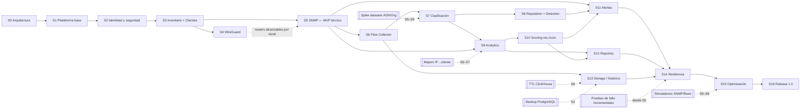

# Horus Flow — Roadmap

> Deriva de [`vision.md`](vision.md) §9 (plan Scrum), §12 (metodología), §13 (Definición de
> Terminado) y §14 (MVP técnico). Si este roadmap contradice `vision.md`, prevalece `vision.md`
> hasta que un ADR en [`adr/`](adr/) registre el cambio. Los ajustes propuestos aquí
> (§4) **no cambian el orden de valor** del plan: solo dividen sprints sobrecargados, adelantan
> prerrequisitos técnicos o mueven trabajo transversal a donde reduce riesgo.
>
> Documentos relacionados: backlog en [`backlog/`](backlog/README.md), reparto en paralelo en
> [`backlog/team.md`](backlog/team.md), UX en [`frontend.md`](frontend.md), preguntas abiertas en
> [`open-questions/product.md`](open-questions/product.md).

## 1. Calendario de referencia

Sprint 0 dura 1 semana; el resto, 2 semanas. Sin fechas absolutas hasta que el PO confirme el
arranque (ver [`open-questions/product.md`](open-questions/product.md) P-01).

| Sprint | Semanas | Sprint | Semanas |
| --- | --- | --- | --- |
| S0 | 1 | S9 | 18–19 |
| S1 | 2–3 | S10 | 20–21 |
| S2 | 4–5 | S11 | 22–23 |
| S3 | 6–7 | S12 | 24–25 |
| S4 | 8–9 | S13 | 26–27 |
| S5 | 10–11 | S14 | 28–29 |
| S6 | 12–13 | S15 | 30–31 |
| S7 | 14–15 | S16 | 32–33 |
| S8 | 16–17 | | |

Total del plan original: **33 semanas (~7,5 meses)**. Con el equipo mínimo de 4 flujos
paralelos ([`backlog/team.md`](backlog/team.md)) el plan ajustado cabe en esas 33 semanas; con 1–2
desarrolladores no cabe (ver §6).

## 2. Hitos

| Hito | Fin de | Qué se puede demostrar | Criterio de salida |
| --- | --- | --- | --- |
| **H0 — Arquitectura aprobada** | S0 | Los documentos de Sprint 0 responden las 5 preguntas de fallo de `vision.md` §9 | ADRs aceptados; modelo de datos, contrato de eventos y modelo de tráfico cerrados (la "Decisión clave" de `vision.md`) |
| **H1 — Walking skeleton** | S1 | Login real → dashboard vacío → navegación; `docker compose up` levanta todo; CI verde | Traza OTel Frontend → api-gateway → auth → PostgreSQL visible en Grafana |
| **H2 — Plataforma segura** | S2 | Usuarios, roles, sesiones revocables, TOTP, auditoría | Pentest interno básico de auth (OWASP ASVS L1 de autenticación y sesión) |
| **H3 — Inventario operable** | S3 | Registrar sitios y routers reales del ISP, con credenciales cifradas y estado de alcanzabilidad | Carga de inventario real del ISP (o una muestra ≥ 20 routers) |
| **H4 — MVP técnico** | **S5** | `Nuxt 4 → API Gateway → {Auth, Devices, WireGuard} → NATS → SNMP → PostgreSQL` (`vision.md` §14) con routers reales: túnel WireGuard, métricas SNMP en vivo, estado online/offline por WebSocket | Demo con ≥ 10 routers reales durante 72 h sin intervención; prueba de "router desaparece" y "SNMP se cae" |
| **H5 — Pipeline de tráfico** | S7 | `Flow → ClickHouse → Traffic Intelligence → Categories` | Flujos reales de ≥ 1 router clasificados con ≥ 80 % de bytes atribuidos a un ASN y ≥ 60 % a un servicio conocido (umbral a validar con datos reales) |
| **H6 — Beta funcional (piloto)** | S11 | Producto usable por el NOC: inventario, WG, monitoreo, tráfico, seguridad, analítica, scoring, alertas | Piloto en producción con el NOC durante S12–S16; alertas de router caído llegan por email/Telegram |
| **H7 — Release 1.0** | S16 | Versión estable, instalable, actualizable, con backup/restore probado y manual de operación | Restauración completa desde backup en máquina limpia < 4 h (objetivo a confirmar con [`disaster-recovery.md`](disaster-recovery.md)); prueba de carga con 1 000 routers superada |

## 3. Sprints: objetivo, entregable demostrable, dependencias y riesgos

Convención: **Dep.** son dependencias duras (sin ellas el sprint no puede cerrar). Los
riesgos se puntúan Probabilidad/Impacto (A/M/B).

### S0 — Arquitectura (1 semana)

- **Objetivo:** cerrar decisiones que cuestan caro de cambiar: servicios, modelo de datos,
  eventos, API, seguridad, almacenamiento, observabilidad, DR, convenciones.
- **Entregable demostrable:** sesión de revisión donde el equipo responde, con los documentos en
  la mano, qué pasa si se cae ClickHouse, SNMP, NATS, un router o el NAS.
- **Dep.:** ninguna.
- **Riesgos:** (M/A) parálisis por análisis → time-box de 1 semana, lo no decidido va a
  [`open-questions/`](open-questions/) con dueño y sprint límite. (A/M) incoherencia entre
  documentos escritos en paralelo → revisión cruzada (historia S0-14 en
  [`backlog/sprint-00.md`](backlog/sprint-00.md)).

### S1 — Plataforma base

- **Objetivo:** esqueleto ejecutable de punta a punta.
- **Entregable:** `docker compose up` levanta PostgreSQL, Redis, NATS JetStream, MinIO, Prometheus,
  Grafana, Loki, OTel Collector, api-gateway, auth, devices (esqueleto) y frontend. Un usuario
  semilla inicia sesión y ve el layout con navegación y menú de usuario. CI ejecuta lint, tests y
  builds en cada PR.
- **Dep.:** S0 (convenciones de API, de código, Git workflow, [`api.md`](api.md),
  [`conventions.md`](conventions.md)).
- **Riesgos:** (A/M) sprint sobrecargado (4 frentes) → solo es viable con flujos paralelos; si
  hay un solo desarrollador, devices queda como health check y el dashboard como página vacía.
  (M/M) el login de S1 se reescribe en S2 → S1 implementa la versión mínima *definitiva* (Argon2id
  + access/refresh token), no un mock.

### S2 — Usuarios, roles y seguridad

- **Objetivo:** identidad y autorización de grado producción.
- **Entregable:** administración de usuarios y roles, sesiones revocables, TOTP, auditoría
  consultable; un usuario sin permiso no ve ni puede invocar lo que no le corresponde.
- **Dep.:** S1 (auth, gateway, frontend shell). [`security.md`](security.md).
- **Riesgos:** (A/A) **sprint demasiado grande** (ver §4.1). (M/A) recuperación de contraseña por
  email sin infraestructura de notificaciones → ajuste §4.1.

### S3 — Inventario

- **Objetivo:** fuente de verdad de la red física y lógica.
- **Entregable:** CRUD de sitios, routers, grupos, tags, vendors/modelos/firmware y credenciales
  cifradas; importación CSV; dashboard con conteo online/offline/warning/critical basado en
  alcanzabilidad ICMP.
- **Dep.:** S2 (permisos, auditoría), [`database.md`](database.md).
- **Riesgos:** (A/M) el dashboard online/offline necesita una fuente de estado antes de SNMP (S5)
  → ajuste §4.2 (sondeo ICMP mínimo). (M/A) credenciales en claro → cifrado de sobre (envelope
  encryption) según [`security.md`](security.md) desde la primera migración.

### S4 — WireGuard

- **Objetivo:** gestionar túneles de gestión hacia routers (y/o servicio VPN; ver P-07).
- **Entregable:** crear servidor WG, alta de peer con claves generadas en servidor, asignación de
  IP, AllowedIPs, descarga de configuración (o QR), handshake y último contacto en vivo, rotación y
  revocación auditadas.
- **Dep.:** S3 (router como entidad a la que se asocia un peer), S2 (permisos `wireguard.*`).
- **Riesgos:** (A/A) gestionar interfaces WG del host desde un contenedor (`NET_ADMIN`, `wgctrl`,
  namespaces) → spike en S3 (historia S3-14). (M/A) fuga de claves privadas → la clave privada del
  peer se muestra una sola vez y nunca se persiste en claro (decisión en
  [`security.md`](security.md)).

### S5 — SNMP → **MVP técnico**

- **Objetivo:** monitoreo de dispositivo e interfaces vía NATS.
- **Entregable:** snmp polea routers (MIB-II, IF-MIB, HOST-RESOURCES, MikroTik como primer
  adaptador), publica en `horus.snmp.*`, el estado se refleja en vivo en el detalle del router y
  en el dashboard; un router caído cambia a offline en < 2 ciclos de sondeo.
- **Dep.:** S3 (inventario y credenciales), S4 si los routers solo son alcanzables por túnel,
  [`events.md`](events.md), decisión de dónde viven las series temporales (§7, C-03).
- **Riesgos:** (A/M) "adaptadores por fabricante" para 5 vendors no caben → solo MikroTik + MIB
  estándar en S5; Cisco/Huawei/Juniper como historias de S6–S8 del flujo de datos. (M/A) volumen
  de métricas en PostgreSQL → ver C-03.

### S6 — Flow Collector

- **Objetivo:** ingesta de metadatos de flujo.
- **Entregable:** flows recibe NetFlow v5/v9 e IPFIX de un router real, publica lotes en NATS y
  un consumidor escribe en ClickHouse; vista "tráfico crudo" (top talkers por IP) en el frontend.
- **Dep.:** S5 (NATS en producción con JetStream configurado), [`traffic-model.md`](traffic-model.md),
  [`storage.md`](storage.md) (TTL de ClickHouse).
- **Riesgos:** (A/A) throughput: un ISP mediano genera decenas de miles de flujos/s → batching en
  el colector, lotes en NATS, inserts por lotes en ClickHouse; prueba de carga con generador
  sintético en el mismo sprint. (M/M) sFlow (muestreo, formato distinto) → se pospone a S7 si no
  hay routers sFlow (pregunta P-06).

### S7 — Clasificación de tráfico

- **Objetivo:** `IP → Prefix → ASN → Organization → Service → Category`, actualizable sin
  despliegue.
- **Entregable:** el tráfico de S6 aparece por ASN, organización, servicio y categoría; un
  administrador edita el catálogo de servicios/categorías y el cambio se aplica sin reiniciar.
- **Dep.:** S6, [`traffic-model.md`](traffic-model.md).
- **Riesgos:** (A/A) **sprint demasiado grande** (ver §4.3). (A/M) calidad y licencia de fuentes
  de datos (prefijos BGP, ASN→Org, rangos publicados por Google/Meta/AWS/Azure/Cloudflare,
  CDN embebidas en el ISP como Netflix OCA o Google GGC) → spike de fuentes en S5–S6.

### S8 — Reputation + Security

- **Objetivo:** correlación de reputación con comportamiento, no listas binarias.
- **Entregable:** reputation ingiere ≥ 2 feeds abiertos; detection genera hallazgos
  correlacionados ("IP con reputación baja + escaneo saliente sostenido") con explicación.
- **Dep.:** S7.
- **Riesgos:** (A/A) **tres servicios en un sprint** (ver §4.4). (M/M) falsos positivos que
  erosionen la confianza del NOC → toda detección muestra razones y nivel de confianza.

### S9 — Analytics

- **Objetivo:** dashboards ISP, Cliente y Router.
- **Entregable:** los tres dashboards con ECharts, filtros de tiempo, actualización en vivo del
  dashboard ISP.
- **Dep.:** S7 (categorías), S5 (métricas de router), **mapeo IP → cliente** (ver §4.5).
- **Riesgos:** (A/A) sin entidad Cliente y su asociación IP↔cliente en el tiempo, el dashboard de
  cliente no es posible → ajuste §4.5. (M/M) consultas lentas → vistas materializadas en ClickHouse
  diseñadas en S6–S7.

### S10 — Detección residencial/comercial

- **Objetivo:** scoring explicable.
- **Entregable:** cada cliente tiene Residential/Commercial/Security/Anomaly Score con razones.
- **Dep.:** S9, histórico de ≥ 4 semanas de flujos (por eso los flujos deben capturarse desde S6
  en el entorno piloto), etiquetas de verdad (tipo de plan contratado) — P-04.
- **Riesgos:** (A/A) sin datos etiquetados no se puede calibrar → empezar con heurística
  ponderada y transparente, calibrar contra los planes conocidos. (M/A) privacidad / legalidad de
  perfilar clientes → P-11.

### S11 — Alertas

- **Objetivo:** `Alert Rule → Detection → Event → Alert → Notification`.
- **Entregable:** reglas configurables, ciclo de vida (abierta, reconocida, resuelta, silenciada),
  canales Web, Email, Telegram.
- **Dep.:** S5 (eventos de monitoreo), S8 (detecciones), S10 (scores).
- **Riesgos:** (M/A) el NOC necesita "router caído" desde el MVP, no en la semana 22 → ajuste §4.6.
  (M/M) fatiga de alertas → deduplicación, agrupación y silencios desde el primer día.

### S12 — Reportes

- **Objetivo:** reportes de consumo, seguridad, disponibilidad, anomalías y posibles comerciales.
- **Entregable:** generación bajo demanda y programada; PDF, CSV, Excel almacenados en MinIO.
- **Dep.:** S9, S10, MinIO (S1).
- **Riesgos:** (M/M) generación de PDF en Go (Chromium headless vs librería nativa) → spike en S11.

### S13 — Storage / histórico

- **Objetivo:** retención por niveles y archivado `ClickHouse → Archive → MinIO → NAS`.
- **Entregable:** políticas de retención (raw 7–30 días, agregado 6–12 meses, diario 2–5 años),
  archivado verificable con checksum, restauración de un rango archivado.
- **Dep.:** S6, [`storage.md`](storage.md), [`disaster-recovery.md`](disaster-recovery.md).
- **Riesgos:** (A/A) si el TTL no existe desde S6, el disco se llena antes de S13 → ajuste §4.7.

### S14 — Alta disponibilidad y resiliencia

- **Objetivo:** demostrar degradación correcta.
- **Entregable:** suite de pruebas de fallo reproducible (apagar PostgreSQL, ClickHouse, NATS,
  Redis, MinIO, NAS, snmp, router) con resultados esperados documentados y UI degradada correcta
  (ver [`frontend.md`](frontend.md) §8).
- **Dep.:** todos los servicios anteriores.
- **Riesgos:** (A/A) descubrir en la semana 28 que un servicio no tolera la caída de NATS → ajuste
  §4.8 (pruebas de fallo incrementales desde S5).

### S15 — Optimización

- **Objetivo:** rendimiento con 10, 100, 500 y 1 000 routers.
- **Entregable:** informe de carga con presupuestos (latencia p95 de API, lag de consumidores NATS,
  tiempo de consulta ClickHouse, memoria por servicio, FPS/latencia de dashboards).
- **Dep.:** simuladores de routers SNMP y de flujos (construidos desde S5/S6).
- **Riesgos:** (M/A) no tener simulador de 1 000 routers → construirlo incrementalmente (S5: 50
  agentes SNMP simulados; S6: generador de flujos).

### S16 — Release 1.0

- **Objetivo:** versión estable y operable por terceros.
- **Entregable:** instalador/compose de producción, guía de actualización, backup/restore, manual
  de operación, runbooks de DR, notas de versión, etiqueta `v1.0.0`.
- **Dep.:** S13, S14, S15.
- **Riesgos:** (M/M) documentación acumulada al final → la DoD exige documentación por historia;
  S16 solo integra y revisa.

## 4. Análisis crítico y ajustes propuestos

### 4.1 S2 está sobrecargado

Login, logout, refresh, sesiones, roles, permisos, ACL, 2FA, recuperación, auditoría **y** cinco
pantallas de frontend son ~70–90 puntos para un equipo que en S1 apenas estabilizó su velocidad.
Además hay dos dependencias ocultas:

- **ACL por recurso** (p. ej. "este técnico solo ve los routers del sitio Norte") necesita sitios y
  grupos, que nacen en S3.
- **Recuperación de contraseña por email** necesita un remitente SMTP, que el plan introduce con
  los canales de alertas en S11.

**Ajuste:**

| Se queda en S2 | Se mueve |
| --- | --- |
| Login/logout/refresh, sesiones revocables, RBAC (roles, permisos `recurso.accion`), TOTP, auditoría, pantallas de usuarios/roles/sesiones/auditoría, *motor* de ACL genérico (tabla de concesiones `sujeto–recurso–acción`, evaluación en auth) | **Aplicación** de ACL a sitios/grupos → **S3** (historia S3-08). **Recuperación autoservicio por email** → S3 si el PO confirma SMTP disponible (P-12), si no S11. En S2 se entrega **restablecimiento asistido por administrador** (genera enlace de un solo uso y fuerza cambio + re-enrolamiento TOTP) |

### 4.2 El estado online/offline de S3 no tiene fuente

El dashboard de S3 pide routers online/offline/warning/critical, pero SNMP llega en S5.
**Ajuste:** sondeo ICMP mínimo en S3 dentro de `devices` (o del futuro `snmp`, según decida
[`services.md`](services.md)), publicando `horus.devices.router.reachability_changed`. Warning y
critical se calculan desde S5 con métricas SNMP; en S3 solo existen online, offline y unknown.

### 4.3 S7 es demasiado grande

Contiene tres problemas distintos: (a) datos de enriquecimiento (prefijo→ASN, ASN→organización)
con actualización periódica, (b) catálogo de servicios y categorías editable y versionado, y (c) el
pipeline de enriquecimiento a volumen de flujos.
**Ajuste sin cambiar el orden:** el flujo de Datos hace el **spike de fuentes y el cargador de
datasets** (a) durante S5–S6 en paralelo; S7 se queda con (b) y (c). Si solo hay un flujo de
datos, S7 entrega (a) + (c) con un catálogo inicial cargado por semilla versionada, y la UI de
edición del catálogo pasa a S8.

### 4.4 S8 tiene tres servicios

reputation, detection y un "security-service" (`vision.md` §9). La lista de servicios acordada
(`api-gateway, auth, devices, wireguard, snmp, flows, traffic-intelligence, reputation, detection,
alerts, analytics, reporting`) **no incluye security-service**; se asume absorbido por `detection`
(ver conflicto C-01, §7). **Ajuste:** S8 entrega reputation completo + detection con 3 detectores
de alto valor (escaneo saliente, contacto con C2 conocido correlacionado con volumen, anomalía de
upload sostenido). Más detectores se añaden de forma incremental en S10–S12.

### 4.5 Falta la entidad Cliente y el mapeo IP → cliente

`vision.md` §3 pone "clientes" en PostgreSQL, S9 pide dashboard por cliente y S10 puntúa clientes,
pero ningún sprint crea la entidad Cliente ni su asociación con IPs (que cambian en el tiempo con
PPPoE/DHCP/CGNAT). Sin ella, los flujos solo se pueden atribuir a IPs.
**Ajuste:** entidad Cliente y asignación estática IP/prefijo→cliente con vigencia temporal en
**S3** (inventario, épica EP-06); integración con la fuente real (RADIUS accounting, servidor
PPPoE/DHCP, sistema de facturación o importación CSV) como historia del flujo de Datos en
**S6–S7**. La fuente depende de P-04.

### 4.6 Alertas mínimas antes de S11

Un NOC no adopta una plataforma que muestra "router caído" pero no avisa. **Ajuste:** en S5 el
dashboard y un centro de notificaciones web muestran eventos de cambio de estado en vivo (sin
motor de reglas, sin canales externos). S11 sigue entregando el motor completo y los canales.

### 4.7 Retención y backups no pueden esperar a S13

- **TTL de ClickHouse** para flujos crudos se define en la primera migración de S6.
- **Backup diario de PostgreSQL** (con prueba de restauración) entra en S2, porque desde S3 hay
  inventario real que perder. La DoD ya lo exige ("backup si aplica").

S13 se queda con archivado por niveles a MinIO/NAS, lifecycle, checksum y restauración de
históricos.

### 4.8 Resiliencia y carga como práctica continua

S14 y S15 siguen siendo sprints de *cierre*, pero cada sprint desde S5 añade al menos una prueba
de fallo automatizada (p. ej. `docker compose kill nats` durante la ingesta y verificar que no se
pierden mensajes) y cada sprint desde S6 ejecuta la prueba de carga del componente nuevo. Así S14
confirma, no descubre.

### 4.9 Otros sprints a vigilar

- **S1**: grande pero paralelizable; no se recorta, se reparte (ver
  [`backlog/team.md`](backlog/team.md)).
- **S5**: "adaptadores por fabricante" se limita a MikroTik + MIB estándar (§3).
- **S9**: mucho frontend; el flujo Frontend empieza los componentes de gráficas reutilizables en
  S6–S8 contra datos simulados.
- **S12**: los reportes son mayormente consultas ya hechas en S9 + render; viable.

## 5. Diagrama de dependencias

Flechas = "necesita". En línea discontinua, los adelantos propuestos en §4.

## 6. Paralelización

El orden de valor es secuencial en lo que se **entrega**, pero no en lo que se **prepara**. Con
4 flujos ([`backlog/team.md`](backlog/team.md)):

| Ventana | En paralelo con el sprint "oficial" |
| --- | --- |
| S1 | Plataforma (compose, CI, observabilidad) ∥ Backend (gateway, auth) ∥ Frontend (shell, login) ∥ Datos (esquema inicial, migraciones, simulador SNMP) |
| S2–S3 | Datos empieza el poller SNMP contra el simulador y el modelo ClickHouse mientras Backend hace identidad e inventario |
| S4 | WireGuard (Backend) ∥ SNMP (Datos) ∥ pantallas de inventario y WG (Frontend) ∥ backups y pruebas de fallo (Plataforma) |
| S5–S6 | Datos: flows + spike de datasets; Backend: alertas mínimas, mapeo de clientes; Frontend: detalle de router en vivo y componentes de gráficas |
| S7–S10 | Datos: clasificación → reputación → scoring; Backend: detection/alerts/reporting; Frontend: analítica; Plataforma: retención, carga |

**Con 1–2 desarrolladores**, el plan ajustado son ~20–22 sprints (S2, S7 y S8 se dividen en dos
cada uno, y S1 se alarga a 3 semanas). Recomendación al PO: P-02.

## 7. Conflictos y decisiones pendientes para el coordinador

| ID | Tema | Propuesta |
| --- | --- | --- |
| C-01 | `vision.md` nombra *network-service* (S4) y *security-service* (S8), ausentes de la lista de servicios acordada | network → `wireguard`; security → `detection`. Registrar en ADR ([`adr/`](adr/), Agente 1) |
| C-02 | Entidad Cliente y mapeo IP→cliente no aparecen en ningún sprint | Añadir a S3 (entidad) y S6–S7 (integración). Modelado en [`database.md`](database.md) (Agente 2) |
| C-03 | MVP técnico dice `SNMP → PostgreSQL`; las series temporales de SNMP en PostgreSQL no escalan a 1 000 routers × interfaces | Último estado en PostgreSQL; series en ClickHouse adelantando su despliegue a S5, o en Prometheus/VictoriaMetrics. Decisión de Agente 1/2 |
| C-04 | Sondeo ICMP en S3: ¿en `devices` o en `snmp`? | Recomendado en `snmp` (servicio de sondeo) adelantando su esqueleto; si no, en `devices`. Decisión en [`services.md`](services.md) |
| C-05 | Recuperación de contraseña sin SMTP | Restablecimiento asistido por admin en S2; email en S3/S11 según P-12 |
