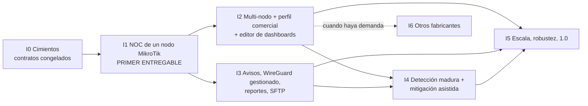

# Horus Flow — Roadmap por incrementos de valor

> **Ronda 2.** Sustituye al plan de 16 sprints de 2 semanas del Sprint 0. Aplica las decisiones
> del product owner de [`po-decisions.md`](po-decisions.md) (D1–D10), que **prevalecen** sobre
> [`vision.md`](vision.md) y sobre cualquier versión anterior de este documento.
>
> Lo que cambia, en una frase: **no hay calendario fijo**. El trabajo se ordena en
> **incrementos**, cada uno desplegable y demostrable con un router MikroTik real, y los agentes
> de IA deciden cómo producir cada incremento en el menor tiempo posible (D9). El equipo es
> **IA + 1 persona** (D7): la persona aprueba, prueba con su MikroTik y decide; los agentes
> construyen, prueban y se revisan entre sí.
>
> Documentos relacionados: historias en [`backlog/`](backlog/README.md)
> ([`increment-0.md`](backlog/increment-0.md), [`increment-1.md`](backlog/increment-1.md)),
> reparto entre agentes en [`backlog/team.md`](backlog/team.md), UX en
> [`frontend.md`](frontend.md), integración MikroTik en
> [`vendors/mikrotik.md`](vendors/mikrotik.md), arquitectura y despliegue en
> [`architecture.md`](architecture.md) y [`services.md`](services.md), preguntas al PO en
> [`open-questions/product.md`](open-questions/product.md).

## 1. Principios del plan

1. **Valor primero, plataforma después.** El primer entregable es un producto usable por un
   NOC: ver qué clientes (IPs) de un nodo MikroTik consumen qué y cuáles muestran señales de
   botnet. Todo lo que no contribuya a eso se pospone (identidad avanzada, WireGuard gestionado,
   alertas configurables, reportes, multi-fabricante).
2. **Multi-tenant desde el primer byte** (D6). El primer entregable funciona con un ISP, pero
   el `tenant_id` (ISP) existe en cada tabla, consulta, evento, token y pantalla, y hay una prueba
   automática de aislamiento. Añadir un segundo ISP no debe requerir migración.
3. **Cada incremento es demostrable con hardware real.** Criterio de salida común: la persona
   conecta su MikroTik (RouterOS v7, D10) y ve el resultado en el dashboard NOC. Además, cada
   incremento tiene una **prueba de aceptación automática** con el simulador de flujos
   (`make accept-iN`), que es la que ejecutan los agentes; la prueba con hardware la hace la
   persona.
4. **Tamaño relativo, no semanas.** Tallas: **S** (una historia de un agente), **M** (varias
   historias de un agente o pocas de varios), **L** (todos los agentes en paralelo), **XL**
   (varias olas de trabajo en paralelo). No se estima en semanas humanas: con agentes de IA el
   cuello de botella es la **atención de la persona** (aprobar contratos, probar con el router,
   responder preguntas), no las horas de desarrollo. Por eso cada incremento minimiza lo que
   exige de ella.
5. **Contratos antes que paralelismo.** Antes de que ≥ 4 agentes trabajen en paralelo, se
   congelan los contratos compartidos (§4, detalle en [`backlog/team.md`](backlog/team.md) §3).
6. **Sin código desechable.** Los atajos permitidos (alta manual de routers, script RouterOS en
   lugar de WireGuard gestionado, dashboard de plantilla antes que editor) son subconjuntos del
   diseño final, no caminos paralelos que haya que tirar.
7. **Lo transversal se hace desde el principio en su versión mínima**: TTL de ClickHouse, backup
   local, logs estructurados, pruebas de fallo básicas y pruebas de aislamiento entre ISP no se
   dejan para el final.

## 2. Vista general

| Orden | Incremento | Tamaño | Qué puede demostrar la persona | Gate de la persona |
| --- | --- | --- | --- | --- |
| **I0** | Cimientos | M | `make up` levanta el sistema; login; da de alta un ISP, un nodo y su MikroTik; el simulador envía flujos y el sistema los cuenta | Aprueba los **contratos congelados** (una sola revisión) |
| **I1** | **Primer entregable: NOC de un nodo MikroTik** | L | Su MikroTik exporta flujos → aparecen los clientes por IP → top de tráfico, servicios y categorías → hallazgos de botnet explicados → dashboard NOC en una pantalla en modo kiosco | Prueba con su router real y acepta/rechaza los hallazgos |
| I2 | Operación multi-nodo y perfil comercial | L | Varios nodos y un segundo ISP; estado de routers (SNMP/ICMP); IPs residenciales con **uso comercial** detectado y razonado; editor de dashboards con guardado por usuario/ISP | Valida la lista de "posibles comerciales" de su red |
| I3 | Avisar y actuar | L | Avisos por Telegram/email/webhook de botnet, router caído o exportador silencioso; WireGuard gestionado desde la UI; reporte semanal de seguridad por ISP; copia externa por SFTP | Recibe un aviso real en su teléfono |
| I4 | Detección madura y mitigación asistida | L | Más detectores, reputación con decaimiento, línea base por IP, ciclo de retroalimentación (falsos positivos), cuarentena asistida en MikroTik (address-list) con aprobación humana — **si el PO la aprueba** (P-23) | Decide la política de mitigación |
| I5 | Escala, robustez y release 1.0 | XL | Prueba de carga 10 → 1 000 routers, suite de fallos, actualización sin pérdida, instalador, manual, `v1.0.0` | Instala desde cero siguiendo el manual |
| I6 | Más fabricantes | M por fabricante | Cisco/Huawei/Juniper por adaptadores; sFlow | Aporta un equipo de laboratorio de cada uno |

Orden **fijo** para I0 → I1 → I2. A partir de I3 el orden puede cambiar según lo que pida la
persona tras usar I1–I2 (por ejemplo, I3 antes que I2 si los avisos urgen más que el perfil
comercial). I6 puede intercalarse en cualquier momento después de I2 si aparece un cliente con
otro fabricante.

## 3. Incrementos en detalle

Convención: **Dep.** son dependencias duras. Los riesgos se puntúan Probabilidad/Impacto
(A/M/B) con su mitigación.

### I0 — Cimientos (M)

- **Objetivo:** que cinco agentes de IA puedan trabajar en paralelo sin bloquearse ni pisarse,
  sobre un esqueleto que ya ejecuta de punta a punta y con datos de flujo simulados realistas.
- **Qué puede demostrar la persona:** clona el repo, ejecuta `make up`, entra con el
  superadministrador semilla, crea el ISP "Demo", el nodo "Centro" y registra su MikroTik (IP del
  exportador y prefijos de clientes). Ve el dashboard vacío con el selector de ISP. Ejecuta
  `make sim` y el contador "flujos recibidos" del router simulado sube.
- **Alcance mínimo:**
  - Monorepo, CODEOWNERS por agente, CI (lint, tests, build, contratos, secretos), protección
    de `main`, reglas de auto-merge.
  - Compose de desarrollo con las dependencias que fije la arquitectura para I1 (PostgreSQL,
    ClickHouse —D4— y el bus de eventos si se mantiene; **sin** MinIO —D2/D3— y sin Valkey
    salvo que la arquitectura lo exija).
  - Modelo multi-tenant en PostgreSQL: ISP → nodo → router principal (exportador) → prefijos de
    clientes del nodo; usuarios con acceso a uno o varios ISP; rol global de superadmin.
  - Autenticación mínima definitiva (Argon2id, access + refresh, `GET /me` con ISPs y permisos)
    y middleware de tenant con **prueba de aislamiento**.
  - Esquema ClickHouse v0 (crudo con TTL + agregados) y migraciones.
  - Simulador de flujos NetFlow v9/IPFIX con plantillas de RouterOS y escenarios (normal,
    escaneo, C2, spam, DoS saliente, uso comercial).
  - Cargadores de datasets: IP→ASN→organización y feeds abiertos de reputación.
  - Frontend: Nuxt 4, login, layout, selector de ISP, cliente API generado, mocks y el
    **marco de widgets** (registro + manifiesto + tarjeta con estados) con datos simulados.
  - Contratos congelados v0 ([`backlog/team.md`](backlog/team.md) §3).
- **Se pospone:** TOTP, sesiones revocables con UI, auditoría consultable, ACL por nodo,
  importación CSV, catálogo de vendors/modelos/firmware, WireGuard, SNMP, MinIO/archivo.
- **Criterios de aceptación de alto nivel:**
  1. `make up && make accept-i0` en un clon limpio termina en verde sin intervención.
  2. Un usuario del ISP A recibe `404` al pedir cualquier recurso del ISP B (prueba de matriz en CI).
  3. Los contratos v0 están publicados en `packages/` y aprobados por la persona.
  4. El simulador produce los seis escenarios de forma determinista (semilla fija).
- **Dep.:** documentos de ronda 2 (`architecture.md`, `database.md`, `api.md`, `events.md`,
  `security.md`, `vendors/mikrotik.md`).
- **Riesgos:** (A/A) arrancar en paralelo sin contratos → los contratos se escriben primero, por
  un solo agente integrador, y se congelan con una única aprobación de la persona. (M/M)
  sobreingeniería de plataforma → I0 solo incluye lo que I1 necesita; todo lo demás queda listado
  en "Se pospone".

### I1 — Primer entregable: NOC de un nodo MikroTik (L)

- **Objetivo:** que un ISP vea, en una pantalla de monitoreo, **qué clientes (IPs) de un nodo
  consumen qué y cuáles muestran señales compatibles con botnet**, con explicación suficiente
  para actuar (D1, D5, D8, D10).
- **Qué puede demostrar la persona:**
  1. En la ficha de su router, pulsa "Generar configuración" y obtiene un script RouterOS
     (`.rsc`) que configura Traffic Flow (NetFlow v9/IPFIX) hacia Horus y, si usa túnel, el peer
     WireGuard del lado del router ([`vendors/mikrotik.md`](vendors/mikrotik.md)). Lo pega en su
     MikroTik.
  2. En menos de 2 minutos el router aparece como **Exportando** y empiezan a aparecer
     **clientes descubiertos** (una IP = un cliente, tipo *Residencial* por defecto).
  3. Ve el top de clientes por tráfico, el top de servicios y categorías (YouTube, Netflix,
     WhatsApp, juegos, CDN…) y de ASN/organizaciones.
  4. Ve **hallazgos de seguridad**: "IP 10.1.4.23 contactó con un C2 conocido de Feodo Tracker
     (3 conexiones, última hace 4 min)", "IP 10.1.7.80 escanea el puerto 23 en 1 200 destinos en
     5 min". Cada hallazgo muestra evidencia, confianza y estado; la persona lo marca como
     confirmado o falso positivo.
  5. Cambia manualmente el tipo de una IP a *Comercial* con un motivo.
  6. Abre el **dashboard "NOC del ISP"** en una TV en **modo kiosco**: pantalla completa, tema
     oscuro, autorrefresco, rotación entre "NOC" y "Seguridad", y recuperación automática si se
     corta la red o se reinicia el servidor.
- **Alcance mínimo:**
  - Colector NetFlow v9/IPFIX (UDP) que solo acepta exportadores registrados (IP origen → router
    → ISP), con métricas de recepción y estado del exportador ("Exportando" / "Silencioso").
  - Ingesta por lotes a ClickHouse; dirección del flujo y **lado cliente** determinados con los
    prefijos de clientes declarados para el nodo; TTL del crudo desde la primera migración.
  - **Descubrimiento de clientes**: cada IP de cliente vista crea/actualiza el cliente
    `(ISP, nodo/realm, IP)` con `first_seen`/`last_seen`, tipo `residential` por defecto, alias
    opcional y cambio manual de tipo auditado (D1).
  - Enriquecimiento IP → prefijo → ASN → organización → servicio → categoría con un **catálogo
    semilla versionado** (sin editor de catálogo).
  - **Detección de botnet v1** (explicable, sin aprendizaje automático): (a) contacto con IPs de
    feeds abiertos de C2/botnet, (b) escaneo saliente (abanico de destinos en puertos típicos de
    propagación: 23, 2323, 22, 445, 5555, 7547…), (c) SMTP saliente masivo desde IP residencial,
    (d) ataque saliente (pps alto hacia pocos destinos). Hallazgos con confianza, evidencia,
    deduplicación y ciclo de vida *Nuevo → En revisión → Confirmado / Falso positivo → Resuelto*.
  - API REST + WebSocket con ámbito de ISP para tráfico, clientes, hallazgos y estado de
    exportadores.
  - UI: Clientes (lista y detalle por IP con tipo y razones), Tráfico (tops), Seguridad (lista y
    detalle de hallazgos), **dashboards de plantilla** "NOC del ISP" y "Seguridad" construidos con
    el marco de widgets, **modo kiosco** con token de pantalla revocable.
  - Generador de script RouterOS para Traffic Flow (+ peer WireGuard opcional). El lado servidor
    del túnel lo prepara el instalador con un comando documentado; **no** hay gestión de túneles
    en la UI.
  - Paquete de instalación de un solo servidor (compose de producción, TLS, `.env`), backup local
    diario de PostgreSQL con prueba de restauración, TTL de ClickHouse.
  - Prueba de aceptación automática con simulador (`make accept-i1`) y prueba de carga básica.
- **Se pospone (y por qué):**

  | Pospuesto | A | Motivo |
  | --- | --- | --- |
  | Perfil comercial automático (scoring) | I2 | Necesita historial de varios días por IP; en I1 el tipo se cambia a mano |
  | Editor de dashboards (arrastrar, redimensionar, guardar por usuario/ISP) | I2 | Las plantillas fijas ya cubren la pantalla NOC; el marco de widgets de I0 hace que el editor sea aditivo |
  | SNMP/ICMP del router (CPU, interfaces, online/offline) | I2 | En I1 la salud que importa es "¿llegan flujos?"; el estado del exportador la cubre |
  | Alertas por Telegram/email/webhook | I3 | En I1 los hallazgos y el exportador silencioso se ven en vivo en la UI y en el kiosco |
  | WireGuard gestionado (hub, peers, rotación) | I3 | Un script RouterOS + un comando de instalador basta para un router |
  | Editor del catálogo de servicios | I4 | El catálogo semilla versionado cubre los servicios principales |
  | TOTP, sesiones revocables, auditoría consultable | I2 | La UI se expone solo en red privada/VPN en I1 (supuesto, ver P-26) |
  | Copia externa SFTP/nube (D2) | I3 | El almacenamiento primario es local; el backup local cubre I1 |
  | sFlow, otros fabricantes | I6 | D10 |

- **Criterios de aceptación de alto nivel:**
  1. `make accept-i1`: con el simulador, los seis escenarios producen exactamente los hallazgos
     esperados (sin falsos positivos en el escenario "normal") y los clientes esperados.
  2. Con el MikroTik real de la persona: de "pegar el script" a "ver clientes en el dashboard" en
     ≤ 2 min; el router pasa a *Silencioso* en ≤ 2 min si se desactiva Traffic Flow.
  3. Los datos de un ISP no aparecen nunca en otro (prueba de matriz extendida a tráfico,
     clientes, hallazgos, WebSocket y kiosco).
  4. El kiosco funciona 24 h seguidas sin intervención, sobrevive a un reinicio del servidor y a
     un corte de red de 5 min, y muestra "Sin conexión desde HH:MM" mientras tanto.
  5. Throughput sostenido 1 h sin pérdida ni lag creciente al caudal objetivo de un nodo (a fijar
     con la medición real del router de la persona; supuesto de partida 5 000 flujos/s).
  6. Cada hallazgo muestra ≥ 2 elementos de evidencia y su confianza; ninguno usa la palabra
     "infectado" salvo que la persona lo haya confirmado.
- **Dep.:** I0; [`vendors/mikrotik.md`](vendors/mikrotik.md) (configuración de Traffic Flow,
  punto de exportación pre-NAT, plantillas IPFIX de RouterOS); acceso al MikroTik de la persona;
  respuestas o supuestos de P-24 (prefijos de clientes) y P-25 (destinatario de hallazgos).
- **Riesgos:**
  - (A/A) **El punto de exportación no ve la IP del cliente** (NAT/CGNAT en el router principal).
    → Exportar en la interfaz del lado cliente (pre-NAT), documentado en
    [`vendors/mikrotik.md`](vendors/mikrotik.md); la UI avisa si > 20 % de los bytes no caen en
    prefijos de clientes ("¿has declarado bien los prefijos?").
  - (A/M) **Falsos positivos** que erosionen la confianza → umbrales conservadores, lenguaje de
    "señales compatibles con", evidencia visible, botón "Falso positivo" que silencia el patrón
    para esa IP, y escenario "normal" del simulador que debe dar cero hallazgos.
  - (M/A) **Flujos por Internet sin cifrar** (NetFlow es UDP sin autenticación) → recomendado
    por túnel WireGuard; si no, lista de exportadores permitidos por IP y cortafuegos.
  - (M/M) **Licencias de datasets/feeds** (ASN, Feodo Tracker, Spamhaus DROP…) → solo fuentes de
    uso comercial permitido; el cargador registra la licencia de cada fuente.
  - (M/M) **Volumen real desconocido** (P-05) → medir con el router de la persona el primer día
    y ajustar agregación/muestreo antes de cerrar I1.
  - (B/A) **Marco legal** del tratamiento de metadatos (D5 lo justifica como seguridad, pero se
    revisa por país) → minimización: el crudo vive 7 días, la UI no expone IPs en URLs y el
    acceso a detalle de cliente queda registrado.

### I2 — Operación multi-nodo y perfil comercial (L)

- **Objetivo:** pasar de "un nodo" a "un ISP real con varios nodos" (y un segundo ISP), con
  salud de routers, el tipo comercial detectado automáticamente y dashboards personalizables.
- **Qué puede demostrar la persona:** registra un segundo nodo con asistente; Horus descubre por
  la API de RouterOS la identidad, interfaces y pools de IP del router y **propone los prefijos de
  clientes**; ve CPU/memoria/interfaces y online/offline del router; abre la lista de "posibles
  comerciales" con razones ("puertos de servicio con conexiones entrantes de 240 IPs distintas,
  subida 5× la media residencial, actividad 24/7") y confirma o descarta; arrastra widgets y guarda
  su propio dashboard o uno compartido del ISP; un superadmin ve la **vista global** de todos los
  ISP.
- **Alcance mínimo:** asistente de alta de nodo/router; descubrimiento por API RouterOS; ICMP +
  SNMP v2c/v3 MikroTik (estado observado online/degraded/offline/stale con razón); módulo de
  scoring residencial/comercial explicable con umbrales configurables por ISP y respeto del tipo
  manual; editor de dashboards (grilla arrastrable con alternativa de teclado, guardado por
  usuario/ISP, plantillas, duplicar); vista global de superadmin; TOTP, sesiones revocables,
  auditoría consultable; roles por ISP (admin, operador, seguridad, solo lectura).
- **Se pospone:** alertas externas (I3), mitigación (I4), otros fabricantes (I6).
- **Criterios de aceptación:** dos ISP con dos nodos cada uno sin fugas entre ellos; ≥ 80 % de
  acuerdo de la persona con la lista de posibles comerciales de su red (muestra revisada); un
  dashboard guardado por un usuario no aparece a otro salvo que se comparta con el ISP; router
  apagado → *Offline* con razón en < 2 ciclos de sondeo.
- **Dep.:** I1 con ≥ 7 días de datos agregados del router real (para calibrar el scoring).
- **Riesgos:** (A/M) sin etiquetas de verdad no se calibra → heurística ponderada, transparente y
  ajustable; la persona etiqueta una muestra. (M/M) cardinalidad SNMP → solo interfaces
  físicas/VLAN y uplinks, nunca interfaces dinámicas por cliente.

### I3 — Avisar y actuar (L)

- **Objetivo:** que el ISP se entere sin mirar la pantalla.
- **Demostración:** un hallazgo de severidad alta, un router caído o un exportador silencioso
  generan un aviso por Telegram/email/webhook, deduplicado, con enlace al detalle; reconocer y
  silenciar desde la UI; alta de túnel WireGuard desde la UI con script RouterOS; reporte semanal
  de seguridad por ISP en PDF/CSV; copia externa cifrada por SFTP (D2) verificada.
- **Alcance mínimo:** servicio/módulo de alertas con reglas predefinidas (no editor libre),
  ciclo de vida, deduplicación, silencios, canales Telegram/email/webhook; WireGuard gestionado
  (hub, peers, IPAM, rotación, revocación, estado de handshake); reportes programados; destino
  remoto SFTP con verificación de checksum (rclone como candidato).
- **Se pospone:** WhatsApp/SMS, editor de reglas libre, Excel.
- **Criterios:** ninguna alerta duplicada en la prueba de caída de nodo; aviso en < 1 min desde
  el hallazgo; restauración desde la copia SFTP probada.
- **Riesgos:** (M/A) fatiga de alertas → solo severidad alta por defecto y agrupación por IP/nodo.
  (M/M) gestionar interfaces WireGuard del host desde un contenedor → agente con privilegios
  separado ([`services.md`](services.md)).

### I4 — Detección madura y mitigación asistida (L)

- **Objetivo:** menos falsos positivos, más cobertura y, si el PO lo aprueba, acción.
- **Demostración:** nuevos detectores (DGA/NXDOMAIN si hay DNS, beaconing periódico, proxies
  residenciales, minería), reputación con decaimiento, línea base por IP; los "falsos positivos"
  marcados en I1–I3 ajustan umbrales; botón "Poner en cuarentena" que añade la IP a una
  address-list de MikroTik por API, **con aprobación humana y reversión** (si P-23 = sí); editor
  del catálogo de servicios.
- **Criterios:** tasa de falsos positivos medida y publicada por detector; toda mitigación es
  reversible, auditada y requiere un rol específico.
- **Riesgos:** (A/A) cortar el servicio a un cliente por error → nunca automático en v1; doble
  confirmación y caducidad de la cuarentena.

### I5 — Escala, robustez y release 1.0 (XL)

- **Objetivo:** que Horus aguante 1 000 routers, degrade bien y lo instale un tercero.
- **Alcance:** pruebas de carga 10/100/500/1 000 routers con simulador; muestreo; suite de
  pruebas de fallo en CI nocturno (ClickHouse, PostgreSQL, bus, colector, router); actualización
  con migraciones sin pérdida; instalador; manual de operación y runbooks
  ([`disaster-recovery.md`](disaster-recovery.md)); pentest externo; `v1.0.0`.
- **Criterios:** presupuestos de rendimiento cumplidos y publicados; restauración completa en
  máquina limpia según RTO de `disaster-recovery.md`; instalación limpia hecha por la persona
  solo con el manual.

### I6 — Más fabricantes (M por fabricante)

- Adaptadores Cisco, Huawei, Juniper (SNMP, flujos, API si aplica) y sFlow, cada uno con
  simulador o capturas reales y equipo de laboratorio aportado por la persona.

## 4. Contratos que se congelan antes de paralelizar

Se congelan **al cerrar I0**, con una única aprobación de la persona, y solo cambian con nueva
versión. Detalle de productor/consumidor y regla de cambio en
[`backlog/team.md`](backlog/team.md) §3.

| Contrato | Documento fuente |
| --- | --- |
| Mapa de módulos → procesos desplegables y estructura del repo | [`architecture.md`](architecture.md), [`services.md`](services.md) |
| Modelo multi-tenant (ISP, nodo, router, prefijos de clientes, cliente-IP) | [`database.md`](database.md) |
| Esquema ClickHouse de flujos y agregados | [`database.md`](database.md), [`traffic-model.md`](traffic-model.md) |
| Sobre de eventos y subjects de I1 | [`events.md`](events.md) |
| OpenAPI v0 y temas WebSocket de I1 | [`api.md`](api.md) |
| Catálogo de permisos y token de kiosco | [`security.md`](security.md) |
| Manifiesto de widgets y formato de layout de dashboard | [`frontend.md`](frontend.md) §6 |
| Esquema de hallazgo (salida de detectores) | [`events.md`](events.md), [`api.md`](api.md) |
| Escenarios del simulador y capturas de RouterOS | [`vendors/mikrotik.md`](vendors/mikrotik.md), `backlog/increment-0.md` |

## 5. Qué se pospone o se recorta del plan original, y por qué

| Recorte / aplazamiento | Motivo |
| --- | --- |
| **Calendario de 16 sprints de 2 semanas, ceremonias Scrum, story points y velocidad** | D9: los sprints eran un nombre. Se sustituyen por incrementos ordenados por valor y tallas relativas; la sincronización es por PR y contratos, no por reuniones (D7) |
| **Entidad Cliente desde CRM/RADIUS/facturación, adaptador IP↔cliente, spike de fuente** | D1: la IP es el cliente y se descubre de los flujos. Desaparece la dependencia crítica Q5/P-04. Alias opcionales más adelante |
| **MinIO, buckets con object lock, NAS obligatorio** | D2/D3: almacenamiento primario local; copia externa opcional por SFTP en I3 |
| **Redis** | D3: Valkey solo si la arquitectura lo necesita; I1 no lo requiere |
| **Identidad completa antes del primer valor** (TOTP, ACL por recurso, recuperación por email, 5 pantallas de admin) | No aporta al primer entregable en red privada; pasa a I2. La autenticación de I0 ya es la definitiva (no un mock) |
| **Inventario completo** (vendors/modelos/firmware, tags, grupos, CSV) | En I1 solo hace falta ISP → nodo → router principal → prefijos. El resto llega con el descubrimiento por API en I2 o cuando haga falta |
| **WireGuard antes que tráfico** (S4 antes de S6) | El valor está en los flujos. En I1 basta un script RouterOS; la gestión de túneles pasa a I3 |
| **SNMP como "MVP técnico"** (S5) | Para un NOC orientado a botnets, la salud del exportador cubre I1; SNMP pasa a I2 |
| **Analítica ISP/Cliente/Router en un sprint propio** (S9) | Se reparte: tops y dashboard NOC en I1, vistas avanzadas y editor en I2 |
| **Reportes PDF/Excel** (S12) | I3, solo seguridad semanal y CSV; Excel después |
| **Resiliencia y optimización al final** (S14–S15) | Se hacen de forma continua (cada incremento añade pruebas de fallo y carga de lo nuevo) y se cierran en I5 |
| **Adaptadores de 5 fabricantes** | D10: MikroTik primero; el resto en I6 bajo demanda |
| **Kubernetes** | Sigue fuera; un único servidor con compose para IA + 1 persona |

## 6. Trazabilidad: dónde quedó cada sprint original

| Sprint original | Contenido | Dónde queda | Notas |
| --- | --- | --- | --- |
| S0 Arquitectura | Documentos y ADRs | **Hecho** (Sprint 0) + ronda 2 | Historias S00 retiradas del backlog; el resultado está en `docs/` |
| S1 Plataforma base | Compose, CI, observabilidad, login, layout | **I0** | Sin MinIO ni Redis; compose con ClickHouse desde el inicio (D4) |
| S2 Usuarios, roles, seguridad | Usuarios, roles, sesiones, TOTP, auditoría, ACL | **I0** (login, roles mínimos, aislamiento por ISP) · **I2** (TOTP, sesiones, auditoría, roles por ISP) | La ACL por sitio se reemplaza por aislamiento por ISP; ACL por nodo solo si se pide |
| S3 Inventario | Sitios, routers, credenciales, CSV, clientes manuales | **I0** (ISP, nodo, router, prefijos) · **I2** (descubrimiento por API, credenciales cifradas) | Clientes manuales eliminados (D1) |
| S4 WireGuard | Servidor, peers, claves, rotación | **I1** (script RouterOS + comando de instalador) · **I3** (gestionado) | Pendiente de confirmar el supuesto de WireGuard (P-07) |
| S5 SNMP / MVP técnico | Sondeo, estado, adaptador MikroTik | **I2** | El "MVP técnico" se reemplaza por el primer entregable de I1 |
| S6 Flow Collector | NetFlow/IPFIX, ClickHouse, TTL | **I1** | Núcleo del primer entregable; sFlow a I6 |
| S7 Clasificación | ASN, organizaciones, servicios, categorías, editor | **I1** (datasets + catálogo semilla) · **I4** (editor) | |
| S8 Reputation + Security | Feeds, detectores, hallazgos | **I1** (feeds abiertos + 4 detectores) · **I4** (madurez) | Sube de prioridad por D5 |
| S9 Analytics | Dashboards ISP, Cliente, Router | **I1** (NOC, clientes, tops) · **I2** (editor, vista global) | Dashboard modular por D8 |
| S10 Residencial/comercial | Scoring explicable | **I2** | En I1 solo cambio manual de tipo |
| S11 Alertas | Reglas, ciclo de vida, canales | **I3** | En I1 la notificación es en vivo en UI/kiosco |
| S12 Reportes | PDF, CSV, Excel | **I3** (seguridad semanal, CSV/PDF) | Excel aplazado |
| S13 Storage / histórico | Retención, archivado | **I1** (TTL, backup local) · **I3** (SFTP, D2) | Sin MinIO |
| S14 Alta disponibilidad | Suite de fallos | Continuo desde **I1** · cierre en **I5** | |
| S15 Optimización | Carga 10–1 000 routers | Carga básica en **I1** · completa en **I5** | |
| S16 Release 1.0 | Instalador, manual, DR | **I5** | El instalador de un servidor nace en I1 |

Historias de los antiguos `backlog/sprint-01..03.md` convertidas: CI, compose, plantilla Go,
login/refresh/me, layout y e2e de humo → `increment-0.md`. Las de identidad avanzada, inventario
completo y WireGuard se retiran y se reescribirán al detallar I2/I3.

## 7. Supuestos de trabajo (hasta que el PO responda)

| Supuesto | Pregunta |
| --- | --- |
| La persona dispone de un MikroTik con RouterOS v7 con clientes reales o de laboratorio | P-19 |
| Los flujos se exportan pre-NAT en la interfaz del lado cliente | P-24, [`vendors/mikrotik.md`](vendors/mikrotik.md) |
| Los prefijos de clientes del nodo los declara el ISP al registrar el router (en I2 se proponen desde la API) | P-24 |
| La UI se expone solo en red privada o VPN durante I1 | P-26 |
| Los hallazgos se revisan por personas; Horus no actúa sobre la red hasta I4 y solo si P-23 = sí | P-23 |
| Feeds de reputación abiertos con licencia compatible; sin presupuesto para feeds comerciales | P-14 |
| Un servidor único aloja todo (sin HA hasta I5) | P-27 |
