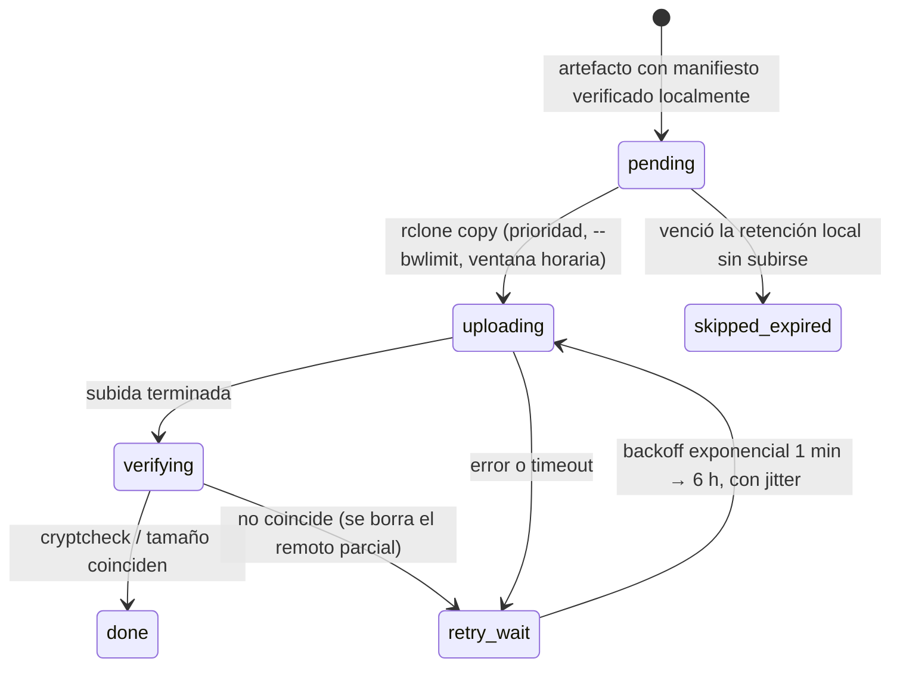

# Estrategia de almacenamiento — Horus Flow

> Estado: **ronda 2 (tras decisiones del PO)** · Dueño: Agente B (Datos) · Fuentes:
> [`po-decisions.md`](po-decisions.md) (D2, D3 **prevalecen**), [`vision.md`](vision.md).
>
> Detalla la decisión de [ADR-0019](adr/0019-almacenamiento-local-y-destino-remoto.md)
> (almacenamiento local primario + destino remoto opcional; sustituye a
> [ADR-0010](adr/0010-minio-sobre-nas.md), MinIO sobre NAS).
>
> Relacionados: [`database.md`](database.md) (retención en ClickHouse/PostgreSQL),
> [`traffic-model.md`](traffic-model.md) (artefactos del catálogo),
> [`disaster-recovery.md`](disaster-recovery.md), [`security.md`](security.md) y
> [`observability.md`](observability.md) (Agente C), [`open-questions/data.md`](open-questions/data.md).

---

## 1. Principios

1. **El almacenamiento primario es local** al servidor de Horus (D2). Todo funciona sin NAS ni
   nube.
2. **El destino remoto es opcional y configurable** (D2): SFTP primero (NAS u otro servidor), luego
   Google Drive, MEGA y Dropbox. **Nada falla** si no está configurado o no responde: la copia
   remota es una cola con reintentos, nunca un paso bloqueante.
3. **Sin object store en v1** (D3, ADR-0019): no se usa MinIO ni ningún servidor S3. Los archivos
   se guardan en el **sistema de archivos local** detrás del puerto `BlobStore` (adaptador `fs`),
   y los artefactos compartidos entre procesos viajan por **NATS Object Store**. Si un disparador
   de ADR-0019 lo exige (varios hosts, tiering, cliente que pida S3), se añade un adaptador S3
   sobre **SeaweedFS** (Apache-2.0) o un S3 gestionado; Garage se descarta por AGPL-3.0 y MinIO por
   licencia y distribución.
4. **Inmutable y verificable**: cada archivo se escribe una vez (`.tmp` + `fsync` + `rename`
   atómico) y lleva su SHA-256 en un manifiesto.
5. **Cifrado antes de salir del servidor**: el proveedor remoto nunca ve contenido ni nombres.
6. **Separación por tenant** en las rutas de todo lo que es de un ISP (D6), para exportar o borrar
   un tenant y, más adelante, enviarlo a su propio destino.

---

## 2. Qué vive en disco local y en qué estructura

### 2.1 Volúmenes

| Volumen (host) | Contenido | Disco recomendado | Quién escribe |
|----------------|-----------|-------------------|---------------|
| `/var/lib/horus/postgres` | datos de PostgreSQL + `pg_wal` | SSD/NVMe | PostgreSQL |
| `/var/lib/horus/clickhouse` | datos de ClickHouse | NVMe | ClickHouse |
| `/var/lib/horus/nats` | JetStream (streams, KV, **Object Store**) | SSD | NATS |
| `/var/lib/horus/valkey` | persistencia opcional de Valkey (RDB) | cualquiera | Valkey |
| `/var/lib/horus/store` (`HORUS_DATA_DIR`) | **almacén de archivos de Horus** (§2.2) | **disco distinto** del de las bases; puede ser HDD; RAID 1 si es posible | `BlobStore`, pgBackRest, ClickHouse (backup/archivo), rol `jobs` |

Un disco separado para `store/` hace que un backup sobreviva a la pérdida del disco de la base de
datos y que llenar `store/` no detenga PostgreSQL ni ClickHouse. Sin destino remoto, un fallo del
servidor completo pierde también los backups: la UI de plataforma lo muestra como advertencia
permanente (§7).

### 2.2 Estructura de `/var/lib/horus/store`

```
/var/lib/horus/store/
├── backups/
│   ├── postgres/                       repositorio pgBackRest (repo1, tipo posix): base + WAL, PITR
│   ├── clickhouse/dt=2026-10-07/full_20261007T030000Z/…     clickhouse-backup o BACKUP … TO Disk('backups')
│   └── nats/dt=2026-10-07/kv_objectstore_20261007T040000Z.tar.zst   KV + Object Store (no streams de telemetría)
├── archive/
│   └── <tenant_id>/clickhouse/<tabla>/month=2026-09/part-0000.parquet   (+ manifest.json)
├── reports/
│   └── <tenant_id>/run_<uuidv7>/consumo_2026-09.xlsx
├── exports/
│   └── <tenant_id>/offboarding_<uuidv7>/…          exportación completa de un tenant
├── audit/
│   └── month=2024-09/audit_log.parquet             (+ manifest.json)
├── catalog/                                        copia para backup/remoto de lo publicado en NATS Object Store
│   ├── traffic/global/v42/catalog.pb.zst           (+ manifest.json)
│   ├── traffic/tenants/<tenant_id>/v7/rules.pb.zst
│   └── reputation/v1871/snapshot.pb.zst
└── datasets/
    └── routeviews_rib/dt=2026-10-07/rib.20261007.0000.bz2
```

Convenciones:

- `<tenant_id>` como primer nivel bajo `archive/`, `reports/` y `exports/` (estructura de
  ADR-0019); nunca nombres de cliente, alias ni IPs en las rutas.
- Fechas UTC estilo Hive (`dt=`, `month=`) para que ClickHouse `file()` y DuckDB poden por partición.
- Nombres con UUIDv7 o ID lógico (`v42`, `run_<uuid>`); nunca texto del usuario sin sanear.
- Cada conjunto lleva `manifest.json`: tipo, tabla/partición o versión, `tenant_id`, esquema,
  `row_count`, totales de control (p. ej. `sum(bytes)`), SHA-256 y tamaño de cada archivo, versión
  de la herramienta, fecha.

### 2.3 Cómo acceden los servicios

| Necesidad | Mecanismo | Por qué |
|-----------|-----------|---------|
| Snapshots del catálogo (global y por tenant) y de reputación, compartidos entre roles y réplicas | **NATS Object Store** (buckets `catalog-snapshots`, `reputation-snapshots`) + copia en `store/catalog/` | Funciona con uno o varios hosts sin volúmenes compartidos; < 100 MB por versión. El ingester guarda además la última versión en su disco local. |
| Archivos propios de un rol (reportes, datasets) | `BlobStore` con adaptador `fs` sobre su subcarpeta de `store/` | Un solo escritor por carpeta. |
| Archivo Parquet y backups de ClickHouse | ClickHouse escribe en **discos locales declarados** (`<disks><backups>`, `user_files_path`) que apuntan a `store/backups/clickhouse` y `store/archive` | `BACKUP … TO Disk(…)` e `INSERT INTO FUNCTION file(…, 'Parquet')` son nativos. |
| Backups de PostgreSQL | **pgBackRest** con `repo1` tipo posix en `store/backups/postgres` | El WAL ya no depende de un NAS: una caída remota no llena `pg_wal`. |
| Descarga de reportes | `GET /api/v1/reports/{id}/download` servido por el rol `reporting` a través del gateway, autorizado por tenant | Sin S3 no hay URLs prefirmadas. |

---

## 3. Qué se guarda (y qué no)

| Contenido | Local | Copia remota (si hay destino) | Notas |
|-----------|-------|-------------------------------|-------|
| Backups de PostgreSQL (base + WAL) | Sí | **Sí, prioridad 1** | contienen secretos cifrados por la aplicación; la KEK nunca va con ellos |
| Backups de ClickHouse (agregados, `dim.*`, esquema; **no** `flows_raw`) | Sí | **Sí, prioridad 2** | lo crudo se puede perder; lo agregado no |
| Backup de NATS KV + Object Store | Sí | Sí, prioridad 3 | streams de telemetría no se respaldan |
| Exportaciones de auditoría | Sí | Sí, prioridad 4 | |
| Archivo Parquet de agregados | Sí | Sí, prioridad 5 | |
| Copias de catálogos y reputación | Sí | Sí, prioridad 6 | pequeñas; reproducibilidad |
| Datasets externos (RIB, iptoasn, PeeringDB) | Sí, 90 d | **No** | licencias (no redistribuir); se vuelven a descargar |
| Reportes exportados | Sí, 7 d | No | se regeneran |
| Configuraciones WireGuard `.conf` | **Nunca** | Nunca | contienen la clave privada del peer |
| KEK, contraseña de `crypt`, credenciales de destinos | **Nunca** en `store/` | Nunca | [`security.md`](security.md) |
| Datos calientes de PG/CH | solo en sus volúmenes | solo vía backups | |

---

## 4. Destino remoto opcional

### 4.1 Herramienta: rclone

**[rclone](https://rclone.org)** (MIT), ejecutado por el rol **`jobs`**
([ADR-0025](adr/0025-binario-modular-con-roles.md)) con configuración generada desde la BD
(ADR-0019). Motivos: un solo binario y formato de configuración para SFTP, Google Drive, MEGA,
Dropbox y muchos más; reintentos, reanudación, `--bwlimit` (importante en servidores de ISP con
enlace compartido), `copy` no destructivo, `check`/`cryptcheck`. Se controla como `rclone rcd`
(API HTTP local) para obtener progreso y errores estructurados, o como CLI.

Alternativas: `restic`/`kopia` (deduplicación y cifrado propios, buenos para backups, pero formato
propio de repositorio; reevaluables solo para backups), backups directos desde pgBackRest o
clickhouse-backup a SFTP/S3 (no cubren Drive/MEGA/Dropbox y duplican la configuración de destinos).

### 4.2 Proveedores

| Orden | Proveedor | Soporte rclone | Notas |
|-------|-----------|----------------|-------|
| 1 | **SFTP** (NAS Synology/QNAP/TrueNAS, servidor Linux) — primer incremento | nativo | **Clave SSH dedicada** (no contraseña), usuario enjaulado con escritura solo en su carpeta; hash SHA-1/MD5 si el servidor permite ejecutar `sha1sum`/`md5sum`, si no solo tamaño. |
| 2 | **Google Drive** | nativo | OAuth; límite de ~750 GB de subida por día y cuenta; ofrece MD5/SHA-1/SHA-256. |
| 3 | **MEGA** | nativo | usuario/contraseña; sin hash comparable (tamaño + verificación por descarga, §4.6); soporte "best effort". |
| 4 | **Dropbox** | nativo | OAuth; hash propio soportado por rclone. |
| — | **MediaFire** | **no existe backend en rclone** (petición abierta desde hace años en el proyecto); MediaFire no expone SFTP, WebDAV ni S3 (los intentos por WebDAV fallan) y su API pública no tiene herramienta de sincronización mantenida; `rclone copyurl` solo descarga enlaces públicos | **No viable.** Se documenta como no soportado (coincide con ADR-0019 y Q24 de arquitectura); reevaluar solo si aparece un backend mantenido o MediaFire expone WebDAV/SFTP. |

Drive y Dropbox requieren autorizar OAuth una vez (`rclone authorize` en un equipo con
navegador); el token se pega en la UI y se guarda cifrado como cualquier credencial.

### 4.3 Cifrado antes de subir

**Overlay `crypt` de rclone** sobre cada destino (ADR-0019): obligatorio para nubes de consumo y
**activado por defecto también en SFTP** (los backups llevan datos de todos los tenants y el NAS
puede ser de un tercero).

- Cifra contenido (XSalsa20-Poly1305 por bloques) **y nombres** de archivos y directorios: el
  proveedor no ve tablas, tenants ni fechas.
- Contraseña y sal de `crypt` en el gestor de secretos de Horus. **Requisito de DR**: se exportan
  una vez y se custodian **fuera del servidor** (gestor de contraseñas del dueño, copia en papel):
  si se pierde el servidor y con él la clave, las copias remotas son irrecuperables. Un destino no
  pasa a "activo" hasta que el operador confirma que guardó la clave de recuperación.
- Rotar la clave = remoto `crypt` nuevo (carpeta nueva); el anterior se conserva hasta su
  retención.
- Endurecimiento opcional (no predeterminado): cifrar los backups con `age` y una clave pública,
  con la privada solo fuera del servidor, para que un servidor comprometido no pueda leer las
  copias remotas antiguas.

### 4.4 Cola, checksums y reintentos



- **Ledger en PostgreSQL** (esquema del rol `jobs`/`analytics`; ADR-0019 lo llama "estado por
  destino"): `remote_destination` (tipo, ruta, credencial cifrada, qué rutas replica, calendario,
  retención remota, `last_success_at`, error) y `remote_copy` (`artifact_key`, `destination_id`,
  `sha256` del original, `size`, `remote_path`, `status`, `attempts`, `last_error`, `uploaded_at`,
  `verified_at`). Es la fuente de verdad de "qué está a salvo fuera".
- **Checksums** en tres puntos: (1) SHA-256 del original en su manifiesto, verificado releyéndolo
  tras escribirlo; (2) `rclone cryptcheck`, que cifra localmente con el nonce del objeto remoto y
  compara con el hash del backend (SFTP con shell, Drive, Dropbox); (3) si el backend no da hash
  (MEGA, SFTP sin shell): tamaño + verificación periódica por descarga (§4.6).
- **Reintentos** indefinidos mientras el original exista; alerta `remote_copy_lagging` a las 24 h
  (`critical` a las 72 h para backups de PostgreSQL) y `remote_destination_unhealthy` inmediata
  ante error de autenticación o cuota. Métricas de ADR-0019: `horus_remote_sync_lag_seconds`,
  `horus_remote_sync_failures_total`.
- **Prioridad**: backups PG > backups CH > NATS > auditoría > archivo > catálogos.
- La cola **no copia** archivos: apunta a los originales. El borrado local **nunca espera** al
  remoto (regla 2 de ADR-0019); si un original vence su retención local sin subirse, queda
  `skipped_expired` y se alerta. Excepción: se conserva siempre localmente el último backup completo
  de PostgreSQL que aún no esté en ningún destino.

### 4.5 Retención en el remoto e inmutabilidad

- `rclone copy` de archivos inmutables con nombre único: nunca se sobrescribe. La retención remota
  es independiente de la local (normalmente mayor) y la aplica el rol `jobs` borrando lo vencido.
- SFTP, Drive, MEGA y Dropbox **no tienen object lock**. Contra ransomware o borrado: en NAS, que el
  usuario SFTP no pueda borrar (la expiración la hace el administrador del NAS o un usuario
  distinto) y **snapshots** Btrfs/ZFS de la carpeta; en nube, papelera y versionado del proveedor.
- La inalterabilidad legal de la auditoría solo se garantiza si el destino la garantiza; se
  indica en la UI.

### 4.6 Verificación periódica

- Semanal: `rclone cryptcheck` de una muestra del ledger.
- Mensual: **restauración de prueba automatizada** — descargar un backup aleatorio a través del
  remoto `crypt`, comprobar el SHA-256 del manifiesto y restaurar en una base temporal (requisito
  para [`disaster-recovery.md`](disaster-recovery.md)).

### 4.7 Varios destinos y multi-tenant

- v1: **0, 1 o varios destinos de plataforma** (permiso `platform.storage.manage`, superadmin).
  Reciben todo lo marcado en §3.
- Después (fuera de v1, Q20 de arquitectura): destinos **por tenant** (el NAS de cada ISP) solo para
  sus artefactos (`archive/<tenant_id>/`, `reports/<tenant_id>/`, `exports/<tenant_id>/`). Los
  backups de PostgreSQL/ClickHouse contienen todos los tenants y por eso **solo** van a destinos de
  plataforma.

---

## 5. Política de retención por tipo de dato

| Tipo de dato | Sistema caliente | Retención caliente | Archivo local | Remoto (si existe) |
|--------------|------------------|--------------------|---------------|--------------------|
| Flujos crudos | ClickHouse | 7 d (7–30) | Parquet diario **opcional** (off por defecto) | no |
| Consumo por cliente 5 min / 1 h / 1 d | ClickHouse | 90 d / 13 meses / 25 meses | Parquet mensual del 1 h (25 meses) | igual que local |
| Consumo por nodo 5 min / 1 h / 1 d | ClickHouse | 90 d / 13 meses / 5 años | Parquet anual del 1 d (10 años) | sí |
| Señales de seguridad 5 min / 1 h | ClickHouse | 30 d / 13 meses | no | no |
| SNMP | ClickHouse | 30 d / 90 d / 13 m / 5 a | no | no |
| Hallazgos de detección | PostgreSQL | 25 meses | Parquet anual | sí |
| Clientes (= IPs) e historial de tipo | PostgreSQL | hasta 25 meses sin actividad | en backups | vía backups |
| Auditoría | PostgreSQL | 2 años | Parquet mensual (5 años o legal) | sí |
| Alertas / notificaciones | PostgreSQL | 13 meses / 90 d | Parquet mensual (alertas) | sí |
| Sesiones, refresh tokens | PostgreSQL / Valkey | expiración + 30 d | no | no |
| Reportes exportados | `store/reports` | 7 d | — | no |
| Catálogos | PG + NATS Object Store + `store/catalog` | todas las versiones | — | sí |
| Datasets externos | `store/datasets` | 90 d | — | **no** |
| Backups PostgreSQL | `store/backups/postgres` | **mínimo garantizado: 7 d de PITR** (ADR-0019) | — | 35 d + 12 mensuales |
| Backups ClickHouse | `store/backups/clickhouse` | **mínimo garantizado: 2 completos** + incrementales de 7 d | — | 35 d + 12 mensuales |

Sin destino remoto, la retención local de backups sube por defecto a 14 d de PITR + 3 completos
mensuales de ClickHouse para compensar parcialmente; el disco se dimensiona con eso. Todos los
valores son defectos configurables por instalación y, más cortos, por tenant; las obligaciones
legales por país siguen abiertas (Q4 de [`open-questions/data.md`](open-questions/data.md)).

---

## 6. Archivado ClickHouse → disco local

### 6.1 Dos mecanismos

| | **Backup nativo** | **Archivo Parquet** |
|---|---|---|
| Propósito | DR: restaurar la base tal cual | Retención larga y consulta fuera de CH |
| Herramienta | `clickhouse-backup` (disco local) o `BACKUP … TO Disk('backups', …)`, incrementales | `INSERT INTO FUNCTION file('<tenant_id>/clickhouse/<tabla>/month=…/part.parquet', 'Parquet') SELECT … FINAL` |
| Contenido | agregados, `dim.*`, esquema — no `flows_raw` | particiones cerradas de agregados, con valores finalizados (no estados `AggregateFunction`) |
| Frecuencia | diario incremental, semanal completo | al cerrar la partición |
| Dueño | rol `jobs` | rol `jobs` (archiver) |

### 6.2 Proceso de archivado Parquet

1. Elegir partición cerrada (p. ej. `customer_1h` de `2026-09`, el `2026-10-02`).
2. Exportar **por tenant** (`WHERE tenant_id = ?`) a `archive/<tenant_id>/clickhouse/<tabla>/month=…/`.
3. Escribir `manifest.json` (esquema, `row_count`, `sum(bytes)`, `min/max(bucket)`, versiones de
   catálogo, SHA-256 por archivo).
4. **Verificar** leyendo de vuelta con `file()` y comparando con el manifiesto y la tabla de origen;
   solo entonces se registra en `analytics.archive_manifest` y se encola la copia remota.
5. **Borrado condicionado al archivo local** (regla 2 de ADR-0019): `DROP PARTITION` solo de
   particiones verificadas, con un usuario CH de mantenimiento (excepción acotada al escritor
   único); TTL de seguridad = retención + 30 días. La verificación **no** depende del remoto.
6. **Restauración de prueba** mensual de una partición aleatoria en una base temporal.

### 6.3 Tiered storage de ClickHouse

Descartado en v1 hacia cualquier destino remoto (acoplaría la disponibilidad de ClickHouse). Se
admite un segundo disco **local** más barato como volumen `cold` si hiciera falta espacio.

---

## 7. ¿Qué pasa si el destino remoto no está configurado o no responde?

| Situación | Comportamiento | Impacto |
|-----------|----------------|---------|
| **No configurado** (por defecto) | La sincronización del rol `jobs` está inactiva; los artefactos se generan y verifican localmente igual. Aviso permanente en la UI de plataforma: "No hay copia fuera del servidor". | Ninguno funcional; riesgo de DR aceptado y visible. |
| Remoto caído, credenciales inválidas, cuota llena | Reintentos con backoff; alertas `remote_copy_lagging` y `remote_destination_unhealthy`. | Ninguno funcional; RPO fuera del sitio se degrada. |
| Remoto lento | `--bwlimit` y ventana horaria configurables (p. ej. 00:00–06:00 local). | Ninguno. |
| Corte más largo que la retención local | Los artefactos vencidos quedan `skipped_expired` (se avisa antes, al 80 % de su retención). | Huecos en el remoto, no en el servicio. |
| Vuelve el remoto | La cola se vacía por prioridad y se verifica lo subido durante la caída. | — |

Ningún rol de Horus (login, inventario, WireGuard, SNMP, flujos, dashboards, alertas, detección)
llama al destino remoto ni espera por él (regla 1 de ADR-0019).

### 7.1 Si se llena el disco local de `store/`

| Umbral (ADR-0019) | Acción |
|-------------------|--------|
| 70 % | alerta `warning` |
| 85 % | alerta `critical`; se pausa el archivo Parquet de crudo (si estaba activo) |
| 95 % | se pausan archivado y generación de reportes; se borran primero reportes caducados y datasets > 30 d; nunca backups dentro de su mínimo garantizado ni archivo de particiones ya borradas de ClickHouse |

PostgreSQL y ClickHouse están en otros volúmenes (§2.1) y siguen operando.

---

## 8. Camino a object store o nube

1. **v1**: sistema de archivos local + NATS Object Store + rclone opcional.
2. **Multi-host** (disparador de ADR-0019): adaptador `s3` del `BlobStore` sobre SeaweedFS o un S3
   gestionado; las rutas de §2.2 pasan a ser claves sin cambios.
3. **Destinos S3 en el remoto** (B2, Wasabi, R2, AWS S3) como un proveedor más de rclone; con ellos
   sí se puede tener object lock real.

---

## 9. Dependencias

| Con | Tema |
|-----|------|
| Agente A (`architecture.md`, `services.md`) | Retirar MinIO/NAS de diagramas; rol `jobs` como dueño de backups, archivo y sincronización; NATS Object Store para snapshots; excepción de `DROP PARTITION` del archiver. Coincido con ADR-0019 en todo; añado manifiestos SHA-256, cola priorizada, `crypt` también en SFTP por defecto y custodia offline de la clave de `crypt`. |
| Agente C (`security.md`, `disaster-recovery.md`, `observability.md`, `api.md`) | Custodia offline de la clave de `crypt` (sin ella no hay DR); credenciales de destinos (SSH, OAuth); RPO/RTO con y sin remoto; restauración de prueba mensual; alertas `remote_copy_lagging`, `remote_destination_unhealthy`, `archive_lag`, disco 70/85/95 %; descarga de reportes por la API; endpoints de destinos (superadmin). |
| Agente D (`roadmap.md`, `backlog`) | Historias: backups locales desde el primer incremento con datos; destino SFTP; Drive/MEGA/Dropbox después; UI de destinos, estado de la cola y confirmación de clave de recuperación; MediaFire fuera de alcance. |
