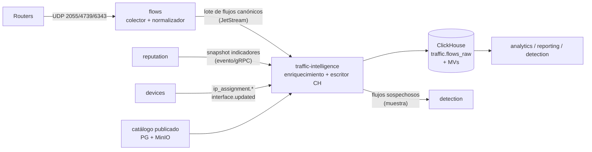
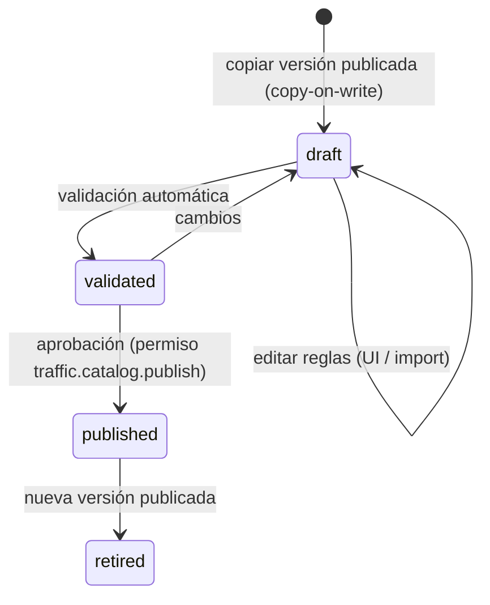

# Modelo de tráfico y clasificación — Horus Flow

> Estado: **borrador Sprint 0** · Dueño: Agente 2 (Arquitecto de datos) · Fuente: [`vision.md`](vision.md)
> ("Decisión clave", documento crítico nº 3).
>
> Relacionados: [`database.md`](database.md) (tablas físicas PG/ClickHouse), [`storage.md`](storage.md)
> (artefactos del catálogo y fuentes en MinIO), [`events.md`](events.md) (Agente 3, contratos NATS),
> [`services.md`](services.md) (Agente 1), [`open-questions/data.md`](open-questions/data.md).

---

## 1. Objetivo y alcance

Convertir metadatos de flujo (NetFlow v5/v9, IPFIX, sFlow v5) en hechos de negocio:

```
IP → Prefix → ASN → Organization → Service → Category → Reputation
   → Client → Router → Interface → Time → Bytes → Packets
```

Leído como frase: *"los bytes/paquetes que, en este intervalo, el **cliente** C intercambió a
través de la **interfaz** I del **router** R con la **IP remota** X, que pertenece al **prefijo** P,
anunciado por el **ASN** A, operado por la **organización** O, que identificamos (con confianza c)
como el **servicio** S de la **categoría** K, con **reputación** r."*

Fuera de alcance v1: captura de paquetes, DPI, inspección de payload. SNI/DNS se dejan modelados
como tipos de regla para el futuro (§6.2).

### Principios

1. **Atribuir en ingesta, describir en consulta**: lo que depende del instante (IP→cliente,
   IP→ASN según BGP del día, reputación del día) se fija en la fila; lo descriptivo (nombres,
   categoría de un servicio) se resuelve con diccionarios ([`database.md` §4](database.md)).
2. **La incertidumbre es un dato**: cada clasificación lleva `method` y `confidence`. Nunca se
   presenta "Instagram" cuando solo sabemos "Meta".
3. **Catálogo como datos, no código**: reglas versionadas, publicadas, auditables y recargables en
   caliente.
4. **No contar dos veces**: el punto de observación se decide por configuración de interfaces, no
   por heurísticas de coincidencia (§10).

---

## 2. Pipeline y responsabilidades por etapa



| # | Paso | Servicio | Momento | Fuente de verdad | Resultado en la fila |
|---|------|----------|---------|------------------|----------------------|
| 1 | Decodificar (v5/v9/IPFIX/sFlow), plantillas, timestamps absolutos | `flows` | ingesta | paquete + `flows.template_cache` | campos canónicos crudos |
| 2 | Corregir muestreo | `flows` | ingesta | sampling del paquete/plantilla/opción; si falta, `flows.exporter.declared_sampling_rate` | `bytes`, `packets` escalados; `sampling_rate` |
| 3 | Identificar exportador → `router_id`, ifIndex → `interface_id`, `observation_role` | `flows` | ingesta | `devices` (cache local por eventos) | `router_id`, `site_id`, `interface_id`, `observation_role` |
| 4 | Pre-agregación opcional (60 s) | `flows` | ingesta | config | menos filas (§11) |
| 5 | **Atribución a cliente** + dirección | `traffic-intelligence` | ingesta | asignaciones IP temporales (`devices`) | `subscriber_id`, `subscriber_ip`, `remote_ip`, `direction`, `attribution_status` |
| 6 | IP remota → prefijo → ASN | `traffic-intelligence` | ingesta | trie en memoria del catálogo publicado | `remote_prefix`, `remote_asn`, `remote_country` |
| 7 | ASN → organización | `traffic-intelligence` | ingesta (ID) / consulta (nombre) | catálogo | `remote_org_id` |
| 8 | Reglas → servicio | `traffic-intelligence` | ingesta | catálogo versión N | `service_id`, `classification_method`, `classification_confidence`, `catalog_version` |
| 9 | Servicio → categoría | — | **consulta** | `dim.service` (catálogo vigente) | — (no se guarda) |
| 10 | Reputación de la IP remota | `traffic-intelligence` (lookup) / `reputation` (dueño de datos) | ingesta (snapshot) | indicadores vigentes | `reputation_score` |
| 11 | Agregación tiempo (5 min/1 h/1 d) | ClickHouse MVs | inserción | — | tablas `traffic.*_5m/_1h/_1d` |
| 12 | Correlación de seguridad, scoring residencial/comercial | `detection` | asíncrono (sobre agregados y crudo) | ClickHouse | `detection.*` |

**¿Por qué el enriquecimiento está en `traffic-intelligence` y no en `flows`?** `flows` debe ser
tonto, rápido y sin dependencias (no perder UDP). Si `traffic-intelligence` cae, JetStream retiene
los lotes (límite por tamaño, propuesta: 6 h de pico, ver [`events.md`](events.md) /
[`disaster-recovery.md`](disaster-recovery.md)) y se procesan al volver; los flujos crudos no se
pierden mientras el retraso no exceda ese límite.

---

## 3. Registro canónico de flujo normalizado

Es el contrato del lote `flows → traffic-intelligence` (el sobre y el subject los define el
Agente 3; los campos son esta tabla). Columnas "enriquecidas" se añaden en el paso 5–10.

| Campo | Tipo | NetFlow v5 | NetFlow v9 / IPFIX (IE) | sFlow v5 | Notas |
|-------|------|------------|-------------------------|----------|-------|
| `exporter_ip` | IP | IP origen UDP | idem | `agent_address` | identifica al router |
| `observation_domain_id` | uint32 | `engine_type/id` | Source ID / Observation Domain ID | `sub_agent_id` + `source_id` | separa linecards/VRFs |
| `flow_start` | DateTime64(3) | `first` (sysUptime relativo → absoluto con `unix_secs` del header) | IE 152 `flowStartMilliseconds` o 22 `flowStartSysUpTime` + IE 160 | = `ts` del sample | |
| `ts` (fin) | DateTime64(3) | `last` | IE 153 / 21 | timestamp de recepción del datagrama | sFlow no tiene duración |
| `src_ip`, `dst_ip` | IPv6 (v4 mapeada) | sí (solo IPv4) | IE 8/12 (v4), 27/28 (v6) | cabecera del paquete muestreado | |
| `src_port`, `dst_port` | uint16 | sí | IE 7/11 | cabecera | 0 si no TCP/UDP; ICMP type/code en `dst_port` (convención v9) |
| `protocol` | uint8 | sí | IE 4 | cabecera | |
| `tcp_flags` | uint8 | OR acumulado | IE 6 | del paquete | |
| `bytes` | uint64 | `dOctets` | IE 1 `octetDeltaCount` | `frame_length` (por muestra) | escalado ×sampling |
| `packets` | uint64 | `dPkts` | IE 2 | 1 por muestra | escalado ×sampling |
| `input_if_index`, `output_if_index` | uint32 | `input`/`output` (16 bits) | IE 10/14 | `input`/`output` del flow sample | clave para `interface_id` |
| `flow_direction` | enum | — | IE 61 (0 ingress/1 egress) | — | **solo informativo**; la dirección respecto al cliente se calcula (§9.4) |
| `src_as`, `dst_as` | uint32 | sí (si el router tiene BGP) | IE 16/17 | extended gateway | se usa solo como *pista*; el ASN canónico sale del catálogo |
| `next_hop` | IP | sí | IE 15/62 | extended router | |
| `vlan_id` | uint16 | — | IE 58/59 | extended switch | |
| `post_nat_src_ip`, `post_nat_src_port` | IP/uint16 | — | IE 225/227 (NAT) | — | si el router exporta eventos NAT (§9.2) |
| `sampling_rate` | uint32 | header `sampling_interval` (14 bits) | IE 34/305/306, Options Template | `sampling_rate` del sample | ver §4 |
| `flow_source` | enum | `netflow_v5` | `netflow_v9`/`ipfix` | `sflow_v5` | |
| `batch_id` | UUIDv7 | — | — | — | idempotencia de escritura en CH |

Campos que **no** se garantizan (se guardan si vienen, nunca se requieren): `src_as`/`dst_as`,
`next_hop`, `vlan_id`, campos NAT, MAC, aplicación propietaria (NBAR/AppID).

---

## 4. Muestreo: qué se pierde y cómo se corrige

- **Corrección**: `bytes_est = bytes × N`, `packets_est = packets × N` donde N es el sampling rate
  efectivo. Prioridad para obtener N: (1) valor en el propio registro/datagrama; (2) Options
  Template/Data Record asociado al `observation_domain_id` y `sampler_id` (v9/IPFIX); (3)
  `flows.exporter.declared_sampling_rate` configurado en Horus; (4) 1 con alerta
  `sampling_unknown`.
- **Qué se pierde con muestreo 1:N**:
  - Flujos cortos (DNS, handshakes, escaneos): con N = 1000, un flujo de 3 paquetes tiene ~0,3 % de
    probabilidad de aparecer. ⇒ **conteo de flujos, IPs distintas y detección de escaneos no son
    fiables** con muestreo alto. `detection` debe leer `sampling_rate` y bajar la confianza.
  - Precisión de bytes por cliente: error relativo ≈ `1/√(paquetes muestreados)`. Un cliente con
    100 MB/h en paquetes de 1 000 B ≈ 100 k paquetes ⇒ con 1:1000 ≈ 100 muestras ⇒ ±10 %. Para
    totales del ISP el error es despreciable; para facturación por cliente **no** usar muestreo
    alto.
  - sFlow: no hay flujo, solo paquetes muestreados; `flow_start = ts`, duración 0, `flows` cuenta
    muestras, no conexiones.
- **Recomendación**: en interfaces `subscriber_edge` usar NetFlow/IPFIX **sin muestreo** (1:1) si la
  CPU del router lo permite (MikroTik Traffic-Flow no muestrea); muestreo solo en `upstream` de
  alto volumen. Ver open questions Q5.

---

## 5. Fuentes de datos: prefijo → ASN → organización

| Fuente | Aporta | Actualización | Licencia (verificar antes de producción) | Uso propuesto |
|--------|--------|---------------|------------------------------------------|---------------|
| **RouteViews / RIPE RIS** (volcados RIB MRT) | prefijo → ASN de origen según BGP real; MOAS | cada 2–8 h | Datos abiertos; atribución solicitada | **Fuente primaria** prefijo→ASN, procesada por un job de `traffic-intelligence` (descarga, parseo MRT, consolidación). |
| **iptoasn.com** | prefijo → ASN, país, AS-name (TSV) | diario | Dominio público (PDDL) | **Arranque/fallback** (simple de importar; Sprint 7). |
| **IPinfo Lite** (free) | IP → ASN, país | diario | CC BY-SA 4.0 (atribución + share-alike sobre la base derivada) | Alternativa/validación cruzada. Revisar implicaciones de share-alike. |
| **MaxMind GeoLite2 ASN / GeoIP2 ISP** | IP → ASN, org (ISP pago añade ISP/org más precisa) | semanal | GeoLite2 EULA (cuenta + atribución, restricciones de redistribución); GeoIP2 comercial pago | Opcional si el PO tiene presupuesto (Q9). |
| **RIR delegated stats** (ARIN, RIPE NCC, LACNIC, APNIC, AFRINIC) | asignación de bloques y ASN a países/titulares | diario | Abiertos | País y titular de bloques no ruteados; validación. |
| **CAIDA AS-to-Organization** | ASN → organización (agrupa ASNs de una misma empresa) | trimestral | Acuerdo de uso de CAIDA (revisar uso comercial) | Semilla de `organization`; curación manual encima. |
| **PeeringDB** (API) | organización, tipo de red (Content/NSP/Cable/Enterprise), IXPs | diario | AUP de PeeringDB (uso permitido, no reventa) | `asn.network_type`, nombres de org. |
| **Rangos publicados por proveedores** (AWS `ip-ranges.json`, Google `goog.json`/`cloud.json`, Azure Service Tags, Cloudflare `ips-v4/v6`, Fastly, Oracle, etc.) | prefijo → proveedor/servicio/región | diario–semanal | Términos de cada proveedor (públicos) | Reglas `prefix` de mayor prioridad que ASN (distinguen p. ej. Google Cloud de Google consumo). |
| **Datos locales del ISP** | caches embebidos (Netflix OCA, Google GGC, Meta FNA, Akamai), prefijos propios, CGNAT, IXP local | manual / API | propios | Reglas `local_override` con prioridad máxima. |

**Proceso de importación** (job de `traffic-intelligence`, diario):

1. Descargar fuentes → guardar original en MinIO (`horus-datasets`, [`storage.md`](storage.md)) +
   `traffic_intel.source_snapshot` con SHA-256.
2. Consolidar prefijo→ASN: BGP (RIS/RouteViews, mayoría de colectores) > iptoasn > RIR. Prefijos
   MOAS se marcan `is_moas`; se elige el origen visto por más colectores.
3. Diff contra la tabla vigente: si cambia > X % de prefijos (propuesta 5 %) **no** se aplica
   automáticamente ⇒ alerta y revisión (protección contra fuentes corruptas).
4. Prefijos y ASN **no** requieren nueva versión del catálogo de reglas (son "hechos del mundo"), pero
   sí generan un nuevo artefacto de datos (`prefix_snapshot_id`) que `traffic-intelligence` recarga.

---

## 6. Catálogo de clasificación versionado

### 6.1 Entidades

```
Category (social, video_streaming, gaming, cloud, cdn_infra, messaging, software_updates, …)
  └─ Service (instagram, youtube, netflix, steam, …)  ── jerárquico: meta_generic → facebook / instagram / whatsapp
        └─ provisto por Organization (meta, google, netflix, valve, …)
              └─ opera ASN(s) (AS32934, AS15169, AS36040, AS2906, AS32590, …)
                    └─ anuncia Prefix(es)
```

Tablas: [`database.md` §2.5](database.md). Servicios **genéricos** (`is_generic = true`):
`google_generic`, `meta_generic`, `cloudflare_generic`, `akamai_generic`, `aws_generic`,
`microsoft_generic` — bolsas honestas para "sabemos el proveedor, no el producto".

### 6.2 Estructura de una regla

| Campo | Ejemplo | Semántica |
|-------|---------|-----------|
| `priority` | 1000 | Mayor gana. Rangos reservados: 900–1000 `local_override`; 700–899 `prefix`(+puerto); 500–699 `asn_port`; 300–499 `asn`; 100–299 `port` puro; 0–99 heurísticas. |
| `match_type` | `asn_port` | `prefix`, `prefix_port`, `asn`, `asn_port`, `port`, `local_override`, `sni`*, `dns`*, `heuristic`* (*futuro) |
| `match_prefix` | `2a03:2880::/32` | La IP remota está contenida (longest-prefix match entre reglas del mismo tipo). |
| `match_asn` | 32934 | ASN de origen de la IP remota. |
| `match_protocol`, `match_port_range` | 17, `[27015,27050]` | Protocolo y puerto **del lado remoto** (servidor). |
| `match_pattern` | `*.cdninstagram.com` | Solo para SNI/DNS (futuro). |
| `service_id` | `instagram` | Resultado. |
| `confidence` | 60 | 0–100. Se guarda en la fila. |
| `scope` | `global` / `local` | `local` = regla del ISP, se conserva al importar un catálogo global nuevo. |
| `note`, `source_ref` | "Meta comparte infraestructura" | Trazabilidad. |

**Algoritmo de evaluación** (determinista, en memoria, O(log n)):

1. Candidatas por IP remota: LPM en un trie de prefijos de reglas `local_override`/`prefix*`.
2. Candidatas por ASN remoto: tabla hash `asn → reglas`.
3. Candidatas por puerto: tabla `(protocol, port) → reglas`.
4. Filtrar las que cumplen todos sus campos `match_*` no nulos; ordenar por `priority` desc, luego
   especificidad (longitud de prefijo, tamaño del rango de puertos), luego `confidence` desc.
5. Primera = resultado. Sin candidata ⇒ `service_id = 0`, `method = none`, pero `remote_asn` y
   `remote_org_id` siguen poblados (el top ASN funciona aunque no haya servicio).

**Dirección del puerto**: el "lado servidor" se infiere: puerto remoto < 1024 o en lista de
puertos de servicio conocidos, o el lado que no es el cliente atribuido. Las reglas por puerto solo
aplican al puerto remoto.

### 6.3 Ciclo de vida y publicación



1. **Draft**: copia completa de la versión publicada; se edita vía API (permiso propuesto
   `traffic.catalog.write`; nombre a confirmar con Agentes 3/4).
2. **Validación automática**: sintaxis, solapamientos de igual prioridad con distinto resultado,
   servicios/categorías existentes, y **replay** sobre una muestra de 1 h de flujos crudos recientes:
   reporta el % de bytes que cambia de servicio respecto a la versión vigente ("diff de impacto").
3. **Publicación**: se genera un **artefacto inmutable** (JSON/Protobuf comprimido con reglas + IDs
   de servicio/categoría + `prefix_snapshot_id`), se sube a MinIO
   `horus-catalog/traffic/v{N}/catalog.pb.zst` con SHA-256, se marca `published` y se emite
   `horus.traffic_intel.catalog.published` (dependencia Agente 3). Todas las réplicas de
   `traffic-intelligence` lo cargan y conmutan atómicamente (puntero a estructura nueva). Desde ese
   instante, filas nuevas llevan `catalog_version = N`.
4. **Rollback** = publicar de nuevo una versión anterior como versión N+1 (no se "despublica";
   la numeración es monotónica y auditable).
5. **Catálogo global distribuido** (futuro): el equipo de Horus puede mantener un catálogo base que
   el ISP importa; las reglas `scope=local` del ISP se fusionan encima.

### 6.4 ¿Se reclasifica el histórico?

| Cambio | Efecto en histórico | Mecanismo |
|--------|---------------------|-----------|
| Servicio cambia de **categoría** (p. ej. TikTok de `social` a `video_streaming`) | **Sí, automático** | La categoría no se guarda en hechos; `dim.service` refleja el catálogo vigente. |
| Renombrar servicio/organización | Sí, automático | Diccionarios. |
| Una regla cambia el **servicio** asignado a flujos | **No por defecto** | Las filas conservan `service_id` + `catalog_version` (lo que se sabía entonces). |
| Reclasificación explícita (opcional, por solicitud) | Solo dentro de la retención cruda (7–30 d) | Job que recalcula `service_id` sobre `flows_raw` y **reconstruye** las particiones afectadas de `*_5m`/`*_1h`/`*_1d` para esos días (`INSERT … SELECT` en tabla temporal + `REPLACE PARTITION`). Más allá de la retención cruda no es posible: se documenta en el reporte ("datos anteriores al dd/mm clasificados con catálogo vN"). |

Justificación: reescribir años de agregados por cada ajuste de regla es caro y hace que los reportes
cambien "solos"; la fila conserva la verdad histórica con su versión, y la categoría (lo que más
se reporta) sí se mantiene coherente.

---

## 7. CDN y nubes compartidas: incertidumbre y confianza

Problema: una IP de Cloudflare, Akamai, Fastly, AWS CloudFront o Google sirve miles de dominios. Con
solo metadatos de flujo **no se puede** saber qué sitio visita el cliente.

Política:

1. **Clasificar al nivel más específico que la evidencia soporte**, nunca más:
   - Prefijo publicado y dedicado a un producto (p. ej. rangos de Netflix Open Connect, rangos de
     un servicio de juegos) ⇒ servicio específico, confianza 85–99.
   - ASN propio de una empresa con varios productos (AS32934 Meta) ⇒ servicio **genérico de la
     organización** (`meta_generic`), confianza 90 de que es Meta; producto específico solo con
     prefijo/puerto distintivo.
   - ASN de CDN/nube multi-cliente (AS13335 Cloudflare, AS16509 Amazon, AS20940 Akamai, AS54113
     Fastly) ⇒ `cloudflare_generic` etc., **categoría `cdn_infra`**, confianza alta *de proveedor* y
     nula de servicio final.
2. **Confianza en la fila** (0–100) ⇒ los dashboards muestran "Meta (Facebook/Instagram/WhatsApp)"
   y no "Instagram" cuando la confianza del producto es baja, y permiten filtrar por confianza
   mínima.
3. **Mejoras futuras** que suben la confianza sin DPI: (a) logs DNS de los resolvers del ISP
   (dnstap) correlacionados por IP de cliente y ventana temporal ⇒ regla tipo `dns`; (b) IPFIX con
   SNI si el router lo exporta; (c) heurísticas de comportamiento (flujos largos, alta tasa de
   descarga, puerto 443/UDP QUIC desde Google ⇒ "video probable") como `heuristic` con confianza
   ≤ 60. Todas quedan como tipos de regla para no cambiar el modelo.
4. **Métrica de calidad del catálogo** (dashboard interno): % de bytes por método y por banda de
   confianza; objetivo inicial > 70 % de bytes con `service_id` no genérico **o** genérico de
   organización conocida.

---

## 8. Ejemplos trabajados

> Los ASN y prefijos citados son ilustrativos y deben verificarse contra las fuentes de §5 al
> construir el catálogo inicial. Nota: el ejemplo de `vision.md` (`142.x.x.x → AS32934`) mezcla
> rangos — `142.250.0.0/15` es de Google (AS15169); los rangos de Meta incluyen p. ej.
> `157.240.0.0/16` y `31.13.64.0/18`. El catálogo debe construirse desde datos, no desde ejemplos.

### 8.1 Instagram

Flujo: cliente `10.20.3.15` (PPPoE, router R1) ↔ `157.240.14.63:443/TCP`, 18 MB descarga.

| Paso | Valor |
|------|-------|
| Atribución | `10.20.3.15` en realm privado de R1, asignación PPPoE vigente ⇒ `subscriber_id = S-1234`; IP del cliente es destino ⇒ `direction = download` |
| Prefijo → ASN | `157.240.0.0/16` → AS32934 |
| Organización | Meta Platforms |
| Reglas candidatas | `asn=32934 → meta_generic (prio 400, conf 90)`; no hay regla de prefijo específica de Instagram |
| Resultado | `service = meta_generic` ("Meta: Facebook/Instagram/WhatsApp"), categoría `social`, `method = asn`, `confidence = 90` |
| Cómo llegaría a "Instagram" | regla `dns` (`*.cdninstagram.com`, `*.instagram.com`) con logs DNS del ISP, o caches Meta (FNA) del ISP declarados como `local_override` — que también son compartidos por FB/IG, así que seguirían en `meta_generic`. |

### 8.2 YouTube vía Google

Flujo: cliente ↔ `rr3---sn-xxxx.googlevideo.com` resuelto a una IP de un **Google Global Cache
(GGC)** instalado en el ISP, o a una IP de AS15169.

| Caso | Regla | Resultado |
|------|-------|-----------|
| IP pertenece a prefijo GGC declarado por el ISP | `local_override prefix=<GGC/29> → youtube_ggc` (prio 950) | `youtube` (GGC sirve mayormente YouTube y descargas de Google Play), `video_streaming`, conf 80. |
| IP en AS36040 (YouTube) | `asn=36040 → youtube` (prio 400) | `youtube`, conf 85. |
| IP en AS15169 genérico, 443 TCP/UDP | `asn=15169 → google_generic` | `google_generic`, categoría `mixed` / `cloud`, conf 90 de "Google", baja de producto. Heurística futura: flujo > N MB, larga duración, alta tasa ⇒ "video probable" conf 55. |
| IP en rangos `cloud.json` (Google Cloud de terceros) | `prefix → gcp_generic` (prio 750, gana a ASN) | `gcp_generic`, categoría `cloud`. Evita contar como "Google" el tráfico de clientes de GCP. |

### 8.3 Netflix con OCA dentro del ISP

El ISP tiene appliances Open Connect (OCA) en su red; sus IPs son **del propio ISP** (prefijo
interno o subred dedicada).

| Paso | Valor |
|------|-------|
| Atribución | Cliente = destino ⇒ `download`. La IP remota **no** es de un cliente (no hay asignación) ⇒ se trata como remota normal; `attribution_status = attributed` (el cliente sí está atribuido). |
| Prefijo → ASN | prefijo del ISP → ASN propio (o ninguno si es privado) — no sirve para clasificar. |
| Regla | `local_override prefix=<subred OCA> → netflix` (prio 990, conf 99), creada por el ISP. |
| Resultado | `netflix`, `video_streaming`. |
| Consecuencia | `traffic.border_1h` **no** ve este tráfico (no cruza el upstream) ⇒ reporte "ahorro de tránsito por caches" = bytes de servicios con `local_override` de caches. Sin la regla local, el tráfico aparecería como "propio/desconocido". |
| Fuera del OCA | IPs de AS2906/AS40027 (Netflix) ⇒ `asn → netflix`, conf 95. |

### 8.4 Steam

| Caso | Regla | Resultado |
|------|-------|-----------|
| IP en AS32590 (Valve), UDP 27015–27050 | `asn_port` (prio 600) → `steam_gaming` | `steam` (juego online), `gaming`, conf 90. |
| IP en AS32590, TCP 443/80 | `asn → steam` | `steam`, `gaming` (tienda/descargas), conf 85. |
| Descargas de contenido servidas por CDN (Akamai/Cloudflare/otros) | `asn → akamai_generic` | `cdn_infra`, conf de servicio baja. Con DNS (`*.steamcontent.com`) pasaría a `steam_downloads` (`software_updates`/`gaming`). |
| Cache Steam local (LANcache del ISP) | `local_override` | `steam_downloads`, conf 95. |

### 8.5 Tráfico a Cloudflare

Flujo: cliente ↔ `104.16.x.x:443` (AS13335).

| Caso | Resultado |
|------|-----------|
| IP genérica de Cloudflare | `cloudflare_generic`, categoría `cdn_infra`, `method = asn`, confianza de servicio final ~0. En dashboards: "Cloudflare (sitios varios)". |
| `1.1.1.1` / `1.0.0.1` / `2606:4700:4700::1111` puerto 53/853/443 | `prefix_port → cloudflare_dns` (prio 800), categoría `infrastructure/dns`, conf 99. |
| WARP (UDP 2408 a rangos de WARP) | `prefix_port → cloudflare_warp`, categoría `vpn_proxy`, conf 85 — **interesante para `detection`** (VPN/proxy). |

---

## 9. Atribución de flujo a cliente

### 9.1 Modelo

La atribución responde: *¿qué cliente tenía la IP `x` en el realm `r` en el instante `t`?* usando
`devices.subscriber_ip_assignment` (`realm_id`, `prefix`, `valid tstzrange`) — ver
[`database.md` §2.2.2](database.md).

- **Realm**: una IP privada (`10.20.3.15`) puede repetirse en routers distintos. El realm se
  determina por el **exportador**: `realm = ip_realm del router_id (+ VRF si aplica)` para IPs
  privadas/CGNAT; realm `public` para IPs públicas del ISP.
- **Instante**: se usa `flow_start` (o el punto medio del flujo). Si un flujo largo cruza un cambio de
  asignación (raro: PPPoE se reconecta y cambia IP ⇒ la conexión TCP muere), se atribuye por
  `flow_start`.
- **Estructura en memoria** (en `traffic-intelligence`): por realm, un trie de prefijos cuyas hojas
  contienen la lista ordenada de intervalos `[desde, hasta) → subscriber_id`. Cargado al arrancar
  desde `devices` (gRPC, solo asignaciones de las últimas 48 h + vigentes) y mantenido por eventos.
  Tamaño: 100 k clientes × ~3 intervalos × ~64 B ≈ 20 MB.
- **Tolerancia de reloj**: si no hay asignación exacta pero sí una que empieza/termina en ±60 s, se
  atribuye con `attribution_status = ambiguous` (eventos de RADIUS pueden llegar con retraso).

### 9.2 Escenarios de direccionamiento

| Escenario | Qué ve el flujo | Cómo se atribuye | Requisito |
|-----------|-----------------|------------------|-----------|
| **IP pública por cliente** (PPPoE/DHCP/estática) | IP pública del cliente | `realm public` + asignación vigente | asignaciones con validez temporal (RADIUS accounting o leases) |
| **IP privada en el BNG/router + NAT en el router del ISP** | Depende de dónde se exporta | Exportar en la **interfaz del lado cliente** (pre-NAT) ⇒ IP privada única en el realm del router | `flow_role = subscriber_edge` en esa interfaz |
| **CGNAT (100.64.0.0/10) en un equipo central** | Post-NAT: muchas personas con la misma IP pública | Pre-NAT: igual que el anterior (realm del BNG). Post-NAT: **solo** con logs de NAT (IPFIX NAT events IE 225–228 / NEL / syslog de asignación de bloques de puertos) ⇒ tabla `(ip_pública, rango_puertos, validez) → ip_privada` | Decidir con el PO (Q3). Recomendado: exportar pre-NAT; logs de NAT solo para cumplimiento legal. |
| **NAT en el CPE del cliente** (lo normal en residencial) | Una IP (la WAN del CPE) por cliente | Se atribuye al cliente; los dispositivos detrás **no** son visibles | `detection` estima "dispositivos detrás del CPE" por señales indirectas (variedad de TTL/puertos/OS fingerprints no disponibles en flujo ⇒ limitado; ver Q11). |
| **IPv6** | Prefijo delegado (`/56`, `/64`) + IP WAN | `subscriber_ip_assignment.prefix` con el prefijo delegado; match por contención | DHCPv6-PD o RADIUS `Delegated-IPv6-Prefix` |
| **IP de infraestructura** (router, OLT, servidores del ISP) | IP de `devices.ip_address` | `attribution_status = infrastructure` | inventario |

### 9.3 Fuentes de asignaciones (ingesta en `devices`)

| Fuente | Mecanismo | Precisión temporal |
|--------|-----------|--------------------|
| Estática (manual/import) | API/CSV | rango abierto |
| PPPoE vía RADIUS accounting | Receptor de `Accounting-Start/Stop/Interim` (o lectura de la BD del RADIUS) | segundos — **la mejor** |
| PPPoE/DHCP vía API del router (MikroTik `/ppp active`, `/ip dhcp-server lease`) | sondeo cada 60 s | ±60 s |
| DHCP vía logs del servidor DHCP (syslog/ISC Kea hooks) | eventos | segundos |
| CGNAT logs | IPFIX NAT / syslog | segundos |

Cuál aplica depende del ISP (Q2). Todas producen el mismo registro y el mismo evento.

### 9.4 Dirección (upload/download)

Se calcula respecto al cliente, no con `flowDirection` del router:

| Condición | `direction` | `subscriber_ip` / `remote_ip` |
|-----------|-------------|-------------------------------|
| `src_ip` ∈ cliente, `dst_ip` ∉ cliente | `upload` | src / dst |
| `dst_ip` ∈ cliente, `src_ip` ∉ cliente | `download` | dst / src |
| ambos ∈ clientes (distintos o el mismo) | `internal` | src / dst; se registra **una** fila (para el cliente origen) para no duplicar; `detection` puede leer `internal` para P2P local |
| ninguno ∈ cliente, alguno ∈ infraestructura | `unknown`, `attribution_status = infrastructure` | |
| ninguno | `unknown`, `attribution_status = transit` o `unknown` | se agrega en `traffic.unattributed_1h` para auditar asignaciones faltantes |

### 9.5 Reatribución

Si faltaban asignaciones (RADIUS caído, cliente importado tarde), un job opcional relee
`flows_raw` de las IPs en `traffic.unattributed_1h` dentro de la retención cruda, aplica
las asignaciones corregidas y reconstruye particiones de agregados de esos días (mismo mecanismo
que §6.4).

---

## 10. Deduplicación: un flujo exportado por varios routers

Un paquete del cliente puede atravesar CPE → router de acceso (BNG) → agregación → borde, y si
todos exportan NetFlow, el mismo tráfico se cuenta 2–4 veces.

**Decisión: deduplicación por diseño (punto de observación), no por coincidencia de 5-tuplas.**

1. Cada interfaz tiene `flow_role` ([`database.md` §2.2.1](database.md)):
   `subscriber_edge` (de cara al cliente), `upstream` (tránsito), `peering` (IXP/PNI), `core`,
   `management`, `none`.
2. `flows` etiqueta cada registro con `observation_role` según la interfaz de **entrada** si es
   `subscriber_edge` (upload) o de **salida** si es `subscriber_edge` (download). Para routers que
   exportan solo ingress, se exporta en ambas interfaces (cliente y uplink) y se toma el lado cliente.
3. Los agregados de **clientes** (`subscriber_*`, `site_*`) usan **solo** `subscriber_edge`.
4. Los agregados de **borde** (`border_1h`: ASN de tránsito, peering) usan **solo**
   `upstream/peering`.
5. Registros de interfaces `core`/`none` se descartan en `flows` (configurable) — ahorran volumen.
6. Si dos routers declaran la misma subred de clientes como `subscriber_edge` (error de
   configuración o redundancia activa-activa), el job de calidad compara por `subscriber_id` y hora
   el `bytes` de cada exportador y alerta (`horus.traffic_intel.attribution.duplicated_exporter`,
   nombre a confirmar).

**Alternativa descartada**: dedup por (5-tupla, ventana ±N s, bytes similares) entre exportadores.
Costosa en memoria a 600 k flujos/s, frágil con muestreo (los routers muestrean paquetes distintos)
y con timeouts activos distintos.

---

## 11. Pre-agregación en el colector (modo de alto volumen)

Configurable por exportador (default **off** hasta ~100 routers):

- Clave: `(router_id, interface_id, src_ip, dst_ip, protocol, server_port)` donde `server_port` es el
  puerto remoto si es "de servicio" y 0 si ambos son efímeros. Ventana: 60 s alineada.
- Se pierde: puerto efímero del cliente, `flow_start` exacto, conteo real de conexiones (se guarda
  `flows` = nº de registros fusionados).
- Ganancia esperada: 3–10× menos filas en `flows_raw` (ver [`database.md` §8](database.md)).

---

## 12. Reputación en el pipeline

- `reputation` es dueño de feeds e indicadores ([`database.md` §2.6](database.md)) y publica
  snapshots compactos (lista de prefijos con score y categoría, versión) — evento
  `horus.reputation.snapshot.published` (dependencia Agente 3) + artefacto en MinIO.
- `traffic-intelligence` hace lookup LPM en ingesta y guarda `reputation_score` (0–100, 0 = sin
  indicador). Es un **snapshot**: la reputación de una IP hoy no reescribe el pasado.
- `detection` **no** concluye "malware" por `reputation_score > 0` (vision.md Sprint 8): combina
  reputación + comportamiento (volumen, periodicidad tipo beacon, puertos, fan-out de destinos) +
  contexto del cliente, y emite su veredicto con razones y confianza.

---

## 13. Dependencias abiertas

| Con | Tema |
|-----|------|
| Agente 3 | Lote canónico `flows → traffic-intelligence` (§3) con `batch_id`; `horus.devices.ip_assignment.started/ended`; `horus.traffic_intel.catalog.published`; `horus.reputation.snapshot.published`; tamaño/edad máxima del stream de flujos en JetStream (propuesta ≥ 6 h de pico). |
| Agente 1 | `traffic-intelligence` como escritor de `traffic.flows_raw` en ClickHouse; `flows` sin acceso a ClickHouse. |
| Agente 4 | Permisos `traffic.catalog.write` / `traffic.catalog.publish`; tratamiento de logs NAT/RADIUS como datos sensibles (retención legal). |
| Agente 5 | Historias: ingesta de asignaciones (RADIUS/API router), catálogo inicial con ~15 servicios del Sprint 7, UI de reglas locales, job de importación de fuentes. |
