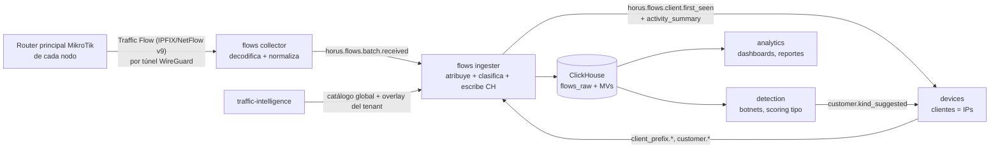

# Modelo de tráfico, atribución y señales — Horus Flow

> Estado: **ronda 2 (tras decisiones del PO)** · Dueño: Agente B (Datos) · Fuentes:
> [`po-decisions.md`](po-decisions.md) (D1, D5, D6, D10 **prevalecen**), [`vision.md`](vision.md).
>
> Relacionados: [`database.md`](database.md) (tablas físicas), [`storage.md`](storage.md)
> (artefactos del catálogo), [`vendors/mikrotik.md`](vendors/mikrotik.md) (Agente E: configuración
> de Traffic Flow en RouterOS v7), [`events.md`](events.md) (Agente C), [`services.md`](services.md)
> (Agente A), [`open-questions/data.md`](open-questions/data.md).

---

## 1. Objetivo y alcance

Convertir los metadatos de flujo que exporta el **router principal de cada nodo** de cada ISP
(D6) en tres productos:

1. **Consumo**: qué cliente (= IP, D1) consume cuánto, de qué servicios y en qué dirección.
2. **Seguridad del ISP (D5, propósito principal)**: detectar clientes infectados o que participan
   en botnets (contacto con C2, escaneo, fan-out, puertos de gusanos, DNS anómalo, salida
   sostenida), para que el ISP los mitigue.
3. **Tipo de cliente**: residencial por defecto; detectar uso comercial.

```
IP del cliente → Cliente (tenant, nodo/realm, IP)
IP remota → Prefijo → ASN → Organización → Servicio → Categoría → Reputación
+ Router principal → Interfaz → Tiempo → Bytes → Paquetes → Flags/Puertos
```

Fuera de alcance v1: captura de paquetes, DPI, payload, nombres DNS consultados (Traffic Flow no los
exporta). SNI/DNS quedan modelados como tipos de regla futuros.

### Principios

1. **La IP es el cliente** (D1): no hay CRM, RADIUS ni asignaciones temporales. Si la IP pertenece a
   un prefijo de clientes del nodo, el flujo es de ese cliente.
2. **Atribuir en ingesta, describir en consulta**: IDs en la fila; nombres, tipo vigente y categoría
   con diccionarios ([`database.md` §4](database.md)).
3. **La incertidumbre es un dato**: clasificación con `method` y `confidence`; detección con
   `confidence` y razones; muestreo explícito.
4. **Un solo punto de observación por nodo**: el router principal (D6). No se cuenta dos veces.
5. **Aislamiento por tenant** en todo el camino: el exportador identifica al tenant y nada cruza de
   un ISP a otro.

---

## 2. Pipeline

Alineado con [ADR-0015](adr/0015-enriquecimiento-de-flujos-en-ingesta.md): el ingester de `flows`
enriquece en memoria y es el escritor único de `flows.flows_raw`.



| # | Paso | Dónde | Resultado en la fila |
|---|------|-------|----------------------|
| 1 | Decodificar IPFIX / NetFlow v9 / v5 (plantillas, timestamps absolutos) | collector | campos canónicos |
| 2 | Identificar exportador por `(IP origen en el túnel WireGuard, observation_domain_id)` ⇒ `tenant_id`, `site_id`, `router_id`; ifIndex ⇒ interfaces | collector | IDs de origen |
| 3 | Corregir muestreo (si lo hubiera) | collector/ingester | `bytes`, `packets` escalados, `sampling_rate` |
| 4 | Pre-agregación opcional 60 s (§10) | collector | `merged_flows` |
| 5 | **Atribución a cliente + dirección** (§4) | ingester | `realm_id` + `client_ip` (clave natural del cliente), `remote_ip`, `direction`, `attribution_status` |
| 6 | Descubrimiento de clientes nuevos (§4.5) | ingester | evento `client.first_seen` |
| 7 | IP remota → prefijo → ASN → organización | ingester | `remote_*` |
| 8 | Reglas → servicio (catálogo global vN + overlay del tenant vM) | ingester | `service_id`, `classification_*`, versiones |
| 9 | Agregación (consumo 5 min/1 h/1 d y detección 1 min) | MVs ClickHouse | `customer_*`, `site_*`, `client_security_*`, `client_port_1m`, `reputation_hit` |
| 10 | Reputación de la IP remota (C2, escáneres) con el snapshot de `detection` | ingester ([ADR-0024](adr/0024-deteccion-de-botnets-como-objetivo-principal.md)) | `reputation_category/source/confidence/version` ⇒ MV `flows.reputation_hit` |
| 11 | Detección de botnets y scoring de tipo | detection, asíncrono | `detection.finding`, `customer_scores_1d`, `kind_suggested` |

Si el ingester o ClickHouse caen, JetStream retiene los lotes (≥ 6 h de pico, ver
[`events.md`](events.md)). Si `devices` cae, el ingester sigue con su último mapa de prefijos (copia
en disco local) y sigue atribuyendo (la clave del cliente es natural); los avisos `client.first_seen`
se acumulan en el stream.

---

## 3. Registro canónico de flujo normalizado

Contrato del lote `collector → ingester`. Exportador inicial: **MikroTik RouterOS v7 Traffic Flow**
(D10): **IPFIX** (alternativa NetFlow v9; **v5 descartado** porque no transporta IPv6), sin
muestreo, `active-flow-timeout=1m`, `inactive-flow-timeout=15s`, `src-address` = IP de túnel
WireGuard del router. Los parámetros concretos (versión, timeouts, interfaces, plantilla) los
documenta el Agente E en [`vendors/mikrotik.md`](vendors/mikrotik.md).

| Campo | Tipo | NetFlow v9 / IPFIX (IE) | Uso | Necesario para |
|-------|------|-------------------------|-----|----------------|
| `exporter_ip` | IP | IP origen UDP (dentro del túnel WireGuard) | identifica router ⇒ tenant/nodo | todo |
| `observation_domain_id` | uint32 | Source ID / ODID | separa instancias | todo |
| `flow_start`, `ts` (fin) | DateTime64(3) | IE 152/153 o 22/21 + sysUpTime | ventanas, duración | consumo, beaconing |
| `src_ip`, `dst_ip` | IPv6 | IE 8/12, 27/28 | atribución, remoto | todo |
| `src_port`, `dst_port` | uint16 | IE 7/11 | puertos | puertos de botnet, escaneo, servidor expuesto |
| `protocol` | uint8 | IE 4 | | todo |
| `tcp_flags` | uint8 | IE 6 (OR acumulado) | SYN sin ACK, sesiones aceptadas | escaneo, servicios entrantes |
| `icmp_type_code` | uint16 | IE 32/139 (IPv4); **IE 178/179** (ICMPv6, plantilla IPv6 de RouterOS) | barridos ICMP | escaneo |
| `bytes`, `packets` | uint64 | IE 1/2 | volumen | todo |
| `input_if_index`, `output_if_index` | uint32 | IE 10/14 | lado cliente vs WAN | dirección, tránsito |
| `post_nat_src_ip/port`, `post_nat_dst_ip/port` | IP/uint16 | IE 225/226/227/228 | solo si el ISP activa `nat-*` (desactivado por defecto, dato sensible) | plan B de §4.4 |
| `next_hop` | IP | IE 15/62 | diagnóstico | — |
| `src_as`, `dst_as` | uint32 | IE 16/17 | solo pista (RouterOS normalmente 0) | — |
| `sampling_rate` | uint32 | IE 34/305/306 u Options | corrección | todo |
| `flow_source` | enum | v5/v9/ipfix/sflow | | — |
| `batch_id` | UUIDv7 | — | idempotencia | — |

Campos que no se garantizan: `src_as`/`dst_as`, `next_hop`, NAT, VLAN, MAC. **No disponibles con
Traffic Flow**: nombres DNS consultados, SNI, códigos de respuesta DNS (NXDOMAIN).

**Muestreo**: Traffic Flow exporta por defecto **sin muestreo** (1:1); si un ISP lo activa, se
escala `bytes × N`, `packets × N` y `detection` reduce la confianza de las señales de conteo
(flujos cortos, escaneos e IPs distintas no son fiables con muestreo alto). La regla de obtención de
N (registro → Options Template → valor declarado → 1 con alerta `sampling_unknown`) se mantiene.

---

## 4. Atribución: cliente = IP observada en el router principal del nodo

### 4.1 Qué IPs son "de clientes"

La respuesta la da la configuración del ISP por nodo: `devices.client_prefix`
([`database.md` §2.2](database.md)). Cada prefijo tiene `role`:

| `role` | Significado | Efecto |
|--------|-------------|--------|
| `customers` | Rango que el nodo asigna a sus clientes (pool PPPoE/DHCP, estáticas, CGNAT interno 100.64.0.0/10, prefijos IPv6 delegados) | Una IP dentro ⇒ cliente |
| `infrastructure` | Gestión, enlaces, servidores del ISP, cachés (OCA/GGC) | `attribution_status = infrastructure` |
| `excluded` | Rangos que el ISP no quiere analizar | se descartan en el collector (no se guardan) |

Cómo se llenan:

1. **Manual** (UI/API por nodo).
2. **Importación desde el MikroTik** (API REST de RouterOS: `/ip pool`, `/ipv6 pool`, direcciones de
   interfaces de cara al cliente), confirmada por el operador. Detalle en
   [`vendors/mikrotik.md`](vendors/mikrotik.md).
3. **Modo descubrimiento** (nodo sin prefijos): el ingester registra en
   `flows.unattributed_1h` las IPs privadas/CGNAT y las IPs públicas del ASN del ISP que aparecen del
   lado de las interfaces `customer_edge`, y la UI propone los prefijos agregados (p. ej. `/24`) para
   confirmar. Hasta entonces el tráfico cuenta en los agregados del nodo, no en clientes.

### 4.2 Identidad y realm

- Clave natural del cliente = `(tenant_id, realm_id, dirección canónica)`
  ([ADR-0018](adr/0018-la-ip-es-el-cliente.md)); IPv4 /32; IPv6 truncada a `ipv6_client_len` del
  prefijo (**/64 por defecto**; 48, 56 o 60 configurables; debe coincidir con el prefijo delegado
  por el router, ver §4.8 y [`vendors/mikrotik.md` §11](vendors/mikrotik.md)). En PostgreSQL el cliente tiene además un
  `customer_id` UUIDv7; ClickHouse no lo guarda ([`database.md` §2.3.1](database.md)).
- **Realm**: los prefijos privados/CGNAT pertenecen al realm `node_private` de su nodo (la misma
  `10.0.0.5` en dos nodos o dos ISP son clientes distintos); los públicos al realm `public` del
  tenant.
- **Tenant**: lo fija el exportador; nunca se infiere de la IP. Dos ISP con las mismas IPs privadas
  no se mezclan porque sus routers llegan por túneles WireGuard distintos.

### 4.3 Algoritmo (en memoria, por flujo)

Estructura: por `site_id` (nodo), un trie LPM de `client_prefix` (decenas a cientos de prefijos
por nodo; KB de memoria). Para cada flujo del exportador del nodo `S`:

1. `src_in = lookup(S, src_ip)`, `dst_in = lookup(S, dst_ip)` ⇒ cada uno es `customers`,
   `infrastructure`, `excluded` o `none`.
2. Aplicar la tabla de dirección (§4.6) para decidir `client_ip`, `remote_ip`, `direction`,
   `attribution_status`.
3. Si hay cliente: `client_ip` = dirección canónica; si la clave `(realm_id, client_ip)` no
   está en el conjunto de conocidos, añadirla y encolar un aviso `first_seen` (§4.5), con el
   límite anti-avalancha por realm.
4. **Tránsito entre nodos**: una IP de un prefijo de **otro nodo** del mismo tenant (p. ej. el nodo
   S es camino del nodo T) **no** se atribuye en S: `attribution_status = transit`. Se cuenta en
   `site_*` de S como tránsito y el cliente solo se atribuye en el router principal de su propio
   nodo. Así no hay doble conteo aunque el tráfico atraviese varios routers principales.

Costo: dos búsquedas LPM y una consulta a un conjunto hash por flujo; > 1 M flujos/s por núcleo.

### 4.4 NAT en el router principal

Con D1 la IP del cliente debe ser la **anterior al NAT** (supuesto abierto de
[`po-decisions.md`](po-decisions.md): "CGNAT").

| Caso | Qué ve Traffic Flow ([`vendors/mikrotik.md` §2.4](vendors/mikrotik.md)) | Atribución |
|------|-------------------------------------------------------------------------|------------|
| Clientes con IP pública (sin NAT) | IP pública del cliente en ambos sentidos | directa |
| CPE con NAT (residencial típico) | WAN del CPE = IP del cliente | directa; los dispositivos detrás no se ven |
| **NAT/CGNAT en el propio router principal** | **Verificado con un router real (2026-10-09, §4.4.3):** en la **subida** `sourceIPv4Address` es la IP privada del cliente y `postNATSourceIPv4Address` la pública; en la **bajada** `destinationIPv4Address` es la **IP pública del NAT** y la privada del cliente llega en `postNATDestinationIPv4Address` | subida: `src`; bajada: `post_nat_dst` (IE 226). Los campos NAT de IPFIX son **obligatorios** para atribuir la bajada en este caso. |
| CGNAT en otro equipo **detrás** del router principal (hacia Internet) | IP privada/CGNAT del cliente | directa |
| CGNAT en otro equipo **entre** los clientes y el router principal | IP pública compartida: no identifica al cliente | **no atribuible**; el ISP debe exportar desde el equipo de CGNAT/BNG. Mientras tanto el tráfico cuenta en el nodo (`unknown`). |

**Regla de atribución con NAT en el router principal** (sustituye al antiguo "plan B"):

1. Si `src` está en un `client_prefix` del nodo → cliente = `src`, dirección `upload`.
2. Si no, si `post_nat_dst` (IE 226) está presente, difiere de `dst` y está en un `client_prefix`
   del nodo → cliente = `post_nat_dst`, dirección `download`.
3. Si no, si `dst` está en un `client_prefix` → cliente = `dst`, dirección `download` (clientes
   con IP pública o NAT en el CPE).
4. Si nada aplica → `attribution_status = unknown`.

El script de onboarding debe **activar** los campos NAT de IPFIX en routers con NAT (sin ellos la
bajada no es atribuible). Siguen siendo dato sensible: el ingester los usa para atribuir y **no**
guarda la IP pública post-NAT en `flows_raw` salvo que el ISP active el modo de correlación de
quejas de abuso.

### 4.4.1 Interfaces dinámicas PPPoE/L2TP

Cada sesión PPPoE crea en RouterOS una interfaz dinámica `<pppoe-usuario>` cuyo **ifIndex cambia
en cada reconexión** ([`vendors/mikrotik.md` §2.4](vendors/mikrotik.md)). Por eso:

- El collector **no** crea `devices.interface` por cada ifIndex dinámico: los ifIndex que no están
  en el inventario y cuyo nombre (obtenido por SNMP/API) encaja con `pppoe-*`/`l2tp-*` se mapean a
  una **interfaz lógica** por router, `customer_edge (dinámica)`, con un `interface_id` estable.
- La atribución **siempre es por IP** (§4.3); la interfaz solo sirve como pista de dirección y para
  el modo descubrimiento.
- El usuario PPPoE (`/ppp/active`) puede importarse como **alias opcional** del cliente, tratado
  como dato personal con retención limitada; nunca como identidad (D1).

### 4.4.2 Cobertura: tráfico acelerado por hardware

El tráfico con offload por hardware (bridge HW, L3HW en CCR2116/2216, FastTrack HW) **no genera
flujos**. Para no presentar consumos incompletos como reales:

- Métrica de **cobertura** por nodo y hora: `bytes de flujos del nodo (site_1h) / bytes del uplink
  por SNMP (ifHCIn/OutOctets de las interfaces upstream)`. Se calcula en `analytics` y se guarda en
  `flows.flows_coverage` (ClickHouse, `(tenant_id, site_id, bucket)`, TTL 13 meses).
- Cobertura < 80 % ⇒ alerta `flow_coverage_low` y aviso visible en los dashboards del nodo
  ("los datos de flujo cubren el 62 % del tráfico del uplink").
- La detección de botnets reduce la confianza de señales de volumen en nodos con baja cobertura
  (las señales de conteo —escaneo, puertos— siguen siendo válidas para lo que sí se ve).

### 4.4.3 Verificación con un router real (2026-10-09)

Captura de 74 s (1 069 datagramas IPFIX, 11 253 registros IPv4) exportada por el router principal
de un nodo del PO, RouterOS 7, con NAT en el mismo router:

| Comprobación | Resultado |
|---|---|
| Versión y plantillas | IPFIX (v10); plantilla 258 IPv4 (37 campos) y 259 IPv6 (34 campos), reenviadas con frecuencia |
| Campos útiles presentes | bytes/paquetes delta, puertos, protocolo, `tcpControlBits`, TTL, ICMP type/code, `ingress/egressInterface`, MAC origen/destino y post-MAC, `systemInitTimeMilliseconds`, `flowStart/EndSysUpTime`, campos NAT 225–228 |
| Subida con NAT | 3 277 registros con `src` privada y `postNATSrc` distinta: 2 IPs públicas de NAT y 1 IP privada (un `srcnat` entre redes internas, 1 418 registros) |
| Tráfico interno | 4 429 registros privado→privado entre redes del ISP (`internal`): no son tráfico de clientes hacia Internet |
| Pérdidas en la captura | 80 saltos de secuencia IPFIX en 74 s (≈ 11 985 registros enviados que no están en la captura): pendiente averiguar si se pierden en el sniffer del router o salen por otra interfaz. El colector debe medir `sequence_gaps` |
| Bajada con NAT | 3 211 registros con `dst` = IP pública del NAT y `postNATDst` = IP privada del cliente |
| Redes de clientes vistas | 172.31/16, 10.22/16, 10.25/16, 10.21/16, 10.18/16, 10.17/16, 10.20/16, 172.28/16, 172.29/16, 10.30/16 |
| `active-flow-timeout=1m` | duración máxima de flujo 59,99 s; 78 % de los registros son de un solo paquete (duración 0) |
| Volumen | ≈ 152 flujos/s y 14 datagramas/s en ese router |
| Fixture anonimizado | `tests/fixtures/mikrotik-real/ipfix-nat-20s.pcapng` (20 s, 2 596 registros; IPs y MAC remapeadas, captura cruda fuera del repo) |
| `interfaces=` | el filtro **no** limitó la exportación a la interfaz indicada (aparecen flujos de varias interfaces): no confiar en él para reducir volumen |
| IPv6 | 0 registros en la ventana capturada |

### 4.5 Descubrimiento de clientes

- Cliente nuevo ⇒ el ingester publica `horus.flows.client.first_seen.<realm_id>` (lote cada 10 s,
  deduplicado; ADR-0018) y `devices` crea el cliente (`INSERT … ON CONFLICT DO NOTHING`) con el tipo
  por defecto del prefijo y emite `horus.devices.customer.discovered.<customer_id>`.
- Cada hora el ingester publica `horus.flows.client.activity_summary.<realm_id>`, resumen de claves activas (para `last_seen` grueso y
  reactivación de `inactive`).
- Los flujos **no esperan** al descubrimiento: la fila ya lleva su clave natural.
- Ciclo de vida (inactive, reset, purga) en [`database.md` §2.3.4](database.md).

### 4.6 Dirección (upload/download) respecto a la IP del cliente

Se calcula respecto a la IP del cliente, no con `flowDirection` del router:

| `src_ip` | `dst_ip` | `direction` | `client_ip` / `remote_ip` | `attribution_status` |
|----------|----------|-------------|------------------------------|----------------------|
| cliente del nodo | no cliente | `upload` | src / dst | `attributed` |
| no cliente | cliente del nodo | `download` | dst / src | `attributed` |
| cliente del nodo | cliente del nodo | `internal` | src / dst (una sola fila para el origen) | `internal` |
| cliente de otro nodo | cualquiera | `unknown` | — | `transit` |
| infraestructura | no cliente (o al revés) | `unknown` | — | `infrastructure` |
| ninguno en prefijos | ninguno | `unknown` | IP del lado `customer_edge` en `client_ip` | `unknown` ⇒ `flows.unattributed_1h` |

- `internal` (cliente a cliente del mismo nodo): relevante para seguridad (propagación lateral de
  gusanos, p. ej. 445/23 entre clientes) y P2P local; cuenta en el consumo del origen.
- El tráfico generado por el propio router (DNS del router, NTP, gestión) es `infrastructure`.

### 4.7 Interfaces y punto de observación

Con **un router principal por nodo** el problema de deduplicación del Sprint 0 (varios routers
exportando el mismo tráfico) desaparece dentro del nodo: cada paquete entra una vez al router y
Traffic Flow lo registra por interfaz de **entrada**. Reglas:

- `interface.flow_role = customer_edge` en las interfaces de cara a clientes y `upstream` en las de
  salida; se usan como **pista** para la dirección y para el modo descubrimiento (§4.1), no para
  filtrar.
- Traffic Flow se configura con `interfaces=all` (las PPPoE dinámicas no se pueden enumerar);
  Horus clasifica por la interfaz de entrada/salida y descarta en el collector los flujos cuyo
  origen o destino es la IP de túnel WireGuard del propio router (gestión y exportación). Ver
  [`vendors/mikrotik.md`](vendors/mikrotik.md).
- Entre nodos, el doble conteo se evita con la regla de tránsito (§4.3 paso 4).
- Si un ISP exporta desde más de un router por nodo, el job de calidad compara bytes por cliente y
  hora entre exportadores y alerta `horus.flows.exporter.duplicated` (nombre a confirmar con el
  Agente C).

### 4.8 IPv6: el cliente es el prefijo delegado

> Añadido el 2026-10-09 (preparación IPv6 pedida por el PO). Fuentes RouterOS y plantilla IPFIX
> IPv6 real en [`vendors/mikrotik.md` §11](vendors/mikrotik.md).

**Qué exporta RouterOS.** El mismo `/ip traffic-flow` exporta IPv6 con una plantilla propia (259,
34 campos, en el router del PO) que trae `sourceIPv6Address`/`destinationIPv6Address`, hop limit
(`ipTTL`), ICMPv6 en IE 178/179 y `flowLabelIPv6`, y **ningún campo NAT**. En IPv6 no hay NAT en el
ISP (el cliente recibe prefijo público), así que no hacen falta.

#### 4.8.1 Identidad: prefijo delegado, nunca /128

- El ISP delega a cada CPE un prefijo (DHCPv6-PD por PPPoE o IPoE: /56, /60 o /64; /48 a empresas).
  Dentro, el CPE anuncia /64 por RA y cada dispositivo forma por SLAAC **varias** direcciones: la
  estable (EUI-64 o *stable-privacy*, RFC 7217) y **temporales de privacidad** que rotan (RFC 8981).
- Identificar por /128 convertiría un hogar en decenas de "clientes" que cambian cada día. Por eso
  (D1 + [ADR-0018](adr/0018-la-ip-es-el-cliente.md)): **cliente IPv6 = prefijo delegado**. El
  ingester:
  1. busca la dirección **completa** en el trie LPM de `client_prefix` del nodo (§4.3);
  2. si cae en un prefijo `customers`, trunca a su `ipv6_client_len` y esa red es `client_ip`
     (p. ej. `2001:db8:1000:2a17:9c3e:…` en un pool /40 con `ipv6_client_len=56` →
     `2001:db8:1000:2a00::`; en PostgreSQL `customer.address = 2001:db8:1000:2a00::/56`).
- `remote_ip` sí se guarda completa (es un servidor de Internet); el fan-out usa /48 para IPv6
  ([`database.md`](database.md), `remote_nets24_out`).

#### 4.8.2 Tamaño de agregación configurable

El tamaño vive en **cada `client_prefix`** (`ipv6_client_len` ∈ {48, 56, 60, 64}, defecto 64), no en
el realm: el realm `public` de un ISP mezcla pools residenciales /56 con prefijos de empresa /48, y
cada pool de RouterOS tiene su `prefix-length`. Cómo se fija:

1. **Importación desde el router** (recomendada): `/ipv6/pool` `prefix-length` → `ipv6_client_len`
   sugerido; `/ppp/profile` dice si el pool es de prefijos delegados o de enlaces PPP
   ([`vendors/mikrotik.md` §11.4](vendors/mikrotik.md)). El operador confirma.
2. **Manual** en la UI/API.
3. Defecto 64 si no se sabe (seguro frente a mezclar clientes, pero puede partir uno en varios).

| Configuración vs delegación real | Efecto | Detección |
|---|---|---|
| Igual | Correcto | — |
| `ipv6_client_len` **más corto** (p. ej. 56 con delegación /64) | **Mezcla** hasta 256 clientes en uno: grave | Importación desde el pool; `/ipv6/pool/used` muestra la longitud real |
| `ipv6_client_len` **más largo** (p. ej. 64 con delegación /56) | Un hogar con varias LAN aparece como varios clientes | Muchos /64 hermanos dentro del mismo /56 con actividad simultánea ⇒ sugerencia en el asistente (pendiente) |

Cambiar `ipv6_client_len` de un prefijo existente **no reescribe** el histórico: los clientes con la
longitud antigua pasan a `inactive` con razón `prefix_removed` y aparecen los nuevos (mismo ciclo
de vida que reducir un prefijo, [`database.md` §2.3.4](database.md)). La UI lo advierte.

**Prefijo de enlace PPP**: con `remote-ipv6-prefix-pool` el CPE tiene además un /64 de enlace que
usa para su propio tráfico (DNS, gestión, malware del CPE). Se declara como `customers` con
`ipv6_client_len=64` (es un cliente distinto del /56 del mismo abonado), salvo que el pool se
reutilice entre todos (`remote-ipv6-prefix-reuse=yes`): entonces es `infrastructure`.

#### 4.8.3 Tipos de dirección

Se evalúan antes del LPM, en este orden:

| Rango | Tratamiento |
|---|---|
| `::ffff:0:0/96` (IPv4-mapped) | Inválido en un flujo IPv6 real (es la forma en que ClickHouse guarda IPv4): se descarta y se cuenta como registro inválido del exportador. Evita colisiones con clientes IPv4. |
| `::/128`, `::1/128` | Descartar (DAD, bucle local). |
| `fe80::/10` (enlace local) | **Nunca es cliente**. ND, RA y DHCPv6 entre CPE y router llegan a Traffic Flow por `input`/`output`: `attribution_status = infrastructure`, sin `first_seen` ni `unattributed_1h`. |
| `ff00::/8` (multicast; o IE 206 = 1) | `ff02::/16` (alcance de enlace) ⇒ `infrastructure`. Otros alcances: se atribuye por el otro extremo con la regla normal. |
| `fc00::/7` (ULA) | Como RFC 1918: solo es cliente si el ISP lo declara en un `client_prefix` (realm `node_private` del nodo). Si no, `unknown`. Su aparición en el router principal suele indicar NPTv6 o gestión interna. |
| `64:ff9b::/96` (NAT64) en el lado remoto | El cliente sigue siendo su prefijo; ASN, servicio y reputación se resuelven con la **IPv4 incrustada**. RouterOS no documenta NAT64 en las páginas consultadas (**a verificar**); se deja preparado en el clasificador. |
| `2001:db8::/32` (documentación) | Solo en *fixtures* y `flowsim`. |
| Global unicast (`2000::/3`) | LPM normal; realm `public` del tenant. |

#### 4.8.4 Encaje con la regla NAT (§4.4)

La regla de §4.4 se aplica igual a IPv6, con una diferencia: **el paso 2 nunca ocurre**, porque la
plantilla IPv6 de RouterOS no trae `post_nat_*`. Queda:

1. `src` en `client_prefix` del nodo ⇒ cliente = `src` truncada, `upload`.
2. *(solo IPv4)* `post_nat_dst`.
3. `dst` en `client_prefix` ⇒ cliente = `dst` truncada, `download`.
4. Si no ⇒ `unknown` (o `infrastructure` por §4.8.3).

Una misma sesión dual-stack produce flujos IPv4 (atribuidos con NAT, D12) y flujos IPv6 (sin NAT),
**independientes**. Si un ISP hiciera **NAT66/NPTv6** en el router principal, la subida seguiría
atribuyéndose por `src` pero la bajada no (llega con la dirección traducida y sin campo post-NAT):
Horus detecta reglas en `/ipv6/firewall/nat` y avisa en el router; invertir un `netmap` 1:1 queda
fuera de v1.

#### 4.8.5 Privacidad y dual-stack

- El ingester **descarta la parte de host** antes de escribir: `flows_raw.client_ip` y los agregados
  solo tienen el prefijo del cliente. No se guarda ninguna /128 de cliente (minimización, D5).
- El DUID (bindings DHCPv6) y el usuario PPP son alias opcionales con retención limitada, nunca
  identidad (como la MAC y el usuario PPPoE en IPv4).
- **Dual-stack**: un abonado con IPv4 privada (NAT en el router) y un /56 es, en v1, **dos clientes**
  (D1: la IP es el cliente), más un tercero si su CPE usa un /64 de enlace. Los KPI de clientes
  activos deben poder desglosarse por familia. Unirlos (misma sesión PPP: `/ppp/active` + binding del
  servidor `<pppoe-usuario>`) es enriquecimiento futuro y pregunta abierta al PO
  ([`vendors/mikrotik.md` §9.2](vendors/mikrotik.md)).

#### 4.8.6 Descubrimiento y señales

- Modo descubrimiento (§4.1): las IPv6 sin prefijo se registran en `flows.unattributed_1h`
  **truncadas a /64** (nunca /128) y la UI propone el agregado que las cubre dentro del espacio del
  ISP; la vía preferente es importar `/ipv6/pool` del router.
- Límite anti-avalancha de `first_seen` por realm: en IPv6 el "tamaño del prefijo" es astronómico;
  el tope usa el número de prefijos de cliente posibles (`2^(ipv6_client_len − longitud del
  prefijo)`), acotado por un máximo fijo por realm (valor en el ingester, a fijar por FLOW).
- Señales (§8, §9): el *hop limit* sirve para la heurística de SO como el TTL; en IPv6 el escaneo
  aleatorio es inviable, así que el escaneo saliente se ve como barridos ICMPv6 (tipo 128) o puertos
  contra listas de objetivos, y el fan-out por /48 remoto. Contar /128 distintas por cliente no es
  fiable (temporales) y no se guarda.

---

## 5. Fuentes de datos: prefijo → ASN → organización

Sin cambios respecto al Sprint 0 en las fuentes; cambian el dueño (catálogo **global** de la
plataforma) y el almacenamiento (local, [`storage.md`](storage.md)).

| Fuente | Aporta | Uso |
|--------|--------|-----|
| RouteViews / RIPE RIS (MRT) | prefijo → ASN de origen | primaria |
| iptoasn.com (PDDL) | prefijo → ASN, país | arranque/fallback |
| PeeringDB | organización, tipo de red | `asn.network_type` |
| CAIDA AS2Org (revisar uso comercial) | ASN → organización | semilla |
| Rangos publicados (AWS, Google, Cloudflare, Azure…) | prefijo → proveedor/servicio | reglas `prefix` |
| RIR delegated stats | país/titular | validación |
| **Datos locales de cada ISP** | cachés embebidos, prefijos propios, resolvers DNS propios | overlay del tenant (`traffic.tenant_rule`) |

Proceso diario de importación en `traffic-intelligence`: descargar → guardar original en el
almacenamiento local (`datasets/`) con SHA-256 → consolidar (BGP > iptoasn > RIR) → diff (> 5 % de
cambio ⇒ revisión) → nuevo snapshot de prefijos que el ingester recarga.

---

## 6. Catálogo de clasificación

Igual que en el Sprint 0 (categorías → servicios → organizaciones → ASN → prefijos; reglas con
`priority`, `match_*`, `confidence`; evaluación determinista LPM + hash; ciclo
`draft → validated → published`; artefacto inmutable; rollback = nueva versión). Cambios:

- **Catálogo global** (plataforma, superadmin) + **overlay por tenant** (`tenant_rule_set`, reglas
  `local_override` prioridad 900–1000). El ingester combina global vN y overlay del tenant vM; la
  fila guarda `catalog_version` y `tenant_rules_version`.
- Los artefactos se distribuyen a las réplicas del ingester por **NATS Object Store** y se
  conservan en el almacenamiento local ([`storage.md` §3](storage.md)).
- **Histórico**: la categoría se reinterpreta siempre (diccionario); el servicio solo se reclasifica
  bajo demanda dentro de la retención cruda.
- **CDN y nubes compartidas**: se clasifica al nivel que la evidencia soporta (`meta_generic`,
  `cloudflare_generic` con categoría `cdn_infra`), nunca más.

Ejemplos trabajados (Instagram/Meta, YouTube/GGC, Netflix/OCA, Steam, Cloudflare): sin cambios de
fondo respecto al Sprint 0; la atribución ahora es "IP en prefijo de clientes del nodo ⇒ cliente".
Nota: los rangos citados como ejemplo deben verificarse contra las fuentes al construir el catálogo
(p. ej. `142.250.0.0/15` es de Google, no de Meta).

---

## 7. Agregados

Definidos físicamente en [`database.md` §6.2](database.md):

- **Consumo**: `customer_5m/1h/1d`, `site_5m/1h/1d` (por servicio, ASN, dirección).
- **Detección**: `client_security_1m` (7 d) y `_1h`, `client_port_1m` (7 d) y `reputation_hit` — una fila por cliente activo y ventana con los
  contadores de §8.
- **Calidad de atribución**: `unattributed_1h` (IPs que parecen de clientes fuera de prefijos).

---

## 8. Señales para detección de botnets (D5)

`detection` combina señales; **ninguna sola concluye "infectado"**. Cada hallazgo
(`detection.finding`) lleva `kind`, `confidence`, razones y referencias a la evidencia (ventanas y
contadores en ClickHouse), nunca payload.

| Señal | Qué indica | Campos del flujo | Agregado / fuente | Regla inicial (orientativa, ajustable por tenant) |
|-------|------------|------------------|-------------------|---------------------------------------------------|
| **Contacto con C2 conocido** | Bot activo | `remote_ip`, `remote_port`, `protocol`, `bytes`, `ts` | marca en ingesta ⇒ `flows.reputation_hit`; retroactivo con `dim.reputation` sobre `flows_raw` (7 d) | ≥ 1 flujo con respuesta (no solo SYN) a un indicador `botnet_cc` de confianza alta ⇒ hallazgo `high`; solo SYN ⇒ `medium` (C2 caído/sinkhole) |
| **Beaconing** (periodicidad) | Bot consultando a su C2 | `flow_start`, `remote_ip`, `bytes` | `flows_raw` (ventana ≤ 24 h, consulta de `detection`) | conexiones al mismo remoto con intervalo regular (coef. de variación < 0,2) y bytes pequeños y constantes durante ≥ 6 h |
| **Participación en DDoS** | Bot atacando | `bytes`, `packets`, `remote_ip`, `remote_port`, `protocol` | `client_port_1m` (pps/bps por puerto y minuto), `client_security_1m` | ráfaga de pps/bps hacia ≤ 3 destinos durante ≥ 2 min muy por encima de la línea base; UDP saliente a puertos de amplificación (53, 123, 1900, 11211, 19) |
| **Fan-out** | Propagación, spam, DDoS | `remote_ip`, `direction` | `remote_ips_out`, `remote_nets24_out`, `flows_out` (`client_security_1m`) | > 500 IPs remotas distintas en 5 min **y** dispersas en > 200 redes /24 (descarta CDN) |
| **Escaneo** horizontal / vertical | Bot reclutando, gusano | `tcp_flags`, `packets`, `remote_ip`, `remote_port`, `icmp_type_code` | `syn_only_out`, `small_flows_out`, `remote_ports_out`, `icmp_flows_out` | > 70 % de flujos salientes SYN sin ACK con ≥ 100 destinos; o ≥ 50 puertos distintos en un mismo destino |
| **Puertos típicos de botnet** | Mirai y variantes (23, 2323, 37215, 52869, 7547, 5555), SMB/EternalBlue (445, 139), IRC C2 (6667, 6697), RDP/MSSQL brute force (3389, 1433), Winbox MikroTik (8291) | `remote_port`, `client_port`, `direction` | `watch_port_flows` (`dim.watch_port`, lista editable por `detection`) | flujos salientes a puertos vigilados hacia ≥ 20 destinos en 5 min |
| **DNS anómalo** | Bot usando resolver propio, DGA (indirecto), túnel DNS, amplificación | `remote_port` 53/853, `remote_ip`, `bytes`, `packets` | `dns_flows_isp`, `dns_flows_other`, `dns_resolvers` (+ `dim.tenant_resolver`) | ráfagas de flujos DNS > 10× la línea base del cliente; ≥ 5 resolvers externos distintos; flujos DNS con bytes medios altos (túnel). **Limitación**: sin nombres consultados ni NXDOMAIN; DGA solo se infiere por volumen |
| **Tráfico saliente sostenido** | DDoS saliente, proxy residencial, exfiltración, minería | `bytes`, `direction`, `ts` | `up_bytes`, `down_bytes` (`client_security_1m/1h`) | subida > 80 % del total y > X Mbps sostenidos ≥ 30 min fuera del patrón del cliente |
| **SMTP saliente directo** | Spam bot | `remote_port` 25 | `smtp_flows_out`, `smtp_remote_ips` | ≥ 20 servidores SMTP distintos/h desde un residencial |
| **Servicios entrantes inesperados** | Dispositivo expuesto/comprometido (o comercial) | `client_port`, `tcp_flags` (SYN+ACK de vuelta) | `inbound_service_ports` | puertos 23/2323/7547 aceptando conexiones entrantes ⇒ CPE/IoT vulnerable |
| **Propagación interna** | Gusano dentro del nodo | `direction = internal`, puertos 445/23 | `flows_raw` / `client_security_1m` | escaneo hacia otros clientes del mismo nodo |

Requisitos de datos que se derivan:

- `tcp_flags`, `icmp_type_code`, puertos de ambos lados y `packets` **deben** estar en la plantilla
  exportada (Agente E).
- Sin muestreo (o con `sampling_rate` conocido para reducir la confianza).
- Línea base por cliente: `detection` calcula medias/percentiles de 7–28 días desde
  `client_security_1h`.
- La **pre-agregación** (§10) conserva todo lo necesario (IP y puerto remotos, OR de flags,
  `merged_flows`), salvo el puerto efímero del cliente.
- Falsos positivos conocidos: servidores legítimos del cliente comercial (fan-out entrante), CDN
  (fan-out concentrado en pocas redes), juegos P2P, VPN. Se mitiga con dispersión por /24/ASN,
  tipo de cliente, `reputation_allowlist` por tenant y la confirmación humana
  (`verdict_feedback`).

---

## 9. Señales para residencial vs comercial

El tipo por defecto es `residential` (D1). `detection` calcula un `commercial_score` diario
(`detection.customer_scores_1d`) y propone el cambio (`customer.kind_suggested`) solo con histéresis
(≥ 7 días consecutivos sobre el umbral) y si el tipo no está bloqueado por un cambio manual.

| Señal | Campos / agregado | Sugiere comercial si… |
|-------|-------------------|-----------------------|
| **Servicios entrantes** (servidor web/correo/VPN/cámaras) | `inbound_service_ports`, flujos entrantes aceptados a 80/443/25/587/993/1194/51820/554 | puertos estables aceptando conexiones de muchas IPs remotas |
| **Patrón horario** | `customer_1h` por hora local del nodo | pico en horario laboral de lunes a viernes, valle nocturno y fines de semana (residencial: pico nocturno y fines de semana) |
| **Mezcla de servicios** | `customer_1d` por categoría | mucho SaaS/ofimática (Microsoft 365, Google Workspace), VPN corporativas, videoconferencia en horario laboral; poco streaming de entretenimiento |
| **Volumen de subida** | `up_bytes / down_bytes` | ratio alto y estable (backups, servidores, videovigilancia) |
| **Diversidad de destinos simultáneos** | `remote_ips_out`, flujos concurrentes | muchos destinos simultáneos en horario laboral (varios puestos detrás del CPE). Es una **estimación**, nunca un conteo de dispositivos |
| **Correo saliente autenticado** | 587/465 saliente regular | servidor o cliente de correo corporativo |
| **IP estática** | `client_prefix.assignment_mode = static` | refuerza (no decide) |

- En prefijos `dynamic` la confianza máxima del score se limita (la IP puede cambiar de persona).
- Un cliente marcado manualmente no se toca; el scoring sigue calculándose y la UI muestra la
  discrepancia ("el scoring sugiere residencial").
- Todas las razones se guardan como claves (`reasons`) para auditar y recalibrar con
  `verdict_feedback`.

---

## 10. Pre-agregación en el colector (modo de alto volumen)

Configurable por exportador (desactivada en el primer incremento para medir):

- Clave: `(router_id, input_if, output_if, client_ip, remote_ip, protocol, remote_port)`,
  ventana de 60 s alineada; `tcp_flags` = OR; `merged_flows` = nº de registros fusionados; `packets`
  y `bytes` sumados; `flow_start` = mínimo, `ts` = máximo.
- Se pierde: puerto efímero del cliente, tiempos exactos por conexión (afecta al beaconing fino: se
  calcula con resolución de 60 s, suficiente para periodos ≥ 2 min).
- Ganancia esperada 3–10× (ver [`database.md` §8](database.md)).

---

## 11. Reputación en el pipeline

Alineado con [ADR-0024](adr/0024-deteccion-de-botnets-como-objetivo-principal.md):

- Feeds **de plataforma** en `detection` (módulo reputation): C2 de botnets, escáneres, listas de
  bloqueo, pools de minería, Tor, proxies; con fuente, confianza, caducidad y licencia.
- `detection` compila un **snapshot** (prefijos → categoría, fuente, confianza) y lo publica en NATS
  Object Store (`reputation-snapshots`) con evento de versión; el **ingester** lo carga como el
  catálogo y conmuta atómicamente.
- El ingester marca cada flujo cuya IP remota esté en el snapshot (`reputation_category`,
  `reputation_source_id`, `reputation_confidence`, `reputation_version`); la MV
  `flows.reputation_hit` agrupa por cliente, IP remota y hora. El hit queda fechado con la versión
  vigente en ese momento y no se reescribe el pasado.
- `reputation_allowlist` **por tenant** (falsos positivos locales) se aplica en `detection` al
  generar hallazgos, no en la ingesta (la marca es un hecho; la decisión es de `detection`).
- `dim.reputation` (diccionario `IP_TRIE`) se mantiene para consultas *ad hoc* sobre `flows_raw`
  con la reputación **actual** (p. ej. "¿quién habló en los últimos 7 días con este C2 que se
  publicó hoy?").

## 12. Dependencias abiertas

| Con | Tema |
|-----|------|
| Agente E (`vendors/mikrotik.md`) | Ya cubierto: IPFIX sin muestreo, timeouts, exportador por IP de túnel, NAT pre-NAT esperado, ifIndex PPPoE dinámicos, IPv6 por prefijo delegado, ceguera por offload. **Pendiente de laboratorio**: IP privada en la bajada con NAT en el mismo router; si `interfaces=` se respeta en CCR; campo ICMP type/code y TTL en IPFIX. Sus enlaces a `traffic-model.md` §9.1 y §11 deben pasar a §4.2 (realm) y §10 (pre-agregación). |
| Agente C (`events.md`) | `horus.flows.client.first_seen.<realm_id>` y `horus.flows.client.activity_summary.<realm_id>` (lotes, telemetría), `horus.devices.customer.*` (ciclo de vida), `horus.detection.customer.kind_suggested`, `horus.detection.finding.{opened,updated,resolved}.<finding_id>`, `horus.devices.client_prefix.*`; eliminar `customer.assigned/unassigned`; `tenant_id` en todos los sobres; lote `horus.flows.batch.received` con `tenant_id`, `site_id`, `router_id` ya resueltos por el collector. |
| Agente A | Dueño del cliente (`devices`) y del descubrimiento (ingester de `flows`); emparejamiento de NAT en el ingester; ADR de botnets (alcance de `detection`). |
| Agente D | Historias: prefijos por nodo + modo descubrimiento, importación de pools del MikroTik, widgets de seguridad para el modo NOC, cola de hallazgos, cambio de tipo manual. |
| FLOW / laboratorio (IPv6, §4.8) | Decodificar la plantilla IPv6 (ICMPv6 por IE 178/179, sin NAT); filtros de §4.8.3 en el ingester; truncado a `ipv6_client_len`; `unattributed_1h` por /64; fixture IPFIX con registros IPv6 reales (la captura del PO tiene 0); validar en CHR con DHCPv6-PD por PPPoE ([`vendors/mikrotik.md` §11.8](vendors/mikrotik.md)). |
